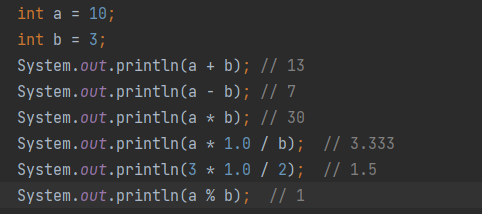
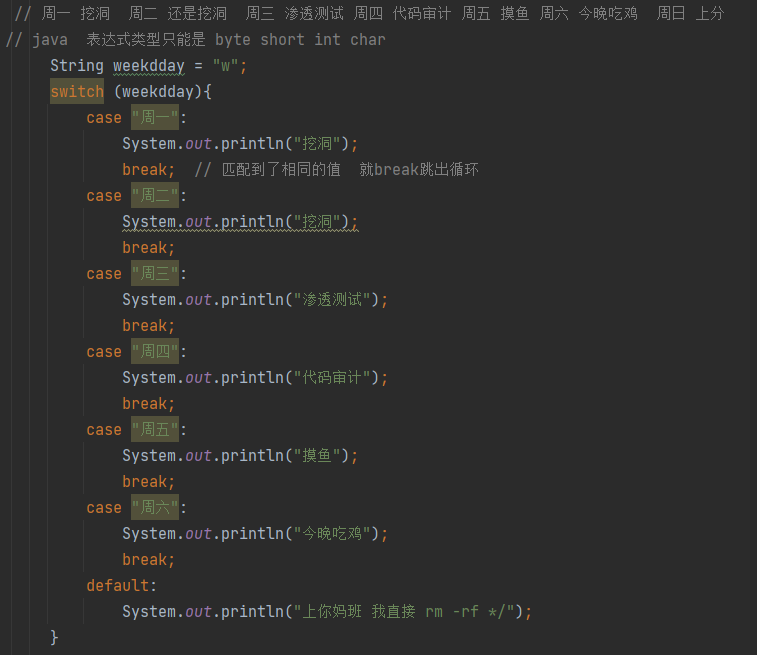

# 基础

## 目录

-   [ASCII编码 ](#ASCII编码-)
-   [二进制](#二进制)
-   [变量](#变量)
-   [数据类型](#数据类型)
-   [运算符](#运算符)
-   [练习题: 找最大值](#练习题-找最大值)
-   [键盘录入](#键盘录入)
-   [判断语句](#判断语句)
    -   [if](#if)
    -   [swithch](#swithch)
    -   [循环语句](#循环语句)
    -   [while](#while)
    -   [do-while](#do-while)
    -   [循环嵌套](#循环嵌套)
-   [随机数](#随机数)
-   [数组](#数组)
    -   [for 循环遍历数组  ](#for-循环遍历数组--)
    -   [for-Each循环](#for-Each循环)
    -   [数组求和案例](#数组求和案例)
-   [方法](#方法)
    -   [Void返回值情况 ](#Void返回值情况-)
    -   [return有返回值情况](#return有返回值情况)
    -   [访问权限](#访问权限)
    -   [方法案例](#方法案例)
    -   [方法参数传递](#方法参数传递)
    -   [方法参数传递案例](#方法参数传递案例)
    -   [判断重置语句](#判断重置语句)
-   [综合案例](#综合案例)


### \*\*ASCII编码 \*\*

````c
美国信息交换标准编码,就是一套现代英语,数学,和其他西欧字符(不含中文)的编码规则

 字符在计算机底层就是存储其编号的二进制形式 
 
```字符     十进制     二进制
A         65       0110 0001
B         66       0110 0010
a         97       0110 0001
b         98       0110 0010
0         48       0011 0000
````


### **二进制**

```java
   计算机底层都是一些数字电路,用开表示0,关表示1 这些01的形式就是二进制 

*  数据在计算机底层都是采用二进制存储的

*  二进制如何表示具体的数字呢

*  二进制转换成十进制的运算方式

*  00 = 0 * 2^0 + 0 * 2^1 = 0;

*  01 = 1 * 2^0 + 0 * 2^1 = 1

*  10 = 0 * 2^0 + 1 * 2^1 = 2

*  11 = 1 * 2^0 + 1 * 2^1 = 3

* */

  int age1 = 3;  // 实际上 数据在内存中存储的有效二进制位是:11 计算机使用DEC进行换算

  int age2 = 19;  // 数据在内存中存储的有效二进制位是： 10011


  // 计算机中认为一个开关表示的 0|1 称为一位ie(b) 每8位称为为一个字节,所以1B=8b

  // 字节是计算机中数据的最小单位
```

### **变量**

```c++
  变量就是用来存储有数据的内存区域可以理解为盒子,且里面存储的数据可以变化

  强制限制盒子中存储数据的形式.例如（整数类型）int、double (小数类型)
```

定义格式

**数据类型 变量名称 = 初始值;   double  money = 6.0;**

```c++
累加数据: 

money = money +  4.0 ;

money += 4;
```

&#x20;修改变量数据


注意: Java 在数据的赋值上左右间有区别&#x20;

**变量注意点**

**什么类型的变量 一定是存放什么类型的数据, 同一个范围内不能定义重名的变量,变量定义的时候可以不给初始化值,但是使用的时候必须有初始值**


&#x20;变量只在所在的大括号中有效!


### **数据类型**

```6502&#x20;assembly
数据类型就是约束变量存储数据的形式

基本数据类型 ：8种  

 byte       字节型               占1个字节 -128 至 127  

 byte number = 98; 

               

 short      短整型               占2个字节

  short money = 20000; 

  

 int        整型                 占4个字节  (默认使用的类型 整数用它) 

  int it = 232442442; 

 

 long       长整型               占8个字节

  long lg2 = 1234454634554L; 

 (默认写一个整数是int类型, 要想类型是float类型 后面要跟上 L / l)

 

 float      浮点型               占4个字节  (小数 )

  float scrore = 0.25F;  

 (默认写一个小数是double类型 要想类型是float类型  后面要跟上 F / f)

 

 double     小数型               占8个字节   （小数用它） 

  double scores2 = 999.99; 

 

 char       字符型               占2个字节

  char ch = 'a';   (只能包含一个字节) String可以包含多,且单引号定义  

 

 boolean    布尔型               占1一个字节

  boolean rs = true; 

  引用数据类型 : String   字符串

String name = "西门吹雪";  String内部用来存储的结果是一个char字符数组。


 自动类型转 

 类型范围小的变量，可以直接的赋值给类型范围大的变量
```


&#x20;表达式最终结果由表达式最高类型决定 &#x20;

\*\* 同时: 在表达式中 byte short cahr 是之间转成int的\*\*​

&#x20;byte-->short-->long-->int-->float-->double


相加过大的情况&#x20;


```6502&#x20;assembly
强制类型转换： 

类型范围大的数据或者变量 不能直接赋值给类型范围小的变量 会报错

强制类型转换 可能造成数据(丢失) 溢出

数据类型 变量2 = (数据类型) 变量1 / 数据

 int的类型范围比byte大, 但这时 byte又想接收它的数据 于是发生了强制类型转换
```


### **运算符**

&#x20;

**数值拆分案例**




**其他运算符**

&#x20;   &#x20;

自增自减运算符： 如果单独使用放前后是没有区别的  a++ a--


在表达式中或者不是单独操作的情况下 ++ -- 在变量前后存在区别

int a = 3;  int b = a++;  先使用再++&#x20;

b = 3  a = 4


++ --  在变量前面 先+1 -1 再使用


赋值运算符   =  +=  -=  \*=  /=   %=

\*\* +=  运算符\*\*​


```6502&#x20;assembly
逻辑运算符: 

逻辑与 &          一假则假  (判断两个结果都必须满足的案例)

短路与 &&         判断结果与 ”&“一样 过程是左边为false 右边则不执行

逻辑或 |          一真则真  (适用于两个条件某一个成立就可以的案例)

短路或 ||         判断结果与 ”|“一样 过程就是左边为true 右边则不执行

逻辑非 ！      ！ttue = false    ！false = true

逻辑异或 ^   两个条件都是false或者都是true则结果是false, 两个条件不同结果返回上true

**“ & ”   “ | ”  案例**
```


三元运算符  条件为 true 则执行左边 为false 执行右边    跟if判断一样


### **练习题: 找最大值**


优先级问题   & > | > && > ||

**因为 && 的优先级比 || 高  所以先执行**


### **键盘录入**

```6502&#x20;assembly
 

调用sc对象的功能等待接收用户输入的数据

int age = sc.nextInt(); 

将这行代码写再打印下面 就可以把输入的数据存存储到 age 变量中
```


**键盘录入的接收数据我们要把后面的next加上相同类型的,**

```java
import java.util.Scanner;

public class java {
    public static void main(String[] args) {
        System.out.println("你好世界");
        Scanner sc = new Scanner(System.in);
        
        System.out.println("姓名是");
        String name = sc.nextLine();
        
        System.out.println("年龄是");
        String age = sc.nextLine();
        
        System.out.println("爱好是");
        String pass = sc.nextLine();
        
        System.out.println(name);
        System.out.println(age);
        System.out.println(pass);
        
       }
        }
```

### **判断语句**

#### **if**


#### **swithch**

switch分支结构  swith 适用于具体的数值 判断  一旦找到就会执行

break   跳出并结束当前所在循环的执行

default 前面所有都不成立才执行的语句 &#x20;



需求根据月份判断天数 1 3 5 7 9 10 12 是31天  利用穿透性


#### **循环语句**

\*\*   for \*\*

&#x20;  for:  i<多大的数字 里面就会遍历几次

&#x20;


找到100——900的水仙花数


九九乘法表


#### **while**


打印九九乘法表


需要 折叠几张 0.1  到 8848860   如果是纸张特定的大小 那么只要改变最终的厚度就知道了

一开始不知道循环的次数的话使用while更专业

解题思路,每次对折那么都是之前的两倍 那么循环一次对折一次 \* 2

等高度到了 saber之后就停止循环 ，定义变量就可以知道次数,循环多少次就知道折了多少下


#### **do-while**

**与while相似 只是 判断语句写在下方**


#### **循环嵌套**

这里会输出出 5个 3行的 “你好世界”  我们第一个i是基于下面输出的次数, 嵌套于其中的

for 里面的 j 决定的是下面的数字语句输出几次 所以一步步看


### **随机数**

**随机数的使用 Random   创建随机数对象**

Random r = new Random()

调用 nexint功能(方法);可以返回一个整型的随机数给你


随机某一范围 ：减加法

原理 某一个范围的数字,

用大的去减去小的得出的数再+1 就是放在括号里的数,剩下加上的数字就是小的数本身

1 -10 ===>  -1 ====> (0-10)+1


**案例**


### **数组**

```java
 使用静态初始化数组  它也是引用类型数组里面存储的是内存中的地址信息

 数据类型[] 数组名称 = new 数据类型[]{元素1,元素2}

 int[] ages = {12, 24, 36};   简化写法

 注意:(数组什么类型的数据，那么开头的数据类型就是什么数据)
```


```java
动态初始化数组:定义数组的时候只确定元素的类型和 数组的长度 之后再存入具体的数据

数据类型[] 数组名 = new 数据类型[长度];

int[] arr = new int[10];    赋值的时候  -1  长度就是正确的长度

arr[9] = 12; // 赋值
```


**如果当前已经知道了存入的元素值,用静态初始化  如果不知道要存入哪些数据 那么用动态初始化**

\*\* 动态初始化数组默认规则\*\*​


**数组两种遍历方式**

#### for 循环遍历数组 &#x20;


#### for-Each循环

&#x20;它能在不使用下标的情况下遍历数组


**数组案例练习**

#### 数组求和案例


数组元素最大值&#x20;

定义一个变量为第一个数组元素存储的值&#x20;

然后进行比较大小 如果大于了max那么max就等于这个数字

是max等于 faceScore\[i]  不是然里面的数字等于 max  这么max永远都不会改变


&#x20;猜数字游戏:

&#x20;定义一个动态初始化的数字 存储5个随机的1-20之间的数据并存入数组中


随机排名   定义一个循环 循环5次 依次录入一个工号存入对应的位置


### **方法**

#### Void返回值情况&#x20;

```glsl
无返回值那么类型是void  这种方法称为 无参数无返回值  
 方法内则不能使用return返回数据也不能结束    return可以立即跳出并结束当前方法的执行

直接在方法里面打印输出,但 如果里面有打印的东西(sout语句)那么调用的时候我们也不用另外打印出来 

 定义: 

public  static void saber(int a){
int a = 10;
int b = a-2
}

 调用: 
saber(10)
方法不调用就不执行 调用时必须严格匹配单独的参数情况


```


#### return有返回值情况

```java
定义格式: 

public static int saber(int a,int b){

  return 100;
}

 调用格式: 

// 格式1
方法名(参数);   举例:  isNum(5);   System.out.println(  saber(10,20));  使用格式1调用我们可以直接打印出方法 


// 格式2
数据类型 变量名 = 方法名(参数);   
int maxNum = saber(int a,int b)    利用变量存储区进行接收 
 System.out.println(maxNum);


-------------------------------------------------------

public class word {
    public static void main(String[] args) {
        System.out.println(  saber(10,20));

    }
    public static int saber(int a,int b){
        if (a > b) {
            return a;
        } else {
            return 100;    return值我们可以自定义出来,return是什么值 我们调用出来也是什么值 
            retur d        return也可以是变量的值 
        }

    }
}
```


#### 访问权限


#### **方法案例**


#### **方法参数传递**

```java
java的参数传递机制   值传递 

在传输实参给方法的形参的时候 并不是传输实参本身,而是传输实参中存储的值，这就是值传递

 注意：  

实参： 如在方法内部定义的变量  
形参： 如在定义方法时,() 中 所声明的参数
```

.


&#x20;

#### **方法参数传递案例**


**return :  跳出并立即结束所在方法的执行**

**break :  跳出并结束当前所在循环的执行**

**continue: 结束当前所在循环的当次继续  进入下一次执行**


#### 判断重置语句

```glsl
      int flge = 1;
        while (flge == 1){
            int yue  = sc.nextInt();
            if (yue <=0 || yue >12){
                System.out.println("不符合月份重新输入");
                continue;
            }else{
                break;  // 判断成功 就是不是这个月份就跳出循环
            }
        }
```

### **综合案例**

**买飞机票**

键盘 录入 机票原价  月份和机舱类型

使用swith分支判断是头等舱还是经济舱;&#x20;

旺季 5-10 头等舱 9折 经济舱 8.5折  淡季 11月到 4月 头等舱 7折 经济舱 6.5折


**找素数**


**评委打分**


**数字加密**


