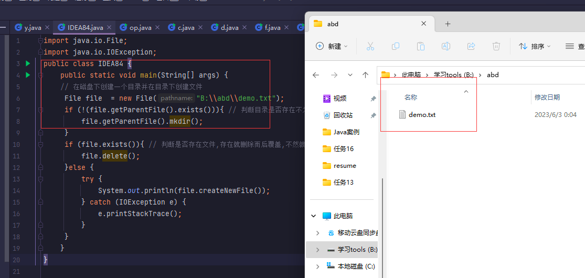

# I / O (输入/输出)  字节流 字符流 缓冲流

## 目录

-   [File 类](#File-类)
    -   [概念](#概念)
    -   [创建File对象构造方法](#创建File对象构造方法)
    -   [ 使用File类的常用方法](#-使用File类的常用方法)
        -   [创建文件](#创建文件)
        -   [创建文件夹](#创建文件夹)
    -   [遍历目录下文件](#遍历目录下文件)
        -   [过滤器遍历目录指定类型的文件](#过滤器遍历目录指定类型的文件)
        -   [遍历指定子目录下所有文件](#遍历指定子目录下所有文件)
    -   [删除文件和目录](#删除文件和目录)
        -   [删除文件](#删除文件)
        -   [删除文件夹](#删除文件夹)
-   [字节流](#字节流)
    -   [InputStream 输入常用方法 ](#InputStream-输入常用方法-)
    -   [OutputStream输出常用方法](#OutputStream输出常用方法)
    -   [FileInputStream读取文件字节](#FileInputStream读取文件字节)
    -   [ FileOutpuStream 写入文件](#-FileOutpuStream-写入文件)
    -   [FileOutputStream追加写入](#FileOutputStream追加写入)
    -   [finally执行关闭资源](#finally执行关闭资源)
    -   [逐个字节文件复制](#逐个字节文件复制)
    -   [字节缓冲区复制文件](#字节缓冲区复制文件)
    -   [字节缓冲流](#字节缓冲流)
        -   [BufferedInputStream  输入缓冲](#BufferedInputStream--输入缓冲)
        -   [BufferedOutputStrea输出缓冲](#BufferedOutputStrea输出缓冲)
        -   [缓冲流复制文件](#缓冲流复制文件)
-   [字符流](#字符流)
    -   [FileReader读取文件文本](#FileReader读取文件文本)
    -   [FileWriter将文本写入文件](#FileWriter将文本写入文件)
    -   [字符缓冲流](#字符缓冲流)
        -   [BufferedReader  输入流包装  ](#BufferedReader--输入流包装--)
        -   [BufferedWriter     输出流包装](#BufferedWriter-----输出流包装)
        -   [字符缓冲流复制文件](#字符缓冲流复制文件)
-   [转换流 字节流转换为字符流](#转换流-字节流转换为字符流)

## File 类

#### 概念

**数据流的方向：**  输入流、输出流

**处理单位:**  字节流以字节为单位进行读写，而字符流以字符为单位进行读写

**适用场景:**

字节流适用于读写二进制文件，如图片、音频等，而字符流适用于读写文本文件，如txt、html等

**读写方式：**

字节流一般使用byte数组进行读写，而字符流则使用char数组或String进行读写。在使用缓冲流时，需要先创建一个字节流或字符流的对象，然后再将其传入缓冲流的构[^注释1]造方法中进行包装。

File类是唯一代表磁盘文件的对象,提供了各种方法可以创建,删除,或者重命名文件,判断硬盘上某个文件是否存在,查询文件最后修改时间等

### 创建File对象构造方法

所有创建`File`对象的构造方法都需要传入文件路径,&#x20;

**处理一个目录或文件并且知道该目录或文件的路径,使用1方便**

**处理一个目录中的若干子目录或文件使用 2 3**


下面分别是使用构造方法传入路径,但是一个是绝对路径也就是我们B盘中的`123.txt` , 一个是相对路径,但是相对路径没懂是怎么拿的,输出也只是输出路径,并非里面的值,

```java
import java.io.File;

public class IDEA84 {
    public static void main(String[] args) {
    // 构造方法
        File f = new File("B:\\123.txt"); // 绝对路径拿到磁盘上的文件
//        File f1 = new File("src\\"); // 绝对路径拿到磁盘上的文件
        System.out.println(f);
    }
}


------------------------------------------

输出:

B:\\123.txt

 
注意: 

绝对路径传入使用的是 "\\" 第一个斜杠是因为系统中目录标识为 \ ,第二个是在Java中斜杠
代表的是特殊转义字符,所以使用斜杠前面就再加一个斜杠 就变成了两个斜杠 
并且目录符也可以用正斜线表示 / 如 B:/123.txt


```

### &#x20;使用File类的常用方法

File提供了一系列方法用于操作,内部封装的路径指向的文件或目录,比如判断文件是否存在创建删除等


#### 创建文件

```java
import java.io.File;
import java.io.IOException;
public class IDEA84 {
    public static void main(String[] args) {
     // 创建文件对象给出路径和名称 1.txt 把变量给file
    File file  = new File("B:\\1.txt");
    // exists(); 判断是否存在,存在就删除 不存在就创建而非覆盖
    if (file.exists()){
        file.delete();  // 山茶花
    }else {
        try {
            System.out.println(file.createNewFile()); // 创建一个空文件
        } catch (IOException e) {
            e.printStackTrace();
        }
    }
    }
}
```


#### 创建文件夹

```java
import java.io.File;
import java.io.IOException;
public class IDEA84 {
    public static void main(String[] args) {
    // 在磁盘下创建一个目录并在目录下创建文件 
     File file  = new File("B:\\abd\\demo.txt");
     if (!(file.getParentFile().exists())){ // 判断目录是否存在不为真则创建
         file.getParentFile().mkdir(); // mkdir() 创建文件
     }
     if (file.exists()){ // 判断是否存在文件,存在删除
         file.delete();
     }else {
     // 创建失败的异常情况
         try {
             System.out.println(file.createNewFile());
         } catch (IOException e) {
              e.printStackTrace();
         }
     }
    }
}

```



### 遍历目录下文件

`File` 类的`list()` 方法用于遍历指定目录下的所有文件

```java
import java.io.File;
public class IDEA84 {
    public static void main(String[] args) {
    // 在磁盘下创建一个目录并在目录下创建文件
     File file  = new File("B:/git/Git");
     if (file.isDirectory()){ // 判断对应目录是否存在 isDirectory()方法
         String[] names = file.list();
         for (String name :names){
             System.out.println(name); // 输出全部文件名
         }
     }
    }
}


---------------------------------------------

输出:

bin
cmd
dev
etc
git-bash.exe
git-cmd.exe
LICENSE.txt
mingw64
ReleaseNotes.html
tmp
unins000.dat
unins000.exe
unins000.msg
usr

```

#### 过滤器遍历目录指定类型的文件

上方是遍历指定文件所有文件的,但也可以只输出指定类型的文件, File类中提供了一个重载的 `list()`&#x20;

该方法接收一个`FilenameFilter`类型参数 这是一个接口也被称为文件过滤器，里面定义了一个抽象方法

`accept()` \*\* 在调用 ****`list()`****方法时,需要实现这个文件过滤器接口,并在其中的 抽象方法`accept()`中做出判断 获得指定类型的文件\*\*​

```java
import java.io.File;
import java.io.FilenameFilter;

public class IDEA84 {
    public static void main(String[] args) {
    // 在磁盘下创建一个目录并在目录下创建文件
     File file  = new File("E:\\java_demo\\new\\API\\src");
     // 创建文件过滤器对象
        FilenameFilter fiter  = new FilenameFilter() {
            @Override // 实现accept对象 这也被称为文件过滤器接口
            public boolean accept(File dir, String name) {
                File currFile =  new File(dir , name);
                // 如果文件名以 .java结尾则返回 ture  否则就是假
                if (currFile.isFile() && name.endsWith(".java")){
                    return  true;
                }else{
                    return false;
                }
            }
        };
        // 上一步已经全部过滤完成 这部的if只是将获取到的文件名遍历打印
        if (file.exists()){ // 判断 File对象相相应的目录是否存在
            String[] lists = file.list(fiter); // 获取过滤后的所有文件名数组
            for (String name : lists){
                System.out.println(name) ; // 循环遍历打出
            }
        }
    }
}

--------------------------------------------------


输出:

b.java
c.java
d.java
e.java
f.java
foreach.java
g.java
h.java
IDEA82.java
IDEA83.java
IDEA84.java
op.java
register.java
RSAUtil.java
y.java


```

```java
 if (currFile.isFile() && name.endsWith(".java")){
                    return  true;
                }else{
                    return false;
                }

currFile() 表示当前正在遍历的文件,它是一个File对象,传入两个参数
currFile.isFile() 判断传入的文件参数是否为普通文件 isFile()是普通文件的方法,
我们需要判断的是当前正在遍历的文件是否为普通文件,而不是一个目录或者是其他
所以使用的是"currFile.isFile()"而不是"dir.isFile()"。currFile表示的才是当前遍历的文件

---------------------------------------------

name.endsWith(".java")  表示文件是否以 .java结尾,这个方法出现在字符串String中
这里为什么不是currFile().endsWith(".java"),因为currFile它是一个File对象而不是字符串
endsWith()对象;
                
```

#### 遍历指定子目录下所有文件

在一个目录下除了文件还有子目录,想得到所有的子目录需要用到`File()` 提供的 `listFiles()` 方法

它返回一个 `File` 对象数组,对数组中的元素进行遍历时,如果元素还有子目录需要遍历则需要递归

```java
import java.io.File;
public class IDEA84 {
    public static void main(String[] args) {
       // 创建代表目录的File对象
        File file = new File("B:\phpstudy_pro\WWW\webshell\AwesomeScript-master");
        // 调用 方法 saber()
        saber(file);
    }
    public static  void  saber(File dir){
        File[]  files = dir.listFiles(); // 获得目录下所有文件的数组就是当前路径下的所有文件
        for (File file :files){ // 循环 遍历所有的子目录和文件先拿到所有再去if区别
            if (file.isDirectory()){  // 判断是否是一个目录也就是文件夹
                saber(file); // 如果是目录则自己调用自己 递归调用
            }
            // 输出文件的绝对路径
            System.out.println(file.getAbsolutePath());

        }
    }
}

----------------------------------------------------


输出:

输出路径下所有的子文件

B:\phpstudy_pro\WWW\webshell\AwesomeScript-master\.gitignore
B:\phpstudy_pro\WWW\webshell\AwesomeScript-master\asp\asp_eval_xxxx_script.asp
B:\phpstudy_pro\WWW\webshell\AwesomeScript-master\asp
B:\phpstudy_pro\WWW\webshell\AwesomeScript-master\aspx\asp.net_custom_script_for_odbc.aspx
B:\phpstudy_pro\WWW\webshell\AwesomeScript-master\aspx\asp.net_eval_script.aspx
B:\phpstudy_pro\WWW\webshell\AwesomeScript-master\aspx
B:\phpstudy_pro\WWW\webshell\AwesomeScript-master\jsp\jspx_custom_script_for_mysql.jspx
B:\phpstudy_pro\WWW\webshell\AwesomeScript-master\jsp\jspx_defineclass_script.jspx
B:\phpstudy_pro\WWW\webshell\AwesomeScript-master\jsp\jsp_custom_script_for_mysql.jsp
B:\phpstudy_pro\WWW\webshell\AwesomeScript-master\jsp\jsp_custom_script_for_oracle.jsp
B:\phpstudy_pro\WWW\webshell\AwesomeScript-master\jsp\jsp_defineclass_script.jsp
B:\phpstudy_pro\WWW\webshell\AwesomeScript-master\jsp\jsp_defineclass_zlib_deflated_script.jsp
B:\phpstudy_pro\WWW\webshell\AwesomeScript-master\jsp
B:\phpstudy_pro\WWW\webshell\AwesomeScript-master\php\php_assert_script.php
B:\phpstudy_pro\WWW\webshell\AwesomeScript-master\php\php_create_function_script.php
B:\phpstudy_pro\WWW\webshell\AwesomeScript-master\php\php_custom_script_for_mysql.php
B:\phpstudy_pro\WWW\webshell\AwesomeScript-master\php\php_eval_rsa_script.php
B:\phpstudy_pro\WWW\webshell\AwesomeScript-master\php
B:\phpstudy_pro\WWW\webshell\AwesomeScript-master\python\python2_custom_script.py
B:\phpstudy_pro\WWW\webshell\AwesomeScript-master\python
B:\phpstudy_pro\WWW\webshell\AwesomeScript-master\README.md


```

### 删除文件和目录

#### 删除文件

`File.delete()` 方法删除文件或者文件夹

```java
import java.io.File;

public class IDEA84 {
    public static void main(String[] args) {
       // 创建代表目录的File对象
        File file = new File("E:\\前端开发\\123.txt");
        if (file.exists()){ // exists()判断是否存在
            // 存在立即删除
            file.delete();
        }
    }
}
```


#### 删除文件夹

**删除文件夹不能直接删除因为里面存在文件,我们需要先调用递归的方式删除文件夹里面的文件,等到这个目录文件夹为空后才能去删除掉这个文件夹**

删除目录是从虚拟机直接删除而不放人回收站的，文件一旦删除就无法恢复，因此在行删除操作时要格外小心

```java
import java.io.File;

public class IDEA84 {
    public static void main(String[] args) {
       // 创建代表目录的File对象
        File file = new File("E:\\前端开发\\123.txt");
        saber(file); // 调用删除的方法 传入上方的路径
    }
    public static void saber(File dir){
        if (dir.exists()){  // 判断路径是否存在
            File[] files = dir.listFiles();// 得到当前目录下的所有子目录和文件
          for (File file:files){ // 遍历所有的子目录和文件
              if (file.isDirectory()){  // file.isDirectory() 判断是否为一个目录
                  saber(file);
              }else {
                  // 不是文件夹目录肯定是文件 那么直接删除
                  file.delete();
              }
          }
          // 删除完一个目录里面的所有文件后就删除这个目录
            dir.delete();
        }
    }
}

```

## 字节流

计算机中文本 图书 音频 视频所有的文件都是以二进制 (字节) 形式存在的, 为字节的 输入/输出`（I/0）`

流提供的一系列流统称为字节流,它是程序中最常用的流,根据数据的传输方向分为字节输入流和字节输出流

JDK提供了两个字节流的顶级父类 `InputStream`  `OutputStream`  \*\*他们都是抽象类 \*\*

> 所有的字节输入流继承 `InputStream` &#x20;
> 所有的字节输出流继承 `OutputStream` &#x20;

数据从`InputStream`  输入到程序中, 通过 `OutputStream`  从程序输出到目标设备从而实现数据传输

#### **`InputStream`**\*\* 输入常用方法 \*\*

前3个`read()` 方法都是读取数据,

第1个 read(）是从输入流中逐个读入字节

第 2、3 read() 方法是将若干字节以字节数组的形式一次性读入,从而提高读数据的效率

在进行 `I/O`  操作,当前的 `I/O` 流会占用一定的内存,由于系统资源宝贵因此,在 `I/O` 操作后

应该调用 `close()` 方法关闭流从而释放当前 `I/O` 流所占的系统资源

| int read()                             | 从输入流读取一个8位字节 ,把它转换位 0-255之间的整数 并返回这个整数                           |
| -------------------------------------- | ---------------------------------------------------------------- |
| int read (byte\[] b)                   | 从输入流读取若干字节 把他们保存到参数b指定的字节数组中,返回的整数表示读取字节的数目                      |
| int read (byte\[] b, int off, int len) | 从输入流读取若干字符,把他们保存到参数b指定的字节数组中, off指定字节数组开始保存数据的起始下标,len 表示读取的字节数目 |
| void close ()                          | 关闭此输入流并释放与该流关联的所有系统资源                                            |

#### `OutputStream`**输出常用方法**

前3 个是重载的 `write()` 方法都用于向输出流写入字节,

第1个方法逐个写入字节

第 2、3 方法将若干个字节以字节数组的形式一次性写入,提高写数据效率

`flush()` 将当前输入流缓冲区 (通常是字节数组) 中的数据强制写入目标设备,从过程称为刷新

`close()` 关闭此输入流并释放与该流关联的所有系统资源

| void write (int b)                       | 向输出流写入一个字节                      |
| ---------------------------------------- | ------------------------------- |
| void write (byte\[]  b)                  | 把参数b指定的字节数组的所有字节写到输出流           |
| void write (byte\[] b, int off, int len) | 将指定byte数组从偏移量off 开始的len个字节写入输出流 |
| void flush ()                            | 刷新此输出流并强制写出所有缓冲的输出字节            |
| void close ()                            | 关闭关闭此输出流并释放与该流关联的所有系统资源         |

虽然输入流输出流两个类提供了一系列与读写数据有关的方法,**但是这两个顶级父类为抽象类,是不能被实例化的**,因此针对不同的功能,2者都提供了不同的子类这些子类形成了一个体系结构

#### `FileInputStream`读取文件字节

`InputStream()` 是输入流的父类, `FileInputStream()` 是它的子类,是操作文件的字节输入流  专门读取文件中的数据,由于从文件读取数据是重复的操作,因此需要通过循环语句实现数据的持续读取

首先在目录下创建文件输入对应的内容用做例子


**注意:**

使用`throws Exception`表示该方法可能会抛出任何类型的异常。这是因为`main`方法是Java程序的入口点，如果程序在执行过程中出现异常，它将会被抛出并终止程序的执行。因此，使用`throws Exception`可以确保程序在出现异常时能够正确地终止，并将异常信息输出到控制台，以便开发人员进行调试和修复。加入了就不会提示主动添加异常

```java
未处理异常代码

import java.io.FileInputStream;

public class IDEA84 {
    public static void main(String[] args) throws Exception{
        // 创建一个文件字节输出流
        FileInputStream in = new FileInputStream("K:\\hello.txt");
        int b = 0;
        while (true){
            b = in.read();// 变量b记住每一个字节
            if (b==-1){ // 如果读取的字节为-1 跳出while循环
                break;
            }
            System.out.println(b); // 输出b也就是逐个输出十进制字节
        }
        in.close();// 关闭资源
    }
}

```

这里它会自动的加上异常是因为文件不存在时控制台的报错信息会有一个潜在的问题，即如果读取过程中发生了I/0错误ImputStream就无法正常关闭，资源也无法及时释放，**对于这种问题，可以使用ty...fnally 来保证无论是否发生IO错误InputStream都能够正确关闭,万一文件路径不存在也能顺利的关闭。**

```java
处理异常代码

public class IDEA84 {
    public static void main(String[] args) {
     // 创建一个文件字节输入流
        FileInputStream in = null;
        try {
            in = new FileInputStream("K:\\hello.txt");
        } catch (FileNotFoundException e) {
            e.printStackTrace(); // 如果没有这个文件则进行异常捕获打印异常信息
        }
        int b = 0; // 定义一个int 类型变量 记住每次读取的一个字节
        while (true) { // 恒真一直执行 达到持续的数据读取
            try {
                b = in.read(); // 逐个读取字节
            } catch (IOException e) {
                e.printStackTrace();
            }
            if( b == -1){ //如果读取的字节为 -1 布瑞克跳出循环
                  break;
              }
            System.out.println(b); // 否则就是将字符逐个写出
        }
        try {
            in.close(); // 执行完执行 关闭流释放内存
        } catch (IOException e) {
            e.printStackTrace();
        }
    }
}


--------------------------------------------


文本你好世界,计算机中的数据都是以字节形式存储
输出:

228
189
160
229
165
189
228
184
150
231
149
140

```

#### &#x20;`FileOutpuStream` 写入文件

所输出流的父类,同样是一个抽象类,如果使用此类必须先通过子类实例化对象, `FileOutpuStream` 是它的子类,是操作文件的字节输出流,用于将数据写入文件

```java
未处理异常代码

import java.io.FileOutputStream;
import java.io.OutputStream;

public class IDEA84 {
    public static void main(String[] args) throws Exception{
        // 创建一个文件字节输出流
        OutputStream out = new FileOutputStream("K:\\hello.txt");
        String str = "看看这个世界"; // 写入的数据
        byte[] b = str.getBytes(); // getBytes() 将字符串转换转换为字符串数组 并赋值给b
        for (int i = 0;i<b.length;i++){
            out.write(b[i]);
        }
        // 关闭程序释放内存
        out.close();
    }
}

```

通过`FileOutputStream()` 写入文件数据,如果文件路径不存在则会自动创建一个文件写入,**如果文件已经存在了,那么写入的数据会将原有的数据替换**

```java
处理异常代码

import java.io.FileNotFoundException;
import java.io.FileOutputStream;
import java.io.IOException;
import java.io.OutputStream;

public class IDEA84 {
    public static void main(String[] args) {
        // 创建一个文件字节输出流
        OutputStream out = null;
        try {
            out = new FileOutputStream("K:\\hello.txt");
        } catch (FileNotFoundException e) {
            e.printStackTrace();
        }
        String str = "看看这个世界"; // 写入的数据
        byte[] b = str.getBytes(); // getBytes() 将字符串转换转换为字符串数组 并赋值给b
        for (int i = 0;i<b.length;i++){
            try {
                out.write(b[i]);
            } catch (IOException e) {
                e.printStackTrace();
            }
        }
        // 关闭程序释放内存
        try {
            out.close();
        } catch (IOException e) {
            e.printStackTrace();
        }
    }
}

```


#### `FileOutputStream`追加写入

希望在已存在的文件内容之后追加新的内容,使用输出流的构造函数,在内部追加一个参数 为true就可以

`FileOutputStream(String fileName,boolean appled)`&#x20;

构造函数来创建文件输出流对象并把 `apple` 参数的值设置为true;

```java
未处理异常代码

import java.io.FileOutputStream;
import java.io.OutputStream;

public class IDEA84 {
    public static void main(String[] args) {
        // 创建一个文件字节输出流
        OutputStream out = new FileOutputStream("K:\\hello.txt",true);
        String str = "看看这个世界"; // 写入的数据
        byte[] b = str.getBytes(); // getBytes() 将字符串转换转换为字符串数组 并赋值给b
        for (int i = 0;i<b.length;i++){
            out.write(b[i]);
        }
        out.close();
    }
}
```

```java
处理异常代码

import java.io.FileNotFoundException;
import java.io.FileOutputStream;
import java.io.IOException;
import java.io.OutputStream;

public class IDEA84 {
    public static void main(String[] args) {
        // 创建一个文件字节输出流
        OutputStream out = null;
        try {
            out = new FileOutputStream("K:\\hello.txt",true);
        } catch (FileNotFoundException e) {
            e.printStackTrace();
        }
        String str = "123"; // 写入的数据
        byte[] b = str.getBytes(); // getBytes() 将字符串转换转换为字符串数组 并赋值给b
        for (int i = 0;i<b.length;i++){
            try {
                out.write(b[i]);
            } catch (IOException e) {
                e.printStackTrace();
            }
        }
        // 关闭程序释放内存
        try {
            out.close();
        } catch (IOException e) {
            e.printStackTrace();
        }
    }
}
```

&#x20;


为了避免抛出异常,我们在程序中使用`throws`关键字将异常抛出,但是一旦遇到 `I/O` 异常, 关闭资源的

`close()` 方法无法执行,但是这个又必须执行,可以将关闭流的操作放到 `finally()` 代码中, `finally()`

怎么样都会执行

#### `finally`执行关闭资源

```java
finally{
      try{
          if(in !=null)5  // 如果 in不为
          in.close();
      } catch (Exception e){
          e.printStackTrace(); // 打印异常信息
      }
      try{
         if (out !=null) // 如果不为空则关闭输出流,
         out.close();
      }catch (Exception e) { // 为空证明异常了,那么打印这个异常
         e.prinStackTrace()
      }
   }
}   
 
```

#### 逐个字节文件复制

程序中输入输出都是成对出现的,例如文件的复制需要输人流读取文件的内容,通过输出流将数据写入文件

如果被写入的文件不存在则是会自动创建

```java
import  java.io.*;
public class IDEA84 {
    public static void main(String[] args) throws Exception{
        // 创建一个字节输入流 用于读取当前目录下的文件
        InputStream in = new FileInputStream("K:\\hello.txt");
        //  创建一个文件输出流,用来获得读取的文件
        OutputStream out = new FileOutputStream("K:\\demo.txt");
        int len; // 定义变量记住每次读取的字节
        // 获得当前文件系统世界
        long a = System.currentTimeMillis();
        // 逐个读取每一个字节判断是否到了文件末尾,不等于-1才会执行写入
        while ((len = in.read()) !=-1){ 
           out.write(len); // 将读到的字节写入文件 这个while才是核心代码
        }
        // 获得文件复制结束时的系统时间
        long b = System.currentTimeMillis();
        System.out.println("复制文件所消耗的时间是"+(b-a)+"毫秒");
        in.close(); //  关闭资源
        out.close();
    }
}
```


#### 字节缓冲区复制文件

通过流的方式复制文件,为了提高效率可以定义一个字节数组作为缓冲区,在复制文件时,可以一次性读取多个字节的数据,并且保持在字节数组中,然后将字节数组中的数据一次性写入文件 **被写入文件不存在也会创建**

```java
import  java.io.*;
public class IDEA84 {
    public static void main(String[] args) throws Exception{
        // 创建一个字节输入流 用于读取当前目录下的文件
        InputStream in = new FileInputStream("K:\\hello.txt");
        //  创建一个文件输出流,用来获得读取的文件
        OutputStream out = new FileOutputStream("K:\\8.txt");
        // 获取文件的字节长度
        int length = in.available();
        // 创建一个字节数组缓冲区读写文件
       // byte[] buff = new byte[length]; 
        byte[] buff = new byte[100]; // 定义一个字节数组作为缓冲区
        // 定义一个int类型的变量len记住读取读入缓冲区的字节数
        int len;
        while ((len = in.read(buff)) != -1){ //read(buff)传入存储的字节数组
            out.write(buff,0,len); // 从第一个字节开始 向文件写入leng个字节
            System.out.println(in.read());
        }
        in.close();
        out.close();
    }
}


```

对于`byte[]` 的字符数组有两种写法

```java
1. 直接传入长度不是动态

byte[] buff = new byte[100]; // 定义一个字节数组作为缓冲区

2. 动态传入文件的字节长度  length  把获得的动态长度传入

int length = in.available();
byte[] buff = new byte[length]; 
```

### 字节缓冲流

缓冲流是对字节流和字符流的一种包装，可以提高读写效率。

#### `BufferedInputStream`  输入缓冲

#### `BufferedOutputStrea`输出缓冲

&#x20;`I/O` 提供两个带缓冲的字节流 `BufferedInputStream`  `BufferedOutputStream` 他们的构造方法中分别接收 `InputStream`   `OutputStream` 类型的参数作为对象,也就是可以传入文件对象,在读写时提供缓冲功能


应用程序是通过缓冲流来完成数据的读写的,缓冲流又是通过底层的字节流和设备关联.这两个缓冲流内部都定义了一个大小为8192的字节数组

#### 缓冲流复制文件

使用字节缓冲区将`hello.txt` 文件复制到`a.txt` 不存在就会创建,,首先将读写的数据存人定义好的字节数组;然后将字节数组的数据一次性读写到文件中，这种方式和上文的的字节流的缓冲区类似，都对数据进行了缓冲，从而有效地提高了数据的读写效率。

```java
import  java.io.*;
public class IDEA84 {
    public static void main(String[] args) throws Exception{
      // 创建一个带缓冲区的输入流
        BufferedInputStream bis = new BufferedInputStream(new FileInputStream("K:\\hello.txt"));
      // 创建一个带缓冲区的输出流
        BufferedOutputStream bos = new BufferedOutputStream(new FileOutputStream("K:\\a.txt"));
        int len; // 变量记录字节
        while ((len = bis.read()) !=-1){ // 不为-1那么就正常执行
               bos.write(len); // 将字节输出到bos中
        }
        bis.close();
        bos.close();

    }
}
```


## 字符流

字符流存在两个顶级父类 `Reader` `Writer`  前者是字符输入流 用于从某个源设备上读取字符,后者字符输出流,用于向某个设备写入字符,作为字符流顶级父类也有许多子类


#### `FileReader`读取文件文本

字符输入流`FileReader` 可以从关联的文件中读取一个或一组字符,读取文件数据打印,

`FleReader` 对象返回的字符流是 `char`，而 `InputStream`对象返回的字符流是`byte`这是两者之间最大的区别

```java
import  java.io.*;
public class IDEA84 {
    public static void main(String[] args) throws Exception{

     // 创建一个 FileReader 对象用于来读取文件中的字符
        FileReader reader = new FileReader("K:\\hello.txt");
        int len; // 定义变量记录读取的字符
        while ((len = reader.read()) !=-1){ // 循环判新是否读取到文件的末尾
   // (char) len是将读取到的字符转换成char类型并输出因为reader.read()方法返回的是int类型
   //表示读取到的字符的ASCII码值需要将其强制转换成char类型才能输出对应的字符。
            System.out.print((char) len);  //
        }
        reader.close(); // 关闭文件读取流 释放资源
    }
}


------------------------------

输出:

看看这个世界123


```

#### `FileWriter`将文本写入文件

它是`Writer`的一个子类,用于向文件中写入字符,，如果指定的文件不存在，就会先创建文件，再写入数据，如果文件存在,则会先清空文件中的内容，再进行写人 **。如果想在文件末尾追加数据，同样需要调用重载的构造方法.** 修改创建的文件对象为`true`

```java
import  java.io.*;
public class IDEA84 {
    public static void main(String[] args) throws Exception {

        // 创建一个 FileWriter 对象用于向文件中写入数据
        FileWriter writer = new FileWriter("K:\\hello.txt");
        // 追加内容 天机哎参数为true  原始代码不变
        FileWriter writer = new FileWriter("K:\\hello.txt",true);
        String str = "网络安全";
        writer.write(str); // 将字符数据写入到文本文件中
        writer.write("\r\n"); // 将输出语句换行
        writer.close();// 关闭写入流 释放资源
    }
}

```


### 字符缓冲流

缓冲流是对字节流和字符流的一种包装，可以提高读写效率

#### `BufferedReader`  输入流包装 &#x20;

#### `BufferedWriter  `   输出流包装

字符流提供了带缓冲区的包装流 分别是 `BufferedReader` 用于输入流包装   `BufferedWriter` 输出流包装

,前者输入流包装有一个重要方法 `readLine()` 该方法可以读取一行文本

#### 字符缓冲流复制文件

复制`hello.txt` 文本的内容到 `9.txt` 不存在则创建,存在则覆盖或者是添加 `true` 追加

```java
import  java.io.*;
public class IDEA84 {
    public static void main(String[] args) throws Exception {
        // FileReader 对象向文本中读取数据
        FileReader reader = new FileReader("K:\\hello.txt");
        // 创建一个BufferedReader 输入缓冲对象
        BufferedReader br = new BufferedReader(reader);
        //  FileWriter 对象向文件中写入数据
        FileWriter writer = new FileWriter("K:\\9.txt");
        // 创建一个 输出缓冲区对象
        BufferedWriter bw = new BufferedWriter(writer);
        String str;
        // readLine() 每次读取一行文本 判断是否到了文件末尾
        while ((str = br.readLine()) !=null){
            bw.write(str);
            // 写入一个换行符 该方法会根据不同的操作系统生成相应换行符
            bw.newLine();
        }
        br.close();
        bw.close();  // 关闭资源

    }
}

```

**注意:**

由于字符缓冲流内部使用了缓冲区，在循环中调用BufferedWriter的write()方法字符时，这些字符首先会被写入缓冲区，当缓冲区写满时或调用 close()方法时，缓冲区中的字符才会写人目标文件。因此在循环结束时一定要调用 close()方法，否则极有可能会导致部分存在缓冲区中酸据没有被写人目标文件。

## 转换流 **字节流转换为字符流**

`I/O` 流分为字符流和字节流,有时候字节流和字符流之间也需要转换,JDK提供两个类用于转换

`InputStreamReader`   `OutputStreamWriter`

-   `InputStreamReader`是 Reader 的子类它可以将一个字节输入流转换成字符输入流方便直接读取字符
-   `OutputStreamWriter`是Writer 的子类它可以将一个字节输出流转换成字符输出流方便直接写人字符

**字节流转换为字符流**

里面这两段代码先创建正常的字节输入输出流 `in` `out`  再通过转换为字符流的代码传入参数

再重新赋值给 `isr` `osw`  这样他就变成了新的 字符流

```java
 InputStreamReader isr = new InputStreamReader(in); // 传入的参数为文本字节输入
 OutputStreamWriter osw = new OutputStreamWriter(out); // 传入参数为文本字节输出
```

```java
import  java.io.*;
public class IDEA84 {
    public static void main(String[] args) throws Exception {
    //  创建文件字节输入流 并指定源文件
     FileInputStream in = new FileInputStream("K:\\hello.txt");

     //  将字节输入流转换为字符输入流
     InputStreamReader isr = new InputStreamReader(in); // 传入的参数为文本字节输入

     // 创建字节输出流对象 并指定目标文件
     FileOutputStream out = new FileOutputStream("K:\\00.txt");

     // 将字节输出流转换为字符输出流
     OutputStreamWriter osw = new OutputStreamWriter(out); // 传入参数为文本字节输出
     int ch;  // 定义变量记录读取的字符
      while ((ch= isr.read()) !=-1){
          osw.write(ch);  // 将字符数据写入 des.txt 文件中
      }
      isr.close(); // 关闭文件读取流 释放资源
      osw.close(); // 关闭文件读取流 释放资源
        
    }
}
```


[^注释1]: 缓冲流则是在字节流和字符流的基础上增加了缓冲区，可以减少IO操作的次数，提高读写效率。
