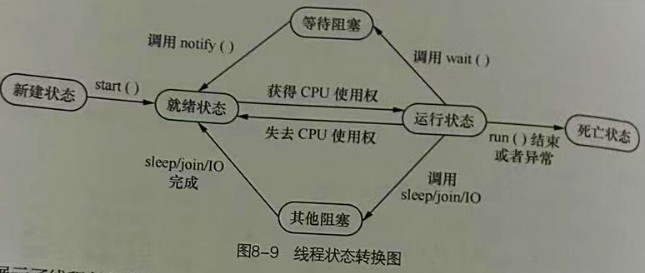
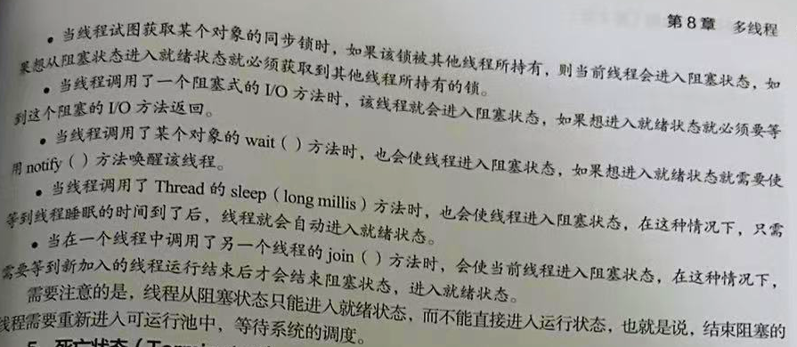

# 多线程

## 目录

-   [线程](#线程)
-   [线程创建](#线程创建)
    -   [继承Thread 类创建多线程](#继承Thread-类创建多线程)
    -   [实现 Runnable 接口创建多线程](#实现-Runnable-接口创建多线程)
    -   [线程对比](#线程对比)
    -   [多线程简化写法](#多线程简化写法)
-   [线程的生命周期及状态转换](#线程的生命周期及状态转换)
    -   [线程状态转换](#线程状态转换)
-   [线程调度](#线程调度)
    -   [调度模型](#调度模型)
    -   [线程优先级 setPriorty](#线程优先级-setPriorty)
    -   [线程休眠 sleep() 出现异常](#线程休眠-sleep-出现异常)
    -   [线程让步 yield()](#线程让步-yield)
    -   [线程插队 join()](#线程插队-join)
-   [多线程同步](#多线程同步)
    -   [线程安全问题](#线程安全问题)
    -   [同步代码块 synchronized ](#同步代码块-synchronized-)
    -   [同步方法 synchronized 修饰](#同步方法-synchronized-修饰)
    -   [死锁问题](#死锁问题)

多线程是提升程序性能非常重要的方式,使用它可以让程序充分利用`CPU` 资源,提高`CPU` 使用率,解决高并发带来的负载均衡问题

# 线程

**进程**

计算机一遍听歌一遍看电视,每一个独立执行的程序都可称为一个进程,也就是在任务管理器中的\*\* "正在运行的程序"\*\*,虽然我们看上去是支持程序并发一起执行,但实际上并不是一起执行的,因为所有的应用程序都是由`CPU` 执行的对于它而言在某个时间点只能运行一个程序,执行一个进程,。

操作系统会为每一个进行分配一个有限的时间,`CPU` 在这段时间执行某个进程,然后在下个时间去执行另外的进程,由于`CPU` 运行速度很快,能在极短的是时间内在不同的进程之间切换所以给人同时执行多个程序的感觉

**线程**

每一个运行的程序都是一个进程, 并且在一个进程中还可以有多个执行单元同时运行,这些执行单元可以看 作程序执行的一条条线索,称为**线程**,每个进程最少都存在一个线程, 当`Java` 程序启动时,就会产生一个进 程,进程中再默认创建一个线程,在这个线程的基础上运行`main`方法中的代码

普通的代码都是按照调用顺序依次从下执行的,没有出现两段代码交替的情况,这样的程序称为单线程,

如果希望程序中实现多段代码交替运行的结果,则需要创建多个线程,即多线程程序,\*\* 多线程是指一个进程在执行过程中可以产生多个单线程,这些单线程在运行时是相互独立的,他们可以并发执行\*\*

# 线程创建

`Java`提供了两种多线程实现方式 :

1.  继承`java.lang` 包下的 `Thread`类, 覆盖 `Thread` 类的 `run()`  方法,在其中实现运行在线程的代码
2.  实现 `java.lang.Runnable` 接口,在 `run()` 方法中实现运行在线程的代码

### 继承`Thread `类创建多线程

**单线程程序**&#x20;

`12`行调用 `run()` 方法导致一直为真一直循环里面的语句,而 `13` 行之后的语句无法得到执行,如果希望下面的语句也可以得到并发执行,就需要实现多线程

```java
class MyThread{
    public void run(){
        while (true){
            System.out.println("MyThread类的run()方法在运行");
        }
    }
}

public class exple {
    public static void main(String[] args) {
        MyThread my = new MyThread(); // 实例化创建对象my
        my.run();  // 这里调用就会一直执行 run() 方法导致下面的无法执行
        while (true){  // while为真没有break语句一直执行
            System.out.println("执行不到");
        }
    }
}


------------------------------------------

输出:

MyThread类的run()方法在运行
MyThread类的run()方法在运行
MyThread类的run()方法在运行
MyThread类的run()方法在运行
MyThread类的run()方法在运行 


```

&#x20; &#x20;

**多线程程序**&#x20;

继承线程类`Thread` 重写其中的 `run()`方法 实现多线程,提供了 `start()` 方法用于启动新线程,启动后虚拟机自动调用 `run()` 方法,如果子类重写了便会执行子类中的方法

```java
class MyThread extends Thread{ // 类继承线程类 Thread
    public void run(){ // start()方法开启后 run方法自动执行
        while (true){
            System.out.println("MyThread类的run()方法在运行");
        }
    }
}

public class exple {
    public static void main(String[] args) {
        MyThread my = new MyThread(); // 实例化创建对象my
        my.start();  // 开启线程 main方法中的代码一起并发执行
        while (true){  // while为真没有break语句一直执行
            System.out.println("执行不到");
        }
    }
}


--------------------------------------


输出:

MyThread类的run()方法在运行
MyThread类的run()方法在运行
MyThread类的run()方法在运行
执行不到
执行不到
执行不到


```

通过继承`Thread` 类的方式实现多线程有一定的局限性,因为`Java` 只支持单继承 一个类只能有一个父亲,所以要是为了实现多线程继承了这个类,那么它就不能继承其他的类了

### 实现 `Runnable `接口创建多线程

`Thread`提供了构造方法 `Thread(Runnable target)`  其中 `Runnable` 是一个接口, 它只有一个 `run()`方法 ,当这个构造方法创建多线程对象时, 只需要为这个接口传递一个 实现了 `Runnable` 接口的实例对象 ；这样创建的线程调用的是接口类中的 `run()` 来运行,而不是 `Thread`的`run()`

```java
class MyThread  implements Runnable { // 实现 Runnable接口
    public void run(){  // 线程的代码段 当调用 start()方法时,线程从此处开始执行
    // 这里的 run()方法相当于重写了 Runnable接口的 run()方法
        while (true){
            System.out.println("MyThread类的run()方法在运行");
        }
    }
}

public class exple {
    public static void main(String[] args) {
        MyThread my = new MyThread(); // 实例化创建对象my
        Thread thread = new Thread(my); // 传入实现接口的线程对象
        thread.start(); // 开启线程 执行线程中的run() 方法
        while (true){  // while为真没有break语句一直执行
            System.out.println("执行不到");
        }
    }
}


-------------------------------------

输出:

MyThread类的run()方法在运行
MyThread类的run()方法在运行
MyThread类的run()方法在运行
执行不到
执行不到
执行不到
执行不到


```

### 线程对比

**继承Thread类实现**

假设存在100张车票需要出售,100张是共享资源,创建4个线程

但是运行结果是每张车票都被打印了4次,全部跑完等于是400张车票,出现这个问题的原因就是线程没有共享,而是各自出售100张,程序中创建了 4个线程,每个线程各自处理自己的

每个线程都有自己的名字,主线程默认是 `main` ,我们第一个创建的线程默认 `Thread-0` ,第二个默认1,依次类推,如果需要指定线程的名称, 可以通过调用 `setName(String name)`\*\* 方法为线程设置名称\*\*​

```java
class MyThread  extends Thread { // 继承 Thread类
    private  int tickets = 100; // 私密变量
    public void run(){
        while (true){
            if (tickets > 0){ // 大于0 执行代码
                Thread th = Thread.currentThread(); // currentThread()方法获取当前线程实例对象
                String  th_name = th.getName(); // getName() 获取当前线程名字
                System.out.println(th_name+"正在发售"+tickets--+"车票"); 
                // tickets-- 每次都会减少 车票数量

            }
        }
    }

}

public class exple {
    public static void main(String[] args) {
        // 创建四个线程
        new MyThread().start(); // 创建线程并开启
        new MyThread().start(); // 创建线程并开启
        new MyThread().start(); // 创建线程并开启
        new MyThread().start(); // 创建线程并开启

    }
}


--------------------------------------------------

输出:

Thread-2正在发售100车票
Thread-3正在发售100车票
Thread-0正在发售100车票
Thread-0正在发售99车票
Thread-1正在发售100车票

```

**实现Runnable接口创建**

```java
class MyThread  implements Runnable { // 实现 Runnable接口
    private int tickets = 100;
    public  void run(){ // 下方的 start()方法调用那么这个run()方法也会自动调用
        while (true){
            if (tickets > 0){
                Thread th = Thread.currentThread();// 获取当前线程
                String th_name = th.getName(); //  获取当前线程名称
                System.out.println(th_name+"正在发售第"+tickets--+"车票");
            }
        }
    }
}

public class exple {
    public static void main(String[] args) {
     MyThread my = new MyThread(); // 创建 MyThread类实例对象
     // Thread(Runnable a, String name); a放置实现了接口了类,name是自定义线程名称
    // 创建线程
     new Thread(my,"窗口1").start(); // 自定义线程名称并调用start() 原神启动
     new Thread(my,"窗口2").start(); // 自定义线程名称并调用start() 原神启动
     new Thread(my,"窗口3").start(); // 自定义线程名称并调用start() 原神启动
     new Thread(my,"窗口4").start(); // 自定义线程名称并调用start() 原神启动
    }
}


---------------------------------------

4个线程访问的是同一个  tickets  变量

输出:

窗口1正在发售第100车票
窗口4正在发售第97车票
窗口2正在发售第98车票
窗口2正在发售第94车票
窗口2正在发售第93车票
.............
```

**实现Runnable接口相比于继承Thread而言**

-   适合多个相同程序代码的线程去处理同一个资源的情况,把线程同程序代码 数据有效分离,很好的体现了面向对象的设计思想
-   避免了由于`Java` 单继承所带来的局限性,在开发中一个类不能继承两个父类,如果为了实现多线程而使用了 `Thread` 那么就有很多局限性,所以只能采用 `Runnable` 实现接口的方式

### 多线程简化写法

简化了多线程的创建方法 在创建线程时指定线程要调用的方法&#x20;

**格式**&#x20;

```java
Thread t = new Thread(() ——>{
   // mian 方法代码
    }
} );
```

**简化多线程**

同实现Runnable运行结一致

```java
class MyThread  extends Thread { // 继承Thread类实现多线程
    public  void run(){ // 下方的 start()方法调用那么这个run()方法也会自动调用
        while (true){
            System.out.println("run()打印方法在运行");
        }
    }
}

public class exple {
    public static void main(String[] args) {
     MyThread my = new MyThread( () ->{
       while (true){
           System.out.println("123");
       }
     });
     my.start(); // 启动新线程

    }
}
```

# 线程的生命周期及状态转换

任何对象都有生命周期,线程同样也是,当`Thread` 对象创建完成时, 线程的生命周期就开始了  **当它的 ****`run()`**** 方法代码正常执行完毕 或者是抛出一个异常或者错误 线程的生命周期便会结束**

线程生命周期五个状态, 不同状态表明了线程当前正在进行的活动,并且我们可以通过一些操作使线程在不同 状态之间转换

## 线程状态转换

下图展示线程各种状态的转换关系,箭头表示可转换的方向,**单箭头表示只能单向转换,比如线程可以从新建状态转换到就绪状态,反之则不能,双箭头表示两种状态可以相互转换,利润也就绪状态可以在运行状态之间互相转换,**



-   **新建状态 New**

&#x20;     创建一个线程对象后,该线程就处于新建状态,此时它不能运行,和其他Java对象一样,仅仅是`Java` 虚拟

&#x20;     机为其分配了内存, 没有表现出任何线程的动态特征

-   **就绪状态 Runnable**

&#x20;     当线程调用了`start()` 方法后, 该线程就进入就绪状态,处于这个状态的线程位于线程队列中,此时它只  &#x20;

&#x20;     只是具备了运行的条件,但是能否获得`CPU` 的使用权并开始运行,还要等于系统的调度

-   **运行状态 Running**

&#x20;     在就绪状态的线程获得了`CPU` 使用权,并开始执行 `run()` 方法中的线程执行体,该线程处于运行状态。

&#x20;    **注意:**

&#x20;    一个线程启动后,它可能不会一直处于运行状态,当运行状态的线程使用完系统分配的时间后,系统就会剥                   &#x20;

&#x20;    夺该线程占用的CPU资源, 让其他线程获得执行的机会,需要注意；只有处于就绪状态的线程才可能转换&#x20;

&#x20;    到运行状态

-   **阻塞状态 Blocaked**

&#x20;    一个正在执行的线程在某些特殊情况下,如被认为挂起或执行耗时的输入/输出 操作时,会让出`CPU` 使用    &#x20;

&#x20;    权, 并暂时终止自己的执行,进入阻塞状态, 线程进入这个状态后, 就不能进入排队队列,只有当引起阻塞的

&#x20;    原因 被消除后,线程才可以转入就绪状态

&#x20;   &#x20;

&#x20;   \*\* 常用线程由运行状态转换成阻塞状态的原因,如果从阻塞状态转换成就绪状态\*\*

&#x20;    &#x20;



&#x20;  &#x20;

-   **死亡状态 Terminated**

`stop()`方法 或****`run()`**** 方法正常执行完毕,或者线程抛出一个捕获的异常错误,线程就进 \*\*

&#x20;   \*\*  入死亡状态, \*\*一旦进入死亡状态 线程不再拥有运行资格, 也不能再转换到其他状态

&#x20;   &#x20;

# 线程调度

程序中的多个线程是并发执行,某个线程若想被执行,必须得到`CPU` 使用权  `Java` 虚拟机会按照特定的机制为程序中的每个线程分配`CPU` 使用权,**这种机制称为线程的调度**

### 调度模型

**分时调度模型**

让所有的线程轮流获得`CPU` 使用权,并且平均分配每个线程占用`CPU` 的时间片,

**抢占式调用模型**

让可运行池中的优先级高的线程优先占用`CPU`, 对于优先级相同的线程, 随机选择 一个线程使其占用 `CPU` 当它失去了 `CPU` 使用权后, 再随机选择其他线程获取 `CPU` 使用权, Java虚拟机默认采用抢占式调度模型,通常情况下程序员不需要关心它,但在某些特定的需求下需要改变这种模式,由程序自己来控制`CPU` 调度

### 线程优先级 `setPriorty`

程序中如果要对线程进行调度,最直接的方式就是设置线程优先级,优先级越高的程序获得`CPU` 执行的机会越大,反正越低, 优先级使用数字 `1-10` 整数表示,数字越大 级别越高,&#x20;

除了可以直接使用数字表示线程优先级外,还可以使用  `Thread`类 提供的3个静态常量表示线程优先级

| Thread 类静态常量              | 功能描述          |
| ------------------------- | ------------- |
| static int MAX\_PRIORITY  | 线程最高优先级 值为 10 |
| static int MIN\_PRIORITY  | 线程最低优先级 值为 1  |
| static int NORM\_PRIORITY | 线程普通优先级 值为 5  |

程序运行期间 处于就绪状态的每个线程都有自己的优先级, 比如 main 线程具有普通优先级,然而线程优先级不是固定的,可以通过 `Thread`类 的 `setPriorty(int newPriority)`  方法 进行设置, 它接收一个 `1-10`整数或者是 `Thread` 类提供的3个静态常量

**不同优先级的两个线程在程序中的运行情况**

优先级较高的`max`线程先运行运行完毕后优先级较低的`min`线程才开始运行。**所以优先级越高的线程获取 CPU切换时间片的概率就越大。**

```java
 class MyThread implements Runnable{ // 实现接口
   public  void  run(){
       for (int i =0;i<3;i++){
           // Thread.currentThread().getName() 获取当前正在执行的线程名称
           // 会输出 下方实例化中的传入的字符串
           System.out.println(Thread.currentThread().getName()+"正在输出:"+i);
       }
   }

}
class Priort implements Runnable{  // 实现 接口
    public void run(){
        for (int i =0;i<3;i++){
            // Thread.currentThread().getName() 获取当前正在执行的线程名称
            // 会输出 下方实例化中的传入的字符串
            System.out.println(Thread.currentThread().getName()+"正在输出:"+i);
        }

    }

}
public class exple {
    public static void main(String[] args) {
        // 创建两个线程
        Thread min = new Thread(new MyThread(),"优先级较低的线程"); //接收一个字符串作为线程的名称
        Thread max = new Thread(new Priort(),  "优先级较高的线程"); //接收一个字符串作为线程的名称
        min.setPriority(Thread.MIN_PRIORITY); // 设置线程优先级为1
        max.setPriority(Thread.MAX_PRIORITY); // 设置线程优先级为10
        // 开启两个线程
        min.start();
        max.start();

    }
}


-----------------------------------------------

输出结果会变化,有时会交叉输出有时执行完一项再输出另一项

输出:

优先级较低的线程正在输出:0
优先级较高的线程正在输出:0
优先级较低的线程正在输出:1
优先级较高的线程正在输出:1
优先级较高的线程正在输出:2
优先级较低的线程正在输出:2

```

**注意：**

虽然Java 中提供了 最高`10`个的线程优先级，但是这些优先级需要操作系统的支持，不同操作系统对优先级的支持是不一样的，不会与`Java `中线程优先级一一对应，因此，在设计多线程应用程附,其功能的实现一定不能依赖于线程的优先级，而只能把线程优先级作为一种提高程序效率的手段

### 线程休眠 `sleep()` 出现异常

如果希望人为的控制线程,使正在执行的线程暂停,将`CPU` 让给别的线程,这时可以**使用静态方法 ****`sleep(long millis)`**** ,该方法可以让当前正在执行的线程暂停一段时间, 进入休眠等待状态**

当前线程调用这个方法后,在指定时间(单位毫秒)内该线程是不会执行的,这样其他线程可以得到执行

`sleep(long millis)` 方法声明会抛出 `InterrupteException` 异常,因此在调用该方法时应该捕获异常

或者声明抛出该异常

```java

// 当前的main方法是主线程,

public class exple2  {
    public static void main(String[] args) throws Exception{
        // 创建一个线程 并启动
        // 直接传入sleep类到Thread中省去一步实例化,因为Runnable接口也是Thread类的构造方法
        new Thread(new Sleep()).start();
        for (int i=1; i<=10;i++){
            if (i==5){
            // 这里不使用try异常包裹是因为在mian方法中写了 异常处理
                Thread.sleep(2000);// 当前线程休眠2000毫秒
            }
            System.out.println("主线程正在输出"+i);
            Thread.sleep(500); // 当前线程休眠 500毫秒 mian方法中的
        }
    }
}
class Sleep implements Runnable{ // 实现接口
    public void run(){ // 重写 方法
        for (int i = 1; i<=10;i++){
            if (i==3){ //执行到第3次就休眠
                try {
                    Thread.sleep(2000); // 当前线程休眠2秒
                } catch (InterruptedException e){
               // ，e.printStackTrace()方法会打印出异常的类型
               //消息和堆栈跟踪信息，其中堆栈跟踪信息包括了异常发生的位置和调用关系，可以帮助开发者定位问题。 
                    e.printStackTrace();
                }
            }
            System.out.println("sleep线程正在输出"+i);
            // 因为使用休眠方法会爆出异常,所以要出现让异常包裹
            try {
                Thread.sleep(500);// 当前线程休眠500
            }catch (Exception e){
                e.printStackTrace();
            }
        }

    }

}


---------------------------------------------

 注意: 

 /*两个线程最后均休眠了500, 目的是让一个线程在打印一次后休眠500
 从而使另一个线程获得执行的机会,这样就可以实现两个线程交替执行
  */

输出:

主线程正在输出1
sleep线程正在输出1
sleep线程正在输出2
主线程正在输出2    // 这里输出2后sleep类并没有交替输出而是接着输出 3 4 
主线程正在输出3    // 这是因为sleep在这里等于了3,i=3 它休眠了出不来 
主线程正在输出4
sleep线程正在输出3 // 这里也是主线程i=5了休眠了所以出不来
sleep线程正在输出4
主线程正在输出5    
sleep线程正在输出5
sleep线程正在输出6
主线程正在输出6
sleep线程正在输出7
主线程正在输出7
主线程正在输出8
sleep线程正在输出8
sleep线程正在输出9
主线程正在输出9
主线程正在输出10
sleep线程正在输出10

```

**注意:**

`sleep()` 是静态方法,只能控制当前正在运行的线程休眠,而不能控制其他线程休眠, 当休眠时间结束后,线程就会返回到就绪状态 而不是立即开始执行

### 线程让步 `yield()`

线程让步是指正在执行的线程,在某些情况下将`CPU` 资源让给其他线程执行, 通过 `yield() `方法实现,同

`sleep()` 相似,都可以让正在运行的线程暂停,区别是 `yield()` 方法不会阻塞该线程,它只是将线程转换成就绪状态, 让系统的调度器重新调度一次。 当某个线程调用 `yield()`方法之后,只有与当前线程优先级相同或者更高的线程才能获得执行的机会

```java

//  继承 Thread类实现多线程
class Yie extends Thread{
    // 定义有参的构造方法
   public Yie(String name){
       super(name); // 调用父类的构造方法
   }
   // 重新继承来的run()方法
   public void run(){
       for (int i=0;i<6;i++){
           // 获得 当前线程的名字
           System.out.println(Thread.currentThread().getName());
           if (i==3){ // 到了第三次就线程让步
               System.out.println(Thread.currentThread().getName()+"线程让步"+"第"+i+"次");
               Thread.yield(); // 线程运行到此作出让步
           }
       }
   }

}
public class exple3 {
    public static void main(String[] args) {
        // 创建两个线程
        Thread t1 = new Yie("线程A");
        Thread t2 = new Yie("线程B");
        // 开启两个线程
        t1.start();
        t2.start();
    }
}


-------------------------------------------------
在线程变量 i=3 就会调用yield();使当前线程暂停另一个线程执行


输出:

线程A
线程A
线程A
线程A
线程B
线程B
线程B
线程B
线程A线程让步第3次  // 让步后紧接着下一个也让步
线程B线程让步第3次
线程A
线程A
线程B
线程B
```

### 线程插队 `join()`

当某个线程调用其他线程的  `join()` 方法时,调用的线程将被阻塞,直到被`join()` 方法加入的线程执行完成后才会继续执行,`join()`方法里面加入的代码就是插队代码,插队完成下面的才会继续跑

```java
class Eme implements Runnable{ // 实现接口
    public void run(){
        for (int i=1;i<6;i++){
            System.out.println(Thread.currentThread().getName()+"输入:"+i);
            try {
                Thread.sleep(500);// 休眠
            }catch (InterruptedException e){
            // ，e.printStackTrace()方法会打印出异常的类型、消息和堆栈跟踪信息
            // 其中堆栈跟踪信息包括了异常发生的位置和调用关系，可以帮助开发者定位问题。
                e.printStackTrace();
            }
        }
    }

}
public class exple4 {
    public static void main(String[] args) throws  Exception{
     // 创建线程 接收字符串作为名称
        Thread t = new Thread(new Eme(),"线程1"); //
        t.start(); // 开启线程
        for (int i =1;i<6;i++){
            System.out.println(Thread.currentThread().getName()+"输入:"+i);
            if (i==2){ // main为2时开始插队
                t.join(); // 调用 joion方法进行插队 执行完 join()方法才会继续执行
            }
            Thread.sleep(500); // 休眠 500毫秒
        }
    }
}


-----------------------------------------

输出:

main输入:1
线程1输入:1
main输入:2 // 在这里mian线程中i=2调用t.join(),线程1开始执行,所以到了某个点就可以插队
线程1输入:2 // 插队调用其他的线程
线程1输入:3
线程1输入:4
线程1输入:5 // 直到线程1全部执行完 才执行 main
main输入:3
main输入:4
main输入:5

```

# 多线程同步

当多个线程去访问同一个资源的时候就会引发安全问题, 如果一个班级要统计人数,但是学生进进出出就很难统计,所以需要实现多线程的同步, 限制某个资源在同一个时刻只能被一个线程访问,

### 线程安全问题

线程一开始的售票案例,有可能会碰到不安全的事情,如一张票被打印多次 或者打印的票数为 0甚至为负数,这样意外都是多线程操作共享资源 `ticket` 而导致的线程安全问题,修改代码 模拟4个窗口出售10张票, 并且每次售票时线程休眠 10毫秒

```java
class Sa implements Runnable{ //实现接口
    private int tickets = 10; // 10张票
    // 重写 run()方法
    public void run(){
     while (tickets > 0){
         try {
             Thread.sleep(10); //经过这个方法的线程休眠10毫秒
         }catch (InterruptedException e){
             e.printStackTrace(); // 输出异常信息
         }
         // 票数递减
         System.out.println(Thread.currentThread().getName()+"--卖出的票"+tickets--);
     }
    }

}

public class exple5 {
    public static void main(String[] args) {
        Sa s = new Sa(); //创建对象
        new Thread(s,"线程1").start();
        new Thread(s,"线程2").start();
        new Thread(s,"线程3").start();
        new Thread(s,"线程4").start();

    }
}
-----------------------------------------


输出:

线程3--卖出的票8
线程2--卖出的票9
线程1--卖出的票10
线程4--卖出的票7
线程2--卖出的票6
线程3--卖出的票6
线程1--卖出的票6
线程4--卖出的票5
线程2--卖出的票4
线程4--卖出的票3
线程1--卖出的票4
线程3--卖出的票4
线程1--卖出的票2
线程4--卖出的票1
线程2--卖出的票-1
线程3--卖出的票0

```

出现负数的原因是多线程在售票时出现了安全问题,在`while()` 循环中添加了 `sleep()`方法 ,由于线程有延迟,当票数 减为 1 时,假设线程1此时出售1号票,对票号进行判断后,进入 `while()`循环 在售票之前通过 `sleep()`方法暂时让线程休眠,这时线程2进行售票,由于票数还是1 所以 - -,4个线程都进入`while()` 循环,休眠结束后 4个线程都会进行售票,相当于 票号-4,所以会出现0 -1 -2&#x20;

### 同步代码块 `synchronized`&#x20;

解决线程安全问题就必须保证任何时候只能有一个线程访问共享资源&#x20;

```java
while(tickets > 0){
    try{
       Thread.sleep(10); // 经过此处的线程休眠 10秒
    } catch(InterruptedException e){
         e.printStackTrace();
    }
    System.out.printin
}
```

`Java` 提供了同步机制,当多个线程使用同一个共享资源时,可以将处理共享资源的代码放在一个使用&#x20;

`synchronized` 关键字修饰的代码块中, 这个代码块被称为同步代码块&#x20;

**创建同步代码块格式**

lock是一个锁对象,它是同步代码块的关键,当某一个线程执行同步代码块时,其他线程将无法执行当前同步代码块,会发送阻塞,只有当前线程执完同步代码块后,所有的线程开始抢夺线程的执行权, 抢到了的线程就进入同步代码块,执行里面的代码,循环往复 直到共享资源被处理完为止

**格式**

```java
synchronized(lock){
    操作共享资源代码块
}
```

将`ticke` 变量的操作全部放到同步代码块中,为了保证线程的持续执行,将同步代码放在了 `while` 为真的死循环中, 直到 `break` 跳出循环, 输出结果不再出现负数和0 是因为代码实现了同步,线程安全得到解决

至于为什么输出结果没有存在`2 3`线程,是因为线程在获得锁对象有一定的随机性

```java
class Tick implements Runnable{ // 实现接口
    private int ticke = 10; // 定义变量 赋值 10;
    Object lock = new Object(); // 定义任意一个对象作为同步代码块的锁
    public void run(){
        while (true){
            synchronized (lock){ // 同步代码块
                try {
                    Thread.sleep(10); //线程休眠
                }catch (InterruptedException e){
                    e.printStackTrace();
                }
                if (ticke > 0){
                    System.out.println(Thread.currentThread().getName()+"--卖出的票"+ticke--);
                }else { // 如果小于0了 那么则跳出循环
                    break;
                }
            }
        }
    }

}

public class exple6 {
    public static void main(String[] args) {
        Tick t = new Tick();
        new  Thread(t,"线程1").start();
        new  Thread(t,"线程2").start();
        new  Thread(t,"线程3").start();
        new  Thread(t,"线程4").start();
    }
}


---------------------------------------------

输出:

线程1--卖出的票10
线程4--卖出的票9
线程4--卖出的票8
线程4--卖出的票7
线程4--卖出的票6
线程4--卖出的票5
线程4--卖出的票4
线程4--卖出的票3
线程4--卖出的票2
线程4--卖出的票1


```

**注意:**

同步代码块中的锁对象可以是任意类型的对象,但多个线程共享的锁对象必须是唯一的； **“任意”** 说的是共享对象的类型,锁对象的创建代码不能放到`run()`  方法中,否则每个线程运行到这个方法都会创建一个新的锁对象,这样每个线程都会有一个不同的锁,每个锁都有自己的标志位,这样线程之间便不能产生同步效果

### 同步方法 `synchronized` 修饰

同步代码块解决线程安全问题,把需要共享的资源操作放在`synchronized`定义的区域中,便为这些操作加了同步锁, 在方法前面使用`synchronized` 关键字修饰,被修饰的方法称为同步方法,它可以实现与同步代码块相同的功能

**格式**

**被**\*\*`synchronized`\*\***修饰的方法在某一时刻只允许一个线程访问,访问其他线程会发生阻塞,直到当前线程访问完毕其他线程才有机会执行该方法**

```java
synchronized 返回值类型 方法名 (参数) {}
```

同步方法可以实现同步代码块一样的效果

```java

class Tick implements Runnable{ // 实现接口
    private int ticke = 10; // 定义变量 赋值 10;
    public void run(){
       while (true){
          sale(); // 调用售票同步方法
          if (ticke <=0){ // 这里做判断票数为0或者小于直接跳出
              break;
          }
       }
    }
    // 定义一个同步方法 sale() 使用synchronized 修饰
    private synchronized void sale(){
        if (ticke>0){
            try {
                Thread.sleep(10);//经过此线程休眠
            }catch (InterruptedException e){
                e.printStackTrace();
            }
            System.out.println(Thread.currentThread().getName()+"--卖出的票"+ticke--);
        }
        // 这里不能添加 break语句因为需要她被 while循环或者其他循环包裹才可以终止
        //这里的 if只是一个判断语句
    }

}

public class exple6 {
    public static void main(String[] args) {
        Tick t = new Tick();
        new  Thread(t,"线程1").start();
        new  Thread(t,"线程2").start();
        new  Thread(t,"线程3").start();
        new  Thread(t,"线程4").start();
    }
}


---------------------------------------


输出:

线程1--卖出的票10
线程1--卖出的票9
线程1--卖出的票8
线程1--卖出的票7
线程1--卖出的票6
线程1--卖出的票5
线程4--卖出的票4
线程4--卖出的票3
线程4--卖出的票2
线程4--卖出的票1

```

**同步方法修改代码 与上文代码效果一致**

```java
class Tick implements Runnable{ // 实现接口
    private int ticke = 10; // 定义变量 赋值 10;
    public void run(){

          sale(); // 调用售票方法

    }
    // 定义一个同步方法 sale() 使用synchronized 修饰
    private synchronized void sale() {
        while (true) {
            if (ticke > 0) {
                try {
                    Thread.sleep(10);//经过此线程休眠
                } catch (InterruptedException e) {
                    e.printStackTrace();
                }
                System.out.println(Thread.currentThread().getName() + "--卖出的票" + ticke--);
            }else {
                break;
            }
        }
    }
}
```

**注意:**

同步代码块块的`lock`锁可以是 自己定义的任意类型的对象,同步方法的锁是当前调用该方法的对象,也就是`this`指向的对象, 优点是同步方法被所有线程共享,方法所在的对象相对于所有线程来说是唯一的,从而保证了锁的唯一,当一个线程执行该方法时,其他的线程就不能进入该方法 ,直到这个线程执行完该方法为止,从而达到了线程同步效果

有时候需要同步的方法是静态方法,静态方法不需要创建对象可以直接 类名.方法的方式进行调用, `Java` 中静态方法的锁是该方法所在类的 `Class` 对象,该对象在装载时该类自动创建,该对象可以直接用\*\* 类名.Class\*\*

的方法获取

\*\*采用同步代码块和同步方法解决多线程问题有好处也要弊端 \*\*

同步解决了多个线程同时访问共享数据时的线程安全问题,只要加上同一个锁,在同一时间内就只能有一个线程被执行, 但是线程在执行同步代码时每次都会判断锁的状态,非常消耗资源 效率很低

### 死锁问题

日本人: 你先给我筷子我再给你刀叉

美国人: 你先给我刀叉我再给你筷子

例子中的两个人相当于不同的线程,筷子和刀叉好比是锁,两个线程都在等待对方的锁,这样就造成了程序的停滞,这种线程称为死锁

```java
class Dead implements Runnable{
    static Object ch = new Object(); // 定义 Object类型的ch锁对象
    static Object kn = new Object(); // 定义 Object类型的锁对象
    private boolean flag; // 定义布尔类型变量
    Dead(boolean flag){ // 定义有参的构造方法
         this.flag = flag;
    }
    public void run(){
        if (flag){
            while (true){
                synchronized (ch){ // ch锁对象的同步代码块
                    System.out.println(Thread.currentThread().getName()+"--if--ch");
                    synchronized (kn){ // kn锁对象的同步代码块
                        System.out.println(Thread.currentThread().getName()+"--if--kn");
                    }
                }
            }
        }else {
            while (true){
                synchronized (kn){
                    System.out.println(Thread.currentThread().getName()+"--if--ch");
                    synchronized (kn){ // kn锁对象的同步代码块
                        System.out.println(Thread.currentThread().getName()+"--if--kn");
                    }
                }
            }
        }
    }
}

public class exple8 {
    public static void main(String[] args) {
        // 创建 两个实例化对象
        Dead d1 = new Dead(true); // 真
        Dead d2 = new Dead(false); // 假
        // 创建两个线程
        new Thread(d1,"Ja").start(); // 开启线程
        new Thread(d2,"Am").start();
    }
}


-----------------------------------------------------------------------------
10-19 行设置了ch的锁,只有获得了kn锁才能执行完毕,20-29设置kn的锁,只要获得cn的锁才能执行完毕
两个线程都需要对方所占用的锁.但是无法释放自己的资源,于是两个线程处于挂起状态,一直循环往复执行


输出:

Am--if--kn
Am--if--ch
Am--if--kn
Am--if--ch

```
