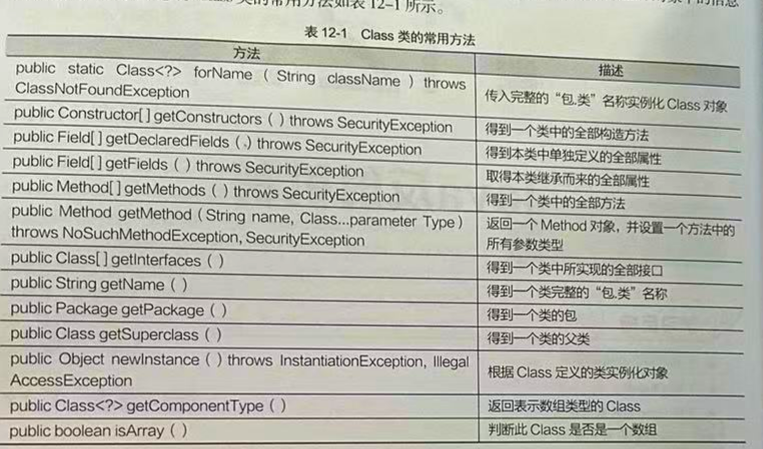
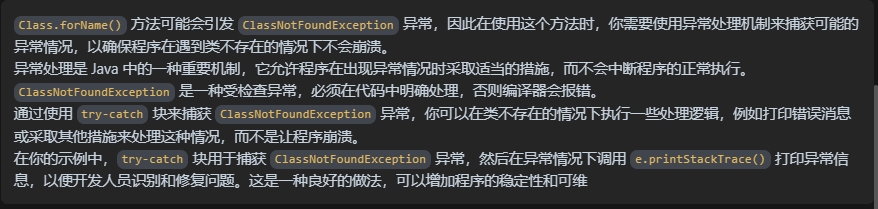
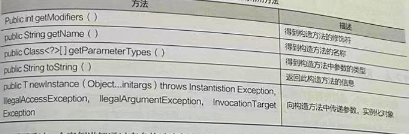
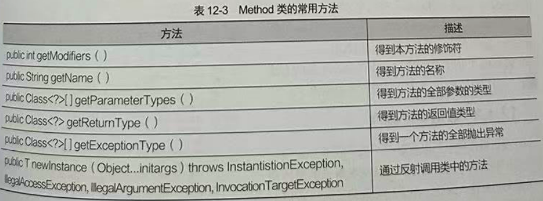
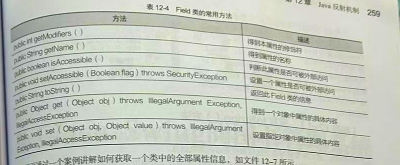

# 反射机制

## 目录

-   [Class类](#Class类)
-   [使用Class类](#使用Class类)
    -   [无参构造实例化对象](#无参构造实例化对象)
    -   [有参构造实例化对象](#有参构造实例化对象)
-   [反射应用](#反射应用)
    -   [获取实现全部接口getInterfaces()](#获取实现全部接口getInterfaces)
    -   [获取全部方法getMethods()](#获取全部方法getMethods)
    -   [获取全部属性 Field](#获取全部属性-Field)

反射创建对象,可以将`Java`类中的成员变量、成员方法等信息映射成一个个的`Java`对象,再使用这些对象进行操作

**反射机制**

```java
在程序运行状态中

1. 构造任意一个类的对象
2. 得到任意一个对象所属的类的信息
3. 调用任何一个类的成员变量和方法
4. 获取任意一个对象的属性和方法

动态获取程序信息和动态调用对象的功能称为Java语言的反射机制
```

**反射机制优点**

```java
实现动态创建对象和编译(动态编译)
```

#### `Class`类

JVM编译.java文件生成对应的`.class`文件,然后将.`class` 文件加载到内存中执行,执行文件需要其他类的信息这个时候就需要**反射**; 加载`.class`文件时,会产生一个 `java.lang.Class`对象代表.`class`字节码文件,从该`Class`对象可以获取类的信息

`Class`是JDK自定义的类,提供了很多方法，通过调用`Class`类的成员方法可以获取`Class`对象中的信息,

**常用方法**



因为`Class`对象代表的是`.class`文件(类),所以所有的类实际上都是`Class`类的实例,所有的对象都可以转变为 `.class`类型表示

```java
使用Class类必须完成实例化 

实例化Class对象3种方式:

(1) 全限定类名获取: Class.forName("全限定类名")
(2) 对象获取: 对象.getClass()
(3) 类名获取: 类名.class


```

**实例化类**

```java
class b { // 修正类名为 B

}

class a {
    public static void main(String[] args) {
        Class<?> c1 = null;
        Class<?> c2 = null;
        Class<?> c3 = null;
        
          try {
        
 // 使用 forNmme()方达实例化class对象，这个方法只需要将类的全限定类名以字符串作为参数传入即可
 // 让程序更有灵活性，所有 forName() 方法实例化对象很常用        
            c1 = Class.forName("b"); 
        } catch (ClassNotFoundException e) {
            e.printStackTrace();
        }
        
        c2 = new b().getClass(); // 使用 对象.getClass()
        
        c3 = b.class; // 使用 类名.class
        
        System.out.println("类名称:" + c1.getName());
        System.out.println("类名称:" + c2.getName());
        System.out.println("类名称:" + c3.getName());
    }
}


-------------------------------------------------------------

输出:

类名称:b
类名称:b
类名称:b

```

**关于forName()实例化异常**



### 使用`Class`类

常见用法将`Class`类对象实例化为自定义类对象,**即可以通过一个给定的 字符串 (类的全限定类名)实例化一个本类的对象**,实例化为本类对象  通过无参构造完成,或者有参完成实例化本类对象

#### 无参构造实例化对象

通过`Class`类实例化其他类的对象, 使用`newInstance()`方法, 但是必须保证被实例化的类中存在一个无参构造方法，否则无法实例化对象

```java
、class Per{
    private  String name;
    private  int age;

    public String getName() {
        return name;
    }

    public void setName(String name) {
        this.name = name;
    }

    public int getAge() {
        return age;
    }

    public void setAge(int age) {
        this.age = age;
    }
    public String toString(){
        return  "姓名：" +this.name+"年龄:"+this.age;
    }
}

class a {
    public static void main(String[] args) {
    
    //  声明一个名为 c 的  Class  对象的引用，并初始化为 null
         Class<?> c = null;
         
         try {
         
             c = Class.forName("Per"); //实例Class对象
             
         }catch (ClassNotFoundException e){
             e.printStackTrace();
         }
   // 声明一个名为 ka 的  Per  类型的对象引用，并初始化为 null。      
         Per ka = null;
         
         try {
    // Class对象c调用newInstance()方法传入完整的类的名称 这里是Per,对Per对象进行实例化
             ka = (Per) c.newInstance();
             
         }catch (Exception e){
          e.printStackTrace();
         }

         ka.setAge(30);
         ka.setName("180");
        System.out.println(ka);  // 打印对象字典执行toString()方法


    }
}


----------------------------------------------------------------

输出:

姓名：180年龄:30


```

#### 有参构造实例化对象

如果类中没有无参构造方法,则通过有参构造方法实例化对象,通过有参构造器实例对象,需要明确调用的构造方法,并且传递相应的参数

```java
有参构造方法实例化对象步骤

(1) 通过Class类的getConstruclors()方法获取本类中的全部构造方法
(2) 向构造方法中传递一个对象数组,对象数组包含构造方法中所需的各个参数
(3) 通过Construclors类实例化对象
```

`Construclors`类用于存储本类的构造方法,常用方法



```java

import  java.lang.reflect.Constructor;

class  per{
private  String name;
private  int age;

// 有参构造器 ----这里的类中没有写无参构造器不会报错
    public per(String name, int age) {
        this.name = name;
        this.age = age;
    }

    public String getName() {
        return name;
    }

    public void setName(String name) {
        this.name = name;
    }

    public int getAge() {
        return age;
    }

    public void setAge(int age) {
        this.age = age;
    }
    public String toString(){
        System.out.println("姓名"+this.name+"年龄"+this.age);
        return  "123"; // 强制输出 return后面的语句
    }
}

class a {
    public static void main(String[] args) {
        Class<?> c = null;
        try {
            c= Class.forName ("per"); // 实例化Class类
        }catch (ClassNotFoundException e){
            e.printStackTrace();
        }

  // 通过Class类取得了Person类中全部构造方法并以对象数组的形式返回
        per p = null;
  // Construclors类用于存储本类的构造方法数组形式      
        Constructor<?> saber[] = null;  
        saber = c.getConstructors();

        try {
     
     // 调用 Per类的构造方法,因为Per类只有一个构造方法,所以取出第一个 下标为0   
            p = (per) saber[0].newInstance("小邓",100);
        }catch (Exception e){
            e.printStackTrace();
        }
        System.out.println(p);


    }
}


--------------------------------------------------------

输出:

姓名小邓年龄100
123


```

### 反射应用

通过反射可以得到一个类的完整结构,包括类的构造方法 类的属性 类的方法; 需要使用` java.lang.reflect`包中的类

```java
Constructor : 表示类中的构造方法
Field: 表示类中的属性
Method: 表示类中的方法

这3个类都是AccessibleObject类的子类 
```

#### 获取实现全部接口`getInterfaces()`

取得一个类所实现的全部接口,使用 `Class`中的 `getInterfaces()`方法 声明如下, 它会返回一个`Class`

类的对象数组,调用 `Class`类中的 `getName()`方法可以取得类的名称

```java
public Class[] getInterfaces ();

```

```java
interface China{  // 接口
    public static final String NATION = "CHINA";
    public static final String AUTHOR = "张三";
}
class  per implements China{  // 实现接口
    private String name;
    private int age;

    public per(String name, int age) {
        this.name = name;
        this.age = age;
    }

    public String getName() {
        return name;
    }

    public void setName(String name) {
        this.name = name;
    }

    public int getAge() {
        return age;
    }

    public void setAge(int age) {
        this.age = age;
    }

    public String toString(){
        return "姓名"+this.name+"年龄"+this.age;
    }
}

class a {
    public static void main(String[] args) {
         Class<?> c = null;
         try {
             c = Class.forName("per");
         }catch (ClassNotFoundException e){
             e.printStackTrace();
         }
        
        // 以Class数组的形式将全部的接口对象返回,并且利用循环反复把内容输出
        // cons[] 数组里面存储的就是接口  
         Class<?> cons[] = c.getInterfaces();
         for (int i = 0;i < cons.length;i++){
           // getName() 方法可以输出名称
             System.out.println("实现的接口名称"+cons[i].getName());
         }
    }
}

------------------------------------

输出:

实现的接口名称China

```

#### 获取全部方法`getMethods()`

取得类中全部方法,使用`Class`类中的 `getMethods()`方法,该方法返回一个 `Method`类的对象数组

它的常用方法是



```java
import java.lang.reflect.Method;

interface China{  // 接口
    public static final String NATION = "CHINA";
    public static final String AUTHOR = "张三";

    public void sayChina();
}
class  per implements China{  // 实现接口
    private String name;
    private int age;

    public per(String name, int age) {
        this.name = name;
        this.age = age;
    }

    public String getName() {
        return name;
    }

    public void setName(String name) {
        this.name = name;
    }

    public int getAge() {
        return age;
    }

    public void setAge(int age) {
        this.age = age;
    }

    public String toString(){
        return "姓名"+this.name+"年龄"+this.age;
    }

    // 实现  China接口中的方法
    public void sayChina(){
        System.out.println("你好世界");
    }
}

class a {
    public static void main(String[] args) {
         Class<?> c = null;
         //
         try {
             // 实例化Class类
             c = Class.forName("per");
         }catch (ClassNotFoundException e){
             e.printStackTrace();
         }

// 通过class类c调用了所有的方法并存储在 cons数组中

        Method[] cons = c.getMethods();
         for (int i = 0;i< cons.length;i++){
             System.out.println("方法名称"+cons[i].getName());
         }
    }
}


----------------------------------------

输出:

不仅输出肉眼看到的方法还输出了Object类中继承的方法

方法名称toString
方法名称getName
方法名称setName
方法名称sayChina
方法名称setAge
方法名称getAge
方法名称wait
方法名称wait
方法名称wait
方法名称equals
方法名称hashCode
方法名称getClass
方法名称notify
方法名称notifyAll

```

#### 获取全部属性 `Field`

类中的属性分为两部分

```java
1. 从父类继承的属性

2. 本类定义的属性
```

所以获取类的属性也有以下两种不同的方式，两种方式返回的都是`Field` 数组,每个`Field`对象表示类中的一个属性,如果获取属性的详细信息就需要调用`Field`类的方法

```java
1. 获取实现的接口或父类中的公共属性,public Field[] getFields throws SecurityException

2. 获取本类的全部属性: public  Field[] getDeclaredFields throws SecurityException 
```



```java
import  java.lang.reflect.Field;
import  java.lang.reflect.Modifier;

class Per{

// String是Java 中的内置类，所以它的类型被表示为 java.lang.String
    private String name;
    
// int是一个基本数据类型没有包装类所以前面没有java.lang字眼    
    private int age;

    public Per(String name, int age) {
        this.name = name;
        this.age = age;
    }

    public String getName() {
        return name;
    }

    public void setName(String name) {
        this.name = name;
    }

    public int getAge() {
        return age;
    }

    public void setAge(int age) {
        this.age = age;
    }

    public String toString(){
        return "姓名"+this.name+"年龄"+this.age;
    }
}

class a {
    public static void main(String[] args) {

        Class<?> c1 = null;
        try {
            c1 = Class.forName("Per"); // 实例化Class类
        }catch (ClassNotFoundException e){
            e.printStackTrace();
        }

        Field f[] = c1.getDeclaredFields(); // 取得本类全部属性
        
                for (int i = 0;i<f.length;i++){ // 循环输出
                    Class<?> r = f[i].getType(); // 取得属性的类型
                    int mo = f[i].getModifiers(); // 得到修饰符数字
                    String priv = Modifier.toString(mo); // 属性修饰符
                    System.out.print("本类属性");
                    System.out.print(priv+" ");  // 修饰符
                    System.out.print(r.getName()+" "); //属性类型
                    System.out.print(f[i].getName()); // 属性名称
                    System.out.print(" ; ");


                }
         }
}


--------------------------------------------------------


输出:

本类属性private java.lang.String name ; 
本类属性private int age ; 


```
