# Java源文件命名规则

> 💻\*\* 不日进者则日退\*\*

> **相信各位攻城狮们应该可以熟练通过jdk命令行下运行java文件，但我还是想做一份小白文保姆级教程让大家更清晰，熟悉变量配置,理解java源文件命名规则。想跟各位分享一下。本人菜鸡一位，文章中如有不对的地方，望各位老师同学指出 共同进步！**

## 环境变量配置

### #环境变量

键盘单击 win 键盘 打开搜索框 搜索 "环境变量" 打开页面


进入后点击  —> 环境变量设置；找到系统变量

**进入环境变量配置页面后 我们就开始了最重要的环境变量配置,需要配置的有三个变量.**

```6502&#x20;assembly
JAVA_HOME :  R:\jdk   (jdk安装路径)          
————安装的目录作用是找出运行时的安装位置,也就是安装JDK选择的位置和JDE

 CLASSPATH : .;%JAVA_HOME% \lib    (在jdk目录下找到\lib文件夹)                 
代表于告诉Java执行环境，在哪些目录下可以找到您所要执行的Java程序所需要的类或者包

 PATH:  %JAVA_HOME%\bin   (在jdk目录下找到\bin文件夹) 
————能够在任意目录（文件夹路径）下能够访问到bin目录下的javac和java工具，使其能够编译使用与CLASS一样的路径变量   

 注意: 

 CLASSPATH这个变量由其重要,基本上出现找不到主类的情况就是这个配置不当                                                    
```

在系统变量中打开新建 &#x20;

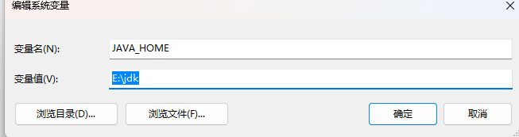

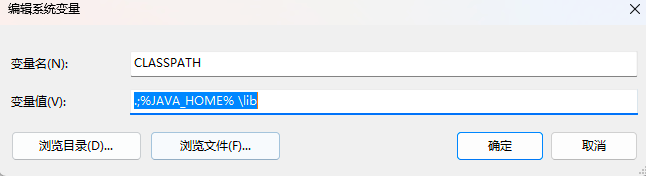

### #疑点

到这里三个变量就已经是配置完成两个,还剩下Path变量,但到这里会有同学出现这种疑惑,

**"为什么我的Path有很多个不知道的东西   明明Path我也没有新建它自己就存在了,就是下图这种情况"**

Paht会放置很多我们看不懂的变量的话是**由于我们使用软件时,某些软件自身会帮我们自动添加到PATH中甚至新建出Path变量**,我们不需要理会别的地方。点击新建就会出现提醒你输入的光标,我们把变量添加进去即可

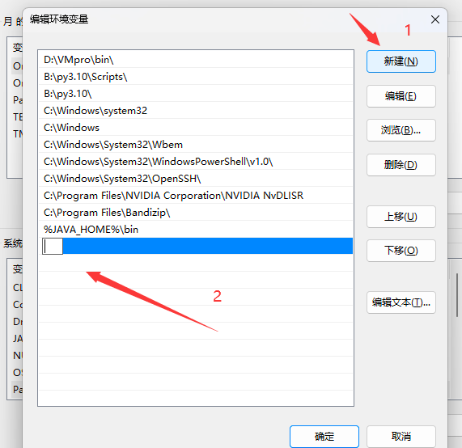

### #检测是否成功

到此步环境变量配置就已经完成,我们通过指令来查看jdk是否已经配置成功,

```6502&#x20;assembly
java    查看当前java帮助用法
java -version  查看当时JDK版本信息
```

按住键盘 win+R  弹出运行面板,我们输入cmd 打开我们行业黑话小黑屋


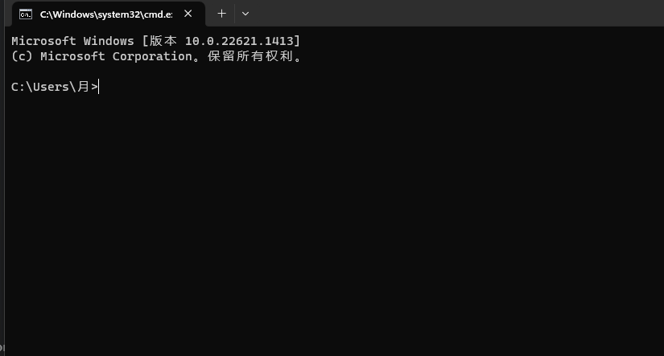

java    查看当前java帮助用法

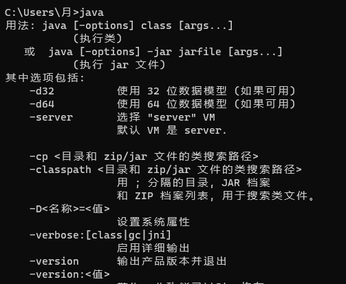

java -version  查看当时JDK版本信息  我们得出当前的JDK版本为1.8 简称远古版本,我们的JDK配置成功可以不通过编译器在命令行输入代码

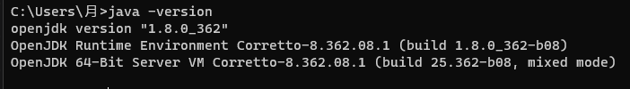

## java命名规则

我们在找到JDK在磁盘中的目录,进入到bin文件夹下,在这里面打入我们的java代码并编译 &#x20;

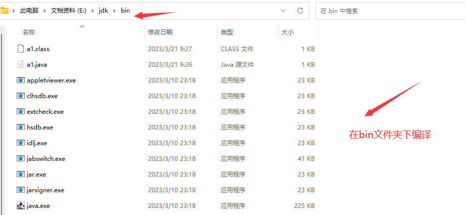

#### #Java程序源文件后缀

> **java源文件后缀只能是.java**

新建源文件分为两步

1.  新建txt文本文档 在记事本中添加代码

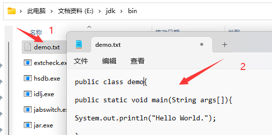

2.修改txt后缀为java源文件


**但是我发现了同学们出现的情况是要么不修改后缀直接运行原本代码,或者修改后缀为.class或者.javac 千奇百怪,但是毕竟初学者有问题也是很常见的事情,但是文件后缀是特别重要的,基本上如果你后缀都错了,那么是已经不可能得出正确的答案了, 而且每个语言的后缀都不同,包括文件**

秉着保姆教程的理念,我也是查找了一下关于文件后缀的拓展,还有许多不同后缀不同作用的文件,这里就不过多赘述,感兴趣自行查找,

```6502&#x20;assembly
编程语言文件 

PHP               .php
javascript        .js
python            .py
go                .go
java              .java

 计算机文件 

exe    执行文件
ios    镜像文件
bat    批处理文件
txt    文本文件
```

同学们有的用class和javac作为后缀这是不正确的

```6502&#x20;assembly
.class  : 是我们通过javac编译上产生的字节码文件,所以这种文件是通过编译产生的
javac   : 是java语言编程编译器。全称java compiler。它是一种编译功能,它将源文件编译成字节代码的class文件
```

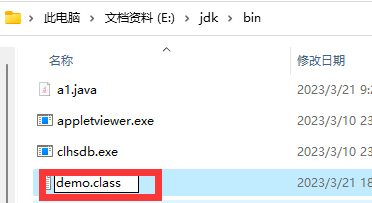

> **结论:**  **java文件的后缀只能是使用java来命名,使用其他方式会报错**

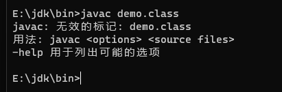

### #源文件名与public修饰不一致

我们在bin文件夹下demo.java文件,里面存在 demo 类 所以我们的源文件和 public必须同名一致

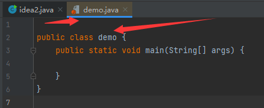

源文件和public修饰不同则会出现编译报错情况,下面我来演示此类情况,**我们源文件名是demo,但是public修饰的文件名是 saber**

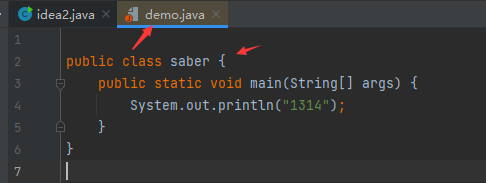

### #小技巧

这里我也给大家提供一个技巧,我们常规的运行是不是\*\* 通过win+R 然后cmd进入小黑屋进行操作，之后在cd "所在盘符"\*\*, 因为C盘是我们的系统盘所以我们通过cmd打开的命令行的开始路径就是处在C盘 ,**作为开发者我们时间都是很宝贵的,这里教大家一种快速找到所在位置运行java的方式**

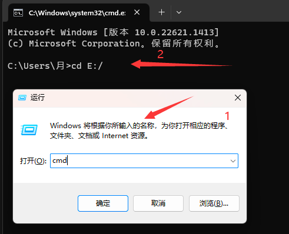

我们在当前JDK的bin目录下单击空白处 使此处路径处于被选中的状态

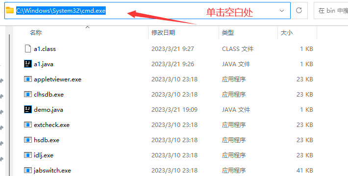

选中后的表现就是上图的蓝色覆盖状态,这时我们再输入cmd  回车就可以快速跳转到所在的目录下运行java文件

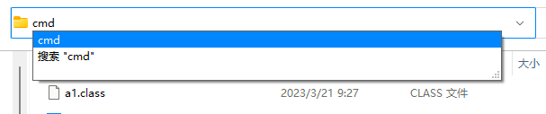

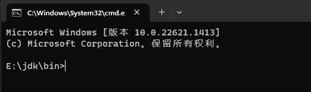

进入此处后我们运行demo.java文件测试

```6502&#x20;assembly
javac demo.java  :通过java从编译demo.java为字节码class文件
```

我们输出后发现错误,这个错误就是我们没有把源文件名和punlic一致导致

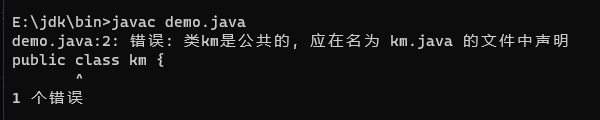

我们修改public类名与文件名一致尝试运行

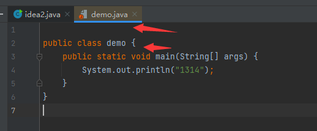

```6502&#x20;assembly
1.javac demo.java  编译出class文件
2.java  demo       运行Java虚拟机运行程序,将编译好的字节码文件（.class文件）加载到内存，这个过程被称为类加载，
                   它是由类加载器完成的，然后虚拟机针对加载到内存中的Java类进行解释执行，便可以看到运行结果

```

> &#x20;\*\* 结论: Java 源文件中有 public 类，那么源文件必须与 public 类同名。\*\*

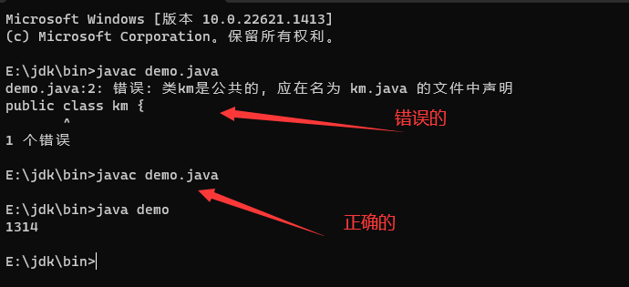

### #类中未定义public类

还是上方的代码 ,我们拿这段代码来实验,我们通过上面的概念得知,如果java程序中没有定义public权限的情况

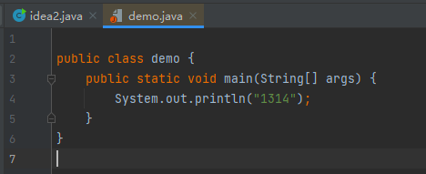

修改代码且添加一个saber类。尝试运行发现正常说明是可以的,

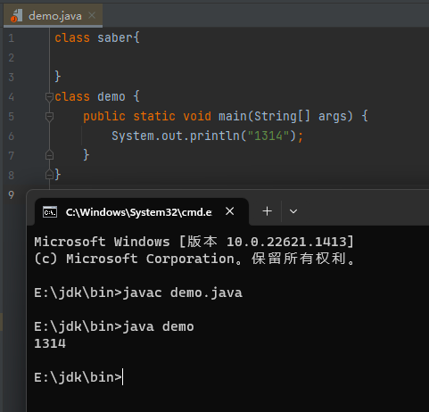

> **结论: 保留一个类和源文件名一致,运行代码成功证明规则是可行的,未用public修饰一样可以运行****Java程序源代码里没有定义任何,publig类那么Java程序源程序的主文件名可以是任意的,只要有一个类的名称是和文件名相同就可以**

### #类中定义多个public修饰的类

我们尝试定义多个public修饰的类,现在程序中存在 a类和demo

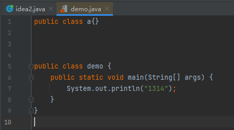

我们运行错误,显然java不需要这样错,一个类文件最多只能包含一个被public修饰的类

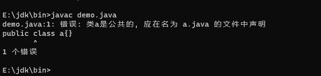

> **结论:虽然一个Java源文件可以包含多个类定义，但最多只能包含1个public 类定义;**
