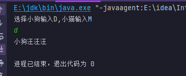

# 动物叫声

### 【 案例介绍】

**1.案例描述**

不同动物有不同的声音,狗会汪汪汪 猫会 喵喵喵

**2.运行结果**



### 【 实现思路】

(1) 定义 `op`接口里面写入两个抽象方法,分别是狗的的`dog()`方法，猫的的`cat()`方法,

(2) 定义`zi`类 继承`op`接口实现里面的两个抽象方法,在里面编写打印狗和猫的输出语句

(3) 在主类`dong` 中实例化`zi`类,并通过if判断结合键盘录入语句来判断选择的是哪种动物那么就就调用相应动物的方法

### 【 实现代码】

定义 `op`接口里面写入两个图形的方法&#x20;

```java
interface op{
    // 狗
    void dog();
    // 猫
    void cat();
}
```

通过`zi`类继承`op`接口 实现两个叫声的抽象方法

`2-4 square()` 狗叫声的语句,就是一句输出语句

`5-7 cat()`      猫叫声的语句&#x20;

&#x20;

```java
class zi implements  op{
    public void dog() {
        System.out.println("小狗汪汪汪");
    }
    public void cat() {
        System.out.println("小猫喵喵喵");
    }
}
```

定义`dong()` 测试类 实例化`zi  ()`类  通过键盘录入 `Scanner ` 和`if` 判断用户选择是那个动物再来调用相应的方法

```java
public class dong {
    public static void main(String[] args) {
        zi z = new zi();
        System.out.println("选择小狗输入D,小猫输入M");
        Scanner sc = new Scanner(System.in);
        String Name = sc.nextLine();
        if (Name.equals("D") | Name.equals("d")){
            z.dog();
        }else if (Name.equals("M") | Name.equals("m")){
            z.cat();
        }else {
            System.out.println("输入错误x`");
            return;
        }
    }
}
```

### 【 代码】

```java
import java.util.Scanner;

interface op{
    // 狗
    void dog();
    // 猫
    void cat();
}
class zi implements  op{
    public void dog() {
        System.out.println("小狗汪汪汪");
    }

    public void cat() {
        System.out.println("小猫喵喵喵");
    }
}
public class dong {
    public static void main(String[] args) {
        zi z = new zi();
        System.out.println("选择小狗输入D,小猫输入M");
        Scanner sc = new Scanner(System.in);
        String Name = sc.nextLine();
        if (Name.equals("D") | Name.equals("d")){
            z.dog();
        }else if (Name.equals("M") | Name.equals("m")){
            z.cat();
        }else {
            System.out.println("输入错误x`");
            return;
        }
    }
}
```
