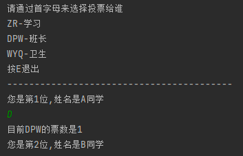
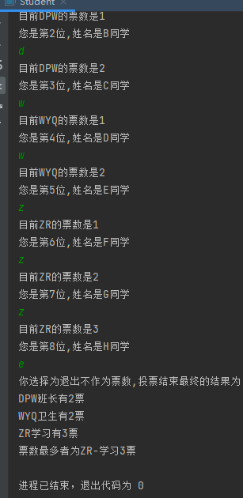
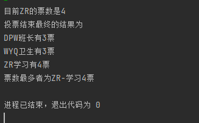

# 学生投票系统

> 💻\*\* 不日进者则日退\*\*

```java
import java.util.Scanner;

class info{
    // 定义班干人数为3
    String monitor = "DPW-班长";
    String hygiene = "WYQ-卫生";
    String study = "ZR-学习";

    public int getW() {
        return w;
    }

    public void setW(int w) {
        this.w = w;
    }

    public int getD() {
        return d;
    }

    public void setD(int d) {
        this.d = d;
    }

    public int getZ() {
        return z;
    }

    public void setZ(int z) {
        this.z = z;
    }

    private int w = 0;
    private int d = 0;
    private int z = 0;

    // 输出最后的统计
    public void statistics(){
        System.out.println("DPW班长有"+getD()+"票\n"+"WYQ卫生有"+getW()+"票\n"+"ZR学习有"+getZ()+"票");
        if (getD() >getZ() && getD() > getW() ){
            System.out.println("票数最多者为"+monitor+getD()+"票");
        }else  if (getW() >getD() && getW() >getD()){
            System.out.println("票数最多者为"+hygiene+getW()+"票");
        }else {
            System.out.println("票数最多者为"+study+getZ()+"票");
        }
    }
  
}
public class Student {
    public static void main(String[] args) {
       // 定义学生数组 里面有10个数组
        String[] Student = {
                "", "A同学", "B同学", "C同学", "D同学", "E同学", "F同学", "G同学", "H同学", "Y同学", "Z同学",
        };
        Scanner sc = new Scanner(System.in);
        info elm  = new info();
        System.out.println("请通过首字母来选择投票给谁" +"\n"+elm.study+"\n"+elm.monitor+"\n"+elm.hygiene+"\n"+"按E退出"+"\n"+"-----------------------------------------");
//        while (true) {
            for (int i = 1; i < Student.length; i++) {
                System.out.println("您是第" + i + "位,姓名是" + Student[i]);
//                System.out.println("请选择你要投票给谁, 1.A同学, 2.B同学, 3.C同学, 4.D同学, 5.E同学, 6.F同学, 7.G同学, 8.H同学, 9.Y同学, 10.Z同学");
                String classmate = sc.nextLine(); // 接收到是谁
                if (classmate.equals("D") | classmate.equals("d")) {
                    // 投票成功那么就将票数加1
                   elm.setD(elm.getD()+1);
                    System.out.println("目前DPW的票数是"+elm.getD());

                } else if (classmate.equals("W") | classmate.equals("w")) {
                    elm.setW(elm.getW()+1);
                    System.out.println("目前WYQ的票数是"+elm.getW());

                } else if (classmate.equals("Z") || classmate.equals("z")) {
                    elm.setZ(elm.getZ()+1);
                    System.out.println("目前ZR的票数是"+elm.getZ());

                } else if (classmate.equals("E") | classmate.equals("e")) {
                    System.out.println("你选择为退出不作为票数,投票结束最终的结果为");
                    elm.statistics();
                    break;
                } else {
                    System.out.println("检测到非法字符 退出系统");
                    break;
                }
                if(i ==10) {
                    System.out.println("投票结束最终的结果为");
                    elm.statistics();
                }
            }

        }
}

```

> 以上就是完成投票系统的全部代码，花费一个晚自习的时间,还是有难点的,但是我完成此功能利用到的知识点不是很多，只有封装get和set构造方法来传递数据,思路是我在水课思考得来的，整体的逻辑为  数组定义 10为学生的姓名, 利用for循环搭配 Scanner键盘录入,遍历数组的长度,每次来确定投票给谁,给出三个“班干部”，接收输入来对票数进行统计........，写完后其实还想去修改一遍利用到其他的知识点，但又觉得这个已经差不多了 该有的功能也是实现了,更加严谨的判断也就懒得做出来。

## 0x1 构思

常规 定义`class info类` 起手,&#x20;

`2-5`需要被投票的三个班干名称,&#x20;

`6-8`是定义的票数统计并且私密`private` 下方也是需要通过get set 方法进行传递赋值 这里就不写出,相信各位都会。

`12` 定义的是普通的方法用于最后的统计票数环节,先定义好方便后续直接使用。 &#x20;

`20-22` 自己定义的字符串数组,放置了11个值,我们知道数组是从0开始取值,为了方便后续的`for循环遍历` 出现问题 我提前设置好空值,后面可以直接跳过值,暂时我也想不到更好的方式解决,只能是手动`length+1`；

`23` 引入键盘录入类,

`24` 实例化`class info 类`

```java
class info{
    String monitor = "DPW-班长";
    String hygiene = "WYQ-卫生";
    String study = "ZR-学习";
    
    private int w = 0;
    private int d = 0;
    private int z = 0;
    
    
       // 输出最后的统计
    public void statistics(){
    
    }
}

public class Student {
    public static void main(String[] args) {
       // 定义学生数组 里面有10个数组
        String[] Student = {
                "", "A同学", "B同学", "C同学", "D同学", "E同学", "F同学", "G同学", "H同学", "Y同学", "Z同学",
        };
        Scanner sc = new Scanner(System.in);
        info elm  = new info();
      }    

```

## 0x2 核心

最核心的判断代码就在 `10-38` 此处需要好好理解,请跟着我的思路来一一剥析

`9` 行是一个提示语,告诉用户投票方式为首字母即可，并且呢利用 elm 实例出的类来成员变量,我也是多写出了一个选择那就是`E` 可以直接退出投票

`10` 行的for循环从i=1开始遍历数组,至于长度肯定就是学生数组的`length`，搭配键盘录入就可以起到妙蛙种子进了妙蛙屋 妙到家了,遍历10 次键盘输入就有10次

`11-12` 提示语句判断第几位和是哪个学生在投票, `classmate` 键盘录入保存的值

`13-38` 里面全部是if判断语句,因为我们是通过首字母判断的,所以我肯定是判断 `classmate` 这个字符串的值&#x20;

`13-16` 行判断我是使用的是**equals**() 去做比较,只是简单的  `classmate == "d"` 一直无法判断到,这时候肯定要打开搜索引擎去找找办法，                           就找到了**equal()** 方式,并且考虑了 `|` 逻辑或的情况,因为上方的提示语句虽然是 大写的 `D W Z` 但不排除会有小写 `d w z` 的情况,所以这 这里的代码就是   `if (classmate.equals("D") | classmate.equals("d")) {}`  这里就可以成功的判断到值,并且进行下一步的票数累加

&#x20;

```java
if (classmate.equals("D") | classmate.equals("d")) {
      elm.setD(elm.getD()+1);
      System.out.println("目前DPW的票数是"+elm.getD());
}

这里就是判断到用户输入而后去利用实例化类的  elm.setD  赋值 +1 而后输出打印
余下的判断同样遵循这个原理

```

&#x20;  &#x20;



```java
public class Student {
    public static void main(String[] args) {
       // 定义学生数组 里面有10个数组
        String[] Student = {
                "", "A同学", "B同学", "C同学", "D同学", "E同学", "F同学", "G同学", "H同学", "Y同学", "Z同学",
        };
        Scanner sc = new Scanner(System.in);
        info elm  = new info();
        System.out.println("请通过首字母来选择投票给谁" +"\n"+elm.study+"\n"+elm.monitor+"\n"+elm.hygiene+"\n"+"按E退出"+"\n"+"-----------------------------------------");
            for (int i = 1; i < Student.length; i++) {
                System.out.println("您是第" + i + "位,姓名是" + Student[i]);
                String classmate = sc.nextLine(); // 接收到是谁
                if (classmate.equals("D") | classmate.equals("d")) {
                    // 投票成功那么就将票数加1
                   elm.setD(elm.getD()+1);
                    System.out.println("目前DPW的票数是"+elm.getD());
                } else if (classmate.equals("W") | classmate.equals("w")) {
                    elm.setW(elm.getW()+1);
                    System.out.println("目前WYQ的票数是"+elm.getW());

                } else if (classmate.equals("Z") || classmate.equals("z")) {
                    elm.setZ(elm.getZ()+1);
                    System.out.println("目前ZR的票数是"+elm.getZ());

                } else if (classmate.equals("E") | classmate.equals("e")) {
                    System.out.println("你选择为退出不作为票数,投票结束最终的结果为");
                    elm.statistics();
                    break;
                } else {
                    System.out.println("检测到非法字符 退出系统");
                    break;
                }
                if(i ==10) {
                    System.out.println("投票结束最终的结果为");
                    elm.statistics();
                }
            }

        }
}

```

## 0x3 功能

**统计**

`25-28` 是定义程序的退出功能,用户 E 键 退出后我们提示  `System.out.println("你选择为退出不作为票数,投票结束最终的结果为");`

并且给到 **统计票数功能方法**  `elm.statistics();` 我们在 `class info` 类定义的统计方法就派上了用场,退出后调用 `statistics()` 方法统计票数

`break` 跳出并结束当前所在循环的执行 也就是退出了整个程序&#x20;

`statistics` 方法类逻辑就非常简单了,`getD....` 拿到每位的票数,if判断进行比较出最大值,这个比较方式比较傻瓜,但我也没有找别的就这样用上了,最后的结果是无误的就可以了

```java
  public void statistics(){
        System.out.println("DPW班长有"+getD()+"票\n"+"WYQ卫生有"+getW()+"票\n"+"ZR学习有"+getZ()+"票");
        if (getD() >getZ() && getD() > getW() ){
            System.out.println("票数最多者为"+monitor+getD()+"票");
        }else  if (getW() >getD() && getW() >getD()){
            System.out.println("票数最多者为"+hygiene+getW()+"票");
        }else {
            System.out.println("票数最多者为"+study+getZ()+"票");
        }
    }
```



**强制退出**

此处功能是自己加入,因为考虑到非法输入 索性就强制退出即可,else 没有在我们选项中的选择就强制break。

```java
 else {
         System.out.println("检测到非法字符 退出系统");
          break;
     }
```

**投票10次结束**

结束其实是不难统计的,计算到`i=10`即可,但是呢常规大家肯定都会是在在程序结束统计不就好了,程序结束的条件不就是`for循环10次结束`,循环结束是没错,结束了就可以统计,但是这是正常的结束才可以这样做,但程序中还存在强制退出的功能点,如果写在下方的话那么就不满足10次,10次不到可能就会执行`elm.statistics();` 导致强制退出和投票结束都会输出就有两个统计。 但是满足10次又需要 正常执行完,所以我就想到了一个折中的方案,额外在 for 里面加入 判断 if的语句 对i进行判断 到10次即可,10次结束了也能正常调用统计。

```java
  if(i ==10) {
        System.out.println("投票结束最终的结果为");
        elm.statistics();
  }
  
```



上就是程序的全部讲解,其实还是有很多需要优化改进的地方,而且还有一些不严谨之处 比如如果有2者票数一致的情况,比如输入非法字符如何不退出整个程序还可以在当次重新输入的情况..... 还需要继续努力学习,如有不正确不恰当之处 望老师同学不吝赐教!
