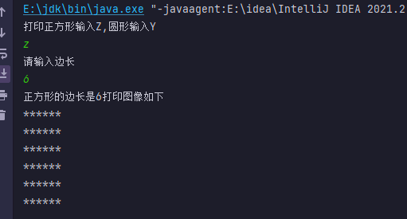

# 打印不同的图形

### 【 案例介绍】

**1.案例描述**

通过用户不同输入不同图形的边长或半径输入不同的图形

**2.运行结果**



### 【 实现思路】

(1) 定义 `fun` 接口里面写入两个抽象方法,分别是正方形的`square()`方法，圆形的`circular()`方法,

(2) 定义`subclass`类 继承`fun`接口实现里面的两个抽象方法,在里面编写打印正方形和圆形的逻辑,并且方法写入形参

,形参方法调用时里面的值用户可以通过`scanner` 键盘录入接收

(3) 在主类`graphical` 中实例化`subclass`类,并通过一系列的if判断结合键盘录入语句来判断是何种图形是那个图形

就调用相应图形的方法

### 【 实现代码】

定义 `fun` 接口里面写入两个图形的方法&#x20;

```java
// 定义接口
interface  fun{
    // 正方形形的方法
    void square(int a);
    // 圆形的方法
     void circular(int b);
}
```

通过`subclass`类继承`fun` 接口 并且咋里面写入打印图形的逻辑代码

`2-10 square()`打印正方形逻辑&#x20;

在方法中加入 `a` 形参 是我们的边长,利用两个for 循环语句打印 `*` i是控制判断, j来接收边长,打印完一行那么进行换行第`8`行 就是控制换行,

结束一次那么就结束了一行,等到 `i≤a` 那么循环也就结束, j 也不会继续累加打印

`11-22circular()`打印圆形逻辑&#x20;

在方法内加入形参 `radius`形参是我们的半径,里面for循环语句从x 轴 y轴开始判断, 从y轴的负值开始循环（即圆的顶部），慢慢填充,一直循环到y轴的正值，到半径为限。每次+1, x轴也是同理, 每循环一次就会判断 `15行 if()` 计算圆形之间的距离,是否小于或等于定义的半径；如果是，则输出一个`*`，否则将输出一个空格。 小于代表在圆形内，在`21`行控制换行,从底部开始结束一次换到下一行,一行一行填充,

&#x20;

```java
class subclass implements  fun {
    public void square(int a) {
        System.out.println("正方形的边长是"+a+"打印图像如下");
        for (int i = 1; i <= a; i++) {   // 打印正方形每一行
            for (int j = 1; j <= a; j++) {  // 打印每个字符
                System.out.print("*");   // 输出星号 //这个语句不换行
            }
            System.out.println();    // 每行结束换行  这个打印会换行
        }
    }
    public void circular(int radius) {
        System.out.println("圆形的半径是"+radius+"打印图像如下");
        for (int y = -radius; y <= radius; y++) {  //从y轴的负值开始循环（即圆的顶部），一直循环到y轴的正值，到半径为限。每次+1
            for (int x = -radius; x <= radius; x++) { // 在y循环内，从x轴的负值开始循环，同样一直循环到x轴的正值，到径为限 每次加1
                if (x * x + y * y <= radius * radius) { //计算当前点和圆心之间的直接距离是否小于或等于定义的半径；如果是，则输出一个星号，否则将输出一个空格。 小于代表在圆形内
                    System.out.print("*");
                } else { // 否则打印出空格忽略
                    System.out.print(" ");
                }
            }
            System.out.println(); // 每进行循环一次就换行
        }
    }
```

定义`graphical()` 测试类 实例化`subclass ()`类  通过键盘录入 `Scanner ` 和`if` 判断用户需要打印的是何种图形,多大的尺寸,再来调用相应的方法,调用方法时的实参就是`Scanner ` 键盘录入的值

```java
public class graphical {
    public static void main(String[] args) {
        subclass sub = new subclass();
        System.out.println("打印正方形输入Z,圆形输入Y");
        Scanner sc = new Scanner(System.in);
        String classmate = sc.nextLine();
        if (classmate.equals("z") | classmate.equals("Z")){
            System.out.println("请输入边长");
            int bian = sc.nextInt();
            sub.square(bian);
        }else if(classmate.equals("y") | classmate.equals("Y")){{
            System.out.println("请输入半径");
            int ban = sc.nextInt();
            sub.circular(ban);
        }}
    }
}
```

### 【 代码】

```java
import java.util.Scanner;

// 定义接口
interface  fun{
    // 正方形形的方法
    void square(int a);
    // 圆形的方法
     void circular(int b);
}
class subclass implements  fun {
    public void square(int a) {

        System.out.println("正方形的边长是"+a+"打印图像如下");
        for (int i = 1; i <= a; i++) {   // 打印正方形每一行
            for (int j = 1; j <= a; j++) {  // 打印每个字符
                System.out.print("*");   // 输出星号 //这个语句不换行
            }
            System.out.println();    // 每行结束换行  这个打印会换行
        }
    }
    public void circular(int radius) {
        System.out.println("圆形的半径是"+radius+"打印图像如下");
        for (int y = -radius; y <= radius; y++) {  //从y轴的负值开始循环（即圆的顶部），一直循环到y轴的正值，到半径为限。每次+1
            for (int x = -radius; x <= radius; x++) { // 在y循环内，从x轴的负值开始循环，同样一直循环到x轴的正值，到径为限 每次加1
                if (x * x + y * y <= radius * radius) { //计算当前点和圆心之间的直接距离是否小于或等于定义的半径；如果是，则输出一个星号，否则将输出一个空格。 小于代表在圆形内
                    System.out.print("*");
                } else { // 否则打印出空格忽略
                    System.out.print(" ");
                }
            }
            System.out.println(); // 每进行循环一次就换行
        }
    }

}
public class graphical {
    public static void main(String[] args) {
        subclass sub = new subclass();
        System.out.println("打印正方形输入Z,圆形输入Y");
        Scanner sc = new Scanner(System.in);
        String classmate = sc.nextLine();
        if (classmate.equals("z") | classmate.equals("Z")){
            System.out.println("请输入边长");
            int bian = sc.nextInt();
            sub.square(bian);
        }else if(classmate.equals("y") | classmate.equals("Y")){{
            System.out.println("请输入半径");
            int ban = sc.nextInt();
            sub.circular(ban);
        }}


    }
}


```
