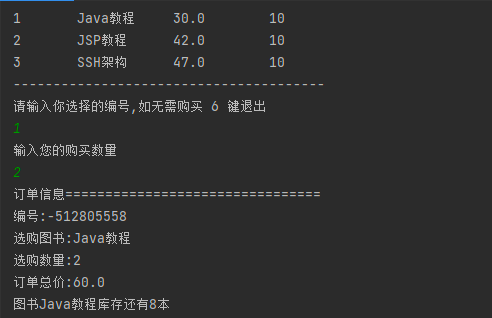

# 控制台购书系统

**实现思路**

就是增删改查,定义图书为class类,但是图书Bokk class的有参构造函数为数组类型实例化。,这样可以将书籍的编号名称,单击库存依次存入,使用就通过数组books\[]的索引来拿到每一项的值,通过遍历数组依次打印出所有数据, 而后判断用户输入的书籍编号还有书籍数量,传递到写好的promotion()方法中,在方法里完成我们对于图书的价格计算库存计算......总价计算通过拿到单击的get方法 \*=数量,库存也是通过拿到get和set方法进行判断,没有库存也会进行提示,购买成功。会输出订单的信息

下图是全部代码 我拆分为左右两边

### 0x1 创建Book图书

第一步我们创建所需要的图书Book类，写入4个私密成员变量保存我们所需的数据,并在 `6-10` 行入有参构造参数,后续我们的图书都是通过这个有参构造方法传入。  `12-17` 是属于库存的`set方法` 因为四个变量中编号 、书名、价格都是不需要改变的,只有 **storage库存是在变化,所以需要拿到**`set方法` 进行重新赋值  `21-24` 是4个变量的get方法

### 0X2 读取图书

回到mian方法中,我们将图书Book类进行实例化,但是我们实例化的类型是一个数组类型,此写法是浏览文章学习到了,通过这种写法可以将数据存储,我一开始想的是利用二维数组来存储书籍的信息,但是忽略了一个非常重要的问题,那就是数组的类型只能定义为一种，但是书籍的信息不同,书名只能是`String`,价格则是`int` 所以行不通就利用了这种写法,手动输出又太过多余,利用数组类型的对象来存储刚刚好,3个数组数据对应三本书

我们定义好读取图书的方法`othbooks` 这个方法存储了我们的数组输出,可以将书籍信息打印出来。传入的`形参类型为数组Book[] 值则是对象名称books ` ,通过实例化从0-2从有参构造器中传入书籍的各项信息。通过for依次打印出各项的get方法。最终输出的效果图**1-4**

### 0x3 书籍判断

传入好图书后来到最重要的判断环节,通过 `if 配合 Scanner`语句来判断编号 1 2 3,是何本书，判断到正确数字则接受,进入下一步购买数量,选择多少本 而后对于书籍购买另写了`promotion()` 方法, 里面有三个需要传入的参数分别是 **书籍编号 购买数量 对象books**,同时利用`while`循环购买一次还可以继续购买,只有按 6 键 才会 `break` 结束进程。 做了一点点微不足道的安全措施,只能输入白名单类的数字,只接受 1 2 3 6,输入别的非法字符直接终止 `51-54`。

### 0x4 订单计算

**库存计算**

`promotion()` 用于计算购买后的情况,形参中的3个参数上文也已经解释, `58` \*\*则是将编号 - 1,因为我们的数组是从0为索引开始,1则是2,那么我们我们的1编号其实就是2,所以要通过索引id-1 \*\*才能拿到正确的书籍,如果没有很明白可以去回顾一下数组

`quantity` 是我们的购买的书籍数量,拿到后我们需要去和现有的书籍库存进行判断在 `59-60` 就是判断库存的情况,通过`books[id].getStorage()`

通过数组索引拿到其中的库存`getStorage` 里面存放的此本书的库存数量,进行对比,如果购买的`quantity` 数量是大于现有库存的则输出`getStorage()` 显示目前有多少本 结束本次购买回到 while 语句中再次提示购买 如图 1-7

**成功购买**

购买成功实现非常简单,对现有库存做 **-=操作**,`62`  是随机编号,利用 `Random 随机数` 将编号值传递给变量 data存储使用。&#x20;

`64-65` 输入订单信息,利用数组索引拿到各项数据,**订单总价就是单价price\* 传入的数量quantity**,其余就是正常的拿到打印即可。

`66` 更新库存,减去购买数量重新利用`setStotage` 赋值

`67` 打印出现有库存

`68` 分割线,进行下次购买,因为是while 循环,只要不是退出或者是非法字符可以一直运行！

&#x20;

### 总结

以上就是程序全部代码,但仍有很多不足之处,面向对象还是很初级的状态,没有做到代码的复用性,利用更少的代码写出更完整的功能,实现时也想过很多种方式, 数据传入进构造方法直接判断编号和购买数量在class类里面完成,不需要额外的if语句,一切在类中完成,但是又考虑到类中如何判断的问题,,不通过if怎么判断,我想到的只能是写出三个构造函数,但这又违背了代码的复用性,三个相同的功能点我就想用一个整体来解决学习无止境......,,如有不正确不恰当之处 望老师同学不吝赐教!

***
