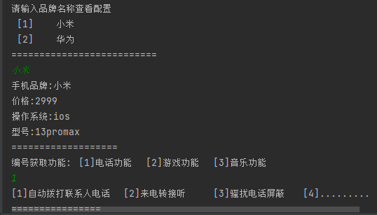
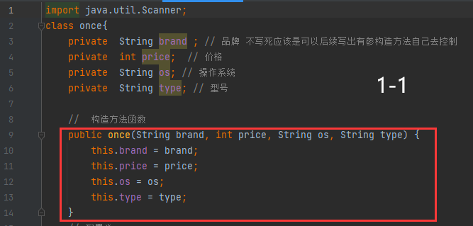
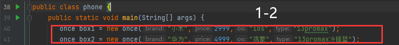
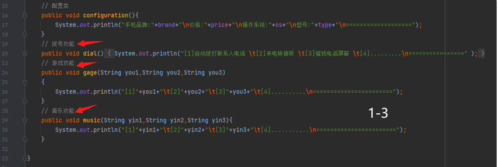
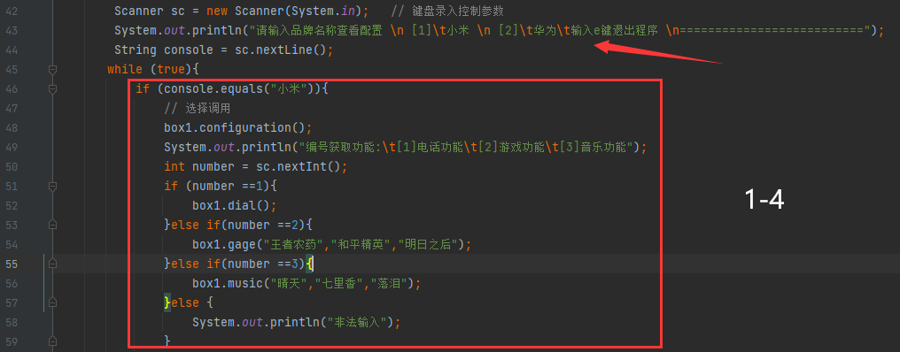
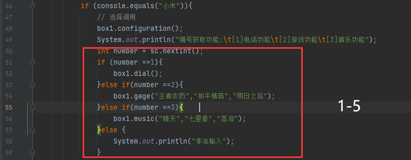
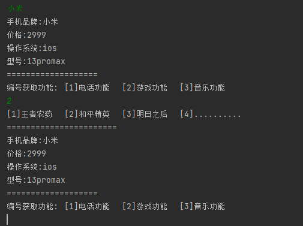
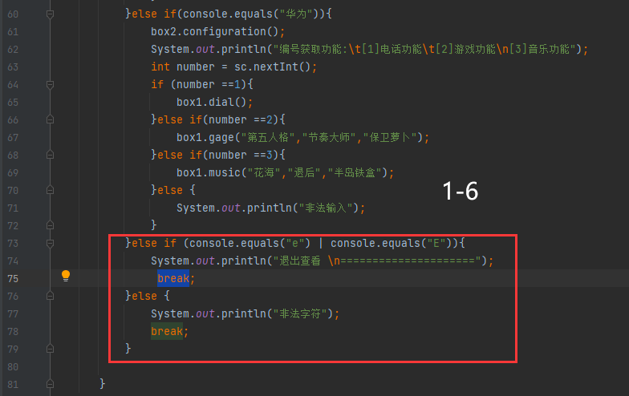

# 查看手机配置与功能

**最底部有完整代码****,写有标题可以打开word导航条查看**​



## 实现思路

&#x20;   (1) 分析程序不包含数据的交互改查,所以不需要封装的get和set方法,定义,只需要定义普通的成员属性即可,创建once类定义

&#x20;   (2) 使用有参构造函数初始化实例对象传入4个定义好的成员变量分别是 品牌(brand),价格(price),操作系统(os),型号(type),实例化2次数据    &#x20;

&#x20;   也是独立的,两部手机

&#x20;   (3) 在once类中写入我们的普通方法,方法是我们的功能 分别是 dial(拨号功能) gage(游戏) music(音乐),同时里面加入形参,利用对象调用还   &#x20;

&#x20;  可以传入自己写的实参,形成复用

(4) 在mian中使用Scanner配合if来判断何种手机,再进行方法的调用

## 0X1 设计功能所需

`1` 行我们引用好的键盘录入的类&#x20;

`2-14` 我们定义好了`once`类 里面定义了需要有的四个属性,这些都是没有交互的所以我并没有定义set和get方法，

下方还有有参构造函数,将四个属性全部加入,后续需要实例化



`38- 41`回到主类的mian方法中,我们实例化有参构造函数,传入两部手机相应的配置,参数全部都是可控的,实例化出box1和box2这两个对象,通过这两个对象就可以调用后续的各种功能,并且不会产生冲突的现象因为实例化后都是独立的



&#x20;回到class once中,上方已经实例化对象,那么类里面我们开始定义功能

`16-18` 查看手机功能,用户在选择好何种手机号会通过**对象.方法()** 的形式调用这个方法,方法内部写的就是之前有参构造函数传递而来的数据,

当然要分清是box1还是box2的数据

`19-20` dial拨号功能,定义的只是简单的打印语句,用户选择拨号功能后会自动调用这个方法,**利用 \t进行空格和 \n换行让程序更加美观**

&#x20;`24-27` gage定义游戏功能,但是写入了形参,这里没有写死是因为游戏不像拨号肯定会有不同,这里定义了3个String类型形参,我们调用时

可以**自定义的写入我们想要的游戏名称**

`28-31` music音乐功能选择何种游戏,写法和gage功能一致,定义形参,实参留给我们自定义去写入。



**到这里我们once类中已经写完,使用功能均在main方法中。**

## 0X2 获取用户输入判断

`42-44` 进入在main方法中,在这里首先引入了键盘录入语句`Scanner` 对应上文 **图1-1**,获取到了参数,那么就是常规打印语句把条件输出到控制台,有小米和华为通过还有ese退出选项,这样更人性化,退出功能是直接`breack`,`44` 行获取到输入的字符串 给到`console`变量保存

`45-59` 此步就是判断代码,这个功能能不能实现就看判断到不到位,我还是喜欢if的形式去判断输入,配合`while(true)` 达到非常好的效果,并且退出程序也是可选的。



为了更加明了我将代码拆分来逐步讲解,

`46` 这里是第一个if判断,equals比较两个字符串是否相等,用户输入小米而正常进入程序

`48` 调用手机功能方法,我们小米是box1类则是 `box1.configuration()` 我们有参的数据也会传递输出手机的各项配置

`49-50` 完成第一个判断后输出该输出的,进行第二个判断,也就是手机的功能 是电话还是游戏还是音乐,使用`int` 类型变量存储,因为是编号获取

保存到 number 中&#x20;

`51-59` 利用number 变量去进行编号的判断,1 2 3 分别对应手机的功能, **1**为拨号功能,调用 dial方法即可,直接打印；**2** 是游戏game功能,

调用方法写入我们自定义的实参,\*\*3 \*\*音乐 music 同样如此, 如果是不正常输入直接截停,并且利用 while(true) 继续开始选择编号



**运行结果**



输入完一个编号还可以继续选择,非法输入会自动的回到选择编号位置,也可以加入 出功能,退出两个if则是定义一个定量为flag

来控制,退出则讲变量变成` false`,我这里没有写入感兴趣的可以自己动手写一写

## 0X3 退出功能结束

`60-72` 这里和上文判断一致,我也就不过多赘述

`73-75` 输入E/e 键退出程序,配合 逻辑或| 和equals 这里 大小写都可以判断到退出

`76-79` 非法字符强制退出结束程序没有什么操作



## 总结

以上就是程序全部讲解,实现其实并没有多复杂,把握基础多花点时间,与其抱怨不如提升自己；如有不正确不恰当之处 望老师同学不吝赐教!&#x20;

***

## 代码

```java
import java.util.Scanner;
class once{
    private  String brand ; // 品牌 不写死应该是可以后续写出有参构造方法自己去控制
    private  int price;  // 价格
    private  String os; // 操作系统
    private  String type; // 型号

    //  构造方法函数
    public once(String brand, int price, String os, String type) {
        this.brand = brand;
        this.price = price;
        this.os = os;
        this.type = type;
    }
    // 配置类
    public void configuration(){
        System.out.println("手机品牌:"+brand+"\n价格:"+price+"\n操作系统:"+os+"\n型号:"+type+"\n===================");
    }
    // 拨号功能
    public void dial(){
        System.out.println("[1]自动拨打联系人电话 \t[2]来电转接听 \t[3]骚扰电话屏蔽 \t[4].........\n================" );
    }
    // 游戏功能
    public void gage(String you1,String you2,String you3)
    {
        System.out.println("[1]"+you1+"\t[2]"+you2+"\t[3]"+you3+"\t[4]..........\n=======================");
    }
    // 音乐功能
    public void music(String yin1,String yin2,String yin3){
        System.out.println("[1]"+yin1+"\t[2]"+yin2+"\t[3]"+yin3+"\t[4]...........\n=======================");
    }

}


public class phone {
    public static void main(String[] args) {
       once box1 = new once("小米",2999,"ios","13promax");
       once box2 = new once("华为",4999,"鸿蒙","13promax冷锋蓝");
        Scanner sc = new Scanner(System.in);   // 键盘录入控制参数
        System.out.println("请输入品牌名称查看配置 \n [1]\t小米 \n [2]\t华为\n输入e键退出程序 \n==========================");
        String console = sc.nextLine();
       while (true){
           if (console.equals("小米")){
               // 选择调用
               box1.configuration();
               System.out.println("编号获取功能:\t[1]电话功能\t[2]游戏功能\t[3]音乐功能");
               int number = sc.nextInt();
               if (number ==1){
                   box1.dial();
               }else if(number ==2){
                   box1.gage("王者农药","和平精英","明日之后");
               }else if(number ==3){
                   box1.music("晴天","七里香","落泪");
               }else {
                   System.out.println("非法输入");
               }
           }else if(console.equals("华为")){
               box2.configuration();
               System.out.println("编号获取功能:\t[1]电话功能\t[2]游戏功能\n[3]音乐功能");
               int number = sc.nextInt();
               if (number ==1){
                   box1.dial();
               }else if(number ==2){
                   box1.gage("第五人格","节奏大师","保卫萝卜");
               }else if(number ==3){
                   box1.music("花海","退后","半岛铁盒");
               }else {
                   System.out.println("非法输入");
               }
           }else if (console.equals("e") | console.equals("E")){
               System.out.println("退出查看 \n=====================");
                break;
           }else {
               System.out.println("非法字符");
               break;
           }

       }
    }
}
```
