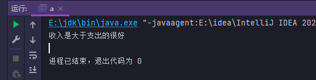

# 研究生薪资管理

### 【 案例介绍】

**1.案例描述**

在职的研究生既要承担相应的生活费,学校又会给予到相应的工资,程序来计算工资和支付是否是入不敷出,书中给到的信息不是很多我也本着完成程序的目就书写了20行左右

**2.运行结果**



### 【 实现思路】

(1) 定义 `cat`接口里面写入 `income`抽象方法,抽象方法是可以带有形参的,`money`(收入)  `pay`(支出)这是一个新知识点写这个程序想到了是否可以这样去定义,结果真的可以

(2) 定义`other`类 继承 实现`cat`接口, 实现里面 `income`抽象方法 ,并且写入判断代码 利用形参去`if`判断  `money`(收入)  `pay`(支出) 的大小,

收入大于支出则是  System.out.println("收入是大于支出的很好");

支出大于收入则  System.out.println("支出是大于收入的 你该贷款了");&#x20;

支出和收入相等则   System.out.println("收入和支出相同");

(3) 在主类`a` 中实例化`other`类,调用`income`方法传入自定义的金额实参就会自行判断输出, 当然收入和支出的代码可以通过键盘录入语句自己定义或者别的方式这里我只是采用了最简单的方法传进去。

### 【 实现代码】

定义 `other`接口里面写入  `income`抽象方法 并且带有形参

```java
 interface cat{
    void income(int money,int pay); // 抽象方法
 }
```

通过`other`类继承`other`接口 实现`income`抽象方法&#x20;

`2-9 if` 判断语句根据两个形参`money`(收入)  `pay`(支出) 来做对比 然后输入相应的语句

```java
class other implements cat{
    public void income(int money ,int pay){
        if (money > pay){
            System.out.println("收入是大于支出的很好");
        }else if (money<pay){
            System.out.println("支出是大于收入的 你该贷款了");
        }else {
            System.out.println("收入和支出相同");
        }
    }
}

```

定义`a` 测试类 实例化`other `类   再通过对象调用`income()` 已经被实现的方法,传入自定义的实参 完成程序

```java
public class a {
    public static void main(String[] args) {
   other ther = new other();
  ther.income(7000,4000); // 传入自定义的的支出和收入统计
    }
}

```

### 【 代码】

```java
// 声明接口
 interface cat{
    void income(int money,int pay); // 抽象方法
 }
 // 实现接口
class other implements cat{
    public void income(int money ,int pay){
        if (money > pay){
            System.out.println("收入是大于支出的很好");
        }else if (money<pay){
            System.out.println("支出是大于收入的 你该贷款了");
        }else {
            System.out.println("收入和支出相同");
        }
    }
}
// 主类 a
public class a {
    public static void main(String[] args) {
   other ther = new other();
  ther.income(7000,4000); // 传入自定义的的支出和收入统计
    }
}
```
