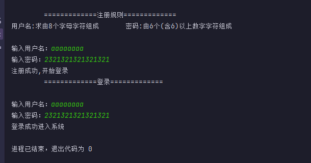

# 系统注册

### 【 案例介绍】

**1.案例描述**

进行系统注册时通常需要输入用户名和密码，其中用户名要求由8个字母字符组成、密码由6个 (含6) 以上数字字符组成。满足要求，则提示“注册成功”，否则根据实际情况提示“**不符合要求”(** 为用户名或密码)

**2.运行结果**



### 【 实现思路】

(1) 定义 `login` 类 写入登录认证的成员方法 `login` 同时两个形参 `u` `p` 皆为注册时的数据,通过形参传递进来判断,在

`saber()` 中写我们的登录判断,关键代码是键盘录入语句以及字符串比较 `equals`

(2) 定义 测试主类 `register` 实例化`login`类 为的是拿到`saber()` 方法, 输出注册规则打印语句,键盘录入拿到用户名和密码并且判断是否符合注册规则,符合则成功注册开始登陆 调用 `login`类中的`saber()` 方法,进行登陆语句的判断, 登陆成功进入系统 程序结束

### 【 实现代码】

定义 `login` 类里面写入  `login` 成员方法 并且带有两个形参 `u` `p`  代码传递而来的用户名和密码

```java
class  login{
  public  void saber(String u,String p){
  }
}
```

在`login ()`成员方法中 写好我们的键盘录入以及`equals` 比较语句 备用,配合if 语句对后面传递而来的用户名和密码进行判断比较

```java
class  login{
    public  void saber(String u,String p){
        System.out.println("\t\t=============登录=============\n");
        Scanner input = new Scanner(System.in);
        System.out.print("输入用户名：");
        String username = input.nextLine();
        System.out.print("输入密码：");
        String password = input.nextLine();
        if (username.equals(u) || password.equals(p)){
            System.out.println("登录成功进入系统");
        }else {
            System.out.println("用户名或密码错误,请重新登录");
        }
    }
}

```

测试主类 `register` 中 ,实现的代码也非常简单

(1) 首先拿到  `login()` 类进行实例化,再进行注册提示的打印语句,输出规则

(2) 键盘录入语句 依次写入用户名和密码

(3) if 语句开始判断是否符合规则,因为用户名只能是8位数的字母,密码只能是0-9的数字 6位或6位以上,其实这里的规则还是很好理解的,但是由于对正则表达式不熟悉 一开始并没有想到使用正则, 想到的是定义2个字符数组,1个数组放24个字母,1个数组放0-9的数字,依次进行for循环比较字符串遍历,确保每个输入的值都符合规则, 但是这样太傻了,后面才想到利用到正则,希望大家无论是在学习编程还是学习其他 还是要多思考 利用更少的方式达到我们的目的,但是走弯路踩坑也对自身帮助也很大&#x20;

```java
规则的if语句 

"[a-zA-Z]{8}" : 在大小写24字母内 并且只能是8位  符合用户名规则
"\\d{6,}"     :  在0-9数字之间 只能是6位或者大于6位  符合密码规则
&&            : 逻辑语句 表示两边都需要符合规则才可以成立


if (username.matches("[a-zA-Z]{8}") && password.matches("\\d{6,}")) {
    System.out.println("注册成功,开始登录");
    gin.saber(username,password);  // 符合后传入用户名和密码 进行登陆判断
}
```

(4) 题目还写到 **根据实际情况提示“不符合要求”(为用户名或密码)** ,所以要对 用户名和密码分别做判断,哪个不符合要求 就提示用户哪个错误,但是注册时可以提示这些,登陆的话最好不要提示, 有的人可以通过这些账号或密码这些回显信息进行恶意的破解,账户正确 密码错误的话是不是可以知道账户是正确的,只是密码错误了,那么恶意的人就可以暴力的破解密码这些,所以在登陆上一旦错误账户和密码均提示错误即可,不需要单一提示某一项,当然这是题外话

```java
  if (username.matches("[a-zA-Z]{8}") && password.matches("\\d{6,}")) {
            System.out.println("注册成功,开始登录");
            gin.saber(username,password);
        } else {
            if (!username.matches("[a-zA-Z]{8}")) {
                System.out.println("用户名不符合要求");
            }
            if (!password.matches("\\d{6,}")) {
                System.out.println("密码不符合要求");
            }
        }
```

### 【 代码】

```java
import java.util.Scanner;
class  login{
    public  void saber(String u,String p){
        System.out.println("\t\t=============登录=============\n");
        Scanner input = new Scanner(System.in);
        System.out.print("输入用户名：");
        String username = input.nextLine();
        System.out.print("输入密码：");
        String password = input.nextLine();
        if (username.equals(u) || password.equals(p)){
            System.out.println("登录成功进入系统");
        }else {
            System.out.println("用户名或密码错误,请重新登录");
        }
    }
}
public class register {
    public static void main(String[] args) {
        login gin = new login(); // 实例对象
        System.out.println("\n\t\t=============注册规则=============\n" +
          "用户名:求由8个字母字符组成\t\t密码:由6个(含6)以上数字字符组成\n");
        Scanner input = new Scanner(System.in);
        System.out.print("输入用户名：");
        String username = input.nextLine();
        System.out.print("输入密码：");
        String password = input.nextLine();
        if (username.matches("[a-zA-Z]{8}") && password.matches("\\d{6,}")) {
            System.out.println("注册成功,开始登录");
            gin.saber(username,password);
        } else {
            if (!username.matches("[a-zA-Z]{8}")) {
                System.out.println("用户名不符合要求");
            }
            if (!password.matches("\\d{6,}")) {
                System.out.println("密码不符合要求");
            }
        }
    }
}
```
