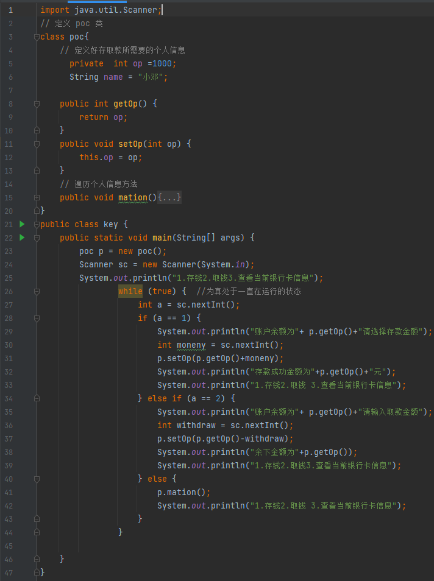
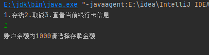
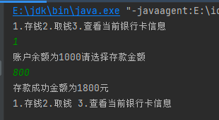
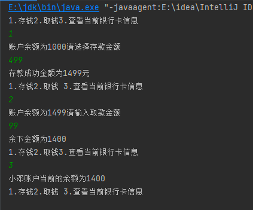

# 银行存取款

> 💻\*\* 不日进者则日退\*\*

```java
import java.util.Scanner;

// 定义 poc 类
class poc{
      private  int op =1000;
      String name = "小邓";

    public int getOp() {
        return op;
    }
    public void setOp(int op) {
        this.op = op;
    }
    public void mation(){
        System.out.println(
       name+"账户当前的余额为"+this.getOp()
        );
    }
}
public class key {
    public static void main(String[] args) {
        poc p = new poc();
        Scanner sc = new Scanner(System.in);
        System.out.println("1.存钱2.取钱3.查看当前银行卡信息");
                while (true) {  //为真处于一直在运行的状态
                    int a = sc.nextInt();
                    if (a == 1) {
                        System.out.println("账户余额为"+ p.getOp()+"请选择存款金额");
                        int moneny = sc.nextInt();
                        p.setOp(p.getOp()+moneny);
                        System.out.println("存款成功金额为"+p.getOp()+"元");
                        System.out.println("1.存钱2.取钱 3.查看当前银行卡信息");
                    } else if (a == 2) {
                        System.out.println("账户余额为"+ p.getOp()+"请输入取款金额");
                        int withdraw = sc.nextInt();
                        p.setOp(p.getOp()-withdraw);
                        System.out.println("余下金额为"+p.getOp());
                        System.out.println("1.存钱2.取钱3.查看当前银行卡信息");
                    } else {
                        p.mation();
                        System.out.println("1.存钱2.取钱 3.查看当前银行卡信息");
                    }
                }

    }
}

```



> **以上是此功能的全部代码，功能的点只有存钱 + 取钱 .但在实际开发中肯定要考虑代码安全.要对金额取出有限制及不能出现负数或者其他字符的情况.当然这种小小练习是不用考虑,只管练手就是了**

### 0x1

功能点比较简单,我的思路是

```java
1.定义类将成员变量作为金额
2.实例化类 通过判断操作从而进行下一步操作
```

在 3-20处定义了 `poc类`,里面定义了 成员变量 op作为金额 且初始金额为1000进行私密, 成员name作为用户名称是一个死数据。  8-13行就是基于`金额op的Set和Get构造方法`,  15行则是我自己加入的功能点,成员方法调用后会显示处当前银行卡的用户名称及金额,当然也可以自定义其他功能点

```java
class poc{
    // 定义好存取款所需要的个人信息
    private  int op =1000;
    String name = "小邓";

    public int getOp() {
        return op;
    }
    public void setOp(int op) {
        this.op = op;
    }
    // 遍历个人信息方法
    public void mation(){
        System.out.println(
       name+"账户当前的余额为"+this.getOp()
        );
    }
}
```

接下来就是在我们的主类mian的逻辑. 23行我首先拿到` class poc类的对象`. 24行属于一个键盘录入语句,数据完全是用户自己输入,存入多少取出多少,  25 打印语句让用户知道已经可以开始操作, **26行的whlie是此处的点睛一笔,因为这个程序要一直在运行,存入和取出是基于一次的，不能是存完程序就结束了, whlie为真保证的是程序可以一直运行下去。**

```java
public class key {
    public static void main(String[] args) {
        poc p = new poc();
        Scanner sc = new Scanner(System.in);
        System.out.println("1.存钱2.取钱3.查看当前银行卡信息");
                while (true) {  //为真处于一直在运行的状态
                   xxxxxxxx
                }
    }
}

```

## 0x2

做完以上的步骤就到了最核心的功能点存钱取出, 此处的功能点全部是在whlie中. **27 行我先是通过键盘录入拿到了输入的数字判断操作是那种,  1 是存钱 2 是取出 3查看信息28 行的if判断就是在判断操作.是为1还是2 , 如果 用户输入是1 的话那么就是进行存钱操作 此时会提醒我们存款金额**



存钱金额的操作是用 poc类的op属性完成,将 op私密后我们通过 set存入数据,再由get输入数据,.此处功能点是再 30 -33行,由我逐行分析代码

由于金额肯定是我们控制的,30行中我们就是定义了 money作为我们输入的金额存储到了里面.\*\*假设此时我们输入的金额是800那么moeny就是800块,我们现在需要把这笔钱给到荷包里面去,就是给到 op,那么 就是 \*\*  `p.setOp(p.getOp()+moneny);`  setOp是存入数据, p.getOp是因为初始就有1000元,在这个基础上加上moneny 就相当于我们钱成功存入了&#x20;

```java
 int moneny = sc.nextInt();
 p.setOp(p.getOp()+moneny);
 System.out.println("存款成功金额为"+p.getOp()+"元");
 System.out.println("1.存钱2.取钱 3.查看当前银行卡信息");
```

&#x20;

我们操作试验成功存入金额两处打印语句,前者输入金额让人有一个直观的感受,后者提示用户存钱已经完成可以继续做别的操作,前面我们是已经将while为真那么这个操作可以一直进行



## 0x3

存钱的操作逻辑就是这样写,用户取钱的操作同样也是先判断操作是1还是2 ,是2则开始取钱,接受到取出的数量.再去用op的set构造方法进行结算与存钱相反那么肯定是减去这个金额 ` p.setOp(p.getOp()-withdraw);`


```java
 int withdraw = sc.nextInt();
 p.setOp(p.getOp()-withdraw);
 System.out.println("余下金额为"+p.getOp());
 System.out.println("1.存钱2.取钱3.查看当前银行卡信息");
```

做完存钱取钱操作最后的操作3就没什么技术,就是判断到用户输入的是3 那么就打印出目前的余额, `p.mation();` 直接通过对象调用方法就是

此功能点结合起码也可以正常运行,以上就是关于功能点的全部讲解


