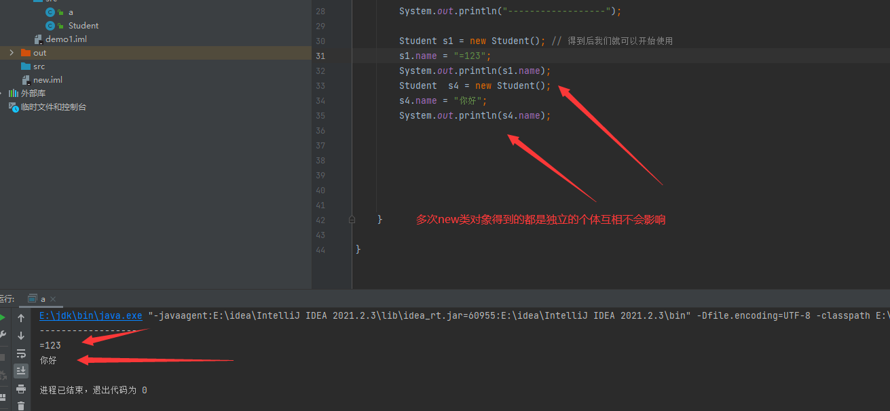
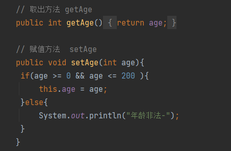
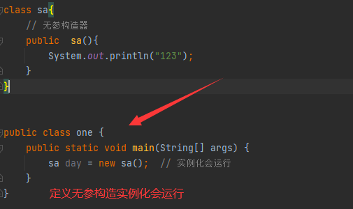
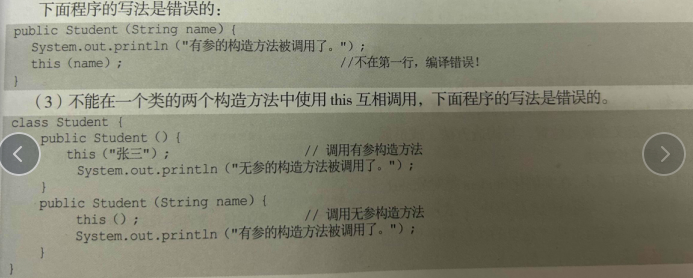

# 封装 构造 静态

## 目录

-   [封装](#封装)
-   [构造器](#构造器)
-   [构造方法重载](#构造方法重载)
    -   [this](#this)
    -   [代码块](#代码块)
    -   [Static (修饰静态)](#Static-修饰静态)
    -   [静态属性](#静态属性)
    -   [静态方法](#静态方法)
    -   [静态代码块](#静态代码块)

class是类   new 出的是对象

**栈内存：**

```groovy
在函数中定义的一些基本类型的变量和对象的引用变量都在函数的栈内存中分配
栈内存主要存放的是基本类型类型的数据 如( int, short, long, byte, float, double, boolean, char) 和对象句柄。

 注意 ：并没有String基本类型、在栈内存的数据的大小及生存周期是必须确定的、其优点是寄存速度快、栈数据可以共享、缺点是数据固定、不够灵活。
```

堆内存：

```groovy
     String str1 = new String ("myString");
     
     String str2 = "myString";
     
     System.out.println(str1 ==str2 ); //False
     
     String str1 = new String ("myString");  // 创建 第一个对象  互相独立
     
     String str2 = new String ("myString");  // 创建第二个对象 在堆中创建
     
     System.out.println(a==b); //Fals
     
     创建了两个引用，创建了两个对象。两个引用分别指向不同的两个对象。以上两段代码说明，
     只要是用new()来新建对象的，都会在堆中创建，而且其字符串是单独存值的，即使与栈中的数据相同， 也不会与栈中的数据共享 ( 此句话说明了每当new出一个新的对象
     但是虽然与栈区的数据相同的,但不会被影响)
```

```java
在java中必须先设计类  才能获得对象  
 类（设计图）: 是对象共同特征的描述 对象: 是真实存在的具体实例
一个java文件中可以定义多个java类 且只能有一个类是pubic修饰
而且public修饰的类名必须成为代码文件名 


下图为设计类方式:

类名 对象名 = new 类名();   
Student s = new Student();      得到类对象的语句写在main方法


```

我们需要先在外部定义类,并且存在成员变量和成员方法。而后才可以在类中去使用

```java
实例代码 直接复制学习 

public class Student {
    // 成员变量
    String name;
    double pce;
    double age;
    // 成员方法
    public void run() {
        String one;  // 局部变量
        System.out.println(name+"----"+age);
    }
    public void kali (){
        System.out.println(name+"----"+age);
    }

}
```

\*\* 两个变量指向同一个对象\*\*​

```java
public class a {
    public static void main(String[] args) {
        Student s1 = new Student(); // 得到后我们就可以开始使用
        s1.name = "你好";   // 单个类定义不同的 变量
        s1.pce = 1;
        s1.age = 2;
        s1.kali();  // 访问方法 输出方法的数据

        Student s2 = s1;    // 将得到的类s1赋值给s2  两个变量指向同一个对象
//        System.out.println(s2); // 二者指向的地址是一致的 变量名中存储的是对象在堆内存中的地址
        s2.name = "世界";  //在这里变量会一同更改,但是分为先后顺序,我们在更改先就可以有了输出语句那么打印的肯定还是原来的  总的来说还是会更改的
        s2.pce = 3;
        s2.age = 4;
//        s2.run();
        System.out.println("-----------------");
        System.out.println(s1.name);  //世界
        System.out.println(s2.name);  // 世界
        s2.kali();
    }

}
```

```java


可以多个得到类的对象 , 且每一个都是独立的 最后一个写的我们要使用的类名称   Car() 

Student s1 = new Student();
Student s2 = new Student();

 如何使用对象 :
 
访问属性: 对象.成员变量    c.name = "奔驰";       

访问行为: 对象名.方法名()  c.start() 

 注意: 

Car c = new Car()  c 变量名中存储的是对象在堆内存中的地址


```



```java
注意点： 

 对象放在堆内存中 

 垃圾回收 : 

    当堆内存中的类对象或数组对象 ,没有被任何变量引用指向时() 

    就会被判定为内存中的 “垃圾”

    Java存在自动垃圾回收期 会定期清理

```

#### **封装**

使用private关键字修饰类的属性，被私有化的属性只能在类中访问,外界想要访问就需要通过

**提供pubilc修饰的公开的getter和setter方法。暴露其取值和赋值;**

```java
 封装的好处 ： 加强了程序代码的安全性 

 适当的封装可以提升开发效率 同时可以让程序更容易理解与维护
```



我们在类中取出这个对象使用&#x20;

```java
实例代码 直接复制学习


 class Studen {
    private String name ;    // private私有化
    private int age;

    public int getAge() {    //  get获取
        return age;  
    }

     public String getName() {
         return name;
     }

     public void setName(String name) {  //打印赋值
         System.out.println("值为"+name);
     }

     public void setAge(int age) {  // // 赋值语句
        if(age > 18){
            this.age = age;
            System.out.println("是一个未成年"+age);
        }else {
            System.out.println("不是未成年"+age);
        }
    }
}


public class a1 {
    public static void main(String[] args) {
        Studen sa = new Studen();
        sa.setName("你好时间");  //打印setName 赋值
        sa.setAge(16);  // 进行判断
    }
}

输出为:

值为你好时间

不是未成年16

```

#### **构造器**

```java
有参数的构造器:在初始化对象的时候 同时可以为对象进行赋值 

构造器的作用 初始化类的对象 并返回对象的地址


 注意事项: 

一旦定义了有参数构造器 无参数构造器就没有了 此时需要自己写一个
```

\*\*无参构造器 \*\*

**构造方法的名称必须和类名一致**



**有参构造器**

```java
实例代码 直接复制学习

 注意事项: 

 一旦定义了有参数构造器 无参数构造器就没有了 此时需要自己写一个  不然会报错,但其实只要没有new出无参的构造器就没有事情
会报错只是我们简单的new出了它, saber  s = new  saber()    但我们没有在类中写无参的方法,所以才会导致报错 

class sa{
    private  String name ;
    private  int age ;
    public sa(){
        System.out.println("定义了有参构造器无参构造器就会没有了 " +
                "此时需要自己写一个不然会报错");
    }
    // 有参构造器
    public  sa(String a,int b){
        name = a;   //将成员变量的值 = 构造器给到的值        也可以是 name  = name 将构造器的实参换成  name和age即可  只要name = 的数字一致就可以 
        age = b;
        System.out.println("狗叫是"+a+"年龄是"+b);  // 定义方法查看修改后的值
    }
    public void saber(){
    // 定义方法查看修改后的值
        System.out.println(name+"为name修改后的值"+age+"同样也被修改");
    }
}


public class one {
    public static void main(String[] args) {
        sa day = new sa();  // 实例化会运行无参
        // 里面有打印的语句所以不用
        sa day1 = new sa("耀阳",29); // 传入值到有参构造器 不与别的冲突独立出来 与上文得到多个类一致
        day1.saber();

    }
}
```


### **构造方法重载**

**重载在相同作用域 ,只是说添加了形参个数达到复用的目的,也就是再构造方法的基础上去添加参数**,**它们具有相同的名称但参数列表不同** , **也就是说 Java可以存在相同的方法只要参数列表不同就可以了**

和普通方法一样,构造方法也可以重载,多次使用不影响,只要每一个**得到的参数个数不同即可调用不同的构造方法为不同的属性赋值**

```java
实例代码 直接复制学习

class sa{
    private  String name ;
    private  int age ;
    private  int mo ;
    public sa(){  // 普通参数
        System.out.println("定义了有参构造器无参构造器就会没有了 " +
                "此时需要自己写一个不然会报错");
    }
    // 有参构造器 重载多个参数
    public  sa(String a,int b){                 // 2个参数
        name = a;
        age = b;
        System.out.println("狗叫是"+a+"年龄是"+b);
    }
    public  sa(String a,int b,int c){            // 3个参数
        name = a;
        age = b;
        mo = c;
        System.out.println("姓名是"+a+"年龄是"+b+"身高是"+c);
    }


    public void saber(){
        System.out.println(name+"为name修改后的值"+age+"同样也被修改");
    }
}


public class one {
    public static void main(String[] args) {
        sa day = new sa();  // 实例化会运行无参
        sa day1 = new sa("耀阳",29);
        sa day2 = new sa("邓小伟",19,180);  //参数个数不同即可可为不同的属性赋值

    }
}

```


#### **this**

\*\*this在这里加就代表指向当前对象或者方法 谁调就是谁     String name \*\*

```groovy
this的作用是为了区分开构造方法的变量和成员变量,普通的写法

在下图中两个成员变量和构造方法的实参不一样 虽然说都会在方法中等于,但是如果命名不一一致的花可读性很差 但是如果让两个变量一致的话那么也就不好区分,this的作用就是区分
通过它想调用谁就调用谁


String name ;
int age ;
 
public sa (String a,int b){                 // 2个参数
    name = a;
    age = b;
   System.out.println("狗叫是"+a+"年龄是"+b);
}        


------------------------------------------------------
三种用法

1.this关键字调用本类成员变量属性
2.this关键字调用成员方法
3.this调用本类的构造方法

```

**1.this调用本类的**成员变量属性

```groovy
实例代码 直接复制学习

class Car{
    String name;
    double price;
    public Car(){
        System.out.println("定义了有参构造器无参构造器就会没有了 " +
                "此时需要自己写一个不然会报错");
    }


    // 有参构造器
    public Car(String name,double price){
        this.name = name;
        this.price = price;
    }
    public void goWith(String name){
        System.out.println("this.name为"+this.name+"普通name为"+name);
        System.out.println(this);      // 对象地址
    }

}


public class one {
    public static void main(String[] args) {
        Car c = new Car(); // 无参构造
        Car c1 = new Car("奔驰",50); // 这里是在有参构造器中参入了值 , 将值奔驰和50传入到this.name中去。  
        c.goWith("宝马"); // 这里只是傻乎乎的普通的值,调用这个方法传入普通的值

    }
    
    

就是传入了不同的参数得到了代码的复用    
t his.name 的值其实就是被 c1 这个有参构造方法赋值了,赋的值就是 奔驰 和 50 gowith只赋普通的name,this.name的值在构造方法中传入参数中就已经使用了     

输入为: this.name为奔驰 普通name 为宝马
```

**2.this调用成员方法**

让类中一个方法，访问该类里的另一个方法或实例变量

```groovy

class Car{
    String name;
    double price;
    public Car(){
        System.out.println("定义了有参构造器无参构造器就会没有了 " +
                "此时需要自己写一个不然会报错");
    }

    // 有参构造器
    public Car(String name,double price){
        this.name = name;
        this.price = price;
    }
    public void goWith(String name){
        System.out.println("this.name为"+this.name+"普通name为"+name);
        System.out.println(this);      // 对象地址
    }

    public void demo(){
        System.out.println("123");
    }
    public void test(){
        this.demo();      // test方案调用了 demo方法,也就是在里面调用了方法, 我们在主类中输出test()类的话则会输出demo()类
    }

}


----------------------------------------
输出: 123
```

**3.this调用本类的构造方法**

```groovy
实例代码 直接复制使用   
   
    class Car{
         private String name;
         private double price;
         public Car(){                      //这里定义的是无参的构造方法,但是我们使用的话需要 
           //  调用它并且使用它,如果不用this的话必须  Car a = new Car() 调用 不调用也不会报错,
            //  this就可以解决这个问题 在其他的构造方法中调用这个方法,等于是节省了一个new方法,
             System.out.println("定义了有参构造器无参构造器就会没有了 " +
                    "此时需要自己写一个不然会报错");
        }

        // 有参构造器
        public Car(String name,double price){
            this();   //  调用了无参的构造方法 那么下面就不需要调用  Car a = new Car()
            this.name = name;
            this.price = price;
        }
        public void goWith(String name){
            System.out.println("this.name为"+this.name+"普通name为"+name);
            System.out.println(this);      // 对象地址
        }

        public void demo(){
            System.out.println("我是"+name+"年龄"+price);
        }
        public void test(){

        }

    }


public class one {
    public static void main(String[] args) {
//        Car c1 = new Car(); // 无参构造
        Car c = new Car("李白",50);
        c.goWith("宝马"); //
        c.demo(); // 使用的是有参构造器的值

    }
    
 注意点: 

1.只能在构造方法中使用this调用其他的构造方法,不能再成员方法中通过this调用
2.在构造方法中使用this调用其他构造方法必须处于第一行且只能出现一次


输出:

定义了有参构造器无参构造器就会没有了 此时需要自己写一个不然会报错
this.name为李白普通name为宝马
Car@1b6d3586
我是李白年龄50.0

```



#### 代码块

```groovy
简单来说 就是使用 {} 括起来的一段代码, 根据位置及声明关键字的不同 代码块可以分为普通代码块,静态代码块,构造块,静态代码块. 同步代码块 4 种
```

**普通代码块**

普通代码块就是直接在方法或语句中定义的代码块

```groovy
// 代码块
public class exp {
    public static void main(String[] args)  { 
         { 
            int age = 100;
            System.out.println("普通代码块");
            
         } 
        
        int age = 30;
        System.out.println("所处的代码块不同 定义同样的变量也不会影响s");
        
     } 
    
}


每一对被大括号{ } 括起的区域就被称为是代码块, exp同样也是一个大的代码块,在exp里面又包含了 main()方法代码块
在main里面又定义了局部代码块,它做了分割,所以在下方定义的 变量age不会影响 ,二者处于不同的代码块,作用域也不同
```

**构造块**

直接在**类中定义的代码块**

```groovy
实例代码

class  saber{
    String age = "18";
    
      // 构造方法
    public saber(){
        System.out.println("我是saber类的构造方法");
    }
    
     { 
        System.out.println("我是构造代码块");   // 与构造方法同级
     } 
    
  
}


// 代码块
public class exp {
    public static void main(String[] args) {
        saber a1 = new saber();
        saber a2 = new saber();  // 实例化拿到两次
    }

}


我们在saber中定义了 构造块,与构造方法,成员变量同级,但是实例化这个东西会先输出,哪怕构造代码块在它的下方也是先执行
"我是构造代码块" 说明了构造代码块的执行顺序是优于构造方法的,与放置前后的位置没有关系

输出:

我是构造代码块
我是saber类的构造方法
我是构造代码块
我是saber类的构造方法


```

#### Static (修饰静态)

> 单独定义了一个类**但是没有通过new实例化是并没有开辟栈内存和堆内存的,** 只要new过后才会开启

我们\*\*希望一些属性和所有的对象共享,那么就可以将其声明为static属性, \*\*如果使用了这个修饰,那么这个属性可以直接使用 类名去进行调用

包括成员方法也是可以通过static修饰

#### **静态属性**

通过static修饰的属性该属性被称为静态属性,也叫 (全局属性) 静态属性使用类名直接访问&#x20;

```groovy
定义方式: 

将属性用户 static修饰现在可以被全局访问到,所谓全局属性  就是可以被不同的类修改使用 
本来下方两个类都是独立开辟的内存空间,属性互不影响值,但如果类被 static修改 那么就可以被一起修改值,

Student a = new  Student;
Student a1 = new  Student;

static String scho = "清华";


 使用: 

y.scho = "南昌大学";   实例对象修改也就是  yan y = new  yan();
yan.scho = "南昌大学"; 类名修改 class yan {}

```

```java
实例代码

class yan{
    String  name ;
    int  age;
    // 被static静态方式修改的属性可以被哪怕是多个new出来的属性也会访问到 并且会同时修改
    static String scho = "清华";
    public yan(String name,int age){
        this.name = name;
        this.age = age;
    }
    public void info(){
        System.out.println("现在的姓名是"+name+"年龄是"+age+"学校是"+scho);
    }
}

public class idea1 {
    public static void main(String[] args) {
        yan y = new yan("小白",18);
        yan y1 = new yan("小白",18);
        yan y2 = new yan("小白",18);
        y.info();
        y1.info();
        y2.info();
        y.scho = "南昌大学";       // 两个类的值同时被修改为一样的结果 这就是全局属性
        y.info();
        y1.info();
        y2.info();
    }
}


输出:

现在的姓名是小白年龄是18学校是清华
现在的姓名是小白年龄是18学校是清华
现在的姓名是小白年龄是18学校是清华
现在的姓名是小白年龄是18学校是南昌大学
现在的姓名是小白年龄是18学校是南昌大学
现在的姓名是小白年龄是18学校是南昌大学


 注意: 

static关键字只能修饰成员变量,不能修饰在方法内的局部变量  下面演示错误代码

public void saber(){

static int a = 10;  //

}
```

#### **静态方法**

> 想要使用类中的成员方法,就需要将它实例化
> 但是在开发中我们希望不创建对象的情况下,通过类的名称就可以调用
> 想要实现这个效果,就可以在成员方法前面加上static修饰,被修饰后的方法称为静态方法

```groovy
静态方法可以通过类名和对象访问: 

类名.方法   saber.pen();   saber{} 

实例对象名.方法   Student.pen();   saber Student = new Student();
```

```java
实例代码

class pen{
    String name;
    double age;
    private static String xiao = "B大学"; // 静态属性
    public pen(String name,double age){  // 构造器
        this.name = name;
        this.age=age;
    }

    public void tr(){  // 普通方法
        System.out.println("姓名是"+name+"年龄"+age+"学校是"+xiao);
    }
   // 被static修饰的方法,就是静态方法,通过这个东西改变学校的值
    public static  void sf(String xiao){  
        pen.xiao = xiao;
    }
}


public class kali {
    public static void main(String[] args) {
        pen p1 = new pen("小李", 18);
        pen p2 = new pen("小李", 18);
        pen p3 = new pen("小白", 18);
        p1.tr();

        pen.sf("清华");  // 将xiao这个成员变量从B大学修改为清华
        p1.tr(); // 调用这个 静态修饰的方法就可以实现,所以它就是写成一个方法修饰就可以了
        p2.tr();
        p3.tr();
    }
}

----------------------------------

上面代码可以成功将 "xiao" 的值 由 "B大学" 改变为 "清华" 且我们没有通过  sf()方法去做,而是直接通过pen.方法去完成, 

pen.xiao="清华"  类名修改   
pi.xiao是="清华"  实例对象修改   

 以上两个方法都是可以统一修改的 

二者都和静态属性一个道理也是全局都可以访问到,并且可以修改
 pen p1 = new pen("小李",18); 只是将值传入了this.name的构造方法,其实我更喜欢理解为new出多个
```

```java
class  kami{

   static   public void  saber(String name,int age){
        System.out.println("传入的name是"+name+"年龄是"+age);
    }
}

public class Quadratic {
    public static void main(String[] args) {
        kami a = new kami();
        kami.saber("123",123);  // 被static修饰的方法才可以在下文被类访问到
    }

}
```

#### **静态代码块**

> 使用Static修饰的代码块称为静态代码块,当类被加载时,静态代码块才会被执行,由于类被加载一次
> 因此静态代码块也只被加载一次

```java
class pen{

    {
        System.out.println("我是构造代码块");                  
    }
    static {
        System.out.println("我是静态代码块");         static修饰的代码块会随class文件一起加载,并且优先级最高,并且只会输出一次
    }                                               虽然我们在下方实例化了三次对象,但是静态代码块的内容只输出了一次
    public  pen(){                                  这就说明,静态代码块在类使用的第一次才会被加载,并且只会加载一次
        System.out.println("我是pen类的构造方法");
    }

}

public class idea2 {
    public static void main(String[] args) {
        pen p = new pen();
        pen p1 = new pen();
        pen p2 = new pen();


    }
}

输出:

 我是静态代码块   //只加载了一次 
我是构造代码块
我是pen类的构造方法
我是构造代码块
我是pen类的构造方法
我是构造代码块
我是pen类的构造方法


```
