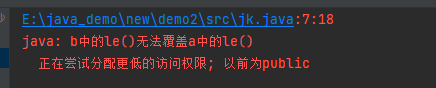
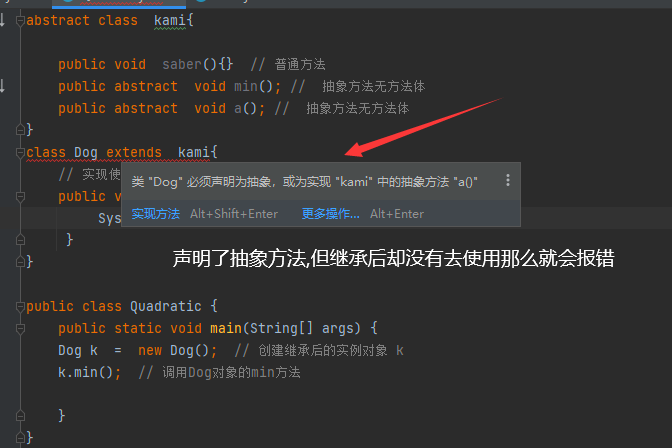

# 继承 super 抽象 接口 多态

## 目录

-   [继承](#继承)
-   [方法的重写](#方法的重写)
-   [super (调用继承父类重写方法)](#super-调用继承父类重写方法)
-   [super (调用父类构造方法)](#super-调用父类构造方法)
-   [final关键字](#final关键字)
-   [抽象类 ](#抽象类-)
-   [接口](#接口)
-   [多态](#多态)
-   [对象类型转换](#对象类型转换)
-   [instanceof(判断和类接口) ](#instanceof判断和类接口-)

#### 继承

> 类的继承是指在一个现有类的基础上去构建新的类,**构建出来的子类就是儿子,现有类好比就是一个父类,模板一样的存在**,与new出多个类互不影响一致,但是 继承的子类是可以使用父类的属性的

```java
 程序中想声明一个类去继承另一个类,使用的是  extends 关键字 

下面三个类是可以写在一起的,只需要用一个public修饰即可


1. 创建父类模板 pen
 class pen {
    private String name;
    private int  age = 100;

     public String getName() {
         return name;
     }

     public void setName(String name) {
         this.name = name;
     }

     public int getAge() {
         return age;
     }

     public void setAge(int age) {
         this.age = age;
     }
 }


 class kali extends pen{
    // 子类中设置属性肯定也是定义属性
    private String  color;

     public String getColor() {
         return color;
     }
     public void setColor(String color) {
         this.color = color;
     }
 }

3. 继承后我们单独再新建一个类 把 kali  new出使用 
public class saber {
    public static void main(String[] args) {
        // 创建继承之后的子类 看看是否可以使用父类的属性和行为
        kali k = new kali();  
        k.setName("世界");
        k.setAge(18);   // 使用的是父类的属性
        k.setColor("黑色")  //使用的是子类属性
        System.out.println("姓名是"+k.getName()+"年龄是"+k.getAge()+"颜色是"+getColor() );
    }
}


--------------------------------------------------
输出:姓名是世界年龄是18 颜色是 黑色
```

**注意点**

在java中 类只支持单继承 不允许多继承,也就是说一个类只能有一个直接父类,但是多个父类可以被多个不同的类使用

```6502&#x20;assembly
class  a{}
class  b{}
class  c extends a b  {}  //  这种情况是不可以的,C类不能同时继承 A B
```

多个类可以继承一个类&#x20;

```6502&#x20;assembly
class a {}
class b extends a {}
class c extends a {}  // B类和C类都继承了 a 类

```

java中也支持多层继承,即一个类的父类可以再继承另外的父类 例如 C类继承B类 而B类又继承了A类，那么 这个时候 A类是父类 那么 C类就是它的子类

```6502&#x20;assembly
class a{}
class b extends a {}   // 多层继承 b类继承了a类 
class c extends b {}   // 同时 c 类又继承了 b类
```

在继承中 子类不能直接访问父类中的私有成员，子类可以调用父类的非私有方法,但是不能调用父类的私有成员

#### **方法的重写**

在继承中 子类会自动继承父类中定义的方法,但有时在子类中对继承方法做一些修改,即对父类的方法进行重写,所以存在继承关系 ,并且可以在别的包中引用

注意:

**在子类中重写的方法需要和父类重写的方法具有相同的方法名、参数列表和返回类型**

且在子类重写的方法不能拥有比父类方法更加严格的访问权限

```java
实例代码

// 定义 a子类并写入 le成员方法
class  a{
    void  le(){
        System.out.println("你好啊");
    }
}

// 定义 b子类 继承上方的 a子类  这个时候b可以使用a的东西
class b extends a{
    void le(){   // 再次定义le方法 修改参数,这就是方法的重写
        System.out.println("世界啊");
    }
}

public class jk {
    public static void main(String[] args) {
        b boo = new b();  //  实例化b类 
        boo.le();  // 使用b类重写后的le方法 会输出
    }
}

----------------------------

输出: 世界后 重写成功
```

**注意点：**

子类重写父类方法时,不能写比父类还严格的访问控制，例如

父类方法 修饰符为 `public`

子类的方法就不能是 `private`

如果子类在重写父类方法时定义的权限缩小,那么编译就会报错

```java
实例代码

  class  a{
      public void  le(){ //父类的代码宽松
          System.out.println("你好啊");
      }
  }
  
  class b extends a{
      private void le(){  // 子类重写的更严格这样是不行的
          System.out.println("世界啊");
      }
  }
  
  public class jk {
      public static void main(String[] args) {
          b boo = new b();  
          boo.le();  
      }
  }
---------------------------------------
以上写法会报错,因为子类重写父类的方法,是不能比他更加严格的,
但相反是可以比他更加松懈 


```



```java
class  a{
    private void  le(){  // 父类的严格
        System.out.println("你好啊");
    }
}
class b extends a{
    public void le(){    // 子类的更宽松这样是可以的
        System.out.println("世界啊");
    }
}

public class jk {
    public static void main(String[] args) {
        b boo = new b();
        boo.le();
    }
}

---------------------------------------

输出: 世界啊
```

#### super (调用继承父类重写方法)

当子类重写父类方法后,子**类对象将无法访问父类被重写的方法**,为了结果这个问题,java就提供了 `super关键字`&#x20;

super可以在子类中调用父类的普通属性,方法和构造方法

```java
super.成员变量
super.成员方法(参数1,参数2)

```

子类使用super关键字调用父类方法和变量

```java
实例代码

class  a{
    String name = "柴犬"; // 父类的name
     void  le(){         // 父类的方法
        System.out.println("你好啊");
    }
}
class b extends a{  // 子类b 继承 父类
    public void le(){
      super.le();  // super调用父类的le方法 会输出    第一个输出
      System.out.println("重写后的世界");  // 第二个输出
    }
    public void lon(){
        System.out.println("全部都是"+super.name); // 通过super关键字调用 父类的name  //第三个输出
    }
}

public class jk {
    public static void main(String[] args) {
        b boo = new b();
        boo.le();
        boo.lon();
    }
}

--------------------------------------------
super的用法就是继承后方便子类调用父类的属性,前提是二者是一个继承关系

输出: 

你好啊
重写后的世界
全部都是柴犬 


```

#### super (调用父类构造方法)

```java
class  a{
    private String name ;
    private  int age;

    public String getName() {
        return name;
    }

    public void setName(String name) {
        this.name = name;
    }

    public int getAge() {
        return age;
    }

    public void setAge(int age) {
        this.age = age;
    }

    public a(String name, int age){     // 父类的构造方法  One 
        this.name =name;
        this.age = age;
    }
    public void info(){  // 父类的方法
        System.out.println("名称是"+this.getName()+"年龄是"+this.getAge());
    }
}
class b extends  a{
  private String color;
  //  b 类的构造方法 使用了父类 a的成员属性 因为继承过来了 
     public b(String name, int age, String color) { // 传入的值一次性可以有三个  // 
        super(name, age);   //  super使用了父类的构造方法  One 把值拿到 
        this.setColor(color); //  拿到本类中定义的属性 color的值通过 setColor       才有了这个  2 

    }
    public String getColor() { // 封装后的方法   有了这个  1 
        return color;
    }

    public void setColor(String color) {  // 封装后的方法
        this.color = color;
    }
    // 重写父类的 info 方法
    public void info(){
        super.info();  //调用 父类的info方法a类的,  this.getColor() 完全是由用户自控制的
        System.out.println("颜色是"+this.getColor()); // 对应最后一句’
        
    }
}


public class jk {
    public static void main(String[] args) {
        b boo = new b("柴犬",18,"黄色");  // 传入值到 构造方法中,里面会有三个值,name age 是父类a的 只有color是子类b自己
        boo.info();                     // 传入的子类的值由   this.setColor(color);
    }
}

----------------------------------------------------
  输出:
名称是柴犬18 颜色是黄色  
实例化调用子类的方法的话,我们在子类中也写入了 super.info()  会先调用父类的方法下方也有子类的方法, 两者才可以一起执行
```

**注意点:**

**通过 super()调用父类的构造代码必须位于子类构造方法的第一行,并且只能出现一次**

super和this的作用很相似,都是可以调用构造方法,普通方法和属性,但是二者肯定是不能同时出现的,因为两者在调用构造方法的时候都是必须放在构造方法的首行

#### final关键字

final关键字的因为意思是 "最终"  它可以修饰 **类 属性 方法**

**修饰类**

被final修饰的类 是不能被继承的,即是一个独立的类 下方没有派生子类

```java
// final 关键字修饰 类

final class  a{
  public  void saber(){
      System.out.println("不可以被继承");
  }
}
class Dog extends  a{  // 不可以被继承会报错  提示  被final修饰的类不可继承

}


public class independence {
    public static void main(String[] args) {
        System.out.println("123");
        Dog  D = new Dog();
        
    }
}

------------------------------------
编译报错,被final修饰的类不可被继承
```


**修饰方法**

当一个类中的方法被final关键字修饰后则不能被重写,定义后也就是最终的方法

```java
class  a{
  public  final void saber(){
      System.out.println("不可以被继承");
  }
}
class Dog extends  a{
  // 继承后尝试重写父类 a 的saber方法
    public void  saber(){
        
    }

}


public class independence {
    public static void main(String[] args) {
        System.out.println("123");
        Dog  D = new Dog();

    }
}

----------------------------------------------
编译报错 被final修饰的方法不能被重写 会成为最终的方法,如果在父类中定义某个方法,如果不希望被子类重写 那么就可以使用final关键字修饰
```


**修饰变量**

```java
被final修饰的变量最终会成为常量 也就是不能被修改,常量只能在被声明时赋值一次,后面如果再修改就会报错

public class independence {
    public static void main(String[] args) {
        final  int a = 100;
        a = 200;

    }
}


------------------------------
编译报错,在对 a 变量进行二次赋值编译器报错。 被final修饰的变量不能修改。
```


**注意点**

final声明变量最好建议是全部字母大写,如果一个程序中的变量使用了 public static final 声明 则此变量将变为全局变量

`public  static final int ABC = "100"`

#### 抽象类&#x20;

当定义一个类时,常常需要定义一些成员方法描述类的行为特征,但有时方法的实现方式是无法确定,所以Java定义了抽象类的概念。

抽象类是使用 `abstract`**关键字修饰的成员方法** 抽象方法在定义时是不需要方法体的 定义格式如下

```java
abstract 返回值类型 方法名称(参数);

```

**当一个类包含了抽象方法 该类必须是抽象类, 抽象类和抽象方法一样 必须使用abstract 关键字修饰**

定义格式如下

```java
abstract class  kami{ // 抽象类

    public void  saber(){}  // 普通方法
    public  abstract  void min(); //  抽象方法无方法体  访问权限 abstract 访问类型 方法名称(参数)
}

public class Quadratic {
    public static void main(String[] args) {

    }
}

抽象类比普通类多了一些抽象方法,其他地方比普通类组成相同
```

**定义规则**

(1) 包含抽象方法的类必须是抽象类

(2) 抽象类和抽象方法都必须使用abstract关键字修饰

(3) 抽象方法只需要声明不需要实现

(4) **如果一个非抽象类继承了抽象类,那么该子类就会继承父类(抽象类)中的全部抽象方法**

```java
 abstract class  kami{

    public void  saber(){}  // 普通方法
      public abstract  void min(); //  抽象方法无方法体
}
class Dog extends  kami{  
    // 实现使用 min  抽象类的min方法  非抽象的类继承了父类那么父类中的
    public void min(){
         System.out.println("完美世界");
     }
}

public class Quadratic {
    public static void main(String[] args) {
    Dog k  =  new Dog();  // 创建继承后的实例对象 k
    k.min();  // 调用Dog对象的min方法

    }
}


--------------------
输出:  
完美世界
```

**注意：**

使用abstract修饰的抽象方法不能使用private 修饰, 因为抽象方法的全部抽象方法必须都被子类实现

如果父类的抽象方法用private修饰 则子类无法实现该方法，private是私密所以拿不到

```java
错误的方法 

prvate viod saber(){} 
```

**如果一个非抽象类继承了抽象类,那么该子类就会继承父类(抽象类)中的全部抽象方法,继承 就要全部实现方法,否则全部定义为抽象类**



#### 接口

如果一个抽象类的**所有方法都是抽象的,则可以将这个类定义为是一个接口, 接口就是想使用的时候就拿过来使用即可。接口中不仅可以有抽象方法,还可以包含默认的普通方法和静态方法((类方法)** 并且两种是都可以有方法体的,里面可以放参数意味着不需要重写

默认方法 `default` 修饰&#x20;

静态方法  `static`  修饰

**声明接口**

接口使用 `interface` 关键字**声明** 格式如下

```java
public interface 接口名 extends 接口1 接口2 {
     public static final 数据类型 常量名 = 常量值;   // final修饰的变量是最终的不可修饰
     public abstract 返回值类型 抽象方法名称 (参数列表);   // 抽象方法
}

接口中的变量默认使用  public stactic final  修饰即全局变量

接口中定义的方法默认使用   public abstract  修饰即抽象方法 

如果接口的访问权限声明为public 则接口里面的变量和方法都是public权限
```

`extends` 接口1 接口2  表示一个接口可以有多个父接口,父接口之间用逗号隔开, **接口的目的就是为了解决单继承的限制,因为一个类只能有一个父类**

而一个接口可以同时继承多个父接口。

**注意：**

编写接口里面的方法会省略 `public` 会以为它的访问权限会是 `default` 这是不正确的, 不管写不写访问权限 接口中方法的访问权限永远是 `public`

**并且里面定义常量时 可以省略前面的**   `public stactic final`  **也就是直接按照普通的定义变量的方式去定义就可以 接口会默认为常量添加**&#x20;

`public stactic final`

**实现接口**

接口中包含三类方法 抽象方法 默认方法 静态方法。静态方法通过 **接口名.方法名** 调用 ; 抽象方法和默认方法只能通过接口来实现类的对象来调用。

接口实现类的方法只需要定义一个类 该类通过`implements`关键字实现接口,并实现接口的实现类。

接口实现`implements` 关键字 格式如下    定义接口实现类

```java
修饰符 class 类名 implements 接口1,接口2{

}
```

```java
定义接口 Animal

interface  Animal{
    int id = 1;  // 接口里面的变量默认是全局变量
    String  name = "左翼";
    void  shout();    // 抽象方法
    void  info();     // 抽象方法
    static void getId(){  // 静态方法
        System.out.println(Animal.id);
    
//    static int getId(){
//        return Animal.id;
//    }
}

// 定义接口 Action
interface  Action{
    void eat();    // 抽象方法
}


// 定义 other 类实现 Animal Action 接口
class other implements Animal ,Action{
    // 重写方法 2个接口里面的全部方法
    public void shout(){
        System.out.println("Action是行为的意思");
    }
    public void  info(){
        System.out.println("信息是大学生");
    }
    public void eat(){
        System.out.println("世界阿"+name);
    }
}

public class Quadratic {
    public static void main(String[] args) {
         //  Animal.getId();  通用的方式
        // 这里出现了两种情况,如果方法没有返回值是void的形式那么就可以直接 接口.方法名    
        // 这种方式调用是通用的,只是return是没有打印语句,所以如果是return的情况那么就需要利用下面的形式把调用语句放在打印里面输出
        System.out.println("编号是"+Animal.getId());  //接口.方法名 调用
        
        System.out.println(Animal.id+"是天气");// 接口直接访问常量
        other Student = new other(); // 实例化拿到对象
        Student.shout();  // 调用重写的方法
        Student.info();
        Student.eat();
    }
}

实例化对象可以直接访问接口中的常量、重写的接口方法和本类内部方法,而接口中的静态则可以直接使用接口名调用
接口的实现类必须实现  implements  接口全部的方法,接收到多少实现多少, 否则会报错

---------------------------------------------
输出:
  编号是1
  1是天气
  Action是行动的意思
  信息是大学生
  世界阿左翼
```

**注意：**

抽象类和接口其实是一样的,只是说如果一个抽象类中的方法全部都是抽象方法那么就可以说它是接口,接口里面又有普通的方法和静态方法

**一个类实现接口并继承抽象类**

定义类格式:

```java
修饰符 class 类名 extends 父类名 implements 接口1,接口2 {

}
```

```java
// 定义接口 Animal

interface  Animal{
    int id = 1;  // 接口里面的变量默认是全局变量
    String  name = "左翼";
    void  shout();    // 抽象方法
    void  info();     // 抽象方法
}

// 定义抽象类
abstract class repeat{
    public abstract void saber(); // 定义抽象方法
}


// 定义 other 类实现 Animal接口 并且继承 repeat抽象类,二者兼得
class other extends repeat  implements Animal  {
    // 重写接口中的两个方法
    public void shout(){
        System.out.println("");
    }
    public void  info(){
        System.out.println("信息是大学生");
    }
    // 普通的方法
    public void eat(){
        System.out.println("世界阿"+name);
    }
   // 重写抽象类中的方法
    public void saber() {
        System.out.println("saber是大美女");
    }
}

public class Quadratic {
    public static void main(String[] args) {
        other Student = new other(); // 实例化拿到对象
        Student.eat();  // eat方法是我们自己加入的方法调用
        Student.info();  // 调用重写的方法
        Student.shout();
        Student.saber();
    }
}

 other 类通过exthds继承了  repeat 抽象类,并且 implements 实现了 Animal  接口。 因为接口和抽象类本身都存在抽象方法, 所以other类必须重写
 Animal 接口和  repeat 抽象类 

-----------------------------------------------
输出:

世界阿左翼
信息是大学生
你好
saber是大美女

```

**接口继承多个接口**

java接口是不允许继承抽象类的,但是允许一个接口继承多个接口

定义继承格式

```java
interface Action extends Animal,Color{
    void shout();
}
```

```java
// 定义接口 Animal

interface  Animal{
    int id = 1;  // 接口里面的变量默认是全局变量
    String  name = "左翼";
    void  info();     // 抽象方法
}

// 定义Color接口
interface  Color{
    void black();  // 抽象方法
}

//  定义接口继承上面接口
interface Action extends Animal,Color{
    void shout();
}


// 定义 other 类实现 Animal接口 并且继承 repeat抽象类,二者兼得
class other  implements Action  {
    // 重写 Animal接口方法
    public void info(){
        System.out.println("你好");
    }
    // 重写Color接口方法
    public void  black(){
        System.out.println("黑色");
    }
   // 重写Action接口方法
    public void shout() {
        System.out.println("saber军刀");
    }
}

public class Quadratic {
    public static void main(String[] args) {
        other Student = new other(); // 实例化拿到对象
        // 调用重写的方法
        Student.info();
        Student.shout();
        Student.black();

    }
}

Action 接口继承了上面两个接口,这样Action接口就可以拥有上面两个接口的抽象方法还有本类 shout方法  
而后利用other类实现接口,再实例化类这样Student对象就需要重写这三个抽象方法

-------------------------------------------------------------
输出:  
     你好
     saber军刀
     黑色
```

#### 多态

多态是指不同的对象在调用同一个方法时所表现出多种不同的行为,比如有一个动物类型的类,我们传入猫就发出喵喵喵,狗就是汪汪汪

这种**由于参数不同而导致执行效果不同的现象就是多态** **不同行为也可以理解为实例化对象每次传入的参数都不一样,形成复用**

多态有有着以下两种形式

(1)  方法的重载性

(2)  对象的多态性 (方法重写)

**被继承的父类对象变成了一种类型,** **通过父类类型实例化的对象就形成了多态的效果;**

`Anima sa = new Cag();`

本来会是&#x20;

`Cag sa = new Cag();  `

`kli``  sa = new kli();   `

因为这两个子类对象向上转型成了Anima**父类类型对象,然后通过父类对象去调用这两个方法**

```java
实例代码

// 定义抽象类 Animal
abstract  class  Anima{
    abstract  void  shot(); //抽象方法 shot
}
// 被两次不同类继承所以要实现两次,同一个对象被不同的类继承 所重写表现的就是多态
class Cag extends  Anima{
    // 实现 shot方法,因为继承所以需要被实现
    public void shot(){
        System.out.println("master是你吗围巾");
    }
}
class kli extends  Anima{
      public  void  shot(){
          System.out.println("秋天到了");
      }
}
public class op{
    public static void main(String[] args) {
        Anima sa = new Cag(); // 创建Cat对象使用Anima类型变量 ,也就是被父类变成了一种类型 使用父类去调用子类的方法 
        Anima sa2 = new kli();
        sa.shot();
        sa2.shot();
    }
}


------------------------------------------
输出:

master是你吗围巾
秋天到了
```

#### 对象类型转换

对象类型转换分为两种情况

(1)  向上转型 : 子类对象—>父类对象  **上方代码就是**

(2)  向下转型： 父类对象—>子类对象

向上转型程序会自动完成,反而是向下转型,必须指明要转型的子类类型,转换格式

**对象向上**

父类类型  父类对象 = 子类实例   ` Anima sa = new Cag();`

**对象向下**

1.父类类型 父类对象 = 子类实例

2.子类类型  子类对象 =  (子类) 父类对象

**对象向上转型操作**

```java
实例代码

// 定义类 Animal
  class  Anima{
    public   void  shot(){ // 普通方法
        System.out.println("你好");
    }
}
class Cag extends  Anima{
    //  重写 shout() 方法
    public void shot(){
        System.out.println("master是你吗围巾");
    }
    public void eat(){
        System.out.println("吃骨头");
    }
}
public class op{
    public static void main(String[] args) {
        Cag dog = new Cag(); // 创建Dog对象
        Anima an = dog;
        //向上转型将实例化后的 dog  又重写给了父类Anima 那么父类可以使用 ad.方法() 调用
        an.shot();  // 虽然是使用父类类型,但调用的还是之后被子类重写的方法 
    }
}

--------------------------------------
输出:

master是你吗围巾
 
 
 注意: 

 对象即使发生了向上转型关系后,所调用的方法一定是被子类重写的方法 
 并且只能调用父类和子类共同都有定义的方法,二者都需要存在,上例中 an父类对象是无法调用 eat()方法的
因为eat() 方法未在父类Anima中定义只在子类中定义
```

进行对象向下转型前,必须先发生对象向上转型,否则将出现对象转换异常

**对象向下转型操作**

```java
实例代码

// 定义类 Animal
  class  Anima{
    public   void  shot(){ // 普通方法
        System.out.println("你好");
    }
}
class Cag extends  Anima{
    //  重写 shout() 方法
    public void shot(){
        System.out.println("master是你吗围巾");
    }
    public void eat(){
        System.out.println("吃骨头");
    }
}
// 转换格式

 1.父类类型 父类对象 = 子类实例

2.子类类型  子类对象 =  (子类) 父类对象 

public class op{
    public static void main(String[] args) {
       Anima an = new Cag(); //1. 第一步先发生向上转型 将Cag()的实例转换成了类Anima()的实例
       Cag dog = (Cag) an; // 2. 向下转型  将Anima类的实例转换成 Cag类的实例,对应上方两步操作
       dog.shot();
       dog.eat();
    }
}

----------------------------------------------
输出: 

master是你吗围巾
吃骨头

 注意:  

调用的仍是子类的方法,因为父类的方法已经被子类重写,可以调用子类里面的任何方法 不需要父类中定义
这里和向上的区别就出现了, 如果我没有理解错的话,向上转型后只能调用两者共有的,向下转型只要是子类的方法都可以调用、 


向下转型不能直接将父类实例对象转换为子类实例,也就是一步到位这是不允许的,否则报错。以下情况是不可以的
不理解就看括号

 Cag dog = (Cag) new Anima(); 

1.父类类型 父类对象 = 子类实例

2.子类类型  子类对象 =  (子类) 父类对象

```

#### instanceof(判断和类接口)&#x20;

语法格式:

**对象 instanceof  类(或者接口)**

instaceof关键字判断一个对象是否是某个类或者接口的实例, 为真返回true 否则 false

```java
实例代码

// 定义类 Animal
  class  Anima{
    public   void  shot(){ // 普通方法
        System.out.println("你好");
    }
}
class Cag extends  Anima{
    //  重写 shout() 方法
    public void shot(){
        System.out.println("master是你吗围巾");
    }
    public void eat(){
        System.out.println("吃骨头");
    }
}
public class op{
    public static void main(String[] args) {
      Anima a1 = new Cag(); // 向上转型 实例化对象是Anima
     // 两个都是属于 父类Anima Cag也是它的子类,所以 a1 对象是下面两个类的实例
     System.out.println("Amima a1 = new Dog():"+(a1 instanceof Anima)); // 真
     System.out.println("Amima a1 = new Dog():"+(a1 instanceof Cag)); // 真

     Anima a2 = new Anima(); // 普通实例化与子类没有关系 
     System.out.println("Amima a1 = new Dog():"+(a2 instanceof Anima));  // 真
     System.out.println("Amima a1 = new Dog():"+(a2 instanceof Cag));// 假
    }
}
 
注意:   
    观察父类是否发生转型即可,发生转型的话那么子类实例化的对象也是属于父类的
```
