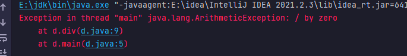
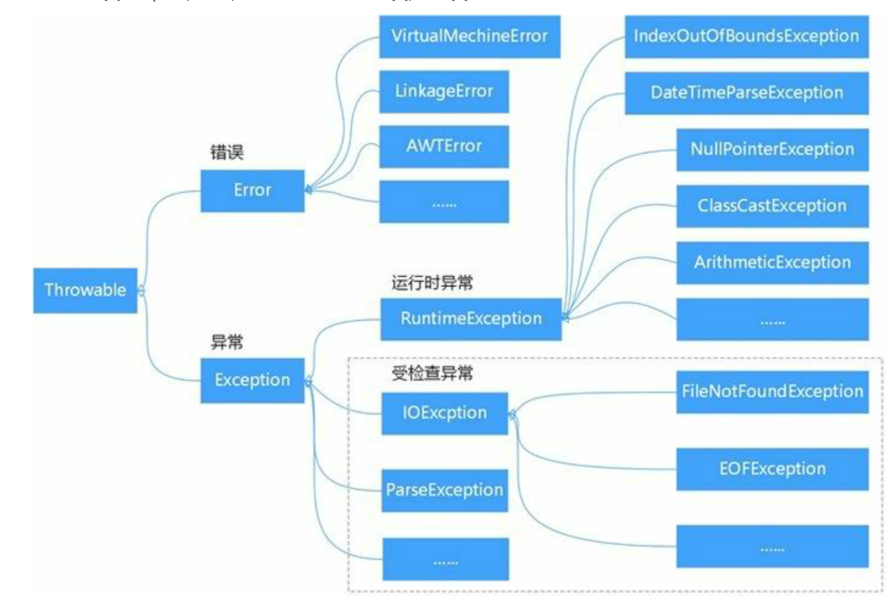

# Object 内部类 异常

## 目录

-   [Objbect类](#Objbect类)
-   [内部类](#内部类)
    -   [成员内部类](#成员内部类)
    -   [局部内部类](#局部内部类)
    -   [静态内部类](#静态内部类)
    -   [匿名内部类](#匿名内部类)
-   [异常(Exception)](#异常Exception)
    -   [什么是异常？](#什么是异常)
    -   [try....catch  和 finally](#trycatch--和-finally)

#### Objbect类

java提供了Object,它是所有类的父类,每个类都直接或间接的继承了Object类,因此Object类通常被称为**超类**

当定义一个类时,如果没有使用extends关键字直接去指定父类继承,只要没有被继承的类,都是会默认的去继承Object类,超类中定义了一些方法

| 方法名称                | 方法说明         |
| ------------------- | ------------ |
| boolean equals()    | 判断两个对象是否相等   |
| int hashCode ( )    | 返回对象的散列码值    |
| String toString ( ) | 返回对象的字符串表示形式 |

```java
实例代码

// 定义 Animal类
class Animal{
    // 定义动物叫的方法
    void  shout(){
        System.out.println("动物叫");
    }
}
// 测试被继承的情况是否可以使用没有被继承和被继承的情况都是可以使用超类的方法
class Dog extends Animal{
    void o(){
        System.out.println("你好");
    }
}
// 主类 a
public class a {
    public static void main(String[] args) {
      Animal op = new Animal();   
      Dog p = new Dog();
      System.out.println(p.toString());
      System.out.println(op.toString()); // 默认继承了Object使用自带的toString,打印方法
    }
}


------------------------
输出:
Dog@1b6d3586
Animal@1b6d3586

```

Object自带的方法并且支持重写,但是其实多次一举,因为这种和普通方法的定义然后重写没有区别这里也是直接写完

```java
// 定义 Animal类
class Animal{
    // 定义动物叫的方法
   public String toString(){
       return  "动物";// 因为默认toString是返回字符串的格式,所以有返回格式我们不能使用void
   }
}
// 主类 a
public class a {
    public static void main(String[] args) {
      Animal op = new Animal();
      System.out.println(op.toString()); // 打印重写后的方法
    }
}

```

### 内部类

Java中允许在一个类的内部定义类,这样的类称为内部类,一个普通类如果定义了内部类,那么普通类就会变成外部类,根据 内部类的位置,修饰符和定义方法不同,内部类可分为 **成员内部类  局部内部类  静态内部类  匿名内部类   四种**

#### 成员内部类

在类中除了可以定义成员变量,成员方法外还可以定义类,这样的类就被称为**成员内部类**,成员内部类可以访问所在外部类(自身边所在位置定义的普通类),的所有成员

```java
实例代码

class Other{
    int m = 0;
    public void  shout(){   // 普通类的成员方法
        System.out.println("外部类的普通方法shout()");
    }
    //成员内部类
    class inner{
        int n = 100; // 内部类成员变量
        public  void show1(){
           // 成员内部类的方法访问外部类的属性也就是成员变量
            System.out.println("外部类的变量:m="+m);
        }
        public  void  show2(){
            System.out.println("成员内部类的普通方法");
        }
    }

    // 普通类的成员方法 功能是访问成员内部类
    public void  info(){
        // 实例化成员内部类
        inner er = new inner();
        System.out.println("成员内部类的变量n="+er.n);
        er.show2(); // 调用成员内部类方法
    }
}

public class b {
    public static void main(String[] args) {
        Other other  = new Other(); // 实例化普通类
        // 通过已经实例化的普通类 other 去访问里面的成员内部类
        Other.inner er = other.new inner();
        er.show1();
        other.info();
    }
}

------------------------------
输出: 

外部类的变量:m=0
成员内部类的变量n=100
成员内部类的普通方法

```

成员内部类和外部类可以互相的去访问,但是**需要先将外部类实例化,利用外部类去访问所在的成员内部类,再去进行调用**,也就是

**如果想通过外部类访问内部类，则需要通过外部类创建内部类对象，创建内部类对象的具体语法格式如下:**

```java
  Other.inner er = other.new inner();
  
  外部类名.内部类名 变量名存储 = 外部类对象.new 内部类名();
```

#### 局部内部类

**在方法中定义的类叫局部内部类也称为方法内部类**,是指定义在某个局部范围中的类, 和在方法中定义的变量叫局部变量一样,有效范围也只限于方法内部类

**访问规则**

局部内部类可以在里面拿到外部类的所有成员变量和方法

**但是它自身内部类定义的变量也方法只能在自己的内部类利用所属方法中访问,外面拿不到里面,里面可以拿到外面**,**自己可以访问自己**

```java
 实例代码


class  Othou{
    int m = 100;
    // 普通的成员方法
    public  void  tset1(){
        System.out.println("我是外部类的成员方法");
    }
    // 成员方法里面定义局部内部类
    public  void  tset2(){
        class  op{
            int n = 1;
            public void  show(){ // 3
                System.out.println("外部的变量m="+m);// 里面拿外面
                tset1(); // 局部内部类可以访问外面的属性和方法,调用 
            }
        }
        op er = new op();// 实例化局部内部类
        System.out.println("局部的变量n="+er.n);//第一个调用自己拿自己
        er.show(); //2 调用它回到 11行
    }
}

public class a {
    public static void main(String[] args) {
        Othou o = new Othou();
        o.tset2();
    }
}

----------------------------------

输出:

局部的变量n=1
外部的变量m=100
我是外部类的成员方法

```

#### **静态内部类**

静态内部类就是使用static关键字修饰的成员内部类,和上文的成员内部类相比就是增加了 static关键字 但是**静态内部类只能访问外面的静态成员,也就是可以拿到外面的值,**&#x20;

**并且可以不创建主类的对象,直接创建自己的内部类对象,也一样可以拿到外部类的值使用**

创建静态内部类语法

`外部类名.静态内部类名 变量名 =  new 外部类名().静态内部类();`

```php
class ou{
    static int my = 100; // 定义静态成员变量 只能调用静态的 普通的成员无法调用
    // 定义静态内部类
    static class Inner{
        int l = 1;
        public  void  sho(){
            // 在静态啊内部类的方法中访问外部类的成员变量
            System.out.println("外部静态变量my="+my);
        }
    }
}

public class b {
    public static void main(String[] args) {
        // 跳过主类直接创建静态内部类
        ou.Inner nn = new ou.Inner();
        nn.sho(); //调用show方法测试静态变量my的值

    }
}


----------------------------------------------------
输出:
外部静态变量my=100


```

#### 匿名内部类

匿名内部类是没有名称的内部类,在java中调用某个方法,如果它的形参类型是接口类型 ,除了可以传递一个接口实现类外,还可以使用实现接口的匿名内部类作为参数

**匿名内部类的作用就是多提供一种实现接口的方法,将接口的方法作为子类实现**

创建匿名内部类语法

```php
new    父接口 () {

 //  匿名内部类实现部分

}
```

```java
实例代码

  interface  Ani{  //定义接口
      void si();  // 接口的方法 下文需要实现
  }

public class c {
    public static void main(String[] args) {
       String name = "小邓";
       saber(new Ani() {
           @Override
           public void si() {
               System.out.println(name+"实现接口的方法");
           }
       });
    }
    public static void  saber(Ani an){ //接口类型的方法
        an.si();  // 调用方法
    }
}

-------------------------------------

输出: 

小邓实现接口的方法
```

**注意:**

JDK8新增特性,允许局部内部类 匿名内部类访问非f`inal`修饰 变量,在13 行里面访问了name所以才没有报错,在之前是会出错误的,如果要访问需要加上final修饰,具体为什么 我也不知道,

匿名内部类的编写分为两步

(1)  在调用saber() 方法时,在方法参数的位置写上 `new Ani() {}` 这就相当于创建了一个实例对象,  并将对象作为参数传递给了 `saber()` 方法  在`new Ani` ()后面还有一个大括号,表示创建的对象为`Ani` 的子类实例, 该子类的匿名的

```java
      saber( new Ani() {} );
```

(2) 在大括号中编写匿名子类的实现代码,实现接口的方法

```java
      saber(new Ani() {
           public void si() {
               System.out.println(name+"实现接口的方法");
           }
       });
```

匿名内部类是实现接口的一种简便写法,在程序中不一定非要使用,理解语法即可

## 异常(Exception)

#### 什么是异常？

在程序中难免出现各种各样的报错 bug,所以java语言引入了异常类, 对这些不正常情况进行封装,通过异常处理机制对程序运行时发生的各种问题进行处理

```java
public class d {
    public static void main(String[] args) {
        // 因为传入的值是 0 导致报错
        System.out.println("值是"+div(4,0));
    }
    //  定义方法两个值相除 
    public static int div(int x,int y){
        int re = x/y;
        return  re;
    }
}

```



`ArithmeticException` 异常只是java类中的一种,Java提供了大量的异常类, 这些类全部继承于`java.lang.Throwable类`



`Throwable类`有两个直接子类 Error(错误)   Exception(异常)

Error

> 它表示Java程序运行时产生的系统内部错误,或资源耗尽的错误,这种错误比较严重,仅靠修改程序是不能恢复的,比如缺少JDK 运行一个不存在的东西就会报这种错误

Exception&#x20;

> 它被称为异常类,表示程序本身可以处理的错误,异常处理都是针对Exception类及其子类的,在Exception类的众多子类中有一个特殊的子类—**RuntimeException类及其子类表示运行时异常**    **Exception及其子类表示编译时异常**

#### try....catch  和 finally

**监听异常try**

**抛出异常** **throw**

由于发生了异常导致程序无法继续向下执行,为了解决异常,java提供了对异常处理的方式——异常捕获. 使用tay.....catch实现

当`try`代码块中的程序发生了异常,系统会将异常的信息封装成一个异常对象,并将这个对象传递给`catch`处理&#x20;

**catch需要一个参数指明它所能接收的异常类型, 这个参数的类型必须是Exception类及其子类**

```java
try{
 // 程序代码块   写入可能发生的异常语句 
}catch(ExceptionType (Exception类及其子类)  e){
 // 对ExceptionType的处理   对异常代码的处理 
}
```

**捕获异常catch**

通过`catch`语句捕获异常,而后通过调用 `Exception`对象的`getMessage()`方法返回异常信息  `/by zero`

**catch 异常处理完毕程序仍会向下执行,但是在try中发生了异常,异常语句下面的代码就不会执行**

```java
public class min {
    public static void main(String[] args) {
        // 定义try...catch语捕获异常
       try{
           System.out.println("值是"+div(4,0));
           System.out.println("try有异常下面不会继续输出");  // 不会执行
       }catch (Exception e){
           System.out.println("捕获的异常信息为"+e.getMessage());
       }
       System.out.println("程序继续执行");
        
    }
    public static int div(int x,int y){
        int re = x/y;
        return  re;
    }
}
```

**finally**

有时候希望有些语句无论程序是否发生异常都要执行,那么就可以在`try...catch`后面加入 `finally`

即使我们使用了return结束方法,但是`finally` 语句还是会去执行,不受return语句的影响还是说发生了异常,在程序设计中,通常使用`finally`**代码块处理未完成的事情,例如释放资源**

```java
public class min {
    public static void main(String[] args) {
        // 定义try...catch语捕获异常
       try{
           System.out.println("值是"+div(4,0));
           System.out.println("try有异常下面不会继续输出");  // 不会执行
       }catch (Exception e){
             System.out.println("捕获的异常信息为"+e.getMessage());
           return;
       }finally {
           System.out.println("怎么样都会去执行");
       }
       // 因为有了return 结束了方法就不会执行
        System.out.println("向下执行");

    }
    public static int div(int x,int y){
        int re = x/y;
        return  re;
    }
}

--------------------------
输出:

捕获的异常信息为/ by zero
怎么样都会去执行

```

**注意点：**

`finally`语句在一种情况下是不会执行的,那就是`try...catch`执行了`System.exit(0)`它表示退出当前的Java虚拟机,退出了那就任何代码都不会执行

protected

protected
