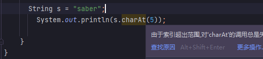
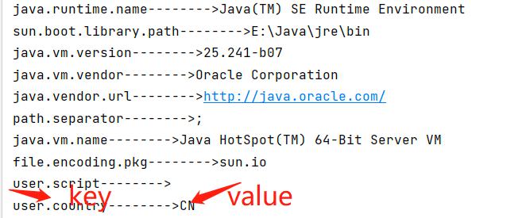

# String字符串 Random数字运算

## 目录

-   [Java API](#Java-API)
    -   [String](#String)
    -   [StringBuffer 增删改查](#StringBuffer-增删改查)
    -   [String Buider](#String-Buider)
    -   [System类 静态方法](#System类-静态方法)
        -   [arraycopy() 复制数组](#arraycopy-复制数组)
        -   [currentTimeMillis() 消耗时间](#currentTimeMillis-消耗时间)
        -   [getProperties( )和getProperty( ) 系统属性](#getProperties-和getProperty--系统属性)
        -   [gc方法 垃圾回收](#gc方法-垃圾回收)
-   [ Runtime类 Java虚拟机运行](#-Runtime类-Java虚拟机运行)
-   [Math类数学运算](#Math类数学运算)
-   [Random类 数学运算 随机数字](#Random类-数学运算-随机数字)
    -   [Random ](#Random-)
    -   [Random ( long seed )](#Random--long-seed-)
    -   [Random类常用方法](#Random类常用方法)

## Java API

#### String

在使用String类进行字符串操作之前需要对String类进行初始化,在Java中可以通过以下两种方式对String类进行初始化

(1)  使用字符串常量 直接初始化一个String对象,具体代码如下  这是比较简化的写法

`String a = "abd";`

(2)  使用String类的构造方法初始化字符串对象,String类常见的构造方法如下

调用不同的构造方法便可以完整对String类的初始化

| **方法声明**                | **功能描述**      |
| ----------------------- | ------------- |
| String()                | 创建一个内容为空的字符串  |
| String(String Value)    | 根据指定的字符串创建内容  |
| String(char\[] Value)   | 根据指定的字符数组创建对象 |
| String (byte\[]  bytes) | 根据指定的字节数组创建对象 |

**字符是单个字符 如 “a” “b”,字符串是一段完整的,类似于单词 “abc”**

```java
public class a {
    public static void main(String[] args) {
        // 创建一个空的字符串
        String  str1 = new String();
        // 创建一个内容为abcd的字符串
        String str2 = new String("普通字符串");
        // 创建一个内容为字符数组的字符串
          char[] charArray = new char[]{'D','E','F'};
        String str3 = new String(charArray); // 将字符数组赋值刚给str3字符串

        //创建一个内容为字节s数组的字符串
        byte[] arr = {97,98,99} ; //字节其实就是阿丝个马值
        String str4 = new String(arr);  // 将arr字节数组赋值给str4字符串
        System.out.println("a"+str1+"b"); 
        System.out.println(str2); // 普通字符串
        System.out.println(str3); // 打印字节
        System.out.println(str4); // 打印ASCILL
    }
}

--------------------------------------------------

输出:
ab
普通字符串
DEF
ABC

```

**字符串获取功能**

Java中需要对字符串进行一些获取操作,如获得字符串的长度,获得指定位置的字符串String为操作提供了方法

**index以 0为索引计算,所以要看清楚不要混淆,计算位置的都是从0开始计算**

```java
public class a {
    public static void main(String[] args) {
       String  s = "saber10290";
       //  获取字符串长度 及字符的个数
            System.out.println("字符串的长度是"+s.length());;
            System.out.println("字符串第一个字符是"+s.charAt(0)); //从0开始
            System.out.println("字符b第一次出现的位置"+s.indexOf("b")); //index以 0为索引计算
            System.out.println("字符0最后一次出现的位置"+s.lastIndexOf("0"));
            System.out.println("字符串ab第一次出现位置"+s.indexOf("ab"));
    }
}

----------------------------------------

输出:

字符串的长度是10
字符串第一个字符是s
字符b第一次出现的位置2
字符0最后一次出现的位置9 
字符串ab第一次出现位置1

```

| s.length()       | 获取长度                    |
| ---------------- | ----------------------- |
| s.charAt(0)      | 获取指定索引开始的字符,第一个字符从0开始   |
| s.indexOf("b")   | 获取指定字符的索引,B第一次出现的位置返回索引 |
| lastIndexOf("0") | 指定字符最后一次出现的位置返回索引       |

**字符串转换操作**

程序开发经常需要给字符串进行转换操作,将字符串转换成数组形式,将字符串中的字符进行大小写转换

```java
import java.util.Locale;

public class a {
    public static void main(String[] args) {
   String  s = "saber10290";
   System.out.println("将字符串转换为字符数组后的结果");
   char[] charrs = s.toCharArray(); // 字符串转换为字符数组也就是一个一个  转换后下面再for
        for (int i = 0; i<charrs.length;i++){
            if (i != charrs.length -1 ){
                // 因为i没有到底 所以还没有结束就在元素后面加逗哈
                System.out.println(charrs[i]+",");
            }else {
                // 数组的最后就不加逗号
                System.out.println(charrs[i]);
            }
        }
        //把里面写入的 数字变成了字符串类型
        System.out.println("int值转换为String类型之后的结果"+String.valueOf(100));
        System.out.println("把字符串转换为大写字母"+s.toUpperCase());
        System.out.println("将字符串转换成小写字母+"+s.toLowerCase());
    }
}


----------------------------------------------------------

输出:

s,
a,
b,
e,
r,
1,
0,
2,
9,
0
int值转换为String类型之后的结果100
把字符串转换为大写字母SABER10290
将字符串转换成小写字母+saber10290

```

| char\[] charrs = s.toCharArray(); | 字符串转换为字符数组                   |
| --------------------------------- | ---------------------------- |
| s.toUpperCase()                   | 字符串转换为大写字母                   |
| s.toLowerCase()                   | 字符串转换为小写字母                   |
| lastIndexOf("0")                  | 指定字符最后一次出现的位置返回索引            |
| String.valueOf(100)               | int值转换为String类型,写入数字100变成字符串 |

value0f()方法有多种重载的形式，`oat、double、char` 等其他基本类型的数据都可以通过` valueOr( )`方法转换为字符串类型

**字符串替换和去除空格**

程序开发中用户输入数据经常出现会有一些错误和空格,这个时候可以使用String类的`replace()`和`trim()` 方法进行字符串的替换和去空格

```java
import java.util.Locale;

public class a {
    public static void main(String[] args) {
   String  s = "saber";
        // 字符串替换操作,使用变量保存接受,同上方一致
   String a = s.replace("er","one");
   System.out.println("将er替换成one的结果是:"+a);

   // 字符串去空格操作
        String S1 = "  oneo  day  ";
        System.out.println("去除字符串两端的空格:"+S1.trim());
        System.out.println("去除字符串所有的空格："+S1.replace(" ",""));
    }
}

-------------------------------------------

输出:

将er替换成one的结果是:sabone
去除字符串两端的空格:oneo  day
去除字符串所有的空格：oneoday


```

**注意:** **trim()只能去出两端的空格,但是replace是所有,因为它会匹配所有的空格去掉,其实效果是比trim好的**

| s.replace("er","one"); | 字符串替换操作                |
| ---------------------- | ---------------------- |
| S1.trim())             | 字符串去空格操作只能两端           |
| S1.replace(" ","")     | 去除字符串所有的空格也就是匹配到空格就替换为 |

**字符串判断操作**

操作字符时,经常需要对字符串进行一些判断,如判断字符串是否以指定的字符串开始,结束,是否包含指定字符串,是否为空等等

```java
import java.util.Locale;

public class a {
    public static void main(String[] args) {
   String  s = "saber";
   String s1 = "0dayhi";
   System.out.println("判断是否以字符串sa开头返回真或假"+s.startsWith("sa"));
   System.out.println("判断是否以字符串er结尾返回真或假"+s.endsWith("er"));
   System.out.println("判断字符串是否为空"+s.isEmpty());
   System.out.println("判断两个字符串字符串是否相等"+s.equals(s1));
    }
}


---------------------------------------

输出:

判断是否以字符串sa开头返回真或假true
判断是否以字符串er结尾返回真或假true
判断字符串是否为空false
判断两个字符串字符串是否相等false

```

| s.startsWith("sa") | 判断是否以字符串sa开头   |
| ------------------ | -------------- |
| s.endsWith("er")   | 判断是否以字符串er结尾返回 |
| s.isEmpty()        | 判断字符串是否为空      |
| s.equals(s1)       | 判断两个字符串字符串是否相等 |

**注意:**\*\* 在程序中可以用 == 和equals()  对字符串进行比较,但是两种方法有明显区别\*\*​

**equals() 用于比较两个字符串中的字符是否相等, == 比较两个字符串的地址是否相等,也就是是不是一个爹妈的,需要完成相等**

**只是表面相等是没有用的,两个内容完全相等是使用equals() 会返回真,使用 == 会返回假**

```java
import java.util.Locale;

public class a {
    public static void main(String[] args) {
   String  s = new String("saber");
   String s1 = new String("saber");
   // 返回假因为地址不同 不是同一个爹妈
   System.out.println(s==s1);
   // 返回真因为字符串内容一致
   System.out.println(s.equals(s1));
    }
}


------------------------------------------

输出:

false
true

```

**字符串截取和分割**

substring() 方法用于截取字符串的一部分,split() 方法用于将字符串按照某个字符进行分割,

```java
import java.util.Locale;

public class a {
    public static void main(String[] args) {
    String str = "石家庄-武汉-哈尔滨";
    //  字符串截取
        System.out.println("从第五个字符截取到末尾的结果"+str.substring(4));
        System.out.println("从第五个字符截取到第7个字符"+str.substring(4,6));

        //  字符串分割操作
        System.out.println("分割后的字符串数组中的元素依次为");
        String[] saber = str.split("-"); // 将字符串以 - 进行分割，将分割后的字符串保存在saber中,出现-就删除
        for (int i = 0;i<saber.length;i++){
            if (i != saber.length-1){
              // 遍历分割后的数组如果不是数组最后一个元素那么就加逗号
                System.out.println(saber[i]+",");
            }else {
                System.out.println(saber[i]);
            }
        }

    }
}

----------------------------------

输出:

从第五个字符截取到末尾的结果武汉-哈尔滨
从第五个字符截取到第7个字符武汉
分割后的字符串数组中的元素依次为
石家庄,
武汉,
哈尔滨

```

**注意：**

**String字符串在获取某个字符时会用到字符的索引，当访问字符串中的字符时，如果字符的索引不存在，则会发生StringIndexOutOfBoundsException（字符串角标越界异常,索引是按0开始**



```java
String s = "saber";
System.out.printin(s.charAt(5));

```

#### StringBuffer 增删改查

> 由于字符串是常量，因此一旦创建，其内容和长度是不可改变的。如果需要对一个字符串进行修改，则只能创建新的字符串。为了对字符串进行修改，Jv 提供了一个 SingBuer 类(也称字符事缓冲区

StringBuffer 类和Sting类的最大区别在于它的内容和长度都可以改变的。**StingBufer 类似一个字符容器**

当在其中添加或删除字符时并不会产生新的 StringBulfer 对象也就是在原有基础上添加

```java
import java.util.Locale;

public class a {
    public static void main(String[] args) {
        System.out.println("1.添加...............");
        add();
        System.out.println("1.删除...............");
        remove();
        System.out.println("1.修改...............");
        alter();

    }
    public  static  void add(){
        StringBuffer sb = new StringBuffer(); //创建一个字符串缓冲区 空的类似于JS变量
        sb.append("saber1029"); // 向空的字符串里面添加字符串
        System.out.println("添加之后的值是:"+sb);
        sb.insert(2,"xiao");  // 指定位置插入字符从索引2,从0开始到了第三个b,在b的位置挤掉b插入xiao
        System.out.println("插入的结果"+sb);
    }
    public static void  remove(){
        StringBuffer sa = new StringBuffer("one0day");
        sa.delete(1,5); // 指定范围 1-5 其实是删除4个因为到5的话就不会删除了  n是索引1 a是索引5到5截至
        System.out.println("删除后的结果是"+sa);
        sa.deleteCharAt(2); // 指定位置删除字符
        System.out.println("指定位置后删除的结果是"+sa); //删除索引为2的字符也就是第三,只删除一个
        sa.delete(0,sa.length()); // 清空缓冲区
        System.out.println("清除缓冲区结果是"+sa);  // 全部删除
    }
    public static void alter(){
        StringBuffer  ab = new StringBuffer("ABCDEFG");
        ab.setCharAt(1, 'p'); // 修改指定位置的字符 是单个字符不是字符串所以要char类型,不是字符串
        System.out.println("修改指定位置的字符后输出"+ab);
        // 字符只能单引号并且单个
        ab.replace(1,3,"WWww");// 替换指定位置字符串或字符
        System.out.println("替换指定位置的结果"+ab);
        System.out.println("字符串反转全部颠倒"+ab);
    }

}


---------------------------------------

输出:

1.添加...............
添加之后的值是:saber1029
插入的结果saxiaober1029
1.删除...............
删除后的结果是oay
指定位置后删除的结果是oa
清除缓冲区结果是
1.修改...............
修改指定位置的字符后输出ApCDEFG
替换指定位置的结果AWWwwDEFG
字符串反转全部颠倒AWWwwDEFG

```

#### String Buider

> String Buider是JDK5中新加的类,它和String Buffer最大是区别是在于
> Buider是非线程安全的 ; 也就是说String Buffer不能被同步访问而String Buider以

### System类 静态方法

> System类 它定义了一些属性和方法并且都是静态的,使用这些方法直接通过 System() 调用即可

#### **arraycopy()** 复制数组

用于将数组从 源数组复制到目标数组

```java
Static void arraycopy (Object src,int srcPos,Object destint destPos.int length)


src:表示源数组。
dest:表示目标数组

srcPos :表示源数组中复制原始的起始位置
destPos:表示复制到目标数组的起始位置


length: 表示复制元素的个数
```

**注意:**&#x20;

在进行数组复制时.目标数组必须有足够的空间来,存放复制的元素,否则会发生角标越界异常

```java
 int[]  fa = {1,2,3,4,5,6}; // 源数组
 int[]  taa = {10,11,12,13,14,15}; // 目标数组
 // 复制数组元素,fa的第2个下标也就是3开始复制,复制从ta的第1个小标也就是11,往后添加4个
 // 10,3,4,5,6,15 目标数组还存在一个位置那么就自动
 System.arraycopy(fa,2,taa,1,4);
 // 打印复制后的数组元素
 System.out.println("复制后的数组元素的:");
 for (int i=0;i<taa.length;i++){
        System.out.println(i+":"+taa[i]);
 }
 

-------------------------------------------------

输出:

复制后的数组元素的:
0:10
1:3
2:4
3:5
4:6
5:15

```

#### currentTimeMillis() 消耗时间

方法用于获取当前的时间,返回的类型也是long类型的值,该值表示当前时间与1970年1日1日0点分之间的时间差,单位是毫秒, 这个差值也被称为**时间戳**  下列计算 for 循环求和所消耗的时间的案例进行说明

**两个时间戳之间的差值便是求和操作所耗费的时间**

```java
public class min {
    public static void main(String[] args) {
     long s = System.currentTimeMillis(); // 开始时的时间
     int sum = 0;
     for(int i=0;i<1000000000;i++){
      sum+=i;
     }
     long a = System.currentTimeMillis(); // 循环结束后的的时间
        System.out.println("程序运行的时间为"+(a-s)+"毫秒");
    }
}

--------------------------------------

输出:

程序运行的时间为430毫秒


```

#### getProperties( )和getProperty( ) 系统属性

System 类的 getPropeties ()方法用于获取当前系统的全部属性，该方法会返回一个 **Propeties**()对象,其中封装了系统的所有属性，这些属性是以键值对形式存在的。**getProperty**()方法用于根据系统的属性名获取对应属性值

```java
 Properties properties = System.getProperties();
        // 获得系统属性的key, 返回Enumeration对象
        Enumeration propertyNames = properties.propertyNames();
        while (propertyNames.hasMoreElements()){
            // 获取系统属性的key
            String key = (String) propertyNames.nextElement();
            // 获取当前key对应的 value值
            String value = System.getProperty(key);
            System.out.println(key+"-------->"+value);
         }
 
 ---------------------------------------------------
 
 注解: 
 
第5行代码通过 System 的 getProperties ()方法获取了系统的所有属性;
第7行代码通过Properties的propertyNames()方法获取所有的系统属性的 key，
并使用名称为 propertyNames 的 Enumeration对象接收获取到的key值;第8~14行代码对 Enumeration 对象进行选代循环，
通过 Enumeration 的nextElement()方法获取系统属性的 key，
再通过 System 的 getPropety (key)方法获取当前 key对应的 vaue，最后将所有系统
属性的键以及对应的值打印出来。从图5-12 的运行结果可以看出，
这些系统属性包括虚拟机版本、用户所在国家、操作系统架构和版本等。
读者只需知道通过 System.getProperties ( )方法
可以得系统属性和通过 SystemgetProperty ( )方法可以根据系统属性名获得系统属性值即可。        
```



#### gc方法 垃圾回收

当一个对象成为垃圾后仍会占用内存空间,时间一长,就会导致内存空间不足,为了避免这种情况,Java引入了**垃圾回收机制** 有了这种机制

程序员就不用过多关心垃圾对象回收问题 **java虚拟机会自动回收垃圾对象所占用的内存空间**

当垃圾堆积到了一定的程度后,Java虚拟机就会启动垃圾回收机制,将垃圾对象从内存中释放,

我们除了等待Java自动的去回收垃圾外,还可以调用`System.gc()`方法通知Java立即进行垃圾回收, 当一个对象在内存中被释放时

它的`finalize()`方法会自动调用,因此可以在类中通过定义finalize()方法观察对象何时被释放

```java
class just{
    // 定义的finalize() 方法会在垃圾回收前被调用
    public void  finalize(){
        System.out.println("对象将作为垃圾进行回收");
    }
}
public class a {
    public static void main(String[] args) {
     // 下面创建两个垃圾对象
    just j1 = new just();
    just j2 = new just();
    // 将对象设置为null变成垃圾

    j1 = null;
    j2 = null;
    // 调用方法进行垃圾回收 主动的
    System.gc();
    for (int i= 0;i<100000;i++){
        // 为了延长执行的时间
    }

    }
}

----------------------------------------------------------

虚拟机针对两个垃圾对象进行了回收，并在回收之前分别调用两个对象的finalize()

输出:

对象将作为垃圾进行回收
对象将作为垃圾进行回收

```

## &#x20;Runtime类 Java虚拟机运行

## Math类数学运算

Math类提供了大量的静态方法以便人们实现数学计算,如绝对值,取最大值或最小值等, Math类的常用方法如

double知识传入的数字类型,Math只对数字有效,所以里面的肯定也是double,这个数据类型不需要写入

| **abs**  (double a）             | 用于计算a的绝对值                                                    |
| ------------------------------- | ------------------------------------------------------------ |
| **sqrt**  (double a)            | 用于计算a的方根                                                     |
| \*\*ceil \*\* (double a)        | 用于计算大于等于a的最小整数，并将该整数转化为 double 型数据                           |
| \*\*floor \*\*(double a)        | 用于计算小于等于a的最大整数，并将该整数转化为 double 型数据                           |
| \*\*round \*\*(double a)        | 用于计算小数a进行四舍五入后的值                                             |
| **max** (double a,double b)     | 用于返回a和b的较大值                                                  |
| \*\*min \*\*(double a,double b) | 用于返回a和b的较小值                                                  |
| **random**()                    | 用于生成一个大于0.0小于1.0的随机值(包括0不包括1) \*\* 只有这个是无需传入参数值是确定的  0-1\*\* |
| **pow** (double a,double b)     | 用于计算a的b次幂，即a”的值                                              |

细心认清传入的值和输出值的类型是什么,有的是整数有的输出小数

```java
public class a {
    public static void main(String[] args) {

        System.out.println("计算-10的绝对值"+Math.abs(-10));
        System.out.println("求大于5.6的最小整数"+Math.ceil(5.6));
        System.out.println("求小于-4.2的最大整数"+Math.floor(-4.2));
        System.out.println("对-4.6进行四舍五入"+Math.round(-4.6));
        System.out.println("求2.1和-2.1中的较大值"+Math.max(2.1,-2.1));
        System.out.println("求2.1和-2.1中的较小值"+Math.min(2.1,-2.1));
        System.out.println("生成一个大于等于0.0小于1.0的随机数"+Math.random()); // 随机数范围已经是确定了的,只能随机0-1之间的小数
        System.out.println("计算4的开平方的结果"+Math.sqrt(4));
        System.out.println("计算指数函数2的3次方的值"+Math.pow(2,3)); // 第一个参数是数字,第二个参数是次方
    }
}

-----------------------------------------------------------------------


输出: 

计算-10的绝对值10
求大于5.6的最小整数6.0  
求小于-4.2的最大整数-5.0
对-4.6进行四舍五入-5
求2.1和-2.1中的较大值2.1
求2.1和-2.1中的较小值-2.1
生成一个大于等于0.0小于1.0的随机数0.34816225946819146
计算4的开平方的结果2.0
计算指数函数2的3次方的值8.0

```

## Random类 数学运算 随机数字

| Random ( )           | 构造方法，用于创建一个伪随机数生成器               | **固定的一组使用**   |
| -------------------- | -------------------------------- | ------------- |
| Random ( long seed ) | 构造方法，使用一个long型的seed(种子)创建伪随机数生成器 | **多个相同的一组使用** |

**seed为种子,那么几个种子就会生成几组相同的数字**

第一个构造方法是无参的，通过它创建的Random对象每次使用的种子是随机的，因此每个对象所产生的随机数不同。

如果希望创建的多个相同的随机数，则可以在创建对象时调用第二个构造方法，传入相同的参数  产生相同的随机数

#### \*\*Random \*\*

创建`Random`的实例对象时，没有指定种子，系统会以当前时间截作为种子来产生随机数

```java
import java.util.Random;

public class a {
    public static void main(String[] args) {
        Random r = new Random(); // 普通随机 不传入种子
        // for 10次 产生 10个在 0-100 范围之内的数字
        for (int i = 0; i < 10; i++){
            System.out.println(r.nextInt(100));
        }
    }
}


--------------------------------------------------


输出:

7
2
2
54
19
53
48
30
5
42

```

#### **Random ( long seed )**

创建 Random 类的实例对象时，如果指定了相同的种子则每个实例对象产生的随机数具有相同的序列。

```java
import java.util.Random;

public class a {
    public static void main(String[] args) {
        Random r = new Random(5); // 普通随机 不传入种子
        // for 10次 产生 10个在 0-100 范围之内的数字
        for (int i = 0; i < 10; i++){
            System.out.println(r.nextInt(100));
        }
    }
}


---------------------------------------------------------
输出:

87
92
74
24
6
5
54
91
22
21


```

#### Random类常用方法

相对于 Math 的random()方法而言Bandom 类**提供了更的方法来生成各种伪随机数，不仅可以生成整数突型的随机数，而且可以生成浮点类型的随机数**，表5-8中列举了 Random类的常用方法

| nextDouble ( ) | 生成double类型的随机数  | 返回 0.0 -1.0范围 |
| -------------- | --------------- | ------------- |
| nexFloat()     | 生成float类型的随机数   | 返回 0.0 -1.0范围 |
| nexInt()       | 生成int类型的随机数     | 产生随机数         |
| nexInt(int n)  | 生成0-n int类型的随机数 | 指定范围同上文一样的API |

```java
import java.util.Random;

public class a {
    public static void main(String[] args) {
        Random r = new Random();
        System.out.println("产生double类型随机数字"+r.nextDouble());
        System.out.println("产生float类型随机数字"+r.nextFloat());
        System.out.println("产生int类型随机数字"+r.nextInt());
        System.out.println("产生int类型指定范围随机数字"+r.nextInt(100)); // 同上文一致只是说有种子
    }
}

-------------------------------------------

输出:

产生double类型随机数字0.9977276395453575
产生float类型随机数字0.16202897
产生int类型随机数字1034089341
产生int类型指定范围随机数字80


```
