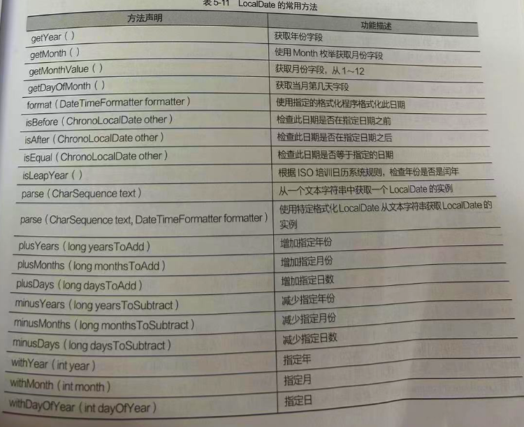
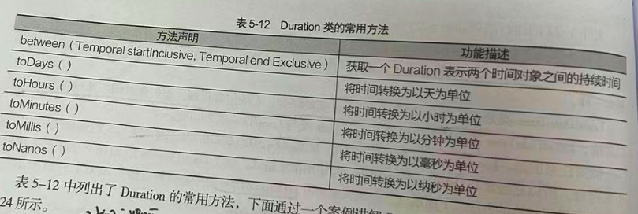

# 日期时间类 包装类&#x20;

## 目录

-   [日期时间类](#日期时间类)
    -   [instant 时间](#instant-时间)
    -   [LocalDate 年月日](#LocalDate-年月日)
    -   [LocalTime 时分秒](#LocalTime-时分秒)
    -   [LocalDateTime  综合日期](#LocalDateTime--综合日期)
    -   [Duration 时间间隔时分秒](#Duration-时间间隔时分秒)
    -   [Period 时间间隔 年月日](#Period-时间间隔-年月日)
-   [包装类](#包装类)

# 日期时间类

Java提供了一套专门用于处理日期时间的API ,日期时间类  包括 `LocalDate 类、LocalTime 类、Instant 类、Duration 类和 Period 类`  这些类都包含在java.time中

| 类的名称          | 功能描述             |
| ------------- | ---------------- |
| instant       | 表示时刻 代表的是时间戳     |
| LocalDate     | 不包含具体时间的日期       |
| LocalTime     | 不包含日期的时间         |
| LocalDateTime | 包含了日期和时间         |
| Duration      | 基于两个时间的值测量间隔 时分秒 |
| Period        | 计算时间的差异只能精确到年月日  |

#### instant 时间

instant类代表的是某个时间 ，其内部由两个Long字段组成, 第一部分保存的是标准的Java计算时间(1970年1月1日开始) 到现在的秒数第二部分保存的是

纳秒数

**常用方法**

| now                                  | 从系统时钟获取当前时刻                                     |
| ------------------------------------ | ----------------------------------------------- |
| now(Clock clock)                     | 从指定时间获取当前时间 (自己传入)                              |
| ofEpochSecond ( long epochSecond)  秒 | 从自标准Java计算时代开始的**秒数**获得一个Instant的实例             |
| ofEpochMili ( long epochMilli）  毫秒   | 从自标准Java计算时代开始的**毫秒**数获得一个instant的实例            |
| getEpochSecond ( ) 秒                 | 从1970-01-01T00:00:00Z 的标准Java计算时代获取秒数           |
| getNano ( ) 纳秒                       | 从第二秒开始表示的时间线中返回纳秒数                              |
| parse( CharSequence text )           | 从一个文本字符串(如2007-12-03T10:15:30.00Z)获取一个instant实例 |
| from ( TemporalAccessor tenporal )   | 从时间对象获取一个nstant的实例                              |

```java
import java.time.Instant;
import java.util.Locale;

public class A {
    public static void main(String[] args) {
        // Instant 时间戳类从 1970-01-01 00:00:00 截至到当前时间的毫秒值
        Instant now = Instant.now();
        System.out.println("从系统中获取当前的时刻为"+now);

        Instant instant = Instant.ofEpochMilli(1000*60*60*24); // Milli 毫秒
        System.out.println("计算机元年后增加毫秒数后为"+instant);

        Instant instant1 = Instant.ofEpochSecond(60*60*24); // Second 秒、
        System.out.println("计算机元年后增加秒数为"+instant1);

        System.out.println("获取的秒值为"+Instant.parse("2007-12-03T10:15:30.44z").getEpochSecond()); // 秒
        System.out.println("获取的纳秒值为"+Instant.parse("2007-12-03T10:15:30.44z").getNano()); // 纳秒


        System.out.println("从时间对象获取的Instant实例为:"+Instant.from(now));

    }
}


----------------------------------------------------
从系统中获取当前的时刻为2023-05-22T06:16:00.535Z
计算机元年后增加毫秒数后为1970-01-02T00:00:00Z
计算机元年后增加秒数为1970-01-02T00:00:00Z
获取的秒值为1196676930
获取的纳秒值为440000000
从时间对象获取的Instant实例为:2023-05-22T06:16:00.535Z


 注意: 

now()方法默认获取的是西六区时间; pre()是从文本字符串获取Instant实例


```

#### LocalDate 年月日

该类用来表示年月日,通常表示的是年份和月份,该类不能代表线上即时信息,只是日期的描述,它提供了两个获取日期的方法 `now()`  `of()`

```java
从一年一个月一天获得一个LocalDate的实例  自己需要传入时间
LocalDate date = LocaLDate.of(2023,5,22);

从默认时区的系统闹钟获取当前时间  效果同Instant类一致 
LocalDate now1 = LocaLDate.now();

```

**常用方法**



LocalDate的获取及格式化的相关方法---------------&#x20;

```java
import java.time.LocalDate;
import java.time.format.DateTimeFormatter;
import java.util.Locale;

public class b {
    public static void main(String[] args) {
        // 获取日期和时间
        LocalDate now = LocalDate.now(); 
        LocalDate of =  LocalDate.of(2015,10,1); // 传入自己想要的时间参数 届时做对比
        System.out.println("从LocalDate实例获取的年份为"+now.getYear());  // 输出当前的年
        System.out.println("获取到的月份是"+now.getMonthValue());  // 当前月
        System.out.println("获取到的是本月的第几号"+now.getDayOfMonth()); // 当前日
        System.out.println("--------------------------------");
        System.out.println("将获取到的LocalDate实例格式为:"+now.format(DateTimeFormatter.ofPattern("yyy年MM月dd日")));
    }
}


--------------------------------------------------------

输出:
从LocalDate实例获取的年份为2023
获取到的月份是5
获取到的是本月的第几号22
--------------------------------
将获取到的LocalDate实例格式为:2023年05月22日

```

LocalDate判断相关方法---------------&#x20;

```java
import java.time.LocalDate;
import java.time.format.DateTimeFormatter;
import java.util.Locale;

public class b {
    public static void main(String[] args) {
        // 获取日期和时间
        LocalDate now = LocalDate.now();
        LocalDate of =  LocalDate.of(2015,10,1); // 传日自己想要的时间参数
        System.out.println("判断日期of是否在now之前:"+of.isBefore(now));
        System.out.println("判断日期of是否在now之后:"+of.isAfter(now));
        System.out.println("判断日期of是否相等:"+now.equals(of));
        System.out.println("判断日期of是否是闰年:"+of.isLeapYear());  // 直接把赋值日期的参数来过来使用就可以判断
    }
}


--------------------------------------------------------

输出: 

判断日期of是否在now之前:true
判断日期of是否在now之后:false
判断日期of是否在now之后:true
判断日期of是否是闰年:false

```

LocalDate解析以及加减操作的相关方法---------------&#x20;

```java
import java.time.LocalDate;
import java.time.format.DateTimeFormatter;
import java.util.Locale;

public class b {
    public static void main(String[] args) {
        // 获取日期和时间
        LocalDate now = LocalDate.now();
        LocalDate of =  LocalDate.of(2015,10,1); // 传日自己想要的时间参数
        String datestr = "2020-02-01";
        System.out.println("把日期字符串解析成日期对象后为"+LocalDate.parse(datestr));
        System.out.println("把当前日期年份加1"+now.plusYears(1)); // now为当前日期的对象
        System.out.println("把当前日期天数减10"+now.minusDays(10));
        System.out.println("把当前日期指定年份是2014"+now.withYear(2014)); // 修改当前日期now为2014
        
    }
}


----------------------------------------------------

输出:

把日期字符串解析成日期对象后为2020-02-01
把当前日期年份加12024-05-22
把当前日期天数减102023-05-12
把当前日期指定年份是20142014-05-22

```

#### LocalTime 时分秒

表示时分秒,与LocalDate类一样,该类不能代表时间线上的即时信息,只是时间的描述,

```java
import java.time.LocalTime;
import java.time.format.DateTimeFormatter;


public class b {
    public static void main(String[] args) {
      // 获取当前时间 包含毫秒
        LocalTime time = LocalTime.now(); // 当前时间做对比
        LocalTime of = LocalTime.of(9,23,23); // 传入时分秒
        System.out.println("将获取到的LocalTime获取到的小时为:"+time.getHour()); // 获取当前时间
        System.out.println("将获取到的LocalTime实例格式化为"+time.format(DateTimeFormatter.ofPattern("HH:mm:ss")));// 当前时间格式化

        System.out.println("-------------------------");
        System.out.println("判断时间是否在now之前:"+of.isBefore(time));
        System.out.println("将字符串解析为 时间对象后"+LocalTime.parse("12:15:30")); // 传入什么输出什么
        System.out.println("从LocalTime获取当前时间,不包含毫秒数"+time.withNano(0));
    }
}


----------------------------------

输出 :

将获取到的LocalTime获取到的小时为:17
将获取到的LocalTime实例格式化为17:46:32
-------------------------
判断时间是否在now之前:true
将字符串解析为 时间对象后12:15:30
从LocalTime获取当前时间,不包含毫秒数17:46:32


注意:

当使用 parse()方法解析字符时该字符串要符合默认的时、分、秒格式要求

```

#### LocalDateTime  综合日期

LocalDateTime 类是LocalDate 类与 LocalTime 类的综合，它既包含日期，也包含时间，LocalDateTime类中的方法包含了LocalDate类与LocalTime类的方法。

```java
import java.time.LocalDateTime;
import java.time.format.DateTimeFormatter;
public class b {
    public static void main(String[] args) {
      // 获取当前时间 年月日 时分秒
        LocalDateTime now = LocalDateTime.now(); // 当前时间做对比
        System.out.println("获取当前日期时间为"+now);
        // 只输出年月日
        System.out.println("将目标LocalDateTime转换为相应的LocalDate实例:"+now.toLocalDate());
        // 只输出时分秒
        System.out.println("将目标LocalDateTime转换为相应的LocalTime实例:"+now.toLocalTime());
        // 指定格式
        DateTimeFormatter of = DateTimeFormatter.ofPattern("yyy年mm月dd日hh时mm分ss秒");
        System.out.println("格式化后的日期时间为:"+now.format(of));
    }
}


--------------------------------------------------

输出:

获取当前日期时间为2023-05-22T17:56:17.213
将目标LocalDateTime转换为相应的LocalDate实例:2023-05-22
将目标LocalDateTime转换为相应的LocalTime实例:17:56:17.213
格式化后的日期时间为:2023年56月22日05时56分17秒

```

#### Duration 时间间隔时分秒



```java
import java.time.Duration;
import java.time.LocalTime;
public class b {
    public static void main(String[] args) {
        LocalTime start  = LocalTime.now();
        LocalTime end = LocalTime.of(20,13,20); //传入时间 20:13:20
        Duration   duration  = Duration.between(start,end);
        // 间隔的时间 时分秒
        System.out.println("时间间隔为"+duration.toNanos()); // 纳秒
        System.out.println("时间间隔为"+duration.toMillis()); // 毫秒
        System.out.println("时间间隔为"+duration.toHours()); // 小时
    }
}
```

#### Period 时间间隔 年月日

Period 主要用于计算两个日期的间隔，与 Duration 相同，也是通过 between 计算日期间隔 提供了 三个常用方法&#x20;

`getYears()` `getMonths()`  `getDays()`&#x20;

```java
import java.time.LocalDate;
import java.time.Period;

public class b {
    public static void main(String[] args) {
        LocalDate now = LocalDate.now();
        LocalDate bir = LocalDate.of(2023,3,20); // 传日年月日
        // 计算两个日期间隔
        Period between = Period.between(bir,now); // 传入两个时间参数做对比
        System.out.println("时间间隔为"+between.getYears()+"年"); //  间隔年
        System.out.println("时间间隔为"+between.getMonths()+"月"); //  间隔月
        System.out.println("时间间隔为"+between.getDays()+"日"); //  间隔日
    }
}

---------------------------------------------------------

输出:

时间间隔为0年
时间间隔为2月
时间间隔为2日

```

# 包装类

包装类可以把基本数据类型的值包装为引用数据类型的对象,类的名称就是数据类型

| 基本数据类型  | 对应包装类     |
| ------- | --------- |
| byte    | Byte      |
| char    | character |
| int     | integer   |
| short   | Short     |
| long    | Long      |
| float   | Float     |
| double  | Double    |
| boolean | Boolean   |

上面写出八种基本的数据类型以及对应的包装类,包装类和基本数据类型在进行转换的时候,引入了装箱和拆箱的概念,**装箱是指将基本数据类型的值**

**转换为引用数据类型 反之拆箱是将引用数据类型的对象(对应的包装类) 转换为基本数据类型**

Integer包装类

```java
public class b {
    public static void main(String[] args) {
          int a = 20;
          Integer   in = a; //自动装箱 基本数据类型转换为包装类
          System.out.println(in);
          int i = in ; // 自动拆箱 把引用数据类型包装类转换为常规的类型
          System.out.println(i);
    }
}


----------------------------------------

输出:

20
20


```

Integer特有的方法

| Integer  ValueOf (int i)    | 返回一个表示指定的int值的Integer实例  |
| --------------------------- | ------------------------ |
| Integer  ValueOf (String s) | 返回保存指定的String值的Integer对象 |
| int parseInt (Strinf s)     | 将字符串参数作为有符号的十进制整数解析      |
| intValue()                  | 将lnteger类型的值以int类型返回     |

```java
public class b {
    public static void main(String[] args) {
        Integer num = new Integer(20); //手动装箱
        int sum = num.intValue()+10; // 手动拆箱
        System.out.println("将Integer类型的值转换为int类型后的与10相加为"+sum);
        System.out.println("返回表示10的Integer的实例为"+Integer.valueOf(10));
        int w = Integer.parseInt("20")+32; // 以整数进行解析 所以加32 就是52了
        System.out.println("将字符串转换为整数是"+w);
    }
}

----------------------------------------------

输出:

将Integer类型的值转换为int类型后的与10相加为30
返回表示10的Integer的实例为10
将字符串转换为整数是52
```

**注意:**

（1） 包装类都重写了Object类中的toString()方法,以字符串的形式返回被包装的基本数据类型的值

&#x20; (2)   除了Character字符型包装类外,包装类都有valuerOf(String) 方法 可以根据Stirng类型的参数创建对象,但是参数不能 为别的,

一一对应什么类型的包装类里面就存放什么类型的数据

```java
public class b {
    public static void main(String[] args) {
     Integer i = Integer.valueOf("124"); // 可以
     Integer o = Integer.valueOf("12a"); // 不可以
    }
}
```

(3) 除了Character外,包装类都有`parsexxx(String s)` 的静态方法
