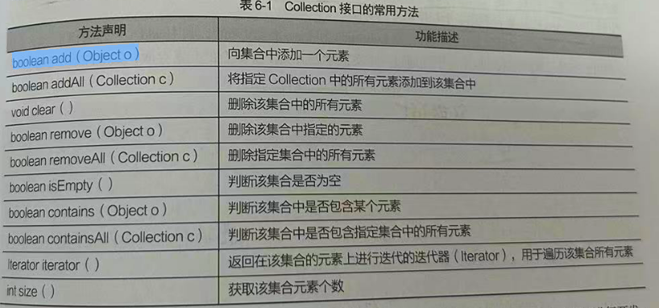
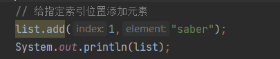
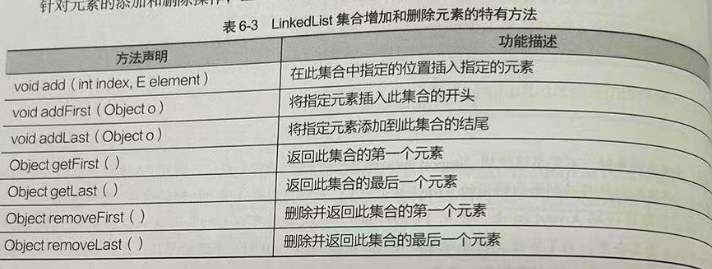
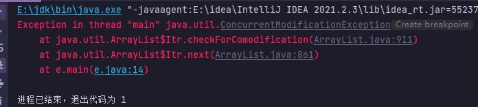

# Collection 单列集合 List Set &#x20;

## 目录

-   [集合概念](#集合概念)
-   [Collection 单列集合根接口](#Collection-单列集合根接口)
-   [List接口](#List接口)
    -   [ArrayList实现类 查询 有序可重复](#ArrayList实现类-查询-有序可重复)
    -   [LinkedList实现类  增删 有序可重复](#LinkedList实现类--增删-有序可重复)
-   [lterator接口 遍历迭代器](#lterator接口-遍历迭代器)
    -   [迭代判断删除](#迭代判断删除)
    -   [foreach 循环](#foreach-循环)
    -   [循环局限性](#循环局限性)
-   [Set接口](#Set接口)
    -   [HashSet  实现类无序无重复](#HashSet--实现类无序无重复)
    -   [HashSet 存储Class类](#HashSet-存储Class类)
    -   [LinkedHashSet实现类存取有序无重复](#LinkedHashSet实现类存取有序无重复)
    -   [TreeSet 实现类有序无重复](#TreeSet-实现类有序无重复)
        -   [TreeSet  存储Class类](#TreeSet--存储Class类)

## 集合概念

集合是一种特殊类 ,这些类可以存储任意类对象,并且长度可变, **这些集合类都位于java.util中,使用的话必须导包**

按照存储结构可以分为两大类   单列集合  `Collection`    双列集合 `Map`   两种 区别如下

-   `Collection`   :  单列集合类的根接口,用于存储一系列符合某种规则的元素,它有两个重要的的子接口,分      &#x20;

&#x20;                             为 `List Set`     &#x20;

&#x20;          `List`        ：接口 特点是元素有序可重复    它的实现类有  **ArrayList  LinkedList**

&#x20;           `Set`        ：接口 特点是元素无序且不可重复  它的实现类有 **HashSet  TreeSet**

-   &#x20;     ` Map`      ：双列集合类的根接口, 用于存储具有 键(Key) 值(Value) 隐射关系的元素,\*\*每个元素都包      \*\*

&#x20;                             **含一对键值** ,其中键值不可重复且每个键  最多只能映射到到一个值,在使用Map集合时  &#x20;

&#x20;                            可以通过指定的Key找到对应的Value,通一个人的学号找到学生的名字一样

&#x20;                           \*\*  没有爸爸接口,只要爷爷接口Mpa  实现类有 HashMap  TreeMap\*\*

# Collection 单列集合根接口

单列集合的父接口,它定义了单例集合(`List Set`) 通用的一些方法,这样方法可用于操作所有的单列集合 ,，在开发中，往往很少直接使用 Collcetion 接口进行开发基本上都是使用其子接口，子接口主要有 `List、Set、Queue和 SortedSeto`

**常用API**



# List接口

`List`接口继承父接口`Collection` 接口 ,是单列集合的一个重要分支,它允许出现重复的元素,所有元素都是以一种线性的方式存储的,通过索引访问List

集合中的指定元素,它的特点是有序\*\* 即元素 存入和取出的 顺序一致\*\*

`List`集合常用方法,上方父接口 `Collection`方法同样可以继承使用

&#x20;List 的所有实现类都可以通过调用这些方法操作集合元素

| 方法声明                                        | 功能描述                                          |
| ------------------------------------------- | --------------------------------------------- |
| void add ( int index, Object element )      | 将元素 element 插入在List 集合的index处                 |
| boolean addAll ( int index, Collection c )  | 将集合所包含的所有元素插入到List集合的index处                   |
| Object get ( int index )                    | 返回集合索引inde处的元素                                |
| Object remove ( int index )                 | 删除集合索引inde处的元素                                |
| Object set ( int index, Object element      | 将集合索引indx处 元素替换成element对象,并将替换后的元素返回          |
| int indexOf ( Object o )                    | 返回对象o在List集合中出现的位置索引                          |
| int lastlndexOf ( Object o )                | 返回对象o在List集合中最后一次出现的位置索引                      |
| List subList ( int fromlndex, int tolndex ) | 返回从索引 fromindex(包括) 到toindex(不包括) 处所有元素组成的子集合 |

#### ArrayList实现类 查询 有序可重复

`ArrayList`是`List` 接口的一个实现类,它是程序中一种常见的集合,在ArrayList内部封装了一个长度可变的数组对象,当存入的元素

超过数组长度时 ArrayList会在内存中分配一个更大的数组来存储这些元素,因此**可以将ArrayList集合看作一个长度灵活可变的数组**

它的大部分方法都是继承父类`Collection` 和`List`接口的 其中 add()方法 和 get()  分别实现元素的存入和取出

```java
import java.util.ArrayList;

public class h {
    public static void main(String[] args) {
        ArrayList List = new ArrayList(); // 创建 ArrayList集合 相当于实现了List接口
        List.add(3);
        List.add("你好");
        List.add("世界");
        // 获取集合中元素的个数  size()方法是 Collection的
        System.out.println("集合的长度:"+List.size());
        // 取出并打印指定位置的元素 通过索引查找和数组一样从 0开始
        // 访问元素索引最好不要超过范围,否则会出现角标越界异常
        System.out.println("第2个元素是:"+List.get(1));
    }
}


---------------------------------------------

输出:

集合的长度:3
第2个元素是:你好

```



**注意 :**&#x20;

由于Aaytist 集合的底层使用一个数组来保存元素，在增加或删除指定位置的元素时，会创建新的数组,效率很低 因此不适合大量的增加删除操作,

因为这种数组的结构允许程序通过索引的方式来访问问元素,所以 ArrayList集合查找元素很方法

#### LinkedList实现类  增删 有序可重复

LinkedList集合内部维护了一个双向循环表,链表中的每一个元素都使用了引用的方式来记住它的前一个元素或后一个元素,从而可以将所有的元素彼此连接起来,**LikedList 集合进行元素的增加删除操作时效率很高**,

**常用方法**



```java
import java.util.LinkedList;

public class g {
    public static void main(String[] args) {
        LinkedList link = new LinkedList(); // 创建了LinkeduList集合
        link.add(3);
        link.add("你好");
        link.add("世界");
        System.out.println(link.toString()); //取出并打印该集合的元素转换为字符串输出
        System.out.println(link);  // 同样取出元素直接输出对象
        // 上面两个的区别在于两个打印语句的结果是相同的，只是输出格式不同。
        link.add(3,"saber"); // 向该集合中指定位置插入元素
        link.addFirst("插入");     // 向该集合第一个位置插入元素
        System.out.println(link.getFirst()); // 取出该集合中的第一个元素 插入
        link.remove(2); // 删除该集合中指定位置的元素 按照数组索引来 所以是第三个 看清楚
        System.out.println("会输出"+link);
        link.removeFirst(); // 删除该集合中的第一个元素
        System.out.println(link);
    }
}


使用 LinkedList 对元素进行增加和删除操作是非常便捷的

----------------------------------------------

输出:

[3, 你好, 世界]
[3, 你好, 世界]
插入
会输出 [插入, 3, 世界, saber]
[3, 世界, saber]
```

# lterator接口 遍历迭代器

接口`Iterator` 接口也是集合中的一员, 但是它与 Collection Map 有所不同, Collection接口和Map 接口主要是用于存储元素 而

Iteratore 主要用于迭代访问(即遍历) `Collection `中的元素,因此 Iteratior对象也称迭代器

```java
代码含义:

hasNext()方法用于判断集合中是否还有下一个元素，如果有则返回true，否则返回false。如果返回true，
则可以使用next()方法取出下一个元素，并将其赋值给一个Object类型的变量obj。最后，使用System.out.println()方法将obj打印出来。
整个过程会一直重复，直到集合中的所有元素都被遍历完毕。因此，这段代码的作用是遍历ArrayList集合中的所有元素，并将它们打印出来。

 注意: 

通过next()方法获取元素时 必须保证获取元素的存在,否则会抛出 NoSuchElementException 异常  (无搜索元素异常)

---------------------------------------------

import java.util.ArrayList;
import java.util.Iterator;
public class f {
    public static void main(String[] args) {
        ArrayList list = new ArrayList();
        list.add("张三");  // 存入了集合就必须使用 Object类型接收
        list.add("李四");
        list.add("王五");
        list.add("赵六"); 
        // 每一个集合迭代前都是必须通过下面的代码来获取迭代器
        Iterator it = list.iterator(); // 获取迭代器对象
        while (it.hasNext()){  // 判断ArrayList集合 是否存在下一个元素
            Object obj = it.next(); // 取出ArrayList集合中的元素 赋值给新的对象 obj
            System.out.println(obj); // 依次打印出全部的时间
        }
    }
}


-----------------------------------------------

输出:

张三
李四
王五
赵六
```

#### 迭代判断删除

使用迭代器对集合中的元素进行迭代时, 如果调用了集合对象的 `remover()` 方法删除元素,那么继续使用迭代器会出现异常,下面通过案例来演示说明

```java
import java.util.Locale;

public class e {
    public static void main(String[] args) {
        ArrayList list = new ArrayList();
        list.add("张三");
        list.add("李四");
        list.add("王五");
        list.add("赵六");
        Iterator it = list.iterator(); // 获取迭代器对象
        while (it.hasNext()){  // 判断ArrayList集合 是否存在下一个元素
            Object obj = it.next(); // 取出ArrayList集合中的元素
            if ("张三".equals(obj))
            list.remove(obj); // 删除后就也就不再继续
        }
        System.out.println(list); // 删除的是没有张三的集合
    }
}

```

上述代码会报出错误,原因是迭代器在运行期间删除了元素,导致迭代次数发生了变化,迭代结果不准确,解决方案



(1)  找到对应的名称字符删除后就使用 breack语句跳出循环不再继续迭代,

```java
   while (it.hasNext()){  // 判断ArrayList集合 是否存在下一个元素
            Object obj = it.next(); // 取出ArrayList集合中的元素
            if ("张三".equals(obj))
            list.remove(obj); // 删除后就也就不再继续
            break;
```

(2) 使用迭代器本身的删除方法去进行删除,删除后所导致的迭代次数变化,对于迭代器本身是可预测的

```java
  while (it.hasNext()){  // 判断ArrayList集合 是否存在下一个元素
            Object obj = it.next(); // 取出ArrayList集合中的元素
            if ("张三".equals(obj))
            list.remove(); // 删除后就也就不再继续
        }
```

#### foreach 循环

`Iterator` 虽然可以遍历集合中的元素,但是写法比较繁琐,简化书写提供了 `foreach` 循环,也称 增强for 循环, 它可以遍历数组或集合中的元素

```java
语法格式:

for(容器中元素类型 临时变量: 容器变量){
  执行语句
}

和for循环相比foreach不再需要获得容器的长度,也不再需要根据索引访问,它会根据索引去访问容器的元素 
 并且自动遍历容器中的每个元素
```

```java
import java.util.ArrayList;
public class foreach {
    public static void main(String[] args) {
        ArrayList list = new ArrayList();
        list.add("张三");
        list.add("李四");
        list.add("王五");
        list.add("赵六");
     for (Object obj:list){// 循环遍历ArrayList
         System.out.println(obj); // 取出
     }
    }
}


--------------------------------

输出:

张三
李四
王五
赵六

```

#### 循环局限性

当使用foreach 循环遍历集合和数组时,只能访问集合中的元素，不能对其中的元素进行修改, 下面是一个`String` 类型的数组,演示 `foreach` 局限性

```java
public class foreach {
    static String[]  strrs = {"aaa","ddd","ccccc"};
    public static void main(String[] args) {
     // foteach 遍历数组
        for(String  str: strrs){
            str="ddd";
        }
        System.out.println("foreach循环修改后的数组"+strrs[0]+","+strrs[1]+","+strrs[2]);
        // for循环遍历数组
        for (int i= 0;i<strrs.length;i++){
            strrs[i]="ddd"; // 修改数据
        }
        System.out.println("循环修改后的数组"+strrs[0]+","+strrs[1]+","+strrs[2]);
     }
}


-----------------------------------

输出:

foreach循环修改后的数组aaa,ddd,ccccc
循环修改后的数组ddd,ddd,ddd

```

foreach循环`str=“ddd”` 只是将临时的变量指向一个新的字符串并不能修改元素,for循环则是可以通过索引的方式对数组中的元素进行修改的

# Set接口

Set接口和List接口一样,同样继承`Collection` 接口,方法和他基本一致, 功能上并没有扩充,反而更加严格,它的List接口不同在于, **Set接口元素无序且不重复**&#x20;

实现类

-   \*\*HashSet \*\*： 根据对象的散列值来确定元素在集合中存储的位置,具有良好的存取和查找功能
-   **TreeSet**  ： 以二叉树方式存储元素,它可以实现对元素的排序

#### \*\*HashSet \*\* 实现类无序无重复

存储元素不可重复 意味着没有相同的,并且元素无序

```java
import java.util.HashSet;
import java.util.Iterator;

public class foreach {
    static String[]  strrs = {"aaa","ddd","ccccc"};
    public static void main(String[] args) {
        HashSet set = new HashSet(); // 创建HashSet集合
        set.add("张三"); //  向集合中添加元素
        set.add("李四");
        set.add("王五");
        set.add("王五"); // 添加重复元素
        Iterator it = set.iterator(); // 获取迭代器接口
        while (it.hasNext()){ // while 判断集合是否有元素
            Object obj = it.next(); // 如果有元素则通过迭代器 next() 获取元素
            System.out.println(obj); // 打印获取到的元素
        }
     }
}


-----------------------------------------------


输出:

李四
张三
王五

```

**注意:**

取出元素和添加元素并不一致,并且重复添加的元素只出现了一次,它之所以可以确保不出现重复的元素,做了很多工作, add 添加元素时,首先调用存入对象的 `hashCode()`方法获得对象的散列值,然后根据元素的散列值计算出特有的存储位置 **, 散列值还是看数据类型是否相等的**, 只要数据类型相等,里面数字相等那么就是一样的,如果出现`String` 字符串的100 和 `int` 类型的 100 其实是不同的,因为数据类型不同,并且 `equals` **使用的前提也是相同数据类型比较字符串类型一致**,详见[String字符串 Random数字运算](<../String字符串 Random数字运算/String字符串 Random数字运算.md> "String字符串 Random数字运算")、

上面是不相同的情况,相同情况则是计算哈希后,进行`equals` 比较,如果比较存在,则是舍弃 没有则是加入

```java
import java.util.HashSet;
import java.util.Iterator;

public class foreach {
    static String[]  strrs = {"aaa","ddd","ccccc"};
    public static void main(String[] args) {
        HashSet set = new HashSet(); // 创建HashSet集合
        set.add("张三"); //  向集合中添加元素
        set.add("李四");
        set.add("王五");
        set.add("王五"); // 添加重复元素
        set.add("100");  // 两个类型不同
        set.add(100); // 两个类型不同
        Iterator it = set.iterator(); // 获取迭代器接口
        while (it.hasNext()){ // while 判断集合是否有元素
            Object obj = it.next(); // 如果有元素则通过迭代器 next() 获取元素
            System.out.println(obj); // 打印获取到的元素
        }
     }
}


------------------------------------

两个内容相同类型不同,散列值也是不同 会保存下来

输出:

李四
100
张三
100
王五


```

#### \*\*HashSet \*\*存储Class类

将字符串存入`HshSet`时 String类已经重写了`hashCode` 和 `equals` 方法,下面演示存储自定义的`Class`类 的结果

**未改写 hashCode和equals()方法**

```java

import java.util.HashSet;
class  Student{
    String id;
    String name;

    public Student(String id, String name) { // 创建构造方法
        this.id = id;
        this.name = name;
    }
    public String toString(){
        return  id+":"+name;
    }
}
public class foreach {
    static String[]  strrs = {"aaa","ddd","ccccc"};
    public static void main(String[] args) {
        HashSet set = new HashSet(); // 创建HashSet集合
        Student stu1 = new Student("1","杜甫");  // 创建对象传入参数到构造函数中
        Student stu2 = new Student("2","李白");
        Student stu3 = new Student("2","李白");
        set.add(stu1); // 将对象的值传入到集合中 也就是传入 class
        set.add(stu2);
        set.add(stu3);
        System.out.println(set);
     }
}


---------------------------------------------

输出:

[2:李白, 2:李白, 1:杜甫]


 注意: 

在Java中，当我们使用System.out.println()方法输出一个对象时，实际上会自动调用该对象的 toString ()方
法来获取其字符串表示形式。因此，在这段代码中，当我们使用System.out.println(set)输出HashSet对象时
实际上会自动调用每个Student对象的toString()方法来获取其字符串表示形式，并将它们拼接成一个字符串输
出。虽然你没有显式调用toString()方法，但它确实被隐式调用了。 所以上面代码我们没有调用实际上啊是自动
调用了

----------------------------------------------------------

运行结果出现了两个相同的李白2,本来应该被认为是重复元素,不允许输出的,为什么没有去掉是因为在定义
Class类时 没有重写hashCode和equals()方法


```

**已改写 hashCode和equals()方法**

```java
    import java.util.HashSet;
     class  Student{
     String id;
     String name;
     public Student(String id, String name) { // 创建构造方法
     this.id = id;
     this.name = name;
      }
    public String toString(){  // 重写toSring() 方法
      return  id+":"+name;
     }
     public int hashCode(){  // 重写了hashCode()
            return  id.hashCode();
        }
        // 重写 eqlals 方法
        public boolean equals(Object obj){
            if (this==obj){  // 判断是否是同一个对象
                return true; // 是的话就是真
            }
            if (!(obj instanceof  Student)){ // 判断对象是否是Student类型
                return  false;
            }
            Student  stu = (Student) obj; // 将对象强制转换为 Student 类型
            boolean b = this.id.equals(stu.id); // 判断id值是否相同
            return  b;
        }
    }
    public class foreach {
        static String[]  strrs = {"aaa","ddd","ccccc"};
        public static void main(String[] args) {
            HashSet set = new HashSet(); // 创建HashSet集合
            Student stu1 = new Student("1","杜甫");  // 创建对象传入参数到构造函数中
            Student stu2 = new Student("2","李白");
            Student stu3 = new Student("2","李白");
            set.add(stu1); // 将对象的值传入到集合中
            set.add(stu2);
            set.add(stu3);
            System.out.println(set);
         }
    }
    

----------------------------------------

输出:

[1:杜甫, 2:李白]


 注意: 

Student类重写了Object类的hashCode()返回 id 属性的散列值还有 equals  并且在 equals  方法比较对象
的id属性值是否相等并返回结果 HashSet 集合添加元素时,因为改写了 hashCode 方法所以 add 添加时
会进行比较发现散列值相同而且 stue.equsls(stu3)  返回true 集合认为两个参数相等因为重复的被去掉了
```

#### LinkedHashSet实现类存取有序无重复

`HashSet`集合存储的元素是无序的,如果想让元素存取顺序一致,那么就使用 `LinkedHashSet`&#x20;

它是`HashSet` 的子类,它和`LinkdList`一样 使用双向链表来维护内部元素关系

```java
import java.util.Iterator;
import java.util.LinkedHashSet;

public class foreach {
        public static void main(String[] args) {
            LinkedHashSet set = new LinkedHashSet();
            set.add("张三"); // 集合添加元素
            set.add("李四");
            set.add("王五");
            set.add("王五"); // 即使出现重复元素 也还是会显示一个
            Iterator it = set.iterator(); // 迭代器判断
            while (it.hasNext()){ // 循环判断是否有元素
                Object obj = it.next();
                System.out.println(obj);
            }
         }
    }

-------------------------------------------------

输出:

张三
李四
王五


```

### TreeSet 实现类有序无重复

为了对集合的元素进行排序,`Set` 接口提供了另一个可以对HashSet集合中元素排序的类——`TreeSet`

```java
import java.util.TreeSet;

public class foreach {
        public static void main(String[] args) {
            TreeSet set = new TreeSet();
            set.add(1);
            set.add(1);
            set.add(3);
            set.add(5);
            set.add(6);
            System.out.println(set);
         }
}


----------------------------------------------

输出:

[1, 3, 5, 6]

元素会自动排序并且没有存在重复

TreeSet 集合之所以可以对添加元素排序,是因为元素的类实现了 Comparable 接口 
(基本类型的包装类 String类都实现了该接口)  Comparable 强行对实现它的每个类的对象进行整体排序
 这种排序被称为自然排序Comparable接口的compareTo()方法被称为自然比较方法！
```

**什么是comparTo()方法**

-

<!---->

    Comparable接口是Java中的一个接口，用于实现对象之间的比较。其中，compareTo()方法是Comparable接口中的一个方法，用于比较当前对象与另一个对象的大小关系。

<!---->

    compareTo()方法的返回值为int类型，表示当前对象与另一个对象的大小关系。如果当前对象小于另一个对象，则返回负整数；如果当前对象等于另一个对象，则返回0；如果当前对象大于另一个对象，则返回正整数。

    compareTo()方法的作用是用于实现对象之间的排序。在Java中，如果一个类实现了Comparable接口，就可以使用Collections.sort()方法或Arrays.sort()方法对该类的对象进行排序。在排序过程中，会调用compareTo()方法来比较对象之间的大小关系，从而实现排序。

    需要注意的是，如果一个类实现了Comparable接口，就必须实现compareTo()方法，否则会编译错误。另外，compareTo()方法的实现应该满足一定的规则，例如具有传递性、反对称性等，否则可能会导致排序结果不正确

#### TreeSet  存储Class类

如果同`HashSet()`一样存储**Class**类，TreeSet集合不会去进行排序,Class类对象必须实现 `Comparable `

接口并重写 `compareTo`方法实现对象元素的顺序存取 **想对添加的元素进行排序就先重写**

```java
import java.util.TreeSet;

// 定义Student类   第一步实现了Comparable泛型; 
class Student implements Comparable<Student>{
    private String id;
    private String name;

    public Student(String id, String name) {
        this.id = id;
        this.name = name;
    }
    // 重写toString字符串方法
    public String toString(){
        return id+":"+name;
    }
    //   第二步重写 compareTo方法 
    //  三种compareTo方法的三种情况 
    public int compareTo(Student o){
         return 0 ;   // 集合中只有一个元素 还是第一个张三
        // return  1  // 集合怎么存怎么取的顺序
//        return -1;   // 集合按照存入的元素进行倒序
    }
}
public class foreach {
        public static void main(String[] args) {
            TreeSet set = new TreeSet();
            set.add(new Student("1","张三")); // 直接打印省去了 stu1 stu2 操作
            set.add(new Student("2","李白"));
            set.add(new Student("3","毒品"));
            System.out.println(set);
         }
}


---------------------------------------------

输出:

return 0  

[1:张三]

return 1 

[1:张三, 2:李白, 3:毒品]


return -1

[3:毒品, 2:李白, 1:张三]


```

除了自然排序还有另一种排序方法; 即实现`Comparator`接口 重写`compare()`方法 `equals()`方法&#x20;

但是由于所有的类默认继承Object 而Object 又存在 `equals()` 所以自定义比较器类时,不用重写`equals`方法,只需要重写`compare()` 方法这种排序称为**比较器排序**

通过自定义`Class`类对象 通过**比较器**存入`TreeSet`集合

```java
import java.util.Comparator;
import java.util.TreeSet;

class Student {
    private String id;
    private String name;

    public Student(String id, String name) {
        this.id = id;
        this.name = name;
    }
    // 重写toString字符串方法
    public String toString(){
        return id+":"+name;
    }
}
public class foreach {
        public static void main(String[] args) {
        // 声明了一个TreeSet集合并通过匿名内部类的方式实现了Comparator接口，
            TreeSet set = new TreeSet(new Comparator() {
                @Override
                
                // 然后重写了compare()方法并
                public int compare(Object o1, Object o2) {
                    return -1;
                }
            });
            set.add(new Student("1","张三")); // 直接打印省去了 stu1 stu2 操作
            set.add(new Student("2","李白"));
            set.add(new Student("3","毒品"));
            System.out.println(set);
         }
}


--------------------------------------------

输出:

[3:毒品, 2:李白, 1:张三]

```
