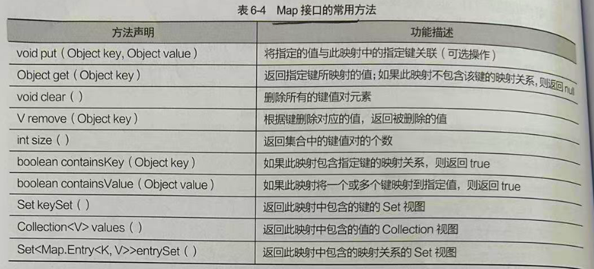

# Map 双列集合  HashMap TreeMap

## 目录

-   [Map双列集合根接口](#Map双列集合根接口)
    -   [HashMap实现类无重复键无序](#HashMap实现类无重复键无序)
        -   [遍历Key键获取对应的值](#遍历Key键获取对应的值)
        -   [遍历集合映射关系](#遍历集合映射关系)
        -   [Map操作集合常用方法](#Map操作集合常用方法)
    -   [LinkedHashMap无重复键存取顺序一致](#LinkedHashMap无重复键存取顺序一致)
    -   [TreeMap实现类无重复键有序](#TreeMap实现类无重复键有序)
        -   [比较排序法](#比较排序法)
    -   [Properties集合配置](#Properties集合配置)

# Map双列集合根接口

Map接口是一种双列集合,它的每一个元素都包含一个键对象`Key`和值`Value` 键和值直接存在一种对应关系 称为**映射** 从Map集中中访问元素, 只要指定了`Key` 就是找到对应的`Value`&#x20;

**常用方法**



## HashMap实现类无重复键无序

它是`Map` 接口的一个实现类,用于存储键值映射关系,并且`HashMap` 集合没有重复的键且键值无序

```java
import java.util.HashMap;

public class h {
    public static void main(String[] args) {
        HashMap map = new HashMap(); //创建Map对象
        map.put("1","张三"); // put方法 存储键和值
        map.put("2","李四");
        map.put("3","王五");
        map.put("3","赵六"); // 测试键是否具有唯一性 显示覆盖
        System.out.println("1:"+map.get("1")); // 根据键获取值
        System.out.println("2:"+map.get("2"));
        System.out.println("3:"+map.get("3"));
    }
}

--------------------------------

输出:

1:张三
2:李四
3:赵六


 注意:  

第9行代码,键位为3重复了,但是还是输出了它
这是因为键位具有唯一性不能出现2个3但是如果存储了两个相同的值,后存储的值会覆盖原有的值 

 键相同 值覆盖 


```

#### 遍历Key键获取对应的值

通过遍历`Map` 集合中所有的键位,也就是对应的数字`Key` ,不遍历值`Value` ,再根据`key` 迭代到值

```java
import java.util.HashMap;
import java.util.Iterator;
import java.util.Set;

public class h {
    public static void main(String[] args) {
        HashMap map = new HashMap(); //创建Map对象
        map.put("1","张三"); // put方法 存储键和值
        map.put("2","李四");
        map.put("3","王五");
        Set keySet = map.keySet();  //获取Key 123 键的方法 Set
        Iterator it = keySet.iterator(); // 遍历迭代键
        while (it.hasNext()) { // 判断是否下个元素 也就是自动++
            Object key = it.next(); // 依次拿到值
            Object value = map.get(key); // 根据key值获取到对应的Value
            System.out.println(key+":"+value); // 依次输出
        }
    }
}

首先调用Map对象的KeySet ()方法获得存储 Map 中所有键的Set 集合
然后通过 Iterator 选代Set 集合的每一个元素，即每一个键
最后通过调get(Stringkey)方法，根据键获取对应的值

-------------------------------------------

输出:

1:张三
2:李四
3:王五

```

#### 遍历集合映射关系

这是另一种遍历方式是先获取集合中的所有的映射关系,然后从映射关系中分别取出对应的键和值,然后分别输出即可

```java
import java.util.HashMap;
import java.util.Iterator;
import java.util.Map;
import java.util.Set;

public class h {
    public static void main(String[] args) {
        HashMap map = new HashMap(); //创建Map对象
        map.put("1","张三"); // put方法 存储键和值
        map.put("2","李四");
        map.put("3","王五");
        Set entrySet = map.entrySet(); // 获得映射集合
        Iterator it = entrySet.iterator(); // 获得遍历迭代器
        while (it.hasNext()){
            // 获得集合中键值对应的映射关系
            Map.Entry entry =  (Map.Entry)  (it.next());
            Object key = entry.getKey(); // 获得Entry 的键 123
            Object value = entry.getValue(); // 获得Enrty的值
            System.out.println("分别输出是"+key+":"+value);
        }
    }
}


-------------------------------------------

输出:

分别输出是1:张三
分别输出是2:李四
分别输出是3:王五


 注意: 

Map.entrySet()获取到了存储在map集合里面的所有映射的值, 这个集合存放了Map.Entry类型的
映射数据,(Entry是内部接口) 每个Map.Entry对象代表了一个键值在16行中. 然后通过遍历迭代
依次取出键和值输出 key  value


```

**区别:**

上面两个迭代器的区别显而易见,一个是通过`Key` 值来拿到值,这是需要一个`key` 就可以获取到,后者集合映射关系则是需要两个都获取到`key`和`value` 缺一不可

### Map操作集合常用方法

| 方法              | 描述                                       |
| --------------- | ---------------------------------------- |
| value()         | 获得Map实例中的所有`Value` 返回类型为Collection(单列集合) |
| size()          | 得到`Map`集合类的大小                            |
| containsKey()   | 判断是否包含传入的键 返回真或假                         |
| containsValue() | 判断是否包含传入的值 返沪真或假                         |
| remove()        | 根据对应的`Key`键删除对应的值                        |

```java
import java.util.*;

public class h {
    public static void main(String[] args) {
        HashMap map = new HashMap(); //创建Map对象
        map.put("1","张三"); // put方法 存储键和值
        map.put("2","李四");
        map.put("3","王五");
        map.put("4","赵六");
        System.out.println("集合的大小是"+map.size());
        // 判断集合有没有键值 2 还要值王五
        System.out.println("判断是否包含传入的键"+map.containsKey("2"));
        System.out.println("判断是否有传入的值"+map.containsValue("赵六"));
        System.out.println("删除键为1的值"+map.remove("1")); //删除键为1
   //通过map.values()方法单独获取到Map集合的Collection集合,然后迭代器输出每一个单独的value
   // 所以返回类型为Collection
        Collection values = map.values();
        Iterator it = values.iterator();
        while (it.hasNext()){
            Object value = it.next();
            System.out.println(value);
        }
    }
}


----------------------------------------------------

输出:

集合的大小是4
判断是否包含传入的键true
判断是否有传入的值true
删除键为1的值张三
李四
王五
赵六


```

## LinkedHashMap无重复键存取顺序一致

`HashMap` 集合迭代出来的元素是无序的,存入和取出不一致,如果需要一致那么需要使用这个方法 ,**它是HashMap的子类**,和单列集合的`LinkedList`一样 它也使用双向链表来维护内部元素的关系,使Map元素迭代的顺序和存入的顺序一致

```java
import java.util.*;

public class h {
    public static void main(String[] args) {
        LinkedHashMap map = new LinkedHashMap(); //创建Map对象
        map.put("2","张三"); // put方法 存储键和值
        map.put("1","李四");
        map.put("3","王五");
        map.put("4","赵六");
         map.put("4","ss");
        Set keySet = map.keySet();
        Iterator it  = keySet.iterator(); //
        while (it.hasNext()){
            Object key = it.next();
            Object value = map.get(key); // 获得每个键Key对应的值
            System.out.println(key+":"+value);
        }
    }
}


----------------------------------------------

存取顺序一致

输出:

2:张三
1:李四
3:王五
4:ss

```

## TreeMap实现类无重复键有序

Treemap是可以对集合中元素键值进行排序的类, 添加的元素自动排序 `1 2 3 4` 并且没有重复的键,只是后面添加的 `ss` 覆盖了键值`4` ,证实了`TreeMap` 中的键必须是唯一的,不能重复且有序,如果存储了相同的,后存储的值会覆盖原有的值

```java
import java.util.*;

public class h {
    public static void main(String[] args) {
        TreeMap map = new TreeMap(); //创建Map对象
        map.put("2","张三"); // put方法 存储键和值
        map.put("1","李四");
        map.put("3","王五");
        map.put("4","赵六");
        map.put("4","ss");
        Set keySet = map.keySet(); // 获取集合中所有的键集合
        Iterator it  = keySet.iterator(); //
        while (it.hasNext()){
            Object key = it.next();
            Object value = map.get(key); // 获得每个键Key对应的值
            System.out.println(key+":"+value);
        }};
}


-------------------------------------------------------

输出:

1:李四
2:张三
3:王五
4:ss

```

### 比较排序法

`TreeMap` 集合之所以对添加的元素的键值进行排序,其实通`TreeSet` 一样,它的排序也分自然排序和比较排序下面就来演示 .  其中 `String` 类是自定义的键

```java
import java.util.*;
class Student{
    private  String name;
    private  int age;

    public String getName() {  // 封装构造存取值get() set()
        return name;
    }

    public void setName(String name) {
        this.name = name;
    }

    public int getAge() {
        return age;
    }

    public void setAge(int age) {
        this.age = age;
    }
   // 构造函数
    public Student(String name, int age) {
        super();
        this.name = name;
        this.age = age;
    }
    @Override  //表示为覆盖,重写的方法 下面也是重写了toString
    //  此toString会自动输出 这个方法
    public String toString(){
       return  "Sttudent[name="+name+",age="+age+"]";
    }
}
public class h {
    public static void main(String[] args) {
        TreeMap map = new TreeMap(); //创建Map对象
        map.put("2","张三"); // put方法 存储键和值
        map.put("1","李四");
        map.put("3","王五");
        map.put("4","赵六");
        map.put("4","ss");
        Set keySet = map.keySet(); // 获取集合中所有的键集合
        Iterator it  = keySet.iterator(); //
        while (it.hasNext()){
            Object key = it.next();
            Object value = map.get(key); // 获得每个键Key对应的值
            System.out.println(key+":"+value);
        }
    }
}


----------------------------------

输出:

1:李四
2:张三
3:王五
4:ss

```

## Properties[^注释1]集合配置

**它主要用来存储字符串类型的键和值**，在实际开发中经常使用`Properties` 集合来存取应用的配置项,也就是模板,价格有这样的代码，背景颜色为`red` 字体大小为 `14px`  语言问`china` 其配置项应该这样存储

```java
Backrgroup-color = red
Font-szie = 14px
Language = chinese
```

使用`Properties` 集合来配置应为

针对`Properties` 类针对字符串有两个存取的方法, &#x20;

`setProperty`  将键和值添加到集合中

&#x20;`getProperty`  获取对应的值

`propertyNames`  得到一个包含所有键的`Enumeration`  ,然后利用迭代器遍历所有键的时候,再根据

`getProperty`  方法获得键所对应的值

```java
import java.util.Enumeration;
import java.util.Locale;
import java.util.Properties;

public class d {
    public static void main(String[] args) {
        Properties p = new Properties();
        p.setProperty("back","red");  // 使用set在集合中存入对应的键和值
        p.setProperty("size","14px");
        p.setProperty("语言","china");
        // 获取Enumeration对象所有键的枚举也就是所有的数据
        Enumeration names = p.propertyNames(); 
        while (names.hasMoreElements()){ // 循环遍历所有的键
            String key = (String) names.nextElement(); // 拿到key
            String value = p.getProperty(key); // 根据键拿到对应的值
            System.out.println(key+":"+value);
        }
    }
}


---------------------------------------------

输出:

back:red
语言:china
size:14px


```

[^注释1]: &#x20;Hashtable的子类
