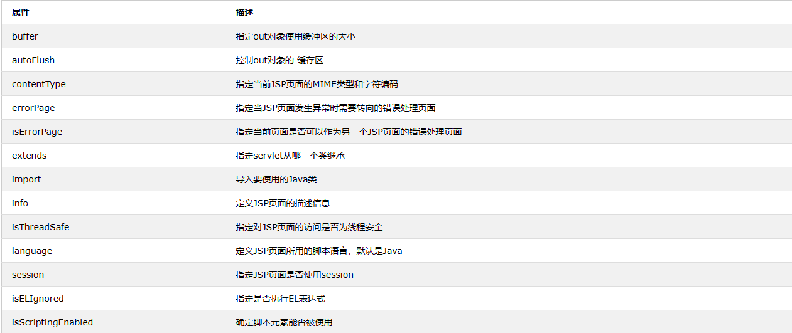
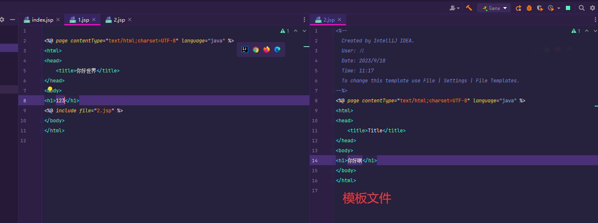
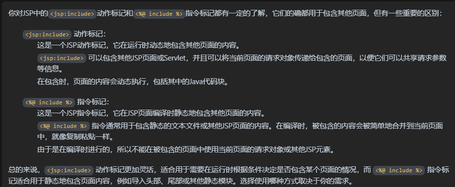
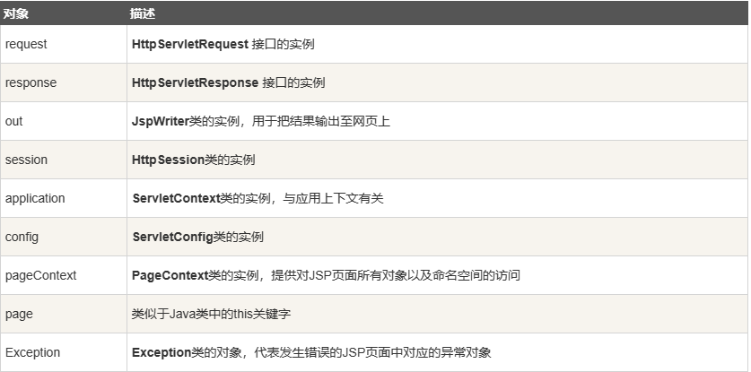
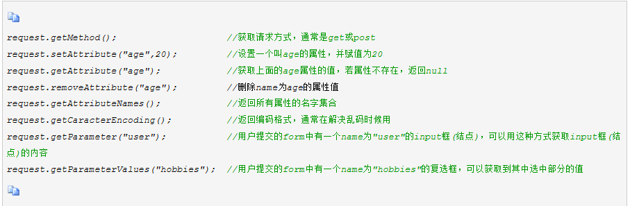
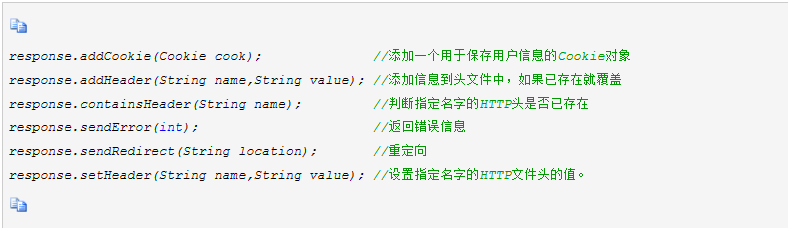
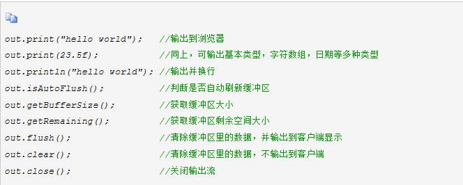
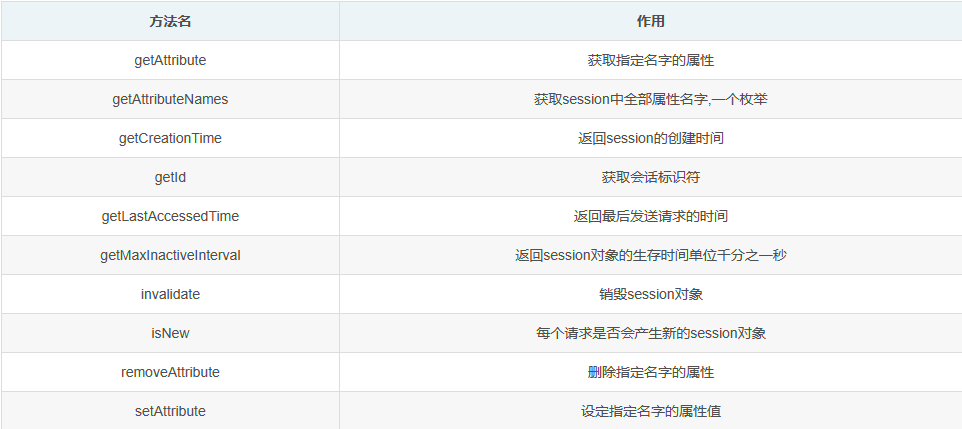
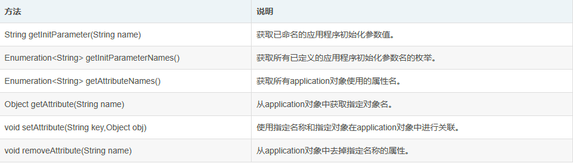

# JSP

## 目录

-   [语法基础](#语法基础)
    -   [表达式](#表达式)
-   [指令标记](#指令标记)
    -   [page页面指令](#page页面指令)
    -   [Include包含指令](#Include包含指令)
    -   [Taglib标签库指令](#Taglib标签库指令)
-   [动作标记](#动作标记)
    -   [\<jsp:include>包含](#jspinclude包含)
    -   [\<jsp:forward>跳转](#jspforward跳转)
-   [内置对象(隐式对象)](#内置对象隐式对象)
    -   [request接收前端数据](#request接收前端数据)
    -   [ response后端发送数据重定向](#-response后端发送数据重定向)
    -   [out打印数据](#out打印数据)
    -   [session存储](#session存储)
    -   [application 数据存储区](#application-数据存储区)

### 语法基础

JSP 与 HTML 的区别在于**能够在 HTML 中使用 Java 代码**。在 JSP 中，您可以使用 JSP 标签在 Java 中嵌入 Java 代码,**静态内容**可以使用基于文本的格式，如 HTML，XML 等，**动态内容**由 JSP 标签使用 HTML 内部的 Java 代码生成

***

JSP 代码 `<% xxxx  %>` 内只能放置 Java代码,不能出现其他 其余地方可以放置正常的`HTML`,并且可以形成内嵌, 脚本段可以互相访问 单个Java 代码段是不完整的

```java
<%!   >  // 声明全局变量 方法 类

<%  %>   // 脚本 普通java代码不能在此定义变量

<%=  %>  // 表达式输出 


```

`for` 循环可以保留一个 括号 然后再写前端代码 最后再放置另一个括号形成包裹

&#x20;

```java
<%@ page contentType="text/html;charset=UTF-8" language="java" %>
<html>
  <head>
    <title>$Title$</title>
  </head>
  <..GFFFF>
 <%! 
     //通常是在JSP页面中定义全局变量、方法或初始化代码块
    int i;  // 定义变量
  %>
  <%
    for (i=0;i<=10;i++)
    {       // for循环保留一个括号
  %>

  <h1>11</h1>  <!--在循环内的语句 -->

  <%
    }
  %>
  </body>
</html>


--------------------------------------------------

 输出: 

11
11
11
11....

```

JSP页面中可以声明合法的变量和方法,变量的类型只要是`Java` 存在的任何数据类型,这种声明是全局变量

```java
<%@ page contentType="text/html;charset=UTF-8" language="java" %>
<html>
<head>
    <title></title>
</head>
<%!  
    // 声明整形变量
    public int saber;
    // 声明方法
    public String info(){
        return  "word"  ; // 必须以分号结尾
    }
%>
<body>

<%  // 普通的Java代码

    // 定义的整形变量的值 +1 输出
    out.println(saber++);
%>

<br>  <!-- 正常的html代码写在外面-->

<%
    out.println(info()); // 输出方法
%>
<%= 
  saber // 表达式输出
 %>

</body>
</html>


--------------------------------------------------

 输出： 

0
word
```

#### 表达式

将程序数据输出到客户端,等价于 `out.print()` 运行后会自动转化为字符串，本质将JSP转化为Servlet

```java
<%= 表达式 %>
```

```java

<%@ page contentType="text/html;charset=UTF-8" language="java" %>
<html>
<head>
    <title></title>
  </head>
<%!
    int saber = 100;
%>

<%= saber%>
<%= "123 " + buff %> // 这种写法也是可以的
 <%= "345 " + au %>
 
 <p>变量saber的值是：${saber}</p>
 <h2>欢迎您，<%= request.getParameter("username") %></h2>
</body>
</html>

----------------------------------------------

 输出: 

100

123 + buff
345 + au
```

## 指令标记

指令是一种控制页面处理的特殊标记,通常在页面的开始处。JSP指令有三种主要类型

页面指令用于设置整个JSP页面的属性和配置。

包含指令用于将其他文件包含到JSP页面中，以便在页面生成时嵌入其他内容。

标签库指令用于导入自定义标签库，以便在JSP页面中使用自定义标签

```python
# 页面的指令部分，用来指定页面的一些属性和选项 指定内容类型为html 编码为utf-8
# language="java"：指定了在这个JSP页面中使用的编程语言是Java。
# JSP支持多种编程语言但通常使用Java

<%@ page contentType="text/html;charset=UTF-8" language="java" %>
<html>
<head>
    <title>你好世界</title>
</head>
<body>
<%out.print("heelo");%>  # 值输出到页面中
</body>
</html>


----------------------------------------------

 输出: 

hello
```

#### `page`页面指令

指令控制整个JSP页面的处理,它向服务器提供有关页面处理的指示`JSP` 存在3种指令类型,

`page` 指令    `include`指令   `include`指令 ,`page`指令存在属性配合指令一起使用

**语法**

```python
 <%@  指令  name [attribute name=“value” attribute name=“value” ........]%>
```

-   `import` 导包属性,进行编码时需要导入多个包,此指令非常实用,它允许在逗号之间的位置提供多个包,或者，您可以拥有多个页面元素实例，每个实例都包含不同的包。

```java
<%@page import="包名"%>

 <%@page import="java.io.*%> // 文件输入输出类
 <%@page import="java.lang.*%> // 语言核心类
 <%--Comment: OR Below Statement: Both are Same--%>
 <%@page import="java.io.*, java.lang.*"%>  // 导入多个类


```

-   `session` 构建用户交互页面,确保允许用户访问获取他人的数据,直到会话退出的这段时间 会话的属性应该为`true`,默认为`true`

```java
<%@ page session="true"%>


<%@ page session="false"%>//使用整个意味着session对象将不可用于该页面。因此，无法为该页面维护会话。


```

-   `isErrorPage` 指定当前的`AJSP`页面是否作为另一个`BJSP`页面产生错误的页面,如果为`true`则可以,通过这种页面有错误的代码 发生异常时由另一个`BJSP`页面调用

```java
<%@ page isErrorPage="false"%> // 默认为false

<%@ page isErrorPage="true"%> // 为true做为异常处理页面 


```

-   `errorPage` 上面的属性表示值为`true`表示产生错误可以被另一个页面调用,`errorPage`属性则是配合 `isErrorPage` 属性,设置`url`路径 它处理页面中未处理的异常

```java
<%@ page errorPage="1.jsp"%> 
// 如果当前的页面产生了错误,则马上调用1.jsp页面处理异常


---------------------------------------------------

1.jsp内容
<%@ page isErrorPage="true"%> // 为true做为异常处理页面 

```

-   `ContentType`
-   `isThreadSafe`
-   `extends`
-   `info`
-   `language`
-   `autoflush`
-   `buffer`



#### `Include`包含指令

通过这个指令增加代码的复用性,将引入的文件形成一个模板样式,谁使用是调用

```java
<%@ include file="1.jsp" %>

```



`1.JSP`

```java
<%@ page contentType="text/html;charset=UTF-8" language="java" %>
<html>
<head>
    <title>你好世界</title>
</head>
<body>
<h1>123</h1>
<%@ include file="2.jsp" %> // 引入模板文件
</body>
</html>

-----------------------------------------

 输出: 

123
你好啊


```

`2.JSP` 模板文件

```java
<%@ page contentType="text/html;charset=UTF-8" language="java" %>
<html>
<head>
    <title>Title</title>
</head>
<body>
<h1>你好啊</h1>
</body>
</html>


```

携带参数`Include` 指令

#### `Taglib`标签库指令

允许用户自定义标签,一个自定义的标签库就是自定义标签集合,`Taglib`引入自定义标签集合的定义,包括库路径,自定义标签,前缀不能使用`JSP` `Java`等作为前缀这些是`JSP`保留的

```java
<%@ taglib uri="标签库路径" prefix="标签库前缀" %>
```

## 动作标记

利用`JSP`动作可以动态地插入文件、重用`JavaBean`组件、把用户重定向到另外的页面、为Java插件生成`HTML`代码。动作元素只有一种语法，它符合XML标准

#### `<jsp:include>`包含

`<jsp:include>` 包含静态和动态的文件,该动作把指定文件插入正在生成的页面之中,`Page`属性表示文件的路径,`flush`属性表示输出缓冲区,默认为假,`<jspparam>`能传递一个或多个参数给动态文件，也可以在一个页面中使用多个[jsp:param](jsp:param "jsp:param")来传递多个参数给动态文件

```java

不带参数

<jsp:include page="相对 URL 地址" flush="true" />


--------------------------------------------------------

带参数

<jsp:include page="相对url" flush="true" >
    <jsp:param name="属性名" value="属性值"/>
</jsp:include>
```

`1.JSP` 主要的

```html
<%@ page contentType="text/html;charset=UTF-8" language="java" %>
<html>
<head>
    <title>你好世界</title>
</head>
<body>
<h2>include动作实例</h2>
<!--引入2，jsp页面并使用-->
<jsp:include page="2.jsp" flush="true"/>
</body>
</html>


--------------------------------------------

 输出: 

include动作实例
你好啊
今天的日期是: 2023年9月18日 下午5:19:55

```

`2.JSP`

```html
<%@ page contentType="text/html;charset=UTF-8" language="java" %>
<html>
<head>
    <title>Title</title>
</head>
<body>
<h1>你好啊</h1>
<p>
    <!---使用表达式获取时间通过toLocaleString()方法转换成字符串-->
    今天的日期是: <%= (new java.util.Date()).toLocaleString()%>
</p>
</body>
</html>


```

动作标记 `<jsp:include>`  指令标记`<%@ include %>`&#x20;



#### `<jsp:forward>`跳转

`<jsp:forward>`动作标记用于在服务器终止当前页面运行,并且重定向到其他页面,重定向的可以是静态`HTML` `JSP`页面或者代码段

```html
不带参数

  <jsp:forward page="2.jsp">

--------------------------------------------------

带参数

<jsp:forward page="2.jsp">
    <jsp:param name="" value=""/>
</jsp:forward>

```

`1.JSP`

```html
<%@ page contentType="text/html;charset=UTF-8" language="java" %>
<html>
<head>
    <title>带参数的</title>
</head>
<body>
<%
    <!--通过内置对象request拿到getParameter(变量名)参数-->
    String name = request.getParameter("11");
    String sa = request.getParameter("123");
    out.print(name);
    out.print(sa);
%>
</body>
</html>


------------------------------------------------

 输出: 

世界 456
```

`2.JSP`

```html
<%@ page contentType="text/html;charset=UTF-8" language="java" %>
<html>
<head>
    <title></title>
</head>
<body>
<jsp:forward page="2.jsp">
         <!--携带参数重定向 -->
    <jsp:param name="11" value="世界"/>
    <jsp:param name="123" value="456"/>
</jsp:forward>

<% int a =0 %>  <!-- 后面的不会执行 执行到重定向后就会跳转-->

</body>
</html>
```

`<jsp:plugin>`用于在`JSP`网页中加载`Java Applet`或`JavaBen`组件,和HTML的\<Applet>和

\<Object>标签类似的功能, 不常用

## 内置对象(隐式对象)

JSP隐式对象为每个JSP容器提供对象,它也被称为预定义变量,它们在JSP页面中是自动可用的，无需明确声明或初始化

\*\*使用方式通过内置对象前缀 \*\*`request.xxxxx` `out.xxxxxx`



#### `request`接收前端数据

request内置对象用于接收客户端通过HTTP协议连接传输到服务端的数据,它通常`HttpsServletRquest`子类,其作用域就是一次request请求



通过`request`对象获取信息并显示

`1.JSP`

```html
<%@ page contentType="text/html;charset=UTF-8" language="java" %>
<html>
<head>
    <title>带参数的</title>
</head>
<body>
<form name="form1" method="post" action="2.jsp">  <!--表单提交到的位置-->
    <p>用户名 <input type="text" name="user"></p>
    <p>密码 <input type="text" name="pw"></p>
    <input type="submit" name="su" value="ok">
</form>

</body>
</html>
```

`2.JSP`

```html
<%@ page import="java.util.Enumeration" %>
<%@ page contentType="text/html;charset=UTF-8" language="java" %>
<html>
<head>
    <title></title>
</head>
<body>
<%
  <!--加入Names拿到所有的参数 -->
  <!--String use = request.getParameter("user"); 或者到单个参数-->
    Enumeration en = request.getParameter Names ();
    <!--遍历拿到所有的参数 -->
    while (en.hasMoreElements()){
    <!--通过nextElement获取下一个参数名name并转换成字符串类型 -->
        String us = (String) en.nextElement();
    <!-- getParameter单独获取参数值value-->
        String pd = request.getParameter(us);
        out.print("参数名称"+us+"<br>");
        out.print("参数值"+pd+"<br>");
    }
%>>

</form>
</body>
</html>

------------------------------------------------

 输出: 

参数名称user
参数值1111
参数名称pw
参数值22222
参数名称su
参数值ok


```

#### &#x20;`response`后端发送数据重定向

&#x20;`response`内置对象用户将服务器端数据发生给客户端以响应客户端请求



`response` 每秒刷新时间

```html
<%@ page contentType="text/html;charset=UTF-8" language="java" %>
<html>
<head>
    <title>带参数的</title>
</head>
<%=new java.util.Date() %>
<%
   <!--"refresh" 是一个特殊的 HTTP 头部属性，它用于控制页面的自动刷新。
   "1" 是参数值，表示每隔 1 秒刷新页面一次,这样时间就会刷新 -->
    response.setHeader("refresh","1");// 对属性赋值 页面每1秒刷新一次
%>
</body>
</html>


----------------------------------------------

 输出: 

Mon Sep 18 19:10:25 CST 2023 ....

```

#### `out`打印数据

`out`内置对象是JspWriter类的实例,向前端输出内容



```html
<%@ page contentType="text/html;charset=UTF-8" language="java" %>
<html>
<head>
    <title></title>
</head>
<h2>内置对象</h2>
<%
    out.print("学习内置对象");
    int buff = out.getBufferSize();
    int au = out.getRemaining();
%>

 <%= "输出缓冲区大小 " + buff %>
 <%= "输出缓冲区空间大小 " + au %>
</body>
</html>


------------------------------------------------

 输出: 

内置对象
学习内置对象 输出缓冲区大小 8192 输出缓冲区空间大小 8121


```

#### `session`存储

`session` 会话内置对象 它存储特定用户会话属性及配置信息,这样用户在进行跳转时存储在session中的数据不会丢失,而是在整个会话一直存在,。当用户请求来自应用程序的 Web 页面时，如果该用户还没有会话，则Web 服务器将自动创建一个session对象。当会话过期或被放弃后，服务器将终止该会话



`session`统计站点人数

```java
<%@ page contentType="text/html;charset=UTF-8" language="java" %>
<html>
<head>
    <title></title>
</head>
<h2>session内置对象</h2>
<%! int num =0;%>  // 创建表达式

<%
    if (session.isNew()){ // isNew判断是否是新创建的会话是新的就+1
        num +=1;
        session.setAttribute("num",num); // 把+1的值创建设置给会话
    }
%>
<h1>计数器</h1> <br>
<p>
    // 将值传递到页面中有点像 双向绑定模板语法
    你是第<%=session.getAttribute("num")%>个访问的用户
</p>
</body>
</html>


----------------------------------------------------

 
 输出: 

session内置对象
计数器

你是第2个访问的用户

```

#### `application` 数据存储区

`application` 所有联机用户共享数据存取区,application中的变量数据在程序设置值时被初始化 网页关闭或者超过时间没用操作自动消失,对于每一个联机浏览网页的用户来说,这个对象用来存储共享数据,无论是网站中的人任何一个网页,用户存取的数据均相同,可以视作传统应用程序中的全局共享数据


