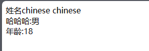

# JavaBean

## 目录

-   [可视化JavaBean](#可视化JavaBean)
-   [\<jsp: useBean>获取属性值](#jsp-useBean获取属性值)
-   [JavaBean赋值属性](#JavaBean赋值属性)
    -   [setProperty赋值](#setProperty赋值)
    -   [单个赋值](#单个赋值)
    -   [手工赋值](#手工赋值)
    -   [独享参数](#独享参数)
-   [JavaBean数组转换字符串](#JavaBean数组转换字符串)

使用前端HTML代码和Java 代码分离,业务逻辑单独封装,然后在JSP页面中调用,就降低了耦合度,让JSP更简介,更易维护复用,这样的类就是一个`JavaBean`组件类

***

`JavaBean`分为可视化组件和非可视化组件两种,可视化组件可以是简单的`GUI`元素,如按钮 文本框可以是报表组件,非可视化没有`GUI`表现形式,用于封装业务逻辑,数据库操作,它的最大优点是可以实现代码的复用性,实现业务逻辑,显示页面分离,多用于后台处理,系统具有更好的健壮性和灵活性  `JSP+JavaBean+Serviet`成为当前开发`Web`应用的主流模式

#### 可视化JavaBean

```java
  有些类似于构造函数,JavaBean 对象提供默认无参数的构造方法
  除了默认无参数的构造方法外，JavaBean 对象也可以根据相应属性提供构造方法


public class User {

    private String username = null;
    private String password = null;
    public String getUsername() {
        return username;
    }
    public void setUsername(String username) {
        this.username = username;
    }
    public String getPassword() {
        return password;
    }
    public void setPassword(String password) {
        this.password = password;
    }
    public User() {
    }
}

```

### `<jsp: useBean>`获取属性值

在`JavaBean`中为了防止外部直接对它其中的属性(变量)调用,一般设置为私有的`privite`,但是需要为其设置公共的`public`访问方法,`getxxx()`

***

`<jsp: useBean>`标签指定域范围内**查找**指定名称的`JavaBean`对象

存在则直接返回`JavaBean`对象的引用

不存在实例化一个新的`JavaBean`对象并将它以指定的名称存储到指定域范围中

```java
<jsp:useBean id="saber" class="xxxx.class" scope="xxxx"  />

id: 指定JavaBean实例对象的引用名称和其存储在域范围中的名称

class: 指定JavaBean的完整类名(必须带包名,和路径一样访问)

scope: 指定JavaBean实例对象所存储的域范围,取值是
       page、request、session、application四个值中的一个,默认为page
```

`<jsp: getPropert>`标签**读取**`JavaBean`对象的属性它调用的`getter`方法,然后将读取的属性值转换成字符串后插入输出的响应正文中

```java
<jsp: getPropert name="xxx" propert="xxxx" />

name: 指定JavaBean实例对象的名称,它的值和 <jsp: useBean>标签的id属性值相同,  id=name

propert: 指定JavaBean实例对象的属性名
```

`per`类就是`JavaBean`对象,创建必须是在一个包里面 这里我是在saber包下


index.JSP

```java
<%@ page language="java" contentType="text/html; charset=GBK"  pageEncoding="GBK"%>
<!DOCTYPE html PUBLIC "-//W3C//DTD HTML 4.01 Transitional//EN" "http://www.w3.org/TR/html4/loose.dtd">
<html>
<head>
    <meta http-equiv="Content-Type" content="text/html; charset=GBK">
    <title>PersonJSP</title>
</head>
<body>
// id 指定了名称和范围  clas跟随包下的类名 page默认
// 下面的代码示例话了Per类对象的过程,这是 useBean标签的执行原理
// 存在返回改 JavaBean对象的引用 不存在实例化新的JavaBean再存储没有太理解
<jsp:useBean id="person" class="saber.per" scope="page"></jsp:useBean>
<div>
    <ul>
        <li>
        // property填写per类中的值,也就是填属性名  name填写和上文id一致
            姓名:<jsp:getProperty property="name" name="person"/>
        </li>
        <li>
            性别<jsp:getProperty property="sex" name="person"/>
        </li>
        <li>
            年龄<jsp:getProperty property="age" name="person"/>
        </li>
        <li>
            婚否<jsp:getProperty property="mari" name="person"/>
        </li>
    </ul>
</div>
</body>
</html>
```

Per.Java

```java
package saber;

public class per {
// 各种的属性赋值
    private String name = "saber";
    private String sex = "女";
    private int age = 16;
    private boolean mari = false;

    public per() {
        // 无参构造函数
    }

    // 用于访问 get取值 set赋值
    public String getName() {
        return name;
    }

    public void setName(String name) {
        this.name = name;
    }

    public String getSex() {
        return sex;
    }

    public void setSex(String sex) {
        this.sex = sex;
    }

    public int getAge() {
        return age;
    }

    public void setAge(int age) {
        this.age = age;
    }

    public boolean isMari() {
        return mari;
    }

    public void setMari(boolean mari) {
        this.mari = mari;
    }
}
```


### `JavaBean`赋值属性

`JavaBean`中的访问器`setxxxx()`方法,用于对JavaBean中的属性赋值,如果类里面提供了`setxxx()`方法,在JSP页面中就可以通过 `<jsp: setProperty>`对其赋值

#### `setProperty`赋值

```java
<jsp: setProperty name="JavaBean实例名=ps" propety="*" />

per ps = new per();
```

index.JSP&#x20;

```java
<%@ page contentType="text/html;charset=GBK" language="java" %>
<html>
<head>
    <title>Title</title>
</head>
<body>
<%request.setCharacterEncoding("GBK");%>
<form action="work.jsp" method="post">
    <table>
        <tr>
            <td>姓名</td>
         // 属性是和JavaBean定义好的,虽然Per.Java 初始化了变量,但是set二次赋值
         
     <!--这里的name属性值和JavaBean中的属性值相同-->
            <td><input type="text" name="name" value=""></td>
        </tr>
        <tr>
            <td>性别</td>
            <td><input type="text" name="sex" value=""></td>
        </tr>
        <tr>
            <td>年龄</td>
            <td><input type="text" name="age" value=""></td>
        </tr>
        <tr>
        //  提交表单
            <td colspan="2" align="center"><input value="提交" type="submit"></td>
        </tr>
    </table>
</form>
</body>
</html>
```

word.JSP

```java
<%@ page contentType="text/html;charset=GBK" language="java" %>
<html>
<head>
  <title>Title</title>
</head>
<body>
<%request.setCharacterEncoding("GBK");%>
<jsp:useBean id="ps" class="saber.per" scope="page"/>

// set赋值 property=* 匹配所有指的是,可以单个匹配
<jsp:setProperty name="ps" property="*" /> // 接收值过来
姓名<jsp:getProperty property="name" name="ps"/><BR>
哈哈哈:<jsp:getProperty property="sex" name="ps"/><BR>
年龄:<jsp:getProperty property="age" name="ps"/><BR>
</body>
</html>
```



#### 单个赋值

```java
<jsp:setProperty name="ps" property="age" /> // 单个age
```

```java
<jsp:setProperty name="ps" property="age" /> // 单个匹配只匹配age属性,给它赋值
姓名<jsp:getProperty property="name" name="ps"/><BR>
哈哈哈:<jsp:getProperty property="sex" name="ps"/><BR>
年龄:<jsp:getProperty property="age" name="ps"/><BR>
```

只赋值了`age`的情况,单个匹配,那么余下没有赋值的属性会默认输出在`per`类中定义好的


#### 手工赋值

```java
<jsp:setProperty name="ps" property="age"  value="100"/> // value=100
```

word.JSP &#x20;

```java
<%@ page contentType="text/html;charset=GBK" language="java" %>
<html>
<head>
  <title>Title</title>
</head>
<body>
<%request.setCharacterEncoding("GBK");%>
<jsp:useBean id="ps" class="saber.per" scope="page"/>

// // 手工设置所值 哪怕index.JSP 提交过来的值不一样 也会使用 手工设置的 Value值
<jsp:setProperty name="ps" property="age"  value="100"/> 
<jsp:setProperty name="ps" property="name"  value="礼拜"/> //
<jsp:setProperty name="ps" property="sex"  value="人妖"/> //
姓名<jsp:getProperty property="name" name="ps"/><BR>
哈哈哈:<jsp:getProperty property="sex" name="ps"/><BR>
年龄:<jsp:getProperty property="age" name="ps"/><BR>
</body>
</html>
```


#### 独享参数

```java
<jsp:setProperty name="ps" property="name"   param="newname"  />

<form action="w ork.jsp?newname=SmpleLee " method="post">
```

index.JSP

```java
<%@ page contentType="text/html;charset=GBK" language="java" %>
<html>
<head>
    <title>Title</title>
</head>
<body>
<%request.setCharacterEncoding("GBK");%>
// 表单头处在跳转的链接处为newname属性赋值为我们自定义的值
// 那样做哪怕跳转过去更改了,也是我们现在赋值的数
<form action="work.jsp?newname=SmpleLee" method="post">
    <table>
        <tr>
            <td>姓名</td>
     <!--这里的name属性值和JavaBean中的属性值相同-->
            <td><input type="text" name="name" value=""></td>
        </tr>
        <tr>
            <td>性别</td>
            <td><input type="text" name="sex" value=""></td>
        </tr>
        <tr>
            <td>年龄</td>
            <td><input type="text" name="age" value=""></td>
        </tr>
        <tr>
            <td colspan="2" align="center"><input value="提交" type="submit"></td>
        </tr>
    </table>
</form>
</body>
</html>
```

from.JSP

```java
<%@ page contentType="text/html;charset=GBK" language="java" %>
<html>
<head>
  <title>Title</title>
</head>
<body>
<%request.setCharacterEncoding("GBK");%>
<jsp:useBean id="ps" class="saber.per" scope="page"/>

 // param=request独享中的参数名”
<jsp:setProperty name="ps" property="name"  param="newname"  />
<jsp:setProperty name="ps" property="age"/>
<jsp:setProperty name="ps" property="sex"  />

姓名<jsp:getProperty property="name" name="ps"/><BR>
哈哈哈:<jsp:getProperty property="sex" name="ps"/><BR>
年龄:<jsp:getProperty property="age" name="ps"/><BR>
</body>
</html>
```


### `JavaBean`数组转换字符串

新建软件包,在包内创建两个`java`文件


`per.java`  功能是接收前端发送的数据,它的属性就是数组存储,因为前端点击可能是多,并且生成对应的`set get`方法 取值 赋值,这里只用到了`get`取值操作没有赋值, 引入一个接口`Serializable`,标记这个类实例可以被序列号转换为字节流, 并要让 `per`类实现这个接口,定义 `serialVersionUID`


```java
package saber;

// java中的一个接口,标记类的实例可以被序列化
// 一个类实现了这个接口它的实例就可以被转换为字节流
import java.io.Serializable;
public class per implements Serializable{ //实现接口

    private static final long serialVersionUID=1L; // 标识序列化类的版本号。
    
    private String[] languages;// 编程语言字符串
    private String[] technics;// 掌握技术字符串数组
    private String[] parts; // 困难部分字符串请求

    public per() {
        // 无参构造函数
    }

    // 用于访问 get取值 set赋值

    public String[] getLanguages() {
        return languages;
    }

    public void setLanguages(String[] languages) {
        this.languages = languages;
    }

    public String[] getTechnics() {
        return technics;
    }

    public void setTechnics(String[] technics) {
        this.technics = technics;
    }

    public String[] getParts() {
        return parts;
    }

    public void setParts(String[] parts) {
        this.parts = parts;
    }
}

```

`convert.java` 创建了 `aaa`里面可以传入数组参数,实现了数组的遍历并将结果返回,这里我一度以为遍历哪里出现了问题,不应该是 `J,a,v,a` 吗,但后面才发现 前端复选框选择的其实就是一个整体,如果存在多选的情况比如 `Java Python`,那么返回的是`Java,Python`

```java
package saber;

public class convert {

    // 数组转换为字符串
    public String aaa(String[] arr){ // 接收arr字符串参数
        StringBuffer sb=new StringBuffer();//创建一个字符串缓冲区 空的类似于JS变量
        // 先判断是数组不为为空null 并且长度大于0才执行下面的遍历
        if(arr!=null&&arr.length>0){
            // 遍历传入的数组
            for(String s:arr){
                sb.append(s); // 其实一个复选框就是一个单独的数组而已,Java是一个整体不会变成 j,a,v,a
                sb.append(",");
            }

            // 使用 sb.deleteCharAt(sb.length()-1)
            if(sb.length()>0){
                // 以确保数组中至少有一个元素。如果是，则删除最后一个字符（逗号），
                sb.deleteCharAt(sb.length()-1);
            }
        }
        // sb.toString() 方法，将 sb 转换为一个字符串，并将其作为方法的返回值。
        return sb.toString();
    }
}
```

软件包内有3个页面,但用到的只有2个, `index.JSP`显示转换后的页面,`work.JSP` 负责前端页面的显示


```java
<%@ page contentType="text/html;charset=UTF-8" language="java" %>
<html>
<head>
  <title>gather</title>
</head>
<body>
<form action="index.jsp" method="post">
  <div>
    <h1>开发技术调研</h1>
    <hr/>
    <ul>
      <li>你经常用哪些编程语言开发程序</li>
      <li>
      // name值和 per类中定义的属性一致 不然接收不到,选择几个意味着数组里面有几个值
        <input type="checkbox" name="languages" value="JAVA">JAVA
        <input type="checkbox" name="languages" value="PHP">PHP
        <input type="checkbox" name="languages" value=".NET">.NET
        <input type="checkbox" name="languages" value="Python">Python
      </li>
    <ul>
      <li>你目前掌握的技术:</li>
      <li>
        <input type="checkbox" name="technics" value="HTML">HTML
        <input type="checkbox" name="technics" value="JAVA BEAN">JAVA BEAN
        <input type="checkbox" name="technics" value="JSP">JSP
        <input type="checkbox" name="technics" value="Sping MVC">Spring MVC
      </li>
    </ul>
    <ul>
      <li>在学习中有哪一部分感觉有困难：</li>
      <li>
        <input type="checkbox" name="parts" value="JSP">JSP
        <input type="checkbox" name="parts" value="STRUTS">STRUTS
      </li>
    </ul>
    <input type="submit" value="提 交">
  </div>
</form>
</body>
</html>
```

index.JSP

```html
<%@ page contentType="text/html;charset=UTF-8" language="java" %>
<html>
<head>
    <title>Reg</title>
</head>
<body>
<!--  id指定JavaBean实例对象的引用名称和其存储在域范围中的名称
      class=通过包名路径拿到saber.per类-->
<jsp:useBean id="per" class="saber.per"></jsp:useBean>
<jsp:useBean id="convert" class="saber.convert"></jsp:useBean>

<!--property=* 匹配所有参数 name=per 实例对象名 -->
<jsp:setProperty name="per" property="*"></jsp:setProperty>
<div>
    <h1>开发技术调研结果</h1>
    <hr/>
    <ul>
        <li>
          <!--通过表达式调用convert.aaa()方法并把per类接收到的属性传入这个
          数组遍历的方法,get属性拿到了这个值 -->
            你经常使用的编程语言：<%=convert.aaa(per.getLanguages())%>
       <!--<jsp:getProperty property="languages" name="per" /> 
       方法方式是不能输出值的,因为没有通过方法去遍历它--->  
</li>
        <li>
            你目前掌握的技术： <%=convert.aaa(per.getTechnics())%>
        </li>
        <li>
            <!-- arr2Str() 传入的形参是per类中的属性,它保存的是输入的字符串--->
            在学习中感觉有困难的部分： <%=convert.aaa(per.getParts())%>
</div>
</li>
</ul>
</body>
</html>
```
