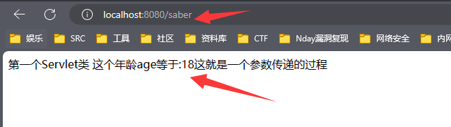

# JavaServlet

## 目录

-   [概念](#概念)
    -   [介绍Servlet](#介绍Servlet)
        -   [Servlet类](#Servlet类)
        -   [Servlet容器(Servlet引擎)](#Servlet容器Servlet引擎)
        -   [功能](#功能)
    -   [生命周期](#生命周期)
        -   [init()方法](#init方法)
        -   [service() 方法](#service-方法)
        -   [init() or service区别](#init-or-service区别)
        -   [destroy()方法](#destroy方法)
    -   [特点](#特点)
-   [编写Servlet类](#编写Servlet类)
    -   [HttpServlet类的常用方法](#HttpServlet类的常用方法)
    -   [ServletRequest接口方法](#ServletRequest接口方法)
        -   [HttpServletRequest接口方法](#HttpServletRequest接口方法)
    -   [ServletResponse接口方法](#ServletResponse接口方法)
        -   [HttpServletResponse 接口方法](#HttpServletResponse-接口方法)
-   [建立Servlet类](#建立Servlet类)
-   [wbe.xml注册映射](#wbexml注册映射)
    -   [多重映射](#多重映射)
    -   [通配符映射路径](#通配符映射路径)
-   [ServletConfig映射传参](#ServletConfig映射传参)
-   [ ServletContext多个传参](#-ServletContext多个传参)
-   [表单Servlet提交数据](#表单Servlet提交数据)
-   [Servlet输出数据库](#Servlet输出数据库)
    -   [0X01 jdbc.properti配置数据库](#0X01-jdbcproperti配置数据库)
    -   [0X02 Servlet类处理逻辑](#0X02-Servlet类处理逻辑)
    -   [0X03  配置类运行路由](#0X03--配置类运行路由)
    -   [0X04 注解式运行Servlet类](#0X04-注解式运行Servlet类)

## 概念

### 介绍`Servlet`

`Servlet`是基于Java语言的Web编程技术,部署在后端的Web容器里,获取前端访问请求,并根据请求升响应信息返回到客户端


#### `Servlet`类

平台独立的Java类,编写一个实际上就是按照`Servlet`规范写一个Java类,`Servlet`被编译为平台独立字节码,可以动态加载到支持Java技术的后端服务器中运行 ,

**它不可以独立运行,必须部署到**\*\*`Servlet`\*\***容器中**,由容器来实例化和调用`Servlet`容器在`Servlet`的生命周期内包容和管理`Servlet`

#### `Servlet`容器(`Servlet`引擎)

Web服务器或应用程序服务器的一部分,用于在发送的请求和响应之上提供网络服务,解码基于`MIME`请求,格式化基于 `MlME`响应

#### 功能

```html
1. 读取客户端发送到服务器的显式数据 (表单数据)
2. 读取客户端发送服务端的隐式数据   (请求报头)
3. 服务器端发送显式的数据到客户端 (HTML)
4. 服务器发送隐式的数据到客户端 (状态代码和响应报头)
```

### 生命周期

一个Servlet的生命周期由部署该`Servlet`的Web容器负责,容器还提供请求分发 安全 并发控制等服务,

当特定的请求被容器映射到某个 `Servlet`,容器就会做出以下操作

```java
1. 若该Servlet实例尚未创建,那么容器就加载该Servlet的 .class文件 ,然后创建该.class的一个实例
   并调用这个实例的init()方法来初始化该实例
   
2. 调用初始化化好的该实例的Service()方法,传入Request和Responnse对象 JSP知识

3. 最后如果不再需要该Servlet,容器会调用该Servlet的destroy()方法销毁该实例

4. Servlet生命周期从Web应用服务器开始运行时开始,以后会不断处理来自浏览器的访问请求,并将
   响应结果通过Wbe应用服务器返回给客户端,直到Web服务器停止运行,Servlet才会被清除
```

`javax.servlet.Servlet`接口中,定义了针对Servlet生命周期重要3个方法。

#### `init()`方法

`HttpServlet`类中的方法,可以在Servlet类中重写这个方法,**它只能被调用一次,即在**\*\*`Servlet`\*\*

**第一次被请求加载时调用方法**

**声明格式**

```java
public void init(ServletConfig config) throws Servletexception
```

当Servlet对象第一个被请求加载,服务器会创建一个Servlet对象,这个对象会调用 `init()`方法完成必要的初始化工作,这个方法执行时, 服务器会把一个`ServletConfig`类型的对象传递给`init()`方法,**也就是形参中的数据类型,** 传过来的对象保存在Servlet对象中,直到Servlet对象被销毁。

`ServletConfig`对象负责向Servlet传递服务设置信息,如果传递失败就会发生,ServletExceptionx,Servlet

对象就不能正常工作,

#### **`service()`** 方法

`HttpServlet`类中的方法,可以在Servlet类中直接继承该方法或重写这个方法

**声明格式**

```java
public void service(HttpServletRequest request, HttpServletRespone respose)
throw ServletException,IOException
```

当Servlet对象成功创建和初始化后,该对象就调用`service()`方法来处理用户的请求并返回响应,服务器将两个参数传递给该方法,

1.  `HttpServletRequest `类型的对象,该对象封装了用户的请求信息
2.  `HttpServletRespone`  类型对象,响应用户的请求

后续的客户请求该`servlet`对象服务,服务器将启动一个新的线程,在该线程中,`Servlet`对象调用`servie()`响应客户前端的请求,; 每个客户请求都导致 `service`方法被调用执行,运行在不同的线程中,所以

> 不同线程的`servlce`方法中的局部变量互不干扰,一个线程改变了自己的`servlce`方法中的局部便利店值,不会影响其他线程的`servlce`方法中的局部变量

#### `init()` or `service`区别

`init()`方法只能被调用一次,而`service()`可以被多次调用,

#### `destroy()`方法

服务器关闭或`Web`应用被移除容器时,`Servlet`随着Web应用销毁而销毁,销毁前容器会调用`Servlet`的`destroy()`方法,已便`Servlet`对象释放资源,在生命周期中它也只会被调用一次

### 特点

`Servlet`程序在服务器端运行,动态生成Web页面,具有更高的效率 更好的移植性

```java
1. 高效: 服务器上仅有一个Java虚拟机运行,它的优势在于多个来自客户端的请求进行访问,Servlet为
         每个请求分配一个线程而不是进程
         
2. 方便: Servlet提供了大量实用工具,如处理很难完成的HTML表单数据,读取和设置HTTP头,处理cookie会话
 
3. 共享数据: Servlet之间通过共享数据可以很容易实现数据库连接池,它能方便地实现管理用户请求,简化
            session和获取前一页面信息操作,而在CGI之间通信则很差          
```

## 编写`Servlet`类

创建一个`Servlet`对象的类就是编写一个特殊的子类,特殊类就是`javax.servlet.http`包中的`HttpServlet`类,它实现了`Servlet`接口,实现响应用户的方法,`HttpServlet`类的子类被习惯地称为一个`HttpServlet`类,这样的类创建的对象习惯地称为一个`Servlet`对象

最常用的创建`Servlet`就是继承`HttpServlet`因为它提供了处理 HTTP 请求的特定方法，如 doGet()、`doPost()`、`doHead()` 等。

#### `HttpServlet`类的常用方法

| 方法声明                        | 功能描述              |
| --------------------------- | ----------------- |
| \`protected void doGel      |                   |
| (HttpServletRequest   req,  |                   |
| HttpServletResponse resp)\` | 处理GET类型的HTTP请求方法  |
| \`protected void doPost     |                   |
| (HttpServletRequest   req,  |                   |
| HttpServletResponse resp)\` | 处理POST类型的HTTP请求方法 |

`Get`方法得到的每一个内容都需要进行编码转换,转换在`request`请求中,需要`Tomcat`编码设置,而`POST`方法只要设置 `request.setCharacterEncoding("UTF-8")`就可以

```java
GET: 服务端使用 Request.QueryString获取变量的值

POST: 服务端用Request.From获取提交的数据
```

### `ServletRequest`接口方法

Servlet接口的service(ServletRequest request, ServletRespone respose)方法存在`ServletRequest `类型参数,表示来自客户端的原始请求数据,

容器接收到客户端要求访问特定`Servlet`请求时,容器先解析客户端的原始请求数据,把它包装成一个`ServletRequest`对象,当容器调用了`Servlet()`方法,就可以把`ServletRequest`对象作为参数传给`service()`方法


#### `HttpServletRequest`接口方法

`HttpServletRequest`接口是`ServletRequest`接口的子接口,

`HttpServlet` 类的重载`service()`方法及 `doGet()`和`doPost()`等方法都有一个HttpServletRequest类型的参数如:

```javascript
protected void service(HttpServletRequest req,HttpServletRequest req, 
HttpServletResponse resp) throws ServletException,IOException{......}
)

```

`HttpServletRequest`接口提供了用于读取HTTP请求中相关信息的方法 下图是方法


### `ServletResponse`接口方法

Servlet接口的service(ServletRequest request, ServletRespone respose)方法存在`ServletResponse`类型参数,通过它来生成响应结果,当`Servlet`容器接收到客户端要求访问`Servlet`的请求时,容器就会创建一个ServletResponse对象,并把它作为参数传给Servlet的Service()方法


#### `HttpServletResponse` 接口方法

`HttpServletResponse` 接口是`ServletResponse`的子接口,HttpServlet类的重载service()方法及doGet()和doPost()方法都有一个HttpServletResponse类型的参数

```java
protected void service(HttpServletRequest req, HttpServletResponse resp
throws ServletException, IOException{.....})
```

接口提供了和HTTP协议相关的方法,`Servlet`可通过这些方法来设置HTTP响应头或向客户端写`Cookie`


**注意:**

ServletResponse响应正文的默认MIME类型为`text/plain`,即纯文本类型,但是`HttpServletResponse`

响应正文的默认类型是`text/html`即HTML文档类型

## 建立[Servlet](https://blog.csdn.net/m0_56392863/article/details/126977087 "Servlet")类

`servlet03:war exploded`工件决定了8080端口后面跟随的路径,如果它为空那么路径也是为空

```java


import javax.servlet.ServletConfig;
import javax.servlet.ServletException;
import javax.servlet.http.HttpServlet;
import javax.servlet.http.HttpServletRequest;
import javax.servlet.http.HttpServletResponse;
import java.io.IOException;
import java.io.PrintWriter;

public class ServletTest extends HttpServlet {

    private static final long serialVersionUID = 1L;

    @Override
// 方法在 Servlet 初始化时被调用。在这个例子中，我们只是调用了父类的 init() 方法，没有做其他操作。
    public void init(ServletConfig config) throws ServletException {
        super.init(config);// 使用super调用父类重写的方法
  // init() 方法是 HttpServlet 类中的一个生命周期方法，它在 Servlet 初始化时被调用
  // 这里只是重写了这个方法      
    }

    @Override
// 方法用于处理 HTTP 请求并生成响应。在这个例子中，我们设置了响应的内容类型为 "text/html;charset=utf-8"，然后通过 PrintWriter 对象生成一个简单的 HTML 页面作为响应。    
    public void service(HttpServletRequest request, HttpServletResponse response) throws IOException {
        response.setContentType("text/html;charset=utf-8"); // 响应内容
// 获取了一个 PrintWriter 对象，用于向响应输出流写入数据。通过使用 PrintWriter 对象
// 我们可以将文本、HTML 或其他数据写入响应，从而生成需要返回给客户端的内容。        
        PrintWriter out=response.getWriter();
        out.println("<html><body>");
        out.println("第一个Servlet类");
        out.println("</body></html>");
    }
}

```

web.xml

```python
<?xml version="1.0" encoding="UTF-8"?>
<web-app xmlns="http://xmlns.jcp.org/xml/ns/javaee"
         xmlns:xsi="http://www.w3.org/2001/XMLSchema-instance"
         xsi:schemaLocation="http://xmlns.jcp.org/xml/ns/javaee http://xmlns.jcp.org/xml/ns/javaee/web-app_4_0.xsd"
         version="4.0">
    <servlet>
        <servlet-name>ServletTest</servlet-name>
        <servlet-class>ServletTest</servlet-class>
    </servlet>
    <servlet-mapping>
        <servlet-name>ServletTest</servlet-name>
        <url-pattern>/saber</url-pattern> <!--路径 对应上下文-->
    </servlet-mapping>
</web-app>
```

## `wbe.xml`注册映射

**注册**

在`web.xml`文件中,`<servlet>`元素用于注册`Servlet`,包含两个主要的子元素

```java
   <servlet-name>ServletTest</servlet-name>   // 设置Servlet注册名称
   <servlet-class>ServletTest</servlet-class> // 指定Servlet完整类名包括包名

```

**映射**

`<servlet-mapping>`元素映射已经注册的Servlet的对外访问路径,客户端浏览器可以使用映射路径访问Servlet类,它包含两个元素

```java
<servlet-name>ServletTest</servlet-name>  // 注册名称同上
<url-pattern>/saber</url-pattern> // 访问路径  路径对应上下文设置的类
```

### 多重映射

多重映射是指同一个Servlet可以被映射成多个虚拟路径,即客户端浏览器可以通过多个路径访问同一个`Servlet`,存在两个方法

-   配置多个`<servlet-mapping>`标签对路径进行映射

```java
  <servlet>
        <servlet-name>ServletTest</servlet-name>
        <servlet-class>ServletTest</servlet-class>
    </servlet>
    
    <servlet-mapping>
        <servlet-name>ServletTest</servlet-name>
        <url-pattern>/saber</url-pattern> 
    </servlet-mapping>
    
      <servlet-mapping>
        <servlet-name>ServletTest</servlet-name>
        <url-pattern>/kali</url-pattern> // 不同的路径
    </servlet-mapping>
```

-   在`<servlet-mapping>`标签中加入多个`<url-pattern>`标签

```java
  <servlet>
        <servlet-name>ServletTest</servlet-name>
        <servlet-class>ServletTest</servlet-class>
    </servlet>
    
    <servlet-mapping>
        <servlet-name>ServletTest</servlet-name>
        <url-pattern>/saber</url-pattern>
        <url-pattern>/kali</url-pattern  // 不同的路径
        <url-pattern>/saaa</url-pattern
    </servlet-mapping>
```

### 通配符映射路径

有时候希望某个目录下的所有路径都可以访问一个`Servlet`,就可以映射路径中使用通配符,属于路径匹配

通配符 " \*"为后缀，`  /servlet/a /servlet/b /servlet/c  `都会与之匹配

```python
<url-pattern>/servlet/*</url-pattern>  路径/servlet后面的路径都将被匹配
```

通配符" \*"前缀, 扩展名匹配,`/a/saber /b/saber`/都将匹配

```python
<url-pattern>*.saber</url-pattern>
```

完全匹配,通配符 " \*"匹配全部路径

```python
<url-pattern>/*</url-pattern>
```

## `ServletConfig`映射传参

类的配置文件中可以使用一个或者多个`<init-pararn>`标签为`servlet`配置一些初始化参数,那么容器初始化实例都会这个Servlet准备一个唯一的`ServletConfig`实例,容器会从部署的描述文件中读出该`Servlet`的初始化参数,并设置到这个实例中,再把实例传递给Servlet的`init()`方法,进而可以通过`ServletConfig`对象得到当前初始化参数信息

```python
private ServletConfig config = null;  // 创建私有变量
```

重写`init()`方法传入config,使其`this.config=config`获取ServletConfig对象,最后可以通过这个`ServletConfig`接口中`getInitParameter(Stringname)`方法来获取指定名称的初始化参数的字符串值

web.xml

```java
<?xml version="1.0" encoding="UTF-8"?>
<web-app xmlns="http://xmlns.jcp.org/xml/ns/javaee"
         xmlns:xsi="http://www.w3.org/2001/XMLSchema-instance"
         xsi:schemaLocation="http://xmlns.jcp.org/xml/ns/javaee http://xmlns.jcp.org/xml/ns/javaee/web-app_4_0.xsd"
         version="4.0">
    <servlet>
        <servlet-name>ServletTest</servlet-name>
        <servlet-class>ServletTest</servlet-class>
        
         <init-param>
            <param-name>age</param-name>       // 传递信息的名称
            <param-value>18</param-value>  // 传递的值是18 依靠上面定义的标签
        </init-param>
        
        
    </servlet>
    <servlet-mapping>
        <servlet-name>ServletTest</servlet-name>
        <url-pattern>/saber</url-pattern> <!--路径 对应上下文-->
    </servlet-mapping>
</web-app>

```

```java
import javax.servlet.ServletConfig;
import javax.servlet.ServletException;
import javax.servlet.http.HttpServlet;
import javax.servlet.http.HttpServletRequest;
import javax.servlet.http.HttpServletResponse;
import java.io.IOException;
import java.io.PrintWriter;

public class ServletTest extends HttpServlet {

    private static final long serialVersionUID = 1L;
   // 设置私有变量类型是对象,是init()方法中的对象类型的函数
    private   ServletConfig   config; 

    @Override
    public void init(ServletConfig config) throws ServletException {
        super.init(config);
        this.config=config;
    }

    @Override
    public void service(HttpServletRequest request, HttpServletResponse response) throws IOException {
        
        // 接收传递而来的值
        String age = this.config.getInitParameter("age");
        response.setContentType("text/html;charset=utf-8");
        PrintWriter out=response.getWriter();
        out.println("<html><body>");
        out.println("第一个Servlet类");
        // 输出 传递而来的值
        out.println("这个年龄age等于:"+age+"这就是一个参数传递的过程"); 
        out.println("</body></html>");
    }
}
```

`Servlet `的初始化参数只是针对当前这个 Servlet 类有效在本Servlet类中只能获取自身的初始化参数，无法获取其他 Servlet 类的初始化参数。



## ` ServletContext`多个传参

多个`Servlet`获取相同的初始化参数,可以把参数配置设置成Web应用上下文初始参数

***

容器部署好之后会为每个应用程序都创建一个`ServletContext`实例,通过该实例可以获取到所有的Web应用上下文初始化参数的值,它被认为是对于Web应用程序的一个整体性存储区域,每一个Web应用程序都只有一个它,存储在里面的对象会一直保留直到它被删除

`ServletContext`对象获取2种方法

-   `ServletConfig.getServletContext0`方法获得对 `ServletContext`对象的引用
-   `this.getServletContext0`方法获得对象的引用

web.xml

```java

<?xml version="1.0" encoding="UTF-8"?>
<web-app xmlns="http://xmlns.jcp.org/xml/ns/javaee"
         xmlns:xsi="http://www.w3.org/2001/XMLSchema-instance"
         xsi:schemaLocation="http://xmlns.jcp.org/xml/ns/javaee http://xmlns.jcp.org/xml/ns/javaee/web-app_4_0.xsd"
         version="4.0">
    <servlet>
        <servlet-name>ServletTest</servlet-name>
        <servlet-class>ServletTest</servlet-class>
    </servlet>
    <servlet-mapping>
        <servlet-name>ServletTest</servlet-name>
        <url-pattern>/saber</url-pattern> <!--路径 对应上下文-->
    </servlet-mapping>

    <context-param>
        <param-name>url</param-name>  // 名称
        <param-value>哈哈哈哈</param-value>  //值
    </context-param>

    <context-param>
        <param-name>user</param-name>  // 名称
        <param-value>root</param-value> // 值
    </context-param>
</web-app>
```

SerletTest.java

```java
import javax.servlet.ServletConfig;
import javax.servlet.ServletContext;
import javax.servlet.ServletException;
import javax.servlet.http.HttpServlet;
import javax.servlet.http.HttpServletRequest;
import javax.servlet.http.HttpServletResponse;
import java.io.IOException;
import java.io.PrintWriter;

public class ServletTest extends HttpServlet {
    private ServletConfig  config;  // 设置值调用
    private ServletContext context;  // 接收的值 类型也是是context

    private static final long serialVersionUID = 1L;

    @Override
    public void init(ServletConfig config) throws ServletException {
        super.init(config);
        this.config =config; // 构造函数的参数 a 的值赋给类的成员变量 a
    }

    @Override
    public void service(HttpServletRequest request, HttpServletResponse response) throws IOException {
        context = this.config.getServletContext(); // 拿到这个对象
        String  url = this.context.getInitParameter("url");  // 上文名称url
        String  user = this.context.getInitParameter("user"); // // 上文名称 user

        response.setContentType("text/html;charset=utf-8");
        PrintWriter out=response.getWriter();
        out.println("<html><body>");
        // 输出值
        out.println("一切的一切不过是是在传递参数而已,设置的链接是"+url+"用户是"+user);
        out.println("</body></html>");
    }
}

```


Web应用中的所有的`Servlet`共享同一个`ServletContext`对象,可以利用这个对象实现通信,设置如下语言实现数据共享

```java
ServletContext context = this.getServletContext(); // servletcontext域对象
context.setAttribute("data","共享数据"); // 向域内存了一个data属性
```

另外一个servlet中,使用下面代码实现获取域中`data`属性

```java
ServletContext context = this.getServletContext();
String value = (String)context.getAttribute("data"); // 获取域中的data属性 value保存

system.out.printin(value); // 输出数据
```

## 表单`Servlet`提交数据

`Servlet`调用`HttpServletRequest` 中的`getParameter`方法,调用参数提供表单变量的名字即可,

-   如果指定表单存在变量名称但是没有值则会返回空字符串,
-   变量不存在则会返回`null`
-   表单变量可能对应多个值,使用`getParameterValues`取代`getParameter`,它会返回一个字符串数组

`HttpServletRequest`的`getParameterNames`方法可以实现获取完整的表单变量名列表,它返回的是

`Enumeration`其中的每一项都可以被转换为调用`getParameter`的字符串

***

正常的`HTML`代码都是前端标签属性,所有前端的代码怎么写其实都可以,但是跳转就必须要进行解析,`saber`路径是`web.xml`映射而来,Java代码是已经解析了的,解析传递而来的数据,处理逻辑,但是`Java`的页面还是使用 `out.println`打印而来

index.JSP

```html
<%@ page contentType="text/html;charset=UTF-8" language="java" %>
<html>
<head>
  <title>用户注册</title>
</head>
<body>

<form action="saber" method="post">  <!--saber路径为ServletTest.java 映射导致这样-->
  <table width="40%" border="0" align="center" bgcolor="#0099ff">
    <tr>
      <th colspan="2" scope="col">用户注册</th>
    </tr>
    <tr bgcolor="#FFFFFF">
      <th scope="row">用户名：</th>
      <td><input name="userName" type="text" id="userName"></td>
    </tr>
    <tr bgcolor="#FFFFFF">
      <th scope="row">密码：</th>
      <td><input name="userPwd" type="password" id="userPwd"></td>
    </tr>
    <tr bgcolor="#FFFFFF">
      <th scope="row">电子邮箱：</th>
      <td><input name="email" type="text" id="email"></td>
    </tr>
    <tr bgcolor="#FFFFFF">
      <th scope="row">性别：</th>
      <td><input type="radio" name="userSex" id="userMale" value="男">男
        <input type="radio" name="userSex" id="userFemale" value="女">女
      </td>
    </tr>
    <tr bgcolor="#FFFFFF">
      <th scope="row">教育程序：</th>
      <td>
        <select name="userEducation" id="userEducation" >
          <option value="研究生">研究生</option>
          <option value="本科">本科</option>
          <option value="专科">专科</option>
          <option value="高中">高中</option>
        </select>
      </td>
    </tr>
    <tr bgcolor="#FFFFFF">
      <th scope="row">&nbsp;</th>
      <td><input type="submit" name="Snbmit" value="提交">
        <input type="reset" name="Reset" value="重置">
      </td>
    </tr>
  </table>
</form>
</body>
</html>
```

web.xml  处理映射跳转

```html
<?xml version="1.0" encoding="UTF-8"?>
<web-app xmlns="http://xmlns.jcp.org/xml/ns/javaee"
         xmlns:xsi="http://www.w3.org/2001/XMLSchema-instance"
         xsi:schemaLocation="http://xmlns.jcp.org/xml/ns/javaee http://xmlns.jcp.org/xml/ns/javaee/web-app_4_0.xsd"
         version="4.0">
    <servlet>
        <servlet-name>ServletTest</servlet-name>
        <servlet-class>ServletTest</servlet-class>
    </servlet>
    <servlet-mapping>
        <servlet-name>ServletTest</servlet-name>
        <url-pattern>/saber</url-pattern> <!--路径 对应上下文-->
    </servlet-mapping>
</web-app>
```

代码为书本代码,貌似比正常的简洁,缺少了`init()`方法这样处理不了映射传递的数据,但是又可以正常的接收前端`JSP`页面传递而来的数据

ServletTest.Java

```java
/import javax.servlet.ServletConfig;
import javax.servlet.ServletContext;
import javax.servlet.ServletException;
import javax.servlet.http.HttpServlet;
import javax.servlet.http.HttpServletRequest;
import javax.servlet.http.HttpServletResponse;
import java.io.IOException;
import java.io.PrintWriter;

public class ServletTest extends HttpServlet {
    protected void doPost(HttpServletRequest request, HttpServletResponse response) throws ServletException, IOException {
       
       // 内置对象response处理传递而来的数据,在JSP代码中有体现
         
        response.setContentType("text/html;charset=utf-8"); // 设置响应类型为HTML 字符编码为utf-8
        request.setCharacterEncoding("utf-8"); // 设置了请求的字符编码为 "utf-8"
        String userName = request.getParameter("userName");  // JSP代码通过内置对象拿到参数
        String userPwd = request.getParameter("userPwd"); //密码
        String email = request.getParameter("email"); //邮箱
        String userSex = request.getParameter("userSex"); // 性别
        String userEducation = request.getParameter("userEducation"); // 教育
     // 向客户端发送响应的语句。它创建了一个 PrintWriter 对象，该对象可以用于向客户端发送文本响应。   
        PrintWriter out = response.getWriter();
      // 正常打印HTML  
        out.println("<HTML>");
        out.println("  <HEAD><TITLE>用户注册结果 </TITLE></HEAD>");
        out.println("  <BODY><br/>");
        out.print("<h3 align=\"center\">用户注册结果</h3>");
        out.println("<table table width=\"40%\" border=\"0\" align=\"center\" bgcolor=\"#0099ff\"");
        out.println("<tr  bgcolor=\"#FFFFFF\"><th>参数</th><th>参数值</th></tr>");
        // username userPwd 对应从上传传递而来的值
        out.println("<tr bgcolor=\"#FFFFFF\"><td>userName</td><td>" + userName + "</td></tr>");
        out.println("<tr bgcolor=\"#FFFFFF\"><td>userPwd</td><td>" + userPwd + "</td></tr>");
        out.println("<tr bgcolor=\"#FFFFFF\"><td>email</td><td>" + email + "</td></tr>");
        out.println("<tr bgcolor=\"#FFFFFF\"><td>userSex</td><td>" + userSex + "</td></tr>");
        out.println("<tr bgcolor=\"#FFFFFF\"><td>userEducation</td><td>" + userEducation + "</td></tr>");
        out.println("</table></BODY>");
        out.println("</HTML>");
  // out.flush() 方法用于刷新输出流，将缓冲区中的数据立即输出到目标设备中 
        out.flush();
   // out.close(); 关闭输出流，并释放与之关联的资源     
        out.close();
    }

    protected void doGet(HttpServletRequest request, HttpServletResponse response) throws ServletException, IOException {
        doPost(request, response);
    }
}
```

[QQ2023124-105050-HD.mp4](video/QQ2023124-105050-HD_HXbTHkeOIC.mp4)


## `Servlet`输出数据库

### 0X01 `jdbc.properti`配置数据库

`jdbc.properties` 文件是一个常见的配置文件，用于配置 Java 程序中使用的 JDBC（Java Database Connectivity）连接属性,在WEB-INF—classes目录下新建,输入我们的路径

本地主机`localhost` 数据库名 用户 密码

```java
url = jdbc:mysql://localhost/
dbName = test1
userName = root
userPasswd = 000000

```


### 0X02 `Servlet`类处理逻辑

写入页面输出逻辑,连接配置文件中的数据库密码用户

ServletTest.Java&#x20;

```java
import javax.servlet.ServletContext; // 获取 Web 应用程序的上下文信息，例如应用程序的名称、路径、初始化参数等。
import javax.servlet.ServletException; //处理 Servlet 中的异常情况。
import javax.servlet.annotation.WebServlet; // 于定义 Servlet 的注解，可以替代传统的在 web.xml 文件中配置 Servlet 的方式。
import javax.servlet.http.HttpServlet; // 实现 HTTP 协议的 Servlet 功能，例如处理 HTTP 请求和响应等。
import javax.servlet.http.HttpServletRequest; //  获取 HTTP 请求的信息 ，例如请求的 URL、参数、头信息等。
import javax.servlet.http.HttpServletResponse; // 生成 HTTP 响应的信息，例如设置响应的状态码、头信息、内容等。
import java.io.IOException;   // 处理输入输出操作中可能发生的异常情况
import java.io.InputStream;    // 读取输入流中的数据
import java.io.PrintWriter;  // 向输出流中写入数据
import java.sql.*; //：用于实现 JDBC 数据库连接功能，包括连接数据库、执行 SQL 语句、处理结果集等。
import java.util.Properties; // 读取和处理配置文件，例如 jdbc.properties 文件中的数据库连接属性。

public class ServletTest extends HttpServlet {
    protected void doPost(HttpServletRequest request, HttpServletResponse response) throws ServletException, IOException {
        response.setContentType("text/html;charset=UTF-8");
        PrintWriter out = response.getWriter();
      // 获取当前 Servlet 的上下文对象。
      // this 表示当前 Servlet 对象，getServletContext() 是 HttpServlet 类中定义的一个方法，用于获取当前 Servlet 的上下文对象。 
        ServletContext context = this.getServletContext(); 
     // 从 Web 应用程序的资源路径中获取一个输入流,可以获取到指定路径资源的输入流，并将其赋值给 stream 变量。  
        InputStream stream = context.getResourceAsStream("/WEB-INF/classes/jdbc.properties");
    // 用于处理属性文件。属性文件通常是一种键值对的文件格式，用于存储应用程序的配置信息。    
        Properties properties = new Properties();
      // 处理传递而来的属性文件,里面包含了数据库连接必要的对象  
        properties.load(stream);
        // 获取 数据库名 用户 密码
        String dbName = properties.getProperty("dbName");
        String userName = properties.getProperty("userName");
        String userPasswd = properties.getProperty("userPasswd");
        String url = properties.getProperty("url");
        url = url + dbName + "?user=" + userName + "&password=" + userPasswd;
        try {
            Class.forName("com.mysql.jdbc.Driver");
            Connection conn = DriverManager.getConnection(url);
            Statement statement = conn.createStatement();
            String sql = "select * from xsb ";
            ResultSet rs = statement.executeQuery(sql);

            out.println("<table border=1>");
            out.println("<th colspan=4 style=' font-size: x-large; alignment: center'> 学生信息表</th>");
            out.println(" <tr style=' text-align: center'>");
            out.println(" <td>学号</td>    <td>姓名</td>    <td>出生日期</td>   <td>所在班级</td>  </tr>");
             // 循环输出 
            while (rs.next()) {
                out.println(" <tr style='text-align: center'>");
                out.println(" <td>" + rs.getString(1) + "</td>");
                out.println(" <td>" + rs.getString(2) + "</td>");
                out.println(" <td>" + rs.getString(3) + "</td>");
                out.println(" <td>" + rs.getString(4) + "</td>");
                out.println(" </tr>");
            }
            out.println("</table></body>");
        } catch (Exception e) {
            e.printStackTrace();
        }
        // 刷新输出流，将缓冲区中的数据立即输出到目标设备中
        out.flush();
        out.close();
    }


    protected void doGet(HttpServletRequest request, HttpServletResponse response) throws ServletException, IOException {
        doPost(request, response);
    }
}
```

### 0X03  配置类运行路由

运行前首先需要配置类的路径,我们有两个方法,web.xml方法在前文已经阐述,这里介绍第二种注解方法,使用前需要导入注解类

```java
import javax.servlet.annotation.WebServlet; 
// 于定义 Servlet 的注解，可以替代传统的在 web.xml 文件中配置 Servlet 的方式
```

-   `web.xml`配置路由
-   `webServlet`注解使用  (简洁)

使用前首先观察`web.xml`配置是否满足版本要求和属性为false,如若没有`metadata-complete`自行加上

```java
metadata-complete="false"  //false是指使用注解式
metadata-complete="true"  //true是指使用配置式


```


配置式就是普通的注册映射方法,添加对应的类设置对应的路由名称实现,

```xml
    <servlet>
        <servlet-name>ServletTest</servlet-name>
        <servlet-class>ServletTest</servlet-class>
    </servlet>
    <servlet-mapping>
        <servlet-name>ServletTest</servlet-name>
        <url-pattern>/saber</url-pattern> <!--路径 对应上下文-->
    </servlet-mapping>
</web-app>
```

注解式在`Servlet`类上方添加对应的路径即可,区别是前者没有双引号,后者则需要,使用这个这个注解后就可以不用在写再去web.xml中部署了servlet了，使用这个注解就相当于替换了它。


```java
@WebServlet("/saber")  // 注解式
public class ServletTest extends HttpServlet {
```

### 0X04 注解式运行`Servlet`类

这里不使用配置式设置路径,使用注解式,所以代码注释掉,是、注解式和配置式只能存在一个

web.xml

```xml
<?xml version="1.0" encoding="UTF-8"?>
<web-app xmlns="http://xmlns.jcp.org/xml/ns/javaee"
         xmlns:xsi="http://www.w3.org/2001/XMLSchema-instance"
         xsi:schemaLocation="http://xmlns.jcp.org/xml/ns/javaee http://xmlns.jcp.org/xml/ns/javaee/web-app_4_0.xsd"
         version="4.0" metadata-complete="false">
<!--    <servlet>-->
<!--        <servlet-name>ServletTest</servlet-name>-->
<!--        <servlet-class>ServletTest</servlet-class>-->
<!--    </servlet>-->
<!--    <servlet-mapping>-->
<!--        <servlet-name>ServletTest</servlet-name>-->
<!--        <url-pattern>/saber</url-pattern> &lt;!&ndash;路径 对应上下文&ndash;&gt;-->
<!--    </servlet-mapping>-->
</web-app>
```

代码只是在类的上方添加注解式代码配置了路径,其余没有改动

ServletTest.Java&#x20;


按照步骤配置`Tomcat`首次运行的路径,如果不做设置默认第一次会运行index.JSP文件,只需要在这里添加我们设置的`Servlet`类注解式的路由即可,配置完成运行


成功输出数据库数据！  12:10 下课吃饭!

[QQ2023124-12108-HD.mp4](video/QQ2023124-12108-HD_hE09nqzO3z.mp4)
