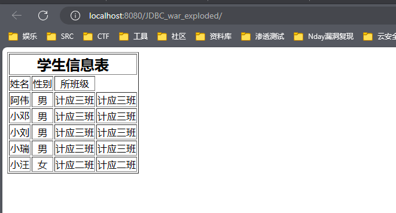
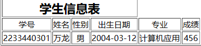
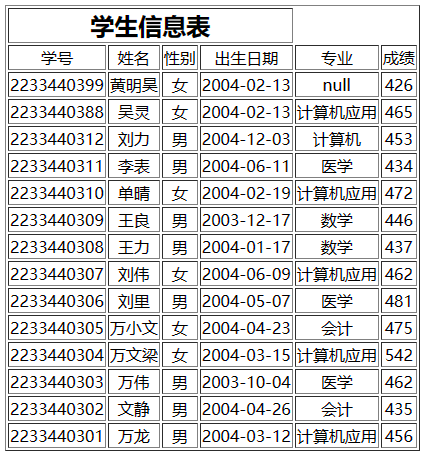
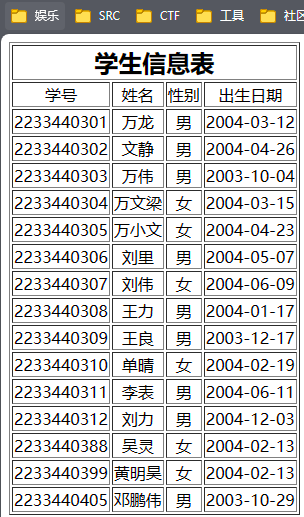
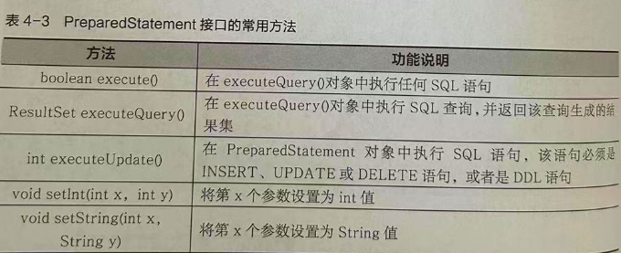
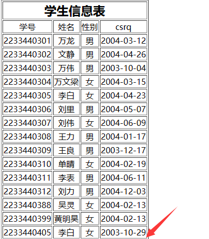
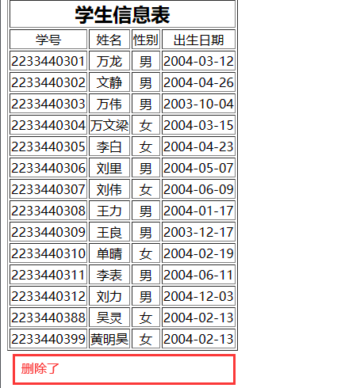

# Jdbc数据库

## 目录

-   [原生Java连接数据库](#原生Java连接数据库)
-   [查询数据操作](#查询数据操作)
    -   [创建Statement对象](#创建Statement对象)
    -   [向数据库发送SQL语句](#向数据库发送SQL语句)
    -   [处理查询结果](#处理查询结果)
    -   [关闭Statement对象](#关闭Statement对象)
-   [查询数据](#查询数据)
-   [条件查询](#条件查询)
    -   [and or逻辑过滤](#and-or逻辑过滤)
-   [排序查询](#排序查询)
-   [增加数据](#增加数据)
-   [更新数据](#更新数据)
    -   [创建PreparedStatement对象](#创建PreparedStatement对象)
    -   [输入参数赋值](#输入参数赋值)
    -   [执行语句](#执行语句)
-   [删除数据](#删除数据)
-   [PreparedStatement Statement](#PreparedStatement-Statement)
-   [注册功能](#注册功能)

### 原生`Java`连接数据库

```basic
import java.sql.Connection;
import java.sql.DriverManager;

public class MysqlTest {
    public static void main(String[] args) {
        //不用动，默认就是这么写的
        String driverName = "com.mysql.cj.jdbc.Driver";
        //本地连接
        String dbURL = "jdbc:mysql://localhost:3306/mysql?&useSSL=false&serverTimezone=Asia/Shanghai"; //mysql为数据库名

        String userName = "root";
        //自己数据库的密码
        String userPwd = "000000";

        try {
            Class.forName(driverName);
            Connection con = DriverManager.getConnection(dbURL, userName, userPwd);
            System.out.println("连接数据库成功");

        } catch (Exception e) {
            e.printStackTrace();

            System.out.print("连接失败");
        }
    }
}
```

`JSP`可以写Java代码,可以通过Java代码来访问数据库,在`Java`技术中访问数据库的技术叫做`JDBC`,它提供了一系列`API`对数据进行添加 删除 修改 查询

### 查询数据操作

`JDBC` 提供的`API`可以将标准的`SQL`语句发送给数据库 实现和数据库的交互操作

#### 创建`Statement`对象

建立和特定数据库的连接后,就可以用该连接发送`SQL`语句,`Statement`对象用`Connection`方法的

`createStatement()`创建; &#x20;

```java
有了 Connection 接口和数据库建立连接后,它返回的是一个连接的值,再通过这个值中的方法 createStatement 
创建 Statement 对象发送sql语句,有了c后用c去创建s

// 建立数据库连接,url为各个参数,用户名密码 // s
1.Connection conn = DriverManager.getConnection(url); 
2.Statement statement = conn.createStatement();  // 利用c的参数coon的方法创建s对象发送sql语句
3.String sql = "select * from xue";  // 随便写一条sql
4.rs = statement.executeQuery(sql);   //rs保存查询结果   executeQuery执行查询语句

ResultSet对象存储数据库取出的值

------------------------------------------------------

3 4 简化的代码,语句直接写在执行方法内

ResultSet rs = statement.executeQuery("SELECT  a,b,c from table2");


PreparedStatement preparedStatement = conn.prepareStatement(sql);


```

***

`Statement`对象是Java执行数据库操作的重要接口,用于已经建立数据库连接的基础上,发送SQL语句

```java
Statement stmt = conn.createStatement();
```

实际有3种  `Statement` 对象 他们专门用于发送特定类型的`SQL`语句

```java
Statement:对象用于执行不带参数简单的SQL语句
PreparedStatement: 对象用于执行带参数或不带参数的预编译SQL语句;
CallableStatement: 对象用于执行对数据库存储过程的调用
```

***

#### 向数据库发送SQL语句

为了执行`Statement`对象,发送到数据库的SQL语句将参数提供给`Statement`方法

```java
ResultSet rs = stmt.executeQuery("SELECT  a,b,c from table2");
```

#### 处理查询结果

`Statement`对象可以调用对应的方法实现对数据库中表的查询和修改,并将查询结果存放在

`ResultSet`类声明的对象:

> 它是以统一形式的列组织的数据行组成,它实际上是一个小表格,存在游标,它是`ResultSet`中可以移动的一个指针,它指向一个数据,初始指向第一行的前一行,`rs.next()`可以将游标移到下一行,其返回值是一个布尔类型,如果下一次有数据返回值为`true`否则为`false`,所以必须运行一次next函数后,才能从新开始取数据,如果强行取数据则会找不到该页面而报错, 所以使用`rs.next`配合`while`对所有结果遍历并输出

#### 关闭`Statement`对象

`Statement`对象将由`Java`垃圾收集程序自动关闭,应该不需要该对象显示地关闭它,这将立即释放`DBMS`资源,有助于避免潜在的内存问题

### 查询数据

配置文章已经发在`CSDN`简单的来说就是&#x20;

1.  下载`JDBC`驱动
2.  驱动放置到`Tomcat`lib文件夹下(apache-tomcat-8.5.93\webapps\ROOT)这个路径是8080端口下
3.  `JavaWeb`项目正常配置,写入下方的代码进行连接

```java
<%@ page contentType="text/html;charset=UTF-8" language="java" %>
<%@page import="java.sql.*" %>

<head>
  <title>整表查询数据</title>
  
  <%! ResultSet rs;%>  <!--用于存储查询结果集-->
  <%
    String dbName = "study"; // 数据库名
    String userName = "root"; // 用户名
    String userPasswd = "000000"; //密码
    String url = "jdbc:mysql://localhost/" + dbName + "?user=" + userName + "&password=" + userPasswd;
    Class.forName("com.mysql.cj.jdbc.Driver");  // JDBC连接驱动
    Connection conn = DriverManager.getConnection(url); // 建立数据库连接
    Statement  statement  = conn.createStatement();  // 执行sql语句对象
    String sql = "select * from xue";  // 表名 xue
    rs = statement.executeQuery(sql);   //rs保存查询结果   executeQuery执行查询语句
  %>
</head>
<body>
<table border="1">
  <th colspan="4" style=" font-size: x-large; alignment: center"> 学生信息表</th>
  <tr style=" text-align: center">
    <td>姓名</td>
    <td>性别</td>
    <td>所班级</td>
  </tr>
  <% while (rs.next()) {  %>  <!--rs.next()配合while循环取出数据并放在页面中--->
  <tr style=" text-align: center">
    <!---rs.getString(1) 表示获取结果集中当前行的第一列的值。--->
    <td><%= rs.getString(1)  %></td>
    <td><%= rs.getString(2) %> </td>
    <td><%= rs.getString(3) %> </td>
    <td><%= rs.getString(3) %> </td> // 两个同样的会重复

  </tr>
  <%  }  %>
</table>
</body>
</html>
```



### 条件查询

`where`子句用于规定查询的条件,进行限制查询

```java
SELECT  age FROM students WHERE age >= 18; // 查询students表中的age字段大于等于18的值

------

between:在某个范围内
like:搜索某种模式
```

index.JSP&#x20;

```java


<%@ page contentType="text/html;charset=UTF-8" language="java" %>

<body>
<form action="fast.jsp"  method="post" > // 点击提交跳转到其他页面代码
  <table>
    <th colspan="2">查询条件</th>
    <tr>
      <td>学号：</td>
      <td><input type="text" name="stuid" id="stuid"/> </td>
    </tr>
    <tr aria-rowspan="2">
      <td><input type="submit" value="提交"></td>
    </tr>
  </table>
</form>
</body>
</html>
```

fast.JSP 存在数据库连接代码

```java


<%@ page contentType="text/html;charset=UTF-8" language="java" %>
<%@page import="java.sql.*" %>

 <% String id = request.getParameter("stuid");%> 

<head>
    <title>整表查询数据</title>
    <%! ResultSet rs;%>  <!--用于存储查询结果集-->
    <%
        String dbName = "test1"; // 数据库名
        String userName = "root"; // 用户名
        String userPasswd = "000000"; //密码
        String url = "jdbc:mysql://localhost/" + dbName + "?user=" + userName + "&password=" + userPasswd;
        Class.forName("com.mysql.cj.jdbc.Driver");  // JDBC连接驱动
        Connection conn = DriverManager.getConnection(url); // 建立数据库连接
        Statement statement = conn.createStatement();  // 执行sql语句对象
        
        // 查询xsb表中的入学成绩字段,这个id是上文的另一个页面传递来的值,第7行写入
        
        String sql = "select * from xsb where rxcj ='" +id+"'" ; 
                
        rs = statement.executeQuery(sql);   //rs保存查询结果   executeQuery执行查询语句
    %>
</head>
<body>
<table border="1">
    <th colspan="4" style=" font-size: x-large; alignment: center"> 学生信息表</th>
    <tr style=" text-align: center">
        <td>学号</td>
        <td>姓名</td>
        <td>性别</td>
        <td>出生日期</td>
        <td>专业</td>
        <td>成绩</td>
    </tr>
        <% while (rs.next()) {  %>
    <tr style=" text-align: center">
        <td><%= rs.getString(1)  %></td>
        <td><%= rs.getString(2) %> </td>
        <td><%= rs.getString(3)%></td>
        <td><%= rs.getString(4)%></td>
        <td><%= rs.getString(5)%></td>
        <td><%= rs.getString(6)%></td>
    </tr>
        <%  }  %>
</body>
</html>
```



#### `and` `or`逻辑过滤

需要进一步满足多个条件,`and` `or`对语句进行过滤

```sql
查询student表下name值等于软件2班 and(并且)  number输入的id 也要满足这个条件

String sql = "select * from student where name=软件2班 and number ='" +id+"'" ;
```

```sql
查询student表下name值等于软件2班 or(或者) 输入的 id值

String sql = select *from student where name=软件2班 or number ='" +id+"'" ;
```

### 排序查询

使用`ORDER BY` 语句对结果进行排序,默认采用升序进行排序,如果需要降序则使用`DESC`关键字

```sql
<%@ page contentType="text/html;charset=UTF-8" language="java" %>
<%@page import="java.sql.*" %>
<% String id = request.getParameter("stuid");%>
<head>
    <title>整表查询数据</title>
    <%! ResultSet rs;%>  <!--用于存储查询结果集-->
    <%
        String dbName = "study"; // 数据库名
        String userName = "root"; // 用户名
        String userPasswd = "000000"; //密码
        String url = "jdbc:mysql://localhost/" + dbName + "?user=" + userName + "&password=" + userPasswd;
        Class.forName("com.mysql.cj.jdbc.Driver");  // JDBC连接驱动
        Connection conn = DriverManager.getConnection(url); // 建立数据库连接
        Statement statement = conn.createStatement();  // 执行sql语句对象
        // ORDER BY 排序查询, xh 降序排序  姓名升序排序,貌似什么也没有改变
        String sql = "select * from  xsb ORDER BY xh DESC ,xm ASC ";
        rs = statement.executeQuery(sql);   //rs保存查询结果   executeQuery执行查询语句
    %>
</head>
<body>
<table border="1">
    <th colspan="4" style=" font-size: x-large; alignment: center"> 学生信息表</th>
    <tr style=" text-align: center">
        <td>学号</td>
        <td>姓名</td>
        <td>性别</td>
        <td>出生日期</td>
        <td>专业</td>
        <td>成绩</td>
    </tr>
        <% while (rs.next()) {  %>
    <tr style=" text-align: center">
        <td><%= rs.getString(1)  %></td>
        <td><%= rs.getString(2) %> </td>
        <td><%= rs.getString(3)%></td>
        <td><%= rs.getString(4)%></td>
        <td><%= rs.getString(5)%></td>
        <td><%= rs.getString(6)%></td>
    </tr>
        <%  }  %>
</body>
</html>
```



### 增加数据

`Statement`接口存在`executeUpdate`方法,这个方法可以使用` insert update delete`和数据库`SQL DDL`(数据定义语言),它的返回值是一个整数,指示受影响的行数

fast.JSP

```sql
<%@ page contentType="text/html;charset=UTF-8" language="java" %>
<%@page import="java.sql.*" %>
<%request.setCharacterEncoding("utf-8");%>  <!--- 字符编码>
<% String id=request.getParameter("stuid");%>
<% String stuName=  request.getParameter("stuname");%>
<% String stuBirthday=request.getParameter("stubirthday");%>
<% String stuClass=request.getParameter("stuclass");%>

<head>
    <title>整表查询数据</title>
    <%! ResultSet rs;%>  <!-用于存储查询结果集-->
    <%
        String dbName = "study"; // 数据库名
        String userName = "root"; // 用户名
        String userPasswd = "000000"; //密码
        String url = "jdbc:mysql://localhost/" + dbName + "?user=" + userName + "&password=" + userPasswd;
        Class.forName("com.mysql.cj.jdbc.Driver");  // JDBC连接驱动
        Connection conn = DriverManager.getConnection(url); // 建立数据库连接
        Statement statement = conn.createStatement();  // 执行sql语句对象

//        String sql = "INSERT into xsb(xh,xm,xb,csrq) VALUES('"+id+"','"+stuName+"','"+stuBirthday+"','"+stuClass+"')";
         // 正确的语句 前面添加列,后面添加行
        String sql = "INSERT into xsb(xh,xm,xb,csrq) VALUES('"+id+"','"+stuName+"','"+stuBirthday+"','"+stuClass+"')";
// result 返回执行的行数数字 大于代表成功了
        int  result= statement.executeUpdate(sql);  
        if(result>0)
            out.print("  <script type='text/javascript'>alert('添加成功'); </script> ");
        else
            out.print("  <script type='text/javascript'>alert('添加失败'); </script> ");
        sql = "select * from xsb ";
        rs = statement.executeQuery(sql); // 执行查询语句
    %>
</head>
<body>
<table border="1">
    <th colspan="4" style=" font-size: x-large; alignment: center"> 学生信息表</th>
    <tr style=" text-align: center">
        <td>学号</td>
        <td>姓名</td>
        <td>性别</td>
        <td>出生日期</td>
    </tr>
        <% while (rs.next()) {  %>
    <tr style=" text-align: center">
        <td><%= rs.getString(1)  %></td>
        <td><%= rs.getString(2) %> </td>
        <td><%= rs.getString(3)%></td>
        <td><%= rs.getString(4)%></td>

    </tr>
        <%  }  %>
</body>
</html>
```

index.JSP

```sql
<%@ page contentType="text/html;charset=UTF-8" language="java" %>

<body>
<form action="fast.jsp"  method="post" >
  <table>
    <th colspan="2">增加学生信息</th>
    <tr>
      <td>学生学号：</td>
      <td><input type="text" name="stuid" id="stuid"/> </td>
    </tr>
    <tr>
      <td>学生姓名：</td>
      <td><input type="text" name="stuname" id="stuname"/> </td>
    </tr>
    <tr>
      <td>性别：</td>
      <td><input type="text" name="stubirthday" id="stubirthday"/> </td>
    </tr>
    <tr>
      <td>出生日期：</td>
      <td><input type="text" name="stuclass" id="stuclass"/> </td>
    </tr>
    <tr aria-rowspan="2">
      <td><input type="submit" value="提交"></td>
    </tr>
  </table>
</form>
</body>
</html>

```



### 更新数据

插入数据可以将数据保存到数据库中,但是`SQL`语句依赖变量,比较容易出错,

`PreparedStatement`解决这个情况,它的接口是`Statement`接口的子接口,它直接继承并重载了`Statement`的方法

**特点**

1.  `PreparedStatement`对象包含的`SQL`语句是预编译的,所以需要执行多次相同的语句使用这个对象效果更好
2.  `PreparedStatement`对象所包含的`SQL`语句允许一个或多个输入参数,创建类`PreparedStatement`的实例,输入参数用 `?`代替, 执行参数必须对 `?`赋值,为了成功的赋值, `PreparedStatement`接口提供了大量`setxxx`方法完成对参数的赋值



#### 创建`PreparedStatement`对象

创建`PreparedStatement`接口的对象只需要在建立连接后,调用`Connection`接口中的`PreparedStatement()`创建一个`PreparedStatement`

```java
String sql ="update student set 字段=?,字段=? where number=? "

PreparedStatement preparedStatement = conn.prepareStatement(sql);
```

#### 输入参数赋值

提供了`setXXX(int index,Object val)`方法对输入参数进行赋值,根据输入的参数选择合适的`setxxxx`方法,`index`的值从1开始

```java
preparedStatement.setString(1,字段);
preparedStatement.setString(1,id);

```

#### 执行语句

执行`preparedStatement`对象的`executeUpdate`或`executeQuery()`就可以完成数据的查询或更新

fast.JSP

```java
<%@ page contentType="text/html;charset=UTF-8" language="java" %>
<%@page import="java.sql.*" %>
<%request.setCharacterEncoding("utf-8");%>  <!--- 字符编码>
<% String id=request.getParameter("stuid");%>
<% String stuBirthday=request.getParameter("stubirthday");%>
<% String stuClass=request.getParameter("stuclass");%>

<head>
    <title>整表查询数据</title>
    <%! ResultSet rs;%>  <!-用于存储查询结果集-->
    <%
        String dbName = "study"; // 数据库名
        String userName = "root"; // 用户名
        String userPasswd = "000000"; //密码
        String url = "jdbc:mysql://localhost/" + dbName + "?user=" + userName + "&password=" + userPasswd;
        Class.forName("com.mysql.cj.jdbc.Driver");  // JDBC连接驱动
        Connection conn = DriverManager.getConnection(url); // 建立数据库连接
        String sql = "update xsb set xm=?,xb=? where xh=?";
        // 创建一个预编译的 SQL 语句对象（PreparedStatement），并将其与数据库连接（Connection）关联起来。
        PreparedStatement preparedStatement= conn.prepareStatement(sql);
        preparedStatement.setString(1,stuBirthday); // 修改的值
        preparedStatement.setString(2,stuClass); // 修改的值
        preparedStatement.setString(3,id);   // 查询的条件 id=xxxx
        // 更换行数使用executeteUpdate();
        int  result= preparedStatement.executeUpdate();
        if(result>0)
            out.print("  <script type='text/javascript'>alert('修改成功'); </script> ");
        else
            out.print("  <script type='text/javascript'>alert('修改失败'); </script> ");
        sql = "select * from xsb "; // 输出全部的表
        rs = preparedStatement.executeQuery(sql); // 执行查询结果
    %>
</head>
<body>
<table border="1">
    <th colspan="4" style=" font-size: x-large; alignment: center"> 学生信息表</th>
    <tr style=" text-align: center">
        <td>学号</td>
        <td>姓名</td>
        <td>性别</td>
        <td>csrq</td>
    </tr>
    <% while (rs.next()) {  %> <!--循环打印值-->
    <tr style=" text-align: center">
        <td><%= rs.getString(1)  %></td>
        <td><%= rs.getString(2) %> </td>
        <td><%= rs.getString(3)%></td>
        <td><%= rs.getString(4)%></td>
    </tr>
    <%  }  %>

    <%
        rs.close(); //关闭ResultSet对象释放资源
        preparedStatement.close(); // ：关闭PreparedStatement对象
        conn.close(); //关闭Connection对象
    %>
</table>
</body>
</html>

```

index.JSP

```java
<%@ page contentType="text/html;charset=UTF-8" language="java" %>

<body>
<form action="fast.jsp"  method="post" >
  <table>
    <th colspan="2">修改学生信息</th>

    <tr>
      <td colspan="2">指定需要被修改的学生信息</td>
    </tr>
    <tr>
      <td>学生学号：</td> <!--根据学号来找人-->
      <td><input type="text" name="stuid" id="stuid"/> </td>
    </tr>
    <tr>
      <td colspan="2">填写需要改正的学生信息</td>
    </tr>
    <tr>
      <td>姓名：</td>
      <td><input type="text" name="stubirthday" id="stubirthday"/> </td>
    </tr>
    <tr>
      <td>性别：</td>
      <td><input type="text" name="stuclass" id="stuclass"/> </td>
    </tr>
    <tr aria-rowspan="2">
      <td><input type="submit" value="提交"></td>
    </tr>
  </table>
</form>
</body>
</html>
```



### 删除数据

需要在`preparedStatement`中设置空值,如果设置具体类型方法,比如`setInt(1,null)`,程序会毫不留情地报出空指针异常,所以需要做的是使用`setNull``(index,type)`方法代替原来的方法,将参数值赋值为null

index.JSP

```java
<%@ page contentType="text/html;charset=UTF-8" language="java" %>

<body>
<form action="fast.jsp"  method="post" >
  <table>
    <th colspan="2">删除学生信息</th>
    <tr>
      <td>学生学号：</td>
      <td><input type="text" name="stuid" id="stuid"/> </td> // 学号的意思
    </tr>
    <tr aria-rowspan="2">
      <td><input type="submit" value="提交"></td>
    </tr>
  </table>
</form>
</body>
</html>
```

fast.JSP

```java
<% String stuClass=request.getParameter("stuclass");%>

<head>
    <title>整表查询数据</title>
    <%! ResultSet rs;%>  <!-用于存储查询结果集-->
    <%
        String dbName = "study"; // 数据库名
        String userName = "root"; // 用户名
        String userPasswd = "000000"; //密码
        String url = "jdbc:mysql://localhost/" + dbName + "?user=" + userName + "&password=" + userPasswd;
        Class.forName("com.mysql.cj.jdbc.Driver");  // JDBC连接驱动
        Connection conn = DriverManager.getConnection(url); // 建立数据库连接
        String sql = "DELETE from xsb where xh=?"; // 根据学生表的xh是多少来查询删除
     // 创建一个预编译的 SQL 语句对象（PreparedStatement），并将其与数据库连接（Connection）关联起来。   
        PreparedStatement preparedStatement= conn.prepareStatement(sql);
        preparedStatement.setString(1,id); // 按照顺序第一个占位就是第一个 ?
        int  result= preparedStatement.executeUpdate();// 返回数字列数
        if(result>0)
            out.print("  <script type='text/javascript'>alert('删除成功'); </script> ");
        else
            out.print("  <script type='text/javascript'>alert('删除失败'); </script> ");
        sql = "select * from xsb ";
        rs = preparedStatement.executeQuery(sql);// 执行查询结果
    %>
</head>
<body>
<table border="1">
    <th colspan="4" style=" font-size: x-large; alignment: center"> 学生信息表</th>
    <tr style=" text-align: center">
        <td>学号</td>
        <td>姓名</td>
        <td>性别</td>
        <td>出生日期</td>
    </tr>
    <% while (rs.next()) {  %>
    <tr style=" text-align: center">
        <td><%= rs.getString(1)  %></td>
        <td><%= rs.getString(2) %> </td>
        <td><%= rs.getString(3)%></td>
        <td><%= rs.getString(4)%></td>
    </tr>
    <%  }  %>
    <%
        rs.close();
        preparedStatement.close();
        conn.close();
    %>
</table>
</body>
</html>
```



### `PreparedStatement Statement`

`PreparedStatement `可读性更好,虽然代码会多出几行但是维护性更强,并且提升性能,预编译语句还可以被重复的调用,所以语句在被编译器编译后执行代码被缓存下来,下次调用相同的预编译代码就不需要编译,只要传入编译后的语句就可以了

而`Statement`语句相同的操作,每次相同的操作,因为每次操作的数据不同,所以整个语句匹配不了,只能分开写,每执行一个`SQL`命令都要解析编译, `PreparedStatement `对象多次执行同一个语句只会解析一次

**复用性**

首先创建了一个 PreparedStatement 对象 `preparedStatement`，并将其与 SQL 查询语句关联起来。然后，可以通过调用 `setXxx()` 方法设置查询参数的值，再通过调用 `executeQuery()` 方法执行查询操作。

在每次需要执行查询时，只需更新参数的值，并再次调用 `executeQuery()` 方法即可。这样可以避免重复创建 PreparedStatement 对象，提高了执行效率

```java
String sql = "SELECT * FROM users WHERE age > ?";
PreparedStatement preparedStatement = conn.prepareStatement(sql);

// 第一次使用 PreparedStatement 对象
int ageThreshold = 18; //   每次传入不同的数字,但是结果集还是不同的 数字可以是自己前端输入的值变量 
preparedStatement.setInt(1, ageThreshold);
ResultSet rs1 = preparedStatement.executeQuery();
// 处理结果集 rs1

// 第二次使用 PreparedStatement 对象
ageThreshold = 25;
// 数字1 2 3代表的是问号的位置,如果语句有2个问好占位符,则值放到第二个语句就是问号2;
preparedStatement.setInt(1, ageThreshold);
ResultSet rs2 = preparedStatement.executeQuery();
// 处理结果集 rs2

// 第三次使用 PreparedStatement 对象
ageThreshold = 30;
preparedStatement.setInt(1, ageThreshold);
ResultSet rs3 = preparedStatement.executeQuery();
// 处理结果集 rs3
```

### 注册功能

注意数据库的字段写入类型,字段不匹配的话是无法写入的

index.JSP

```java
<%@ page contentType="text/html;charset=UTF-8" language="java" %>
<style>
    *{
        margin: 0;
        padding: 0;
    }
    div{
        width: 500px;
        height: 500px;
        margin: 0 200px;
    }
    h1{
        text-align: center;
    }
</style>
<body>
<div>
    <h1>
        <form action="fast.jsp"  method="post" >
            <table>
                <th colspan="2">会员注册信息</th>
                <tr>
                    <td>用户名</td>
                    <td><input type="text" name="stuid" id="stuid"/> </td>
                </tr>
                <tr>
                    <td>密码</td>
                    <td><input type="text" name="stuname" id="stuname"/> </td>
                </tr>
                <tr>
                    <td>手机号</td>
                    <td><input type="text" name="stubirthday" id="stubirthday"/> </td>
                </tr>
                <tr>
                    <td>出生日期：</td>
                    <td><input type="text" name="stuclass" id="stuclass"/> </td>
                </tr>
                <tr>
                    <td>年龄</td>
                    <td><input type="text" name="age" id="age"/> </td>
                </tr>
                <tr aria-rowspan="2">
                    <td><input type="submit" value="注册"></td>
                </tr>
            </table>
        </form>
    </h1>
</div>
</body>
</html>

```

fast.JSP

```java
<%@ page contentType="text/html;charset=UTF-8" language="java" %>
<%@page import="java.sql.*" %>
<%request.setCharacterEncoding("utf-8");%>  <!--- 字符编码>
<% String id=request.getParameter("stuid");%>
<% String stuName=  request.getParameter("stuname");%>
<% String stuBirthday=request.getParameter("stubirthday");%>
<% String stuClass=request.getParameter("stuclass");%>
<% String age=request.getParameter("age");%>

<head>
<title>整表查询数据</title>
<%! ResultSet rs;%>  <!-用于存储查询结果集-->
<%
    String dbName = "study"; // 数据库名
    String userName = "root"; // 用户名
    String userPasswd = "000000"; //密码
    String url = "jdbc:mysql://localhost/" + dbName + "?user=" + userName + "&password=" + userPasswd;
    Class.forName("com.mysql.cj.jdbc.Driver");  // JDBC连接驱动
    Connection conn = DriverManager.getConnection(url); // 建立数据库连接
    Statement statement = conn.createStatement();  // 执行sql语句对象

//        String sql = "INSERT into xsb(xh,xm,xb,csrq) VALUES('"+id+"','"+stuName+"','"+stuBirthday+"','"+stuClass+"')";
    // 正确的语句 前面添加列,后面添加行
    String sql = "insert into xue(name,pass,php,age,da) VALUES('"+id+"','"+stuName+"','"+stuBirthday+"','"+stuClass+"','"+age+"')";
// result 返回执行的行数数字 大于代表成功了
    int  result= statement.executeUpdate(sql);
    if(result>0)
        out.print("  <script type='text/javascript'>alert('添加成功'); </script> ");
    else
        out.print("  <script type='text/javascript'>alert('添加失败'); </script> ");
       sql = "select * from  xue ";
      rs = statement.executeQuery(sql); // 执行查询语句
%>
</head>
<body>
<table border="1">
    <th colspan="4" style=" font-size: x-large; alignment: center"> 注册表</th>
    <tr style=" text-align: center">
        <td>用户名</td>
        <td>密码</td>
        <td>手机号</td>
        <td>出生日期</td>
        <td>年龄</td>
    </tr>
        <% while (rs.next()) {  %>
    <tr style=" text-align: center">
        <td><%= rs.getString(1)  %></td>
        <td><%= rs.getString(2) %> </td>
        <td><%= rs.getString(3)%></td>
        <td><%= rs.getString(4)%></td>
        <td><%= rs.getString(5)%></td>
    </tr>
        <%  }  %>
</body>
</html>
```
