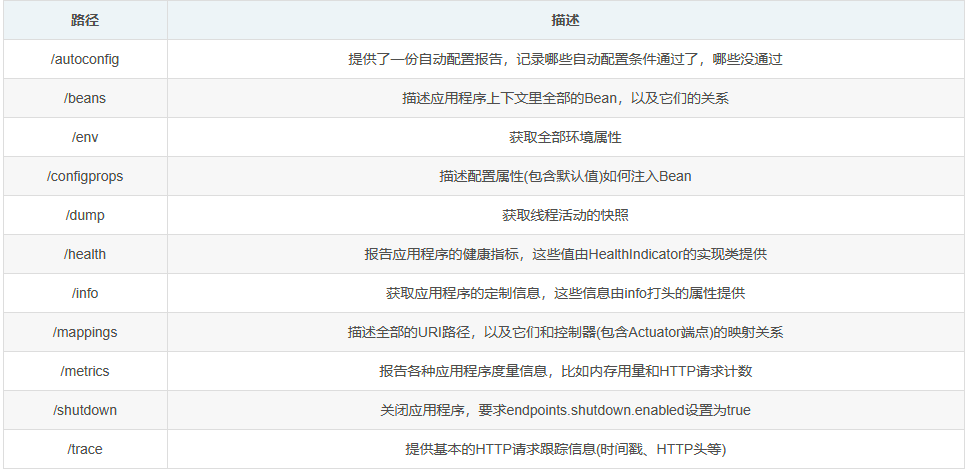
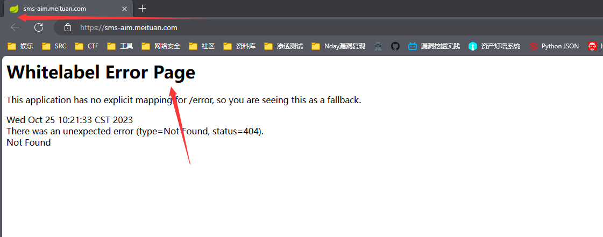
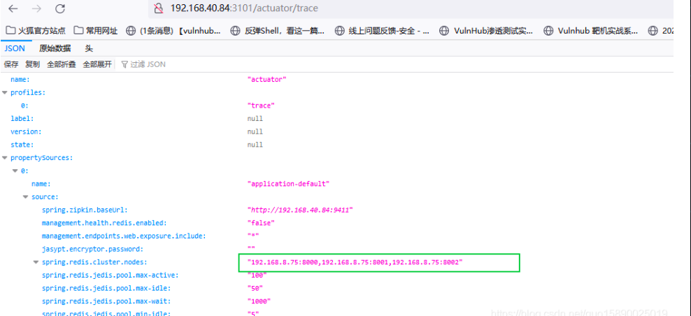
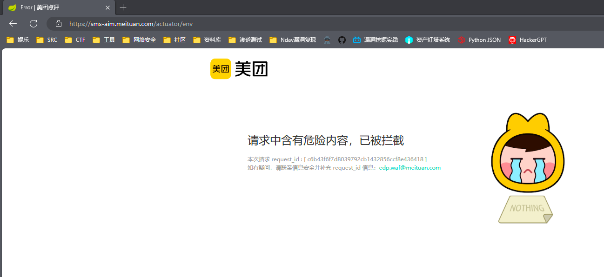
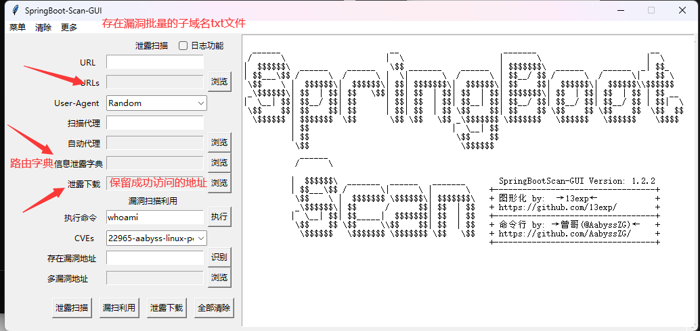

# Spring boot 未授权

## 目录

-   [漏洞发现](#漏洞发现)
-   [漏洞利用](#漏洞利用)
-   [检测工具](#检测工具)

Actuator 是 Spring Boot 提供的服务监控和管理中间件。当 `Spring Boot `应用程序运行时，它会自动将多个端点注册到路由进程中。而由于对这些端点的错误配置，就有可能导致一些系统信息泄露、XXE、甚至是 RCE 等安全问题,



#### 漏洞发现

1.  网站`icon`是一个小绿叶标志
2.  特有的报错信息

```java
Whitelabel Error Page
```



**影响版本**Spring Boot < 1.5 默认未授权访问所有端点 （版本只要是 < 1.5那么就是漏洞）

Spring Boot >= 1.5 默认只允许访问/health和/info端点，但是此安全性通常被应用程序开发人员禁用。

### 漏洞利用

如果访问相关的路由回显出了铭感信息那么就是可以利用的,访问/trace端点获取到近期服务器收到的请求信息。如果存在登录用户的操作请求，可以伪造cookie进行登录



这是被拦截的情况



### 检测工具

```java
https://github.com/13exp/SpringBoot-Scan-GUI  // Github项目地址

pip install python-nmap // 下载nmap模块

python SpringBoot-Scan-GUI.py  // 运行图形化工具
```


