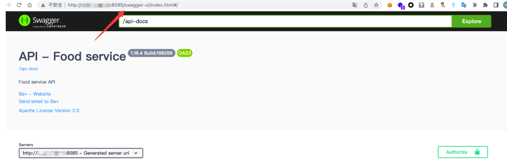
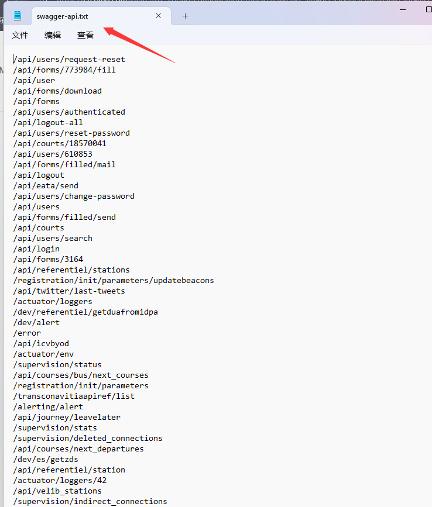
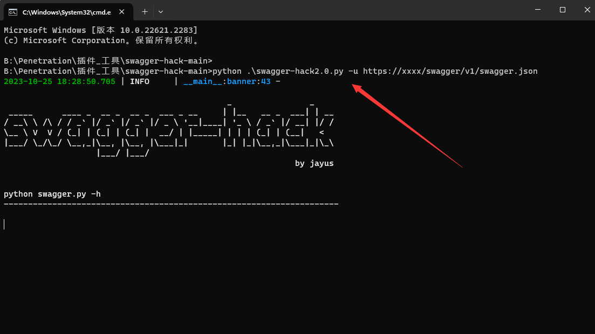

# SwaggerUI未授权

## 目录

-   [漏洞发现](#漏洞发现)
-   [漏洞利用](#漏洞利用)
    -   [Burp爆破接口](#Burp爆破接口)
    -   [Py脚本攻击](#Py脚本攻击)

`Swagger`是一个规范且完整的框架，用于生成、描述、调用和可视化 RESTful 风格的 Web 服`Swagger `UI来展示文档时，所有公开的API接口都会被暴露出来。根据开发人员在代码中的设置来自动生成API说明文档，若存在相关的配置缺陷，攻击者可以未授权翻查Swagger接口文档，得到系统功能`API`接口的详细参数，再构造参数发包，通过回显获取系统大量的敏感信息,

### 漏洞发现

```java
1.swaggerUI的默认路径是/swagger-ui.html或/swagger-ui 

```



### 漏洞利用

#### Burp爆破接口

直接上字典对路径进行遍历看看是否回显出了其他信息,利用`Burp`爆破



#### Py脚本攻击

[微信文章漏洞利用方式](https://mp.weixin.qq.com/s/JaECX_XxL4y25ofdd8WmuQ "微信文章漏洞利用方式")

该工具主要是对swagger的接口进行快速的探测接口的存活，说不定能够直接探测出信息泄露的接口，这样特么的就赚大了。

```javascript
https://github.com/jayus0821/swagger-hack   // Github地址

python .\swagger-hack2.0.py -u https://xxxx/swagger/v1/swagger.json   // 用法 
```

找到`https://xxxx/swagger/v1/swagger.json `目录为api-docs或者json格式之间进行扫描

api-docs或者json格式  运气好扫描到大量个人信息泄露的接口


