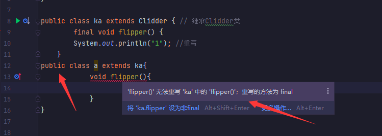

# 代码审计作业

## 目录

-   [1 对象类型转换](#1-对象类型转换)
-   [2 三目运算符](#2-三目运算符)
-   [3 异常语句追加](#3-异常语句追加)
-   [4 swith穿刺性和break](#4-swith穿刺性和break)
-   [5 for多次循环搭配continue](#5-for多次循环搭配continue)
-   [6 异常代码 finally强制执行](#6-异常代码-finally强制执行)
-   [7 集合通过泛型限制传入的数据类型](#7-集合通过泛型限制传入的数据类型)
-   [8 TreeSet集合传入Class对象实现Comparable 接口](#8-TreeSet集合传入Class对象实现Comparable-接口)
-   [9 作用域问题本类中的变量和方法中的变量](#9-作用域问题本类中的变量和方法中的变量)
-   [10 多线程题目](#10-多线程题目)
-   [11 enum 枚举类](#11-enum-枚举类)
-   [12 利用访问权限漏洞重写final方法](#12-利用访问权限漏洞重写final方法)
-   [13 多线程问题 Mixer](#13-多线程问题-Mixer)
-   [14 Static静态代码块和构造代码块在类中优先级](#14-Static静态代码块和构造代码块在类中优先级)
-   [15 变量作用域访问](#15-变量作用域访问)

#### 1 对象类型转换

1  涉及知识对象类型转换 向上转型调用只能2者共有,向下转型和原来的一样,子类调用子类

```java
 class Dog {
 public void bark() { System.out.print("woof "); }
 }
 // extends 继承 父类 dog
 class Hound extends Dog {
public void sniff() { System.out.print("sniff "); } // 重写子类方法
 public void bark() { System.out.print("howl "); }
 }
 public class DogShow {
 public static void main(String[] args) {
     new DogShow().go();
 }
 void go() {
        new Hound().bark(); // howl
        ((Dog) new Hound()).bark(); // Dog是父类 貌似是父类调用,但其实是调用子类重写的方法howl
//      ((Dog) new Hound()).sniff();/ 因为 Hound继承来的父类没有这个方法 只有子类有所以会报错
     new Hound().sniff(); // sniff 这样正常调用输出才不会报错
 }
}


----------------------------------

输出:

howl  howl sniff 


```

#### 2 三目运算符

2    拆分结构

```java
class DogShow {
public static void main(String[] args) {
         Integer i = 42;
         String s = (i<40) ? "life":(i>50)? "universe":"everything";
         System.out.println(s);
  }
}


-----------------------------

输出: 

everything

```

拆分代码 为两个部分, 部分`1`   `i<40` 为假 输出到  `i>50`  到此第一部分输出完成

```java
String s =  (i<40) ? "life":(i>50)  ? "universe":"everything";
```

来到第二部分 因为 `i>50`  i数字为42 不可能大于 50 所以为假 输出 第二项   `everything`

```java
String s = (i<40) ? "life": (i>50) ? "universe":"everything";
```

#### 3 异常语句追加

3  异常语句的追加 (猜测是在考验异常前置信息是否会重置)

```java
class Emu {
    static String s = "-";
    public static void main(String[] args) {
        try {
            throw new Exception();
        } catch (Exception e) {
            try {
                try {
                    throw new Exception();
                } catch (Exception ex) {
                    s += "ic "; // -ic
                }
                throw new Exception();
            } catch (Exception x) {
                s += "mc "; // -icmc
            } finally {
                s += "mf "; //icmcmf
            }
            //  finally 怎么样都会执行
        } finally {
            s += "of ";  // icmcmfof
        }
        System.out.println(s);
    }
}


---------------------------------------------------------

输出:

-ic mc mf of 


```

#### 4 swith穿刺性和break

4  swith穿刺性没有 `break` 终止会一直执行下去, 同时静态代码块被类加载只执行一次

```java
public class ka {
    static int x = 7; //静态变量

    public static void main(String[] args) {
        String s = ""; //
        for (int y = 0; y < 3; y++) {
            x++; // //8++  //9++   //10 ++
            switch (x) { // 9  10  11
                case 8:
                    s += "8 ";
                case 9:
                    s += "9 ";  // 1执行
                case 10: {
                    s += "10 "; //1 执行10 穿刺性执行到9并没有终止 所以到了10   //2 执行 因为第二次的缘故
                    break;
                }
                default:
                    s += "d "; // 3 执行 因为没有匹配项所以执行
                case 13:
                    s += "13 "; // 3 执行 没有brek跳出循环所以也被执行
            }
        }
        System.out.println(s);
    }

    //  静态代码块 类加载时就会被优先执行一次 且只会执行一次
    static {
        x++; // 8
    }
 
 

----------------------------------------------------

输出 :

9 10 10 d 13 
    
    
```

首先 `x` 是为7的因为静态代码块被先执行所以导致了 `x` 实际一开始的时候为8 进入 `for`循环的

```java
   static {
        x++; // 8
    }
```

for循环一共执行了3次  y=0  y=1  y=2,并且每次执行 switch带入的值是 9 10 11,这是++后的值

```java
 for (int y = 0; y < 3; y++) {
            x++; // //8++  //9++   //10 ++
             switch (x) { // 9  10  11
            } 
    
    }        

```

第一次  x=9执行到 `case` 输出9 但是因为 没有`break` 结尾所以匹配到了还是会往下执行所以`case`10

&#x20;                也被执行了  输出   **9  10**

第二次 x=10 执行到了10  且有 `break`语句  所以正常结束  输出  **10**

第三次 x=11 一个也没有匹配所以执行 `default` 且 没有 `break` 所以继续执行  最后输出 为  **d  13**

&#x20;       &#x20;

```java
       switch (x) { // 9  10  11
                case 8:
                    s += "8 ";
                case 9:
                    s += "9 ";  // 1执行
                case 10: {
                    s += "10 "; //1 执行10 穿刺性执行到9并没有终止 所以到了10   //2 执行 因为第二次的缘故
                    break;
                }
                default:
                    s += "d "; // 3 执行 因为没有匹配项所以执行
                case 13:
                    s += "13 "; // 3 执行 没有brek跳出循环所以也被执行
            }
        }
```

#### 5 for多次循环搭配continue

5   for循环执行配合 continue跳出当次`for`循环 break 跳出当前内部的一次循环 进入下一次,我理解的是一个 `continue` 跳出整体  `break `  进入 下一次循环

```java
public class ka {
    public static void main(String[] args) {
        int[] ia = {1, 3, 5, 7, 9}; // 整形数组
        for (int x : ia) { // 遍历数组 一次把 1 3 5 7 9 带入到循环中
            for (int j = 0; j < 3; j++) { // 3 次 0 1 2
                if (x > 4 && x < 8) continue; // 满足则跳出当次循环而不是整个 大于5 小于8  所有进入循环的只会是 5 7 自己被跳出 57 根本执行不到  反而 1 3 9不会进入执行,只会2次
                System.out.print(" " + x); // 1 1  33 99  输出语句首先执行 但是到了
                if (j == 1) break; // 确定这一步 j是0 还是已经++过的 原本的1=1一次  第二部已经不会执行了 直接 continue 跳出 所以执行其实是 1.5 半  2都没有完整的执行完
                continue; // 到 进入循环第二次的时候 j是2了 所有 上一步的 breakk不会执行,continue跳出这个 for循环 数组1 执行不到 第三次
            }
            continue;
        }
    }
}

```

分析 数组 1 3 5 7 9 进行遍历,依次把5个数字带入到循环中,带入一个数字其实是围绕这个数完成了一次 `for`  循环,执行 0 1 2 三次, 但是 `for`  循环中 存在 `if` 和逻辑与 数字 大于 4 小于 8 的会为真执行

跳过 `continue`  跳出 当次的 `for`  前面说了一个数字带入会执行三次,但是只要带入的数符合 这个`if` 无论执行多少次都不没有 符合 条件的数字是 **5 7**   这两个数永远都不会执行,进入就符合 符合就 `continue` 跳出进入下一次

```java
 int[] ia = {1, 3, 5, 7, 9}; // 整形数组
        for (int x : ia) { // 遍历数组 一次把 1 3 5 7 9 带入到循环中
            for (int j = 0; j < 3; j++) { // 3 次  0 1 2
                if (x > 4 && x < 8) continue; 
          }
         }       

```

数组的1进入后,首先 第三行输出 第一个`1`  然后 来到 `if (j ==1)` ，现在的 j就是++后的`1`所以会执行break; 跳出循环 第一次结束,

for循环进入 第二次, `j=1` `j++`  输出 第三行代码来到 `if` 判断 这次的 `if`不会执行 因为会 `j ==2`&#x20;

所以会直接 `continue` 跳出,第三次根本就没有机会执行了   所以进入循环的数字都会执行2次&#x20;

输出结果就会是  `11 33 99`

&#x20;

```java
for (int j = 0; j < 3; j++) { // 3 次 0 1 2
                if (x > 4 && x < 8) continue; 
                System.out.print(" " + x); // 1 1  33 99  输出语句首先执行 但是到了
                if (j == 1) break; 
                continue; // 到 进入循环第二次的时候 j是2了 所有 上一步的 breakk不会执行,continue跳出这个 for循环 数组1 执行不到 第三次
            }
```

矛盾点是  continue如果只是跳出当次的话而不是整个的话,那么 符合条件的都会根据for循环输出 3次,因为她的跳出在输出语句之后,那么答案就会变成 111 333 999,只有第二次输出到  break, 1.5半的时候就已经可以执行跳出了 第三次不执行 答案就是 11 33 99

#### 6 异常代码 finally强制执行

6  对异常代码 finally的处理 因为这里面的代码会强制执行,但是如果执行的是一个错误带有异常的方法同样     也会报错

```java
public class ka {
    static String s = "";

    public static void main(String[] args) {
        try {
            s += "1"; // 1
            throw new Exception();
        } catch (Exception e) {
            s += "2"; // 12
        } finally {
            s += "3"; // 123
            doStuff(); // 到这里的时候因为 finally强制执行,但是doStuff() 方法又有报错所以会出错 需要给它这个方法抛异常才可以
            s += "4";
        }
        System.out.println(s);
    }

    static void doStuff() {
        int x = 0;
        int y = 7 / x;
    }
}

```

输出


将方法使用异常语句包裹再去执行才不会报错,同样也会正常执行完&#x20;

```java
  static void doStuff() {
        try {
            int x = 0;
            int y = 7 / x;
        } catch (ArithmeticException e) {
            System.out.println("异常代码处理方案");
        }
    }
   
---------------------------------

输出:    

异常代码处理方法
1234
    
    

```

#### 7 集合通过泛型限制传入的数据类型

7  `TreeSet`集合 存取元素有序无重复,但是存取的数据类型不一致, 又存在数字又存在字符串,可以通过泛型来指定类型

```java
import java.util.*;  // 提供了一些工具类 时间日期

// 主类 只是没有 public 修饰
 class ka {
    public static void before() {  // 静态方法
        Set set = new TreeSet(); //  集合 有序序且不能重复
        set.add("2");
        set.add(3);
        set.add(3);
        Iterator it = set.iterator();  // 迭代器
        while (it.hasNext()){
            System.out.print(it.next() + " ");
        }     
    }

    public static void main(String[] args) {
        before();  // 调用方法
    }
}

```

元素不一致导致输出报错


使用泛型来修改代码,限定集合传入的类型为 `String` 字符串, 并且把传入的整数转换为字符串,

```java
Set<String> set = new TreeSet<String>();
set.add("2");
set.add(String.valueOf(3)); // 将数字三转换为字符串
set.add("1");

--------------------------------------------

输出:

1 2 3 
```

#### 8 TreeSet集合传入Class对象实现Comparable 接口

&#x20;TreeSet集合限定了传入的数据只能是Class类,但是又没有实现`Comparable`  接口,它是对象之间的比较不然无法对元素进行排序 因为没有实现接口并重写所以会报错

```java
import java.util.*;

class Dog {
    int size;

    Dog(int s) { // 传入的数字会等于 size==s 传入几个就会有不同的几次
        size = s;
    }
}

public class ka {
    public static void main(String[] args) {
        TreeSet<Integer> i = new TreeSet<Integer>(); //泛型限定传入只能是int 且有序不重复
        //  创建集合 同样也是泛型 但传入的值是对象  泛型类传入的值就是限定了传入的值只能是对象别的不行
        // TreeSet集合存储的是Class类那么就不会去排序,如果需要排序就需要 必须实现 Comparable 接口并重写 compareTo方法实现对象元素的顺序存取
        TreeSet<Dog> d = new TreeSet<Dog>();
     // 传入的是虽然是对象 但是没有实现 Comparable接口无法排序
        d.add(new Dog(1));   // s=1
        d.add(new Dog(2));  // s=2
        d.add(new Dog(1));  // s=1
        // 正常传入数据
        i.add(1);
        i.add(2);
        i.add(1);
        System.out.println(d.size() + " " + i.size());
    }
}
```


因为集合限定传入的值是`Dog` 类所以需要在这个类的基础上实现接口

```java
 TreeSet<Dog> d = new TreeSet<Dog>();
```

实现 `Comparable` 接口 并重写方法,

```java
class Dog implements Comparable<Dog> {

    public int compareTo(Dog o) {
        return  0
    }

}
```

我使用迭代器还有遍历还有 `forEach` 去遍历集合都得不到集体的数据,真相大白了,因为传入的是`Class`对象 取出来的话只能是地址而不是具体的数据, 那么我拿 `size()`  取出只是存入的个数,而不是具体的数据&#x20;

```java
import java.util.*;

class Dog implements Comparable<Dog> {
    int size;

    Dog(int s) { // 传入的数字会等于 size==s 传入几个就会有不同的几次
        size = s;
    }

    @Override
    // 实现接口
    public int compareTo(Dog o) {
        return 1;
    }
}

public class ka {
    public static void main(String[] args) {
        TreeSet<Integer> i = new TreeSet<Integer>(); //泛型限定传入只能是int 且有序不重复
        //  创建集合 同样也是泛型 但传入的值是对象  泛型类传入的值就是限定了传入的值只能是对象别的不行
        // TreeSet集合存储的是Class类那么就不会去排序,如果需要排序就需要 必须实现 Comparable 接口并重写 compareTo方法实现对象元素的顺序存取
        TreeSet<Dog> d = new TreeSet<Dog>();
     // 传入的是虽然是对象 但是没有实现 Comparable接口无法排序
        d.add(new Dog(11));   // s=1
        d.add(new Dog(2));  // s=2
        d.add(new Dog(10));  // s=1
        for (Object obj:d){// 循环遍历ArrayList
            System.out.println(obj); // 取出
        }
        i.add(1);
        i.add(2);
        i.add(3);
        System.out.println(d.size() + " " + i.size()); // 元素的个数

    }
}

-------------------------------------------

输出:


Dog@1b6d3586   // 对象的地址
Dog@4554617c
Dog@74a14482
3 3

```

#### 9 作用域问题本类中的变量和方法中的变量

```java
public class ka {
    private int size = 7; // 本类中访问到
    private static int length = 3;

    public static void main(String[] args) {
        new ka().go(); // 调用方法
    }

    void go() {
        int size = 5; // 只在 go() 作用域
        System.out.println(new Gazer().adder());
    }

    class Gazer {
        int adder() {
            return size * length; // 7x3
        }
    }
}

------------------------------------------------------

输出:

21
```

#### 10 多线程题目

```java
class MyThread extends Thread { // Thread 继承而来
    MyThread() { // 构造方法
        System.out.print(" MyThread");
    }

    public void run() {
        System.out.print(" bar");
    }

    public void run(String s) {
        System.out.print(" baz");
    }
}

public class ka {
    public static void main(String[] args) {
        Thread t = new MyThread() { // 实例化
            public void run() {
                System.out.print(" foo");
            }
        };
        t.start();
    }

```

#### 11 enum 枚举类

```java
 class Announce {
 public static void main(String[] args) {
         for(int __x = 0; __x < 3; __x++) ;
         int #lb = 7;
         long [] x [5];
         Boolean []ba[];
         enum Traffic { RED, YELLOW, GREEN };
         }
 }
```

#### 12 利用访问权限漏洞重写final方法

众所周知 被 `final` 修饰的 类不可不继承修饰的方法不可被重写, 但是在这里 `Clidder` 类中被&#x20;

`final`修饰的 `flipper` 方法却在继承后重写了这个方法

```java
class Clidder {
    // private 本类Clidder才能访问到 私密 final 最终不可以重写
    private final void flipper() {
        System.out.println("Clidder"); // 这个类实际上从未使用过
    }
}

public class ka extends Clidder { // 继承Clidder类
        final void flipper() {
        System.out.println("1"); //重写
    }

    public static void main(String[] args) {
        new ka().flipper();  // 调用
    }
}


----------------------------------------------

输出:

1
```

观察发现这里的`Clidder`类中的`flipper`方法被`private`修饰，因此只能在`Clidder`类内部访问，而不能被其他类访问也根本不可能重写

所以在 `ka` 类 中我们误以为继承过去了就开始重写了,实际 `ka` 中的 `flipper` 方法是一个全新的和 上方的类没有半毛钱关系

```java
class Clidder {
    // private 本类私密 final 最终
    private final void flipper() {
        System.out.println("Clidder"); // 这个类实际上从未使用过
    }
}


public class ka extends Clidder { // 继承Clidder类
        final void flipper() {
        System.out.println("1"); //重写
    }
 
------------------------------------------------ 
    
输出:

1    
```

只要缺少了访问权限的加持 哪怕是一高一点的权限 `piblic` 都无法重写这个方法,因为可以访问到 `final`

关键字就起作用了



#### 13 多线程问题 Mixer

```java
class Mixer {
    Mixer() { // 构造方法
    }

    Mixer(Mixer m) { // 构造方法
        m1 = m; // m=m2 所以 m1=m2 这个是对象地址 m1现在是m2的地址
    }

    Mixer m1;

    public static void main(String[] args) {
        Mixer m2 = new Mixer();// 多次实例化
        Mixer m3 = new Mixer(m2); // 实例化传入为对象那么它是一个地址 m3 =m2的地址
        m3.go(); // hi
        Mixer m4 = m3.m1; //  m4 == m2的地址
        m4.go(); // hi
        Mixer m5 = m2.m1; // 地址
        m5.go(); // 利用地址去调用  go()
    }

    void go() {
        System.out.print("hi ");
    }
}
```

#### 14 Static静态代码块和构造代码块在类中优先级

```java
class Bird {
    {
        System.out.print("b1 "); // 4  构造代码块优先输出比构造方法优先级高
    }

    public Bird() { // 构造方法 无参构造
        System.out.print("b2 "); // 5
    }
}

class Raptor extends Bird {
    static { // 静态代码块 最高优先输出并且只输出一次和类加载一起输出
        System.out.print("r1 ");   // 1
    }

    public Raptor() { // 构造方法
        System.out.print("r2 ");  // 7
    }

    { // 构造代码块
        System.out.print("r3 "); // 6
    }

    static { // 静态代码块
        System.out.print("r4 "); // 2
    }
}

class ka extends Raptor {
    public static void main(String[] args) {
        System.out.print("pre "); //3
        new ka();
        System.out.println("hawk "); // 8
    }
}


---------------------------------------------

输出:

r1 r4 pre b1 b2 r3 r2 hawk 


```

静态代码块的优先级是最高,如果同时存在两个则分先后顺序  先执行完  `r1`  `r4` 这两个静态的它和类加载同时进行最开始就是先, 静态代码块就执行完成,

开始执行第一个输出语句`pre`, 执行好 回到 `new  ka()`  常规从上到下按顺序执行 构造代码块,和其中的构造方法,构造代码块优先级是比构造方法高,所以优先执行

`b1 `  `b2 ` `r3`  `r2`&#x20;

执行完成来到最后的输出语句  `hawk` 执行完成整个程序结束

#### 15 变量作用域访问

```java
public class Dark {
         int x = 3;

    public static void main(String[] args) {
        new Dark().go1(); // 调用 go1
    }

    void go1() {

        int x = 0;  // 这里原本是 int x; 运行会出现错误因为没有给x赋值初始化
        go2(++x); // 把x +1后传入到 2中   1
    }

    void go2(int y) {  // y =x +1
        int x = ++y;
        System.out.println(x); // 2
    }
}


-------------------------------------------------

输出:

2


```
